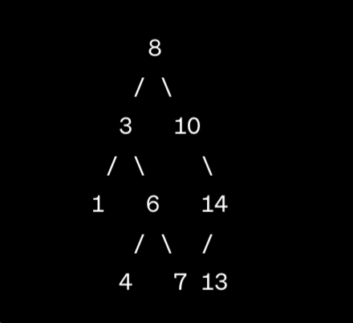

# Comparison of Search Operations - Array, Linked List and BST 

Consider a scenario where you have a dataset of integers that you want to organize and efficiently search through. We'll compare the search operations on an array, a linked list, and a binary search tree to highlight the advantages of using a binary search tree for fast searches while maintaining a sorted order.

## Example Dataset
Suppose we have the following dataset: {8, 3, 10, 1, 6, 14, 4, 7, 13}.

## Array
If we store these elements in an array and want to search for the element 6, we would typically perform a linear search. We would iterate through the array until we find the desired element:
  
### Implementation in Java  
  
```java
int[] array = {8, 3, 10, 1, 6, 14, 4, 7, 13};
int target = 6;

for (int i = 0; i < array.length; i++) {
    if (array[i] == target) {
        System.out.println("Element found at index: " + i);
        break;
    }
}
```
In this case, the search operation would take **O(n)** time because we might need to check each element before finding the target.  
  
## Linked List

In this case, the search operation in a linked list would take **O(n)** time.

### Implementation in Java

Assuming a linked list is implemented using a `Node` class:

```java
class Node {
    int data;
    Node next;

    Node(int data) {
        this.data = data;
        this.next = null;
    }
}

// Search in linked list
Node current = head; // assuming head is the starting node
while (current != null) {
    if (current.data == target) {
        System.out.println("Element found in linked list");
        break;
    }
    current = current.next;
}
```


Again, this operation would take **O(n)** time.

## Binary Search Tree (BST)

### Introduction

Let's continue with the provided dataset {8, 3, 10, 1, 6, 14, 4, 7, 13} and elaborate further on how a binary search tree (BST) facilitates fast search operations while maintaining a sorted order.

### Binary Search Tree Construction

First, let's construct a binary search tree using the provided dataset. The construction of the tree involves inserting each element in the dataset into the tree while maintaining the property that all elements in the left subtree of a node are less than the node's value, and all elements in the right subtree are greater.
  
 
  
### Searching in the Binary Search Tree

```java
public class BinarySearchTreeExample {
    static class TreeNode {
        int data;
        TreeNode left, right;

        TreeNode(int data) {
            this.data = data;
            this.left = this.right = null;
        }
    }

    public static TreeNode search(TreeNode root, int target) {
        if (root == null || root.data == target) {
            return root;
        }

        if (target < root.data) {
            return search(root.left, target);
        } else {
            return search(root.right, target);
        }
    }

    public static void main(String[] args) {
        // Construct the binary search tree
        TreeNode root = new TreeNode(8);
        root.left = new TreeNode(3);
        root.right = new TreeNode(10);
        root.left.left = new TreeNode(1);
        root.left.right = new TreeNode(6);
        root.left.right.left = new TreeNode(4);
        root.left.right.right = new TreeNode(7);
        root.right.right = new TreeNode(14);
        root.right.right.left = new TreeNode(13);

        // Search for element 6 in the binary search tree
        TreeNode result = search(root, 6);

        if (result != null) {
            System.out.println("Element found in binary search tree");
        } else {
            System.out.println("Element not found");
        }
    }
}
```  

In the binary search tree, the search for the element 6 starts at the root (8), then moves to the left subtree (3), and further to the right subtree of the left child (6). The search concludes with finding the element 6. The time complexity of this operation is **O(log n)**, making it more efficient compared to linear search in an array or linked list.

### Benefits
1.	**Fast Search**: Binary search in a well-balanced BST ensures that, at each step, we eliminate half of the remaining elements. This results in a logarithmic time complexity for search operations.
2.	**Maintaining Sorted Order**: The binary search tree inherently maintains a sorted order, which means that an in-order traversal of the tree would produce the elements in ascending order. This property is useful in various scenarios where sorted data is required.
3.	**Dynamic Operations**: BSTs support dynamic operations like insertion and deletion while maintaining their structure. This allows for efficient updates to the dataset without the need to rebuild the entire structure.  
  
  > In summary, a binary search tree provides a powerful and efficient data structure for searching, insertion, and deletion operations, especially when the dataset needs to be kept in a sorted order.

## Scenario - Searching an element amongst 1 million data points

Let's consider the maximum number of steps/comparisons for each scenario when searching through **1 million data points**:

1. Array  
Maximum Comparisons: 1 million  
In the worst case, where the target element is at the end of the array or not present, you may need to compare against all 1 million elements.  

2. Linked List  
Maximum Comparisons: 1 million  
Similar to arrays, in the worst case, you might need to traverse the entire linked list to find the target element or determine its absence.  

3. Binary Search Tree (BST)  
Maximum Comparisons: Log base 2 of 1 million (approximately 20 comparisons for a well-balanced tree)  
In a balanced binary search tree, the maximum number of comparisons is determined by the height of the tree, which is logarithmic with respect to the number of elements. For 1 million elements, log base 2 of 1 million is around 20.  

>> Note : It's important to note that the actual number of comparisons may vary based on the distribution of data and the specific structure of the tree (balanced or unbalanced). In the case of an unbalanced tree, the maximum number of comparisons could be closer to 1 million, leading to a linear search scenario.