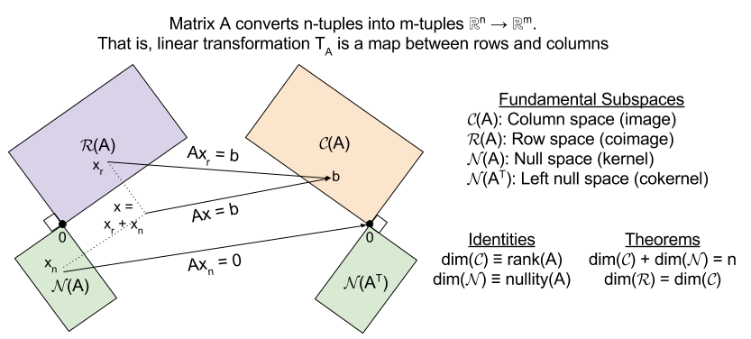

## Fundamental theorem of linear algebra  

- <http://www.dm.unibo.it/~regonati/ad0708/strang-FTLA.pdf>  
- <https://jeffycyang.github.io/from-least-squares-regression-to-the-fundamental-theorem-of-linear-algebra/index.html>  
- <https://colbrydi.github.io/MatrixAlgebra/14--Fundamental_Spaces_pre-class-assignment.html>

image Source : <https://kevinbinz.com/2017/02/20/linear-algebra/>  

### Four fundamental subspaces

- <https://web.mit.edu/18.06/www/Essays/newpaper_ver3.pdf>  

The introduction of above link is reproduced below.  
It sheds light on the recurring themes of FTLA, fundamental subspaces, SVD and their relationships.

> Those subspaces are the column space and the null space of A and A^T. They lift the understanding of Ax = b to a higher level—a subspace level.  

>The first step sees Ax (matrix times vector) as a combination of the columns of A. Those vectors Ax fill the column space C(A). When we move from one combination to all combinations (by allowing every x), a subspace appears. Ax = b has a solution exactly when b is in the column space of A.  

>The four subspaces are connected by the Fundamental Theorem of Linear Algebra. A perceptive reader may recognize the Singular Value Decomposition, when Part 3 of this theorem provides perfect bases for the four subspaces. The three parts are well separated in a linear algebra course! The first part goes as far as the dimensions of the subspaces, using the rank. The second part is their orthogonality—two subspaces in R^n and two in R^m. The third part needs eigenvalues and eigenvectors of A^TA to find the best bases. Figure 1 will show the “big picture” of linear algebra, with the four bases added in Figure 2.  

>The main purpose of this paper is to see that theorem in action. We choose a matrix of rank one, A = xy^T. When m = n = 2, all four fundamental subspaces are lines in R^2. The big picture is particularly clear, and some would say the four lines are trivial. But the angle between x and y decides the eigenvalues of A and its Jordan form—those go beyond the Fundamental Theorem. We are seeing the orthogonal geometry that comes from singular vectors and the skew geometry that comes from eigenvectors. One leads to singular values and the other leads to eigenvalues.
