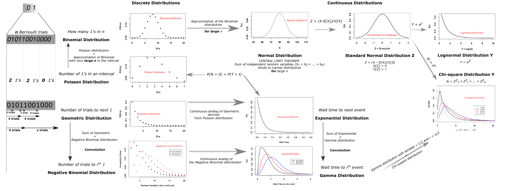

# Unified view of Probability Distributions  

> All the probability distributions are interrelated.  

The diagram below is a framework to view probability distributions as a unified whole instead of is disparate silos.  

   

I came across this diagram in this link : [https://www.dataanalysisclassroom.com/lesson54/](https://www.dataanalysisclassroom.com/lesson54/).  
The article is very informative and highly recommended.  

Another article I found along similar lines : [link](https://medium.com/@srowen/common-probability-distributions-347e6b945ce4).

I will also add my own flavor on this later.
