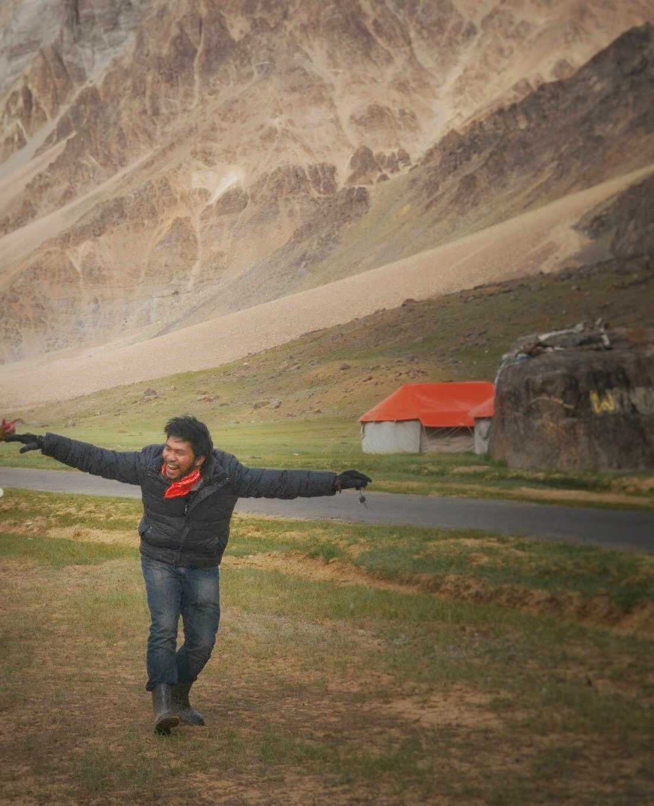
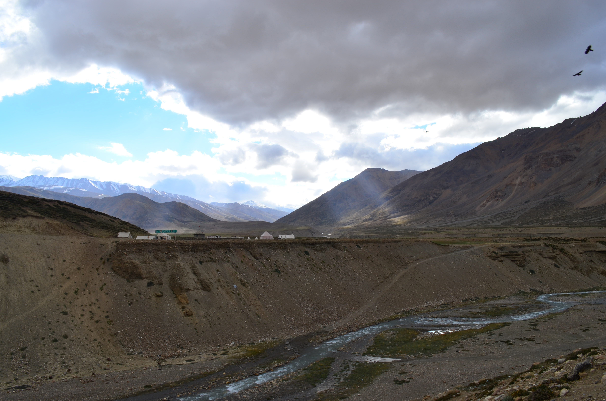

# An Evening in the Himalayas  

Surrendering Myself to Nature.

Time simply seemed to take a halt.

With chilly winds blowing across...

Only eagles for company

  

The forces of nature unleashed..  

the violent erosion of landscape..  

by the brute power of river channels at full display.  

As night descends down... the skyline becomes full of stars, constellations.  

You simply get flabbergasted and humbled.  

You forget about your own existence and then again you start cogitating about everything in your life till that moment and then slowly you sip a cup of tea, enter your tent and with a heavy heart close your eyes for a nap..And Hope to rise like a "Phoenix" the next day
