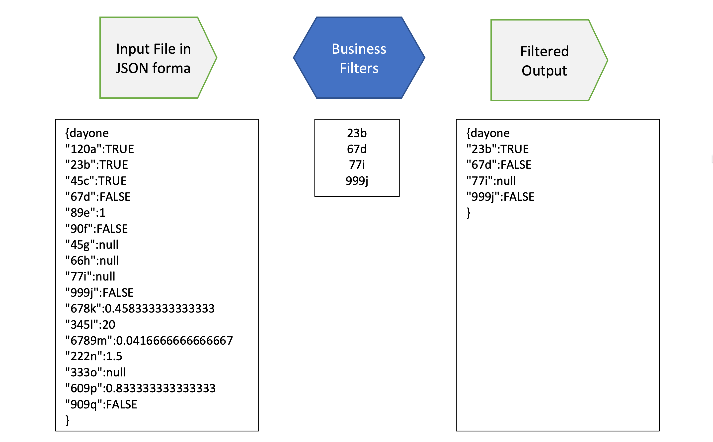
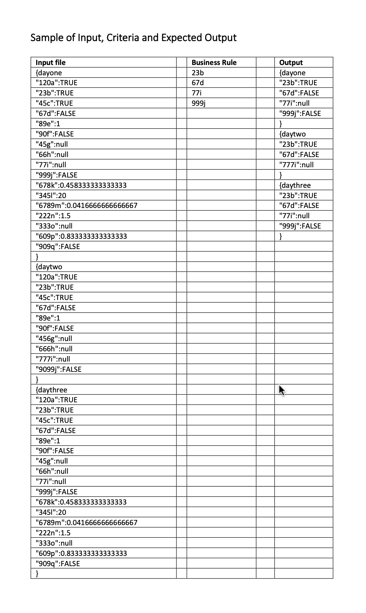
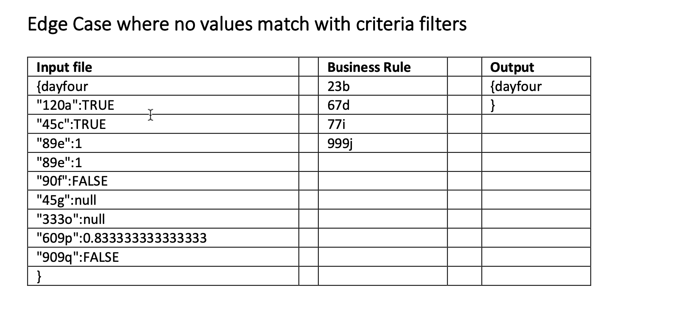
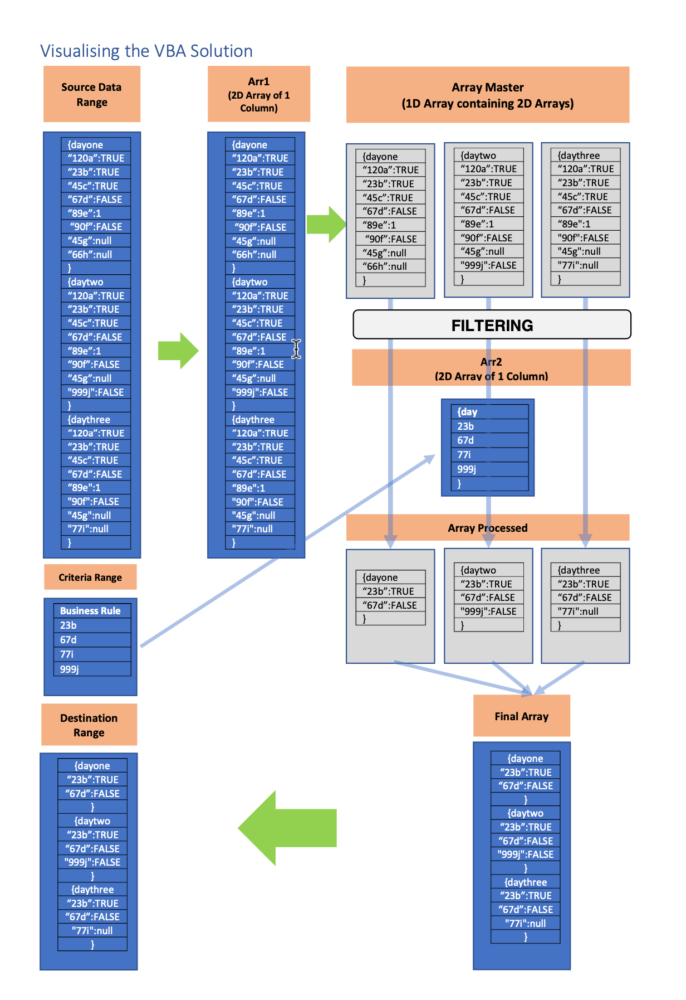

## Original Ask of Client

The raw data is related to payroll and contains details of an employee working for 7 days in week. A timesheet data dump is generated. The Timesheet gives the output in json format.  

I need to analyse the data whether for the time worked all the payments are correct. But the file generally has **16000 lines of data out of which 700 lines are relevant** for my analysis. So I want to **filter that data**. Like for example I want to know what’s the overtime, penalty, meal payment etc paid for each day, So these become my filters and these filters need to be applied for the entire week data and what I initially gave was just one day of data.  

  

## Brief Note About JSON  
A valid JSON document can be either of the following:  
- An Object surrounded by curly braces, { and }   
- An Array enclosed by brackets, [ and ]  

Below are two samples corresponding to above :
>{ "thisIs": "My first JSON document" }  
>[ "also", "a","valid", "JSON", "doc"]  

Above Examples are from the book **“JSON at Work” authored by Tom Marrs** and Page no.4.

## Sample of Input, Criteria and Expected Output  

   

## Contextualising the problem in terms of VBA based code  
The first major challenge is ensuring that the sequence of row values after filtering is same as in the original data. That means **filtered values should correctly correspond to its parent day**. We do not want a filtered string value to land up within a different day.  

While there are multiple ways to do lookup and match in VBA environment, it does not necessarily ensure the sequence unless explicit coding is done.  

To ensure the **purity of the extracted required labels** and **no spill over** at all stages, **we ensure that day-wise data is transferred into a container of its own.** This container corresponding to data pertaining to a single day will undergo filtering to return match values.  

So, what happens is that if there are **n days** in the JSON data from which day-wise data will be transferred to **n containers**. Hence, there will be n containers created. Each container will undergo filtering resulting in n filtered containers.
The n filtered containers will then be aggregated to single column with the sequence maintained.  

## Visualising the solution approach

## Access the solutions  
Detailed solution [pdf file](EmpData_Extraction_from JSON_VBA_Code_Recommendations.pdf)  
Excel files [version1](VBA Solution_01.xlsm) [version2](Data Extraction from JSON_VBA Solution_EndUser.xlsm)  
