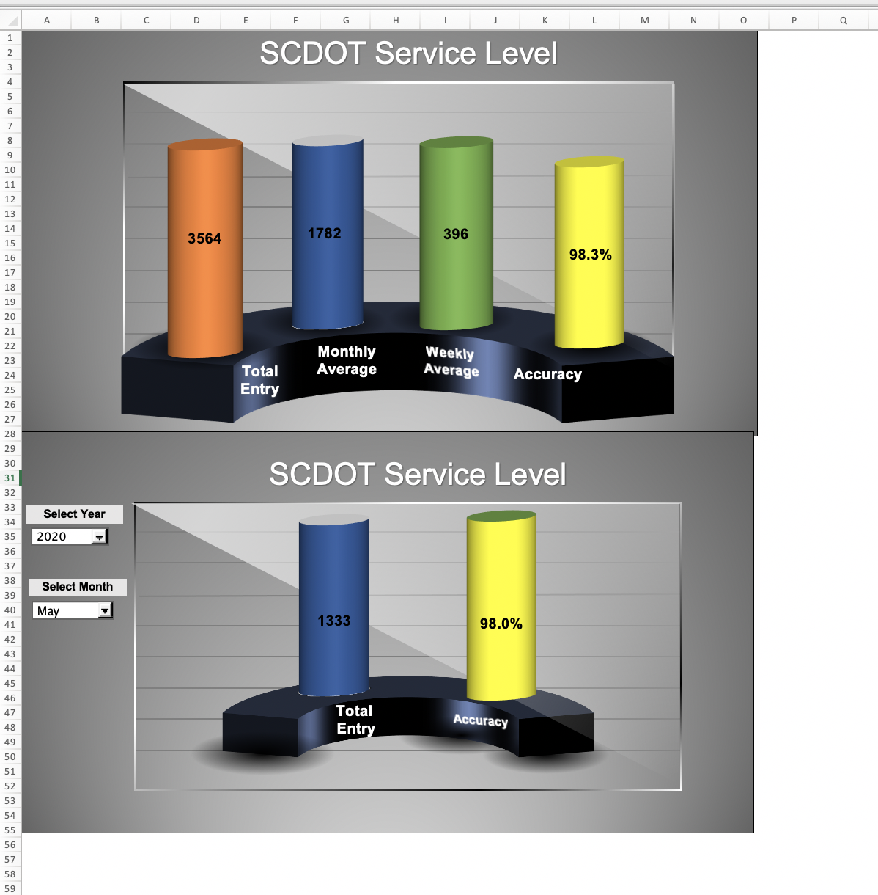
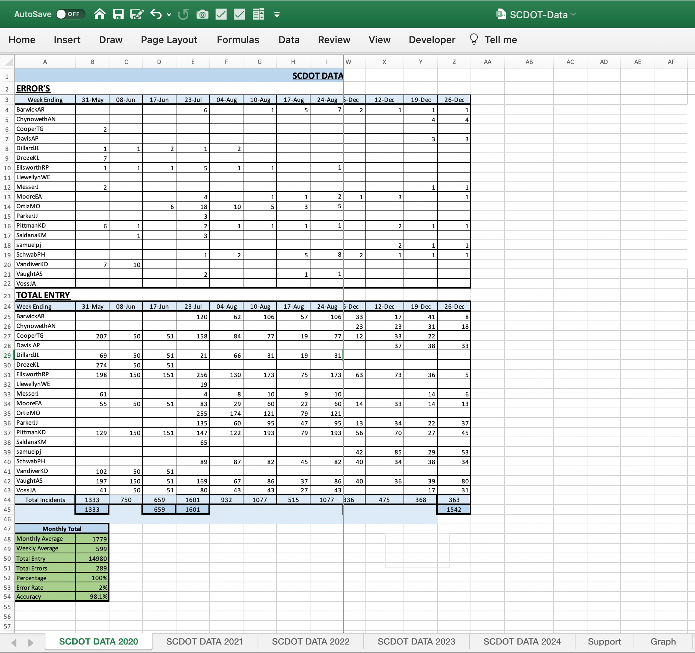
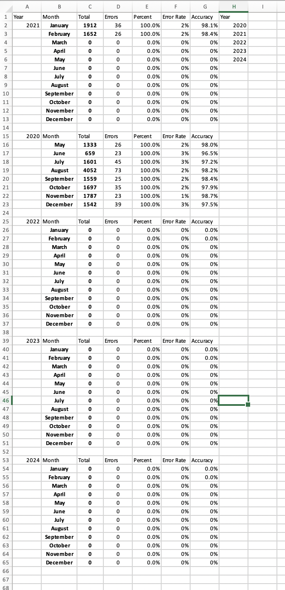
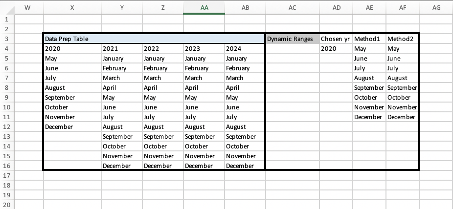
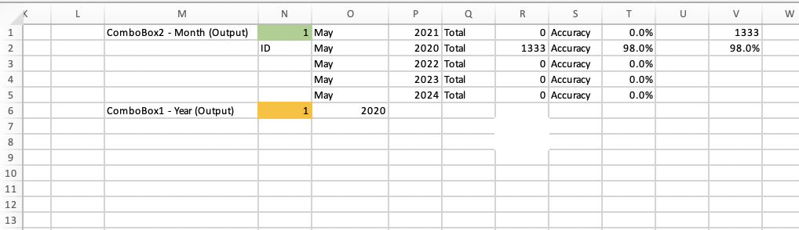

# Usecase : SCDOT Data  
# Problem : Dependent Combo boxes

In this problem, client had got a contract to render services to another organisation.  
The client had to maintain an excel dashboard for displaying service levels at a monthly
basis and overall till date. Note that the contract period had started from May 2020 onwards
 and was supposed to run till 2024.

The dashboard would allow a user choose the year and month from two drop-downs (via comboboxes)
 to check the service levels. Depending on the year selected in the first combo box, we want to
 display only the relevant months for that year in the second combo box.

Let's say in 2020, the business was operational only from Aug to
December whereas it was operational every month in 2021 and remains
operational as on date -- Feb 2022. When User selects 2020, we want only
Aug to Dec to be visible. When User selects 2021, all months should be
visible. And on selection of 2022, months till Feb should be displayed.

# Service level Dashboard snapshot

# Raw data  

# Aggregating Data for staging the inputs in comboboxes  
A new sheet named 'Support' has been created for data staging/preparation.  
As we can see, the services were operational from May onwards in 2020 and ongoing.  

## Calculated values

  

## Data prep table housing year and months  

Note the column AE from row 4 onwards will house the dynamic month range.
For 2020, we will have months from May onwards. For other years, all the months are valid.  

> =OFFSET(Support!$X$4,1,MATCH(Support!$AD$4,Support!$X$4:$AB$4,0)-1,  
  COUNTA(OFFSET(Support!$X$4,1,MATCH(Support!$AD$4,Support!$X$4:$AB$ 4,0)-1, 13)))

  

## Combobox connected to relevant year and months  

In case of year, its fairly straightforward. The year combobox has following parameters :  
> input range : cell range containing the years (**Support!$H$2:$H$6**)    
> cell linked : Support!$N$6

For the months, the respective combobox has following parameters :
> input range : Named range **"Months"**  
> cell linked : **Support!$N$1**

Formula for named range Months using name manager :  
> = Support!$AE$4:INDEX(Support!$AE$4:$AE$15,  
  MATCH("ZZZZZZZZZZZZZZ",Support!$AE$4:$AE$15,1))

  

# Access the file
[Excel File](SCDOT.md)  
[pdf File](SCDOT_Dependent Dropdown Data Validation.pdf)
