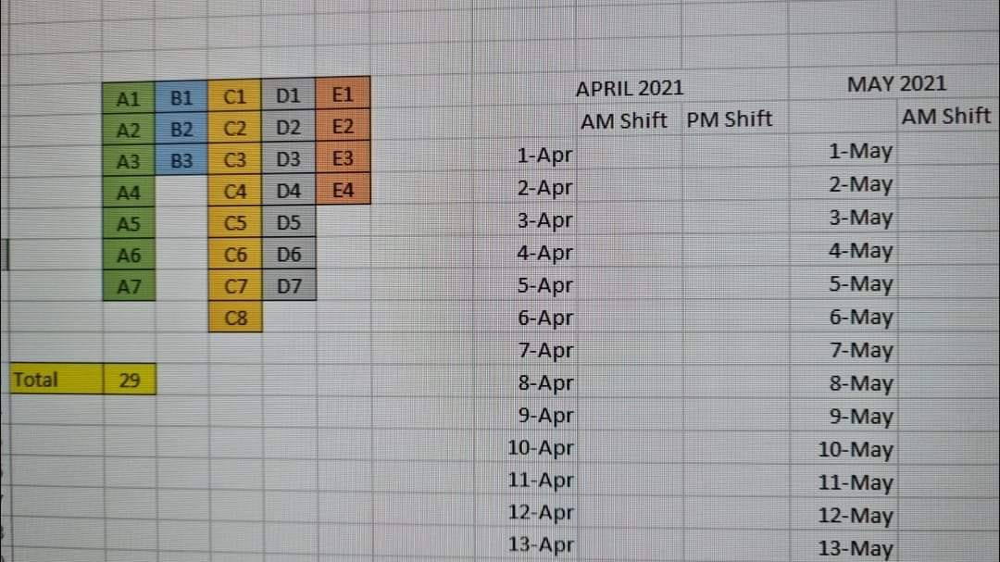
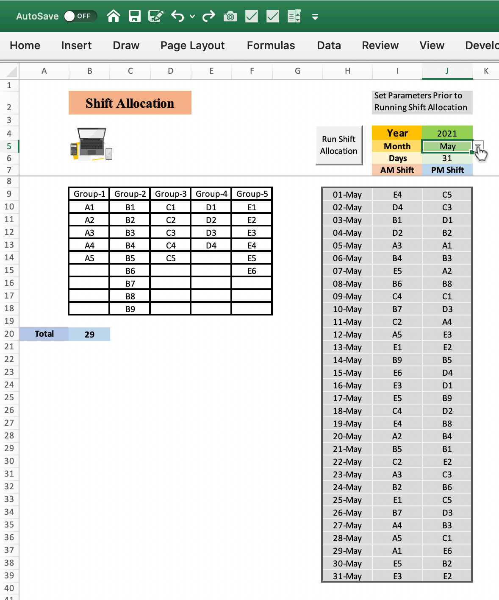

# Premise  
We are looking for an Excel solution to randomly assign shifts to different groups of available personnel. There is an immediate use case of this for small businesses, floor shop enterprises, salons, hospital/nursing departments, police departments for patrolling/beat, manpower based entities etc.  

# Original Ask from client

Hi, I want to randomise a group of people to do tasking for each time slot.  
Each group is with different number of people in the group.  
Example:  
Group A - 7 person  
Group B - 3 person  
Group C - 8 person  
Group D - 7 person  
Group E - 4 person  

Constraint: Each person must do equal shifts.  

# Constraint
Each person should get equal/equitable number of shifts assigned in the month. There should not be successive shifts to same person.  

# Approach  

A simple approach can be.  
1. There are 29 persons.  
2. Use random/choose function to select one out of the 29 persons for shift.  
3. For 2nd shift, select randomly one out of the remaining 28 persons.  
4. Similarly, for every iteration you have reduced pool of available members.  
5. Complete one whole cycle of allotment for 29 members and 29 shifts.  
6. Repeat the same process. Depending on monthly and bimonthly period, your choice of the available persons for selection for fresh new whole allotment will differ.  

# Solution  

  

# Behind the scenes
Dabbling with some heavy duty macros behind the scenes. Extensive use of **Dynamic VBA Arrays**, Passing Arrays across subroutines, **Sorting/filtering, String Functions, formatting** all via **Macro coding**. Interesting experience indeed. Hope to make these modular codes that can be used like plug and play across problems. This is just a rough cut. Further customisation and window dressing possible as well.

# Disclaimer
Clarity might be an issue in mobile devices.

# Access the file with the macro  

[Excel File](Shift Allocation.xlsm)
