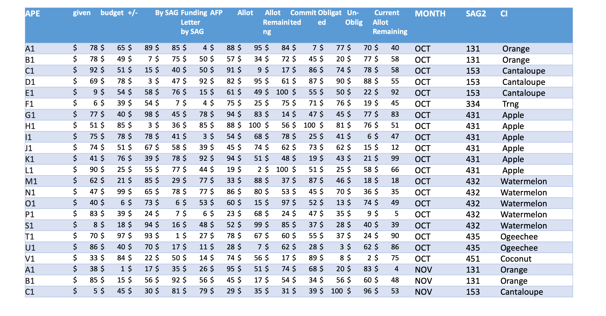
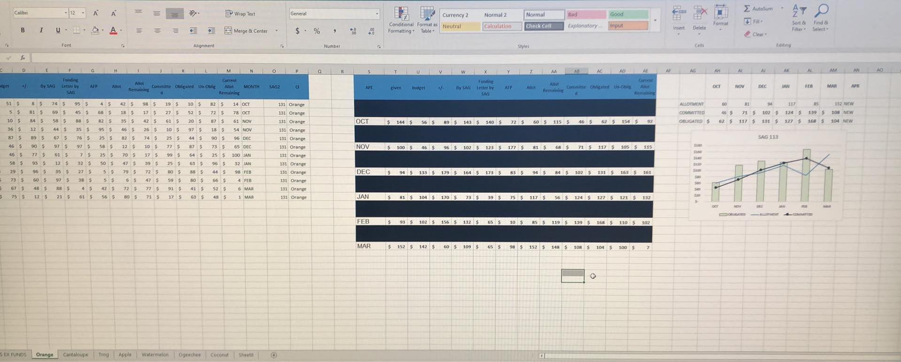

---
layout : single  
toc: true
toc_label: "Splitting Data from source file to separate sheets "
toc_sticky: true
author_profile: true
comments: true
---  

# Splitting Data from source sheet to separate sheets  

This is relevant for marketing managers, account managers, budget control, revenue tracking etc.  

## Context  

In this particular file, client was maintaining a sheet of **budget obligated, allocated and committed** for multiple accounts (**CI**) for different activities on a monthly basis. The source file would be updated every month for all the accounts.  

Using the data from the source file, Client would maintain a separate worksheet for each of the accounts.  
Let's deepdive into the account specific worksheet. The different activities under which budget was obligated, allocated and committed would be listed. There would additonally be a total summary for every month. Further, there would be plot of the budget obligated, allocated and committed on a monthly basis.

## Input File  

## Desired output
  

## VBA code

I have written the VBA code for three broad tasks :  
- [split and transfer the data to new sheets](Split Data to new or existing sheets_Module1.md)
- [split and transfer the data to existing sheets](Split Data to new or existing sheets_Module2.md)
- [Deleting all sheets except the Source sheet](Split Data to new or existing sheets_Module2.md)

## Excel file with macro
Download [link](/Pages/Excel & VBA/Split Data to new or existing sheets/SplitData_Raw_To_New_ExistingSheets_VBA_Final.xlsm)
