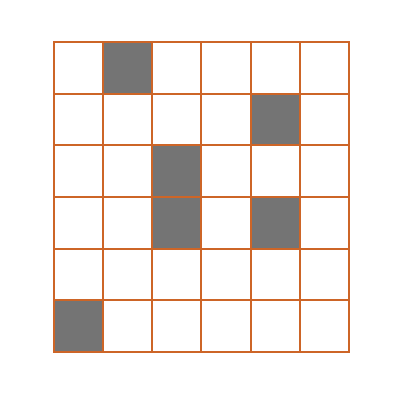
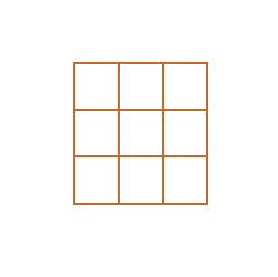

**A maze** typically consists of cells. In the context of a maze, a "cell" refers to an individual unit or space within the maze's structure. A maze is generally composed of numerous cells, which can be square, rectangular, or even hexagonal, depending on the design of the maze. These cells are arranged in a specific pattern and are interconnected by pathways, while some cells may be blocked by walls to create the puzzle element of the maze. The goal in a maze is to find a path through these cells from a starting point to an endpoint.  
  
**Maze sample**  
  

# Rat in a Maze problem

## Movement in four directions - Version 1

Print the route/pathways from starting cell to the last cell moving up, down, left, or right, without revisiting any cell in the maze.  
  
  
  
```java
public class FourDirectionMazePath{
    public static void main(String[] args){
        int rows = 3;
        int cols = 3;
        
        if (args.length > 0) {
        try {
            rows = Integer.parseInt(args[0]);
            cols = Integer.parseInt(args[1]);
        } catch (NumberFormatException e) {
            System.out.println("Invalid input. Using default value: 3");
            // rows is already set to 3, so no need to set it again
        }
    }    
    boolean[][] isVisited = new boolean[rows][cols];
    
    print(0,0, rows-1, cols-1,"", isVisited);
        
    }
    
    private static void print(int sr, int sc, int er, int ec,
                              String s, boolean [][] isVisited){
            if(sr<0 || sc<0) return;
            if(sr>er || sc>ec) return;
            if(isVisited[sr][sc] == true ) return;
            if(sr == er && sc ==ec){
                System.out.println(s);
                return;
            }
            
            isVisited[sr][sc] = true;
            
            //go right
            print(sr, sc+1, er, ec, s+ "R", isVisited);
            
            //go down
            print(sr+1, sc, er, ec, s+"D", isVisited);
            
            //go left
            print(sr, sc-1, er,ec,s+"L", isVisited);
            
            //go up
            print(sr-1, sc, er,ec, s+"U", isVisited);
            
            //backtracking
            isVisited[sr][sc] = false;
            }
    }

```  
  
### Code Assessment from ChatGPT

The **FourDirectionMazePath class** in Java that you've provided is designed to print all possible paths through a 3x3 maze, moving up, down, left, or right, without revisiting any cell. Let's review the code in detail:

1.	**Class and Main Method**:
- The class is correctly defined.
- The main method initializes a **3x3 maze** but allows for size customization through command-line arguments.
2.	**Command-line Argument Handling**:
- The program checks for command-line arguments and tries to parse them as integers for rows and columns.
- If the parsing fails, it catches a NumberFormatException and defaults to a 3x3 maze.
- This is a good practice for handling invalid inputs.
3.	**Maze Initialization**:
- The maze is represented by a boolean array **isVisited**, which tracks whether a cell has been visited. This is an appropriate choice for the task.
4.	**Recursive print Method**:
- The method is designed to explore the maze recursively.
- Base cases are correctly implemented:  
  - It returns if the current cell is out of bounds.  
  - It returns if the current cell is already visited.
  - It prints and returns the path if the end of the maze is reached.
- The method marks the current cell as visited and explores all four directions (right, down, left, up).
- After exploring, it backtracks by marking the current cell as not visited.
5.	**Potential Improvements**:
- **Variable Naming**: The variable names sr, sc, er, ec are not immediately clear. More descriptive names like **startRow**, **startCol**, **endRow**, **endCol** could enhance readability.  

## Movement in four directions - Version 2

- Print all possible route/pathways from starting cell to the last cell moving up, down, left, or right, without revisiting any cell in the maze.
- Also, return the count of total possible ways

```java
public class FourDirectionMazePath_V2{
    public static void main(String[] args) {
        int rows = 3; // Default value
        int cols = 3; // Default value

        if (args.length > 1) {
            try {
                rows = Integer.parseInt(args[0]);
                cols = Integer.parseInt(args[1]);
            } catch (NumberFormatException e) {
                System.out.println("Invalid input. Using default values for rows and cols: 3");
            }
        }
        
        //isVisited is a boolean 2D array that keeps track of visited cells to avoid revisiting them
        boolean[][] isVisited = new boolean[rows][cols];  

        // specifying start row, start cols as 0,0
        // specifying end row, cols as rows-1, cols-1 respectively representing the bottom-right corner of the maze.  
        
        /* The print method uses recursive backtracking to explore all possible paths in the maze, and the variable ways is assigned the number of valid paths found by the print method. After the recursive calls, ways will contain the count of different paths from the starting point to the destination in the maze. */  
          
        int ways = print(0, 0, rows - 1, cols - 1, "", isVisited);
        System.out.println(ways);
    }

    private static int print(int sr, int sc, int er, int ec, String s, boolean[][] isVisited) {
        if (sr < 0 || sc < 0 || sr > er || sc > ec || isVisited[sr][sc]) return 0;
        if (sr == er && sc == ec) {
            System.out.println(s);
            return 1;
        }

        isVisited[sr][sc] = true;

        int count = 0;
        // Go right
        count += print(sr, sc + 1, er, ec, s + "R", isVisited); 
        // Go down
        count += print(sr + 1, sc, er, ec, s + "D", isVisited);
        // Go left
        count += print(sr, sc - 1, er, ec, s + "L", isVisited); 
        // Go up
        count += print(sr - 1, sc, er, ec, s + "U", isVisited);
	  
	  //backtracking 
        isVisited[sr][sc] = false;

        return count;
    }
}
```  

### Code Review and Assessment by ChatGPT

The updated version of your **FourDirectionMazePath_V2 class** introduces some refinements and additional functionality compared to the original version. Let's review the key aspects:

1.	**Class and Main Method**:
- The class is correctly defined.
- The main method retains its functionality of initializing a maze with default or user-specified dimensions.
2.	**Argument Handling and Maze Initialization**:
- The program correctly checks for command-line arguments and handles invalid input.
- It uses a boolean[][] to represent the maze and track visited cells, which is appropriate for this task.
3.	**Enhanced Recursive print Method**:
- The method now returns an integer (count), representing the number of ways to reach the end.
4.	**Base cases are well-implemented**:
- The function returns 0 (no paths) if the current cell is out of bounds or already visited.
- If the end of the maze is reached, it prints the path and returns 1 (a valid path).
- The method accumulates the count of valid paths while exploring in all four directions.
5. **Counting Paths**:
- After recursive calls for each direction, the method sums up the number of valid paths found.
- This feature is a significant enhancement, as it not only finds but also counts all possible paths.
6. **Backtracking:**
- The method correctly implements backtracking by marking the current cell as not visited after exploring all directions.
7. **Print Statement for Count**:
- The main method prints the total number of paths at the end, which is a useful addition for users to understand the maze's complexity.
8. **Potential Improvements**:
- **Code Comments**: Adding comments for key sections would improve readability and maintainability.
- **Error Handling**: While the current error handling for command-line arguments is good, additional checks (like ensuring non-negative values for rows and cols) could be added.
9.	**Overall Functionality**:
- The updated program is functionally more informative, as it now counts the number of possible paths through the maze.
- It continues to use backtracking effectively to explore all possible paths.  
  
Overall, **FourDirectionMazePath_V2** is a well-structured and improved version that effectively meets its intended purpose. With minor corrections and enhancements, it would be even more robust and user-friendly.


