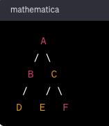

## Recursion Trees and Euler Paths

A recursive tree diagram for an Euler tour represents a technique used in graph theory and computer science for traversing or listing all the edges of a tree or a graph in a systematic way. In the context of trees, an Euler tour is a walk around the tree that visits each edge exactly twice, once in each direction. The concept is named after the Swiss mathematician Leonhard Euler.

Here's how a recursive tree diagram and an Euler tour typically work:

1. **Starting Point:** The tour starts at a selected node (often the root in a tree).
2. **Traversal:** It then recursively traverses the tree. In a binary tree, for instance, it might go to the left child, then to the right child, and then back up to the parent.
3. **Edge Visiting:** Each edge is visited twice, once when descending down the tree and once when ascending back up.
4. **Completing the Tour:** The tour completes when it returns to the starting node, having traversed every edge twice.

### Example
Consider a simple binary tree:  
  
  
  
  
An Euler tour of this tree, starting from node A, would be:
A - B - D - B - A - C - E - C - F - C - A.
Here, each edge is visited twice: once going down the tree and once coming back up.

### Recursion Trees and Euler Paths in Recursion and Backtracking Algorithms

The concepts of recursion trees and Euler paths are indeed important in understanding and analyzing recursion and backtracking algorithms. Let's delve into how these concepts are relevant in the context of recursion and backtracking:

#### Recursion Tree
A recursion tree is a visual representation of the function calls in a recursive algorithm. Each node in the tree represents an instance of a recursive call, and the children of a node represent the subsequent recursive calls made by that instance.

1. **Understanding the Recursive Process:** The recursion tree helps in visualizing the flow of the algorithm, showing how the problem is broken down into smaller sub-problems.
2. **Analyzing Time Complexity:** It's a useful tool for analyzing the time complexity of recursive algorithms. By examining the structure and depth of the tree, you can estimate the number of recursive calls and thereby determine the algorithm's efficiency.
3. **Visualizing Backtracking:** In backtracking algorithms, the recursion tree illustrates how the algorithm explores the solution space. Each path from the root to a leaf node represents a specific sequence of choices made by the algorithm.

### Euler Path in Recursion
An Euler path (or tour) in the context of recursion and backtracking can be understood metaphorically. As discussed earlier, an Euler tour in a tree-like structure involves visiting each edge exactly twice, which is akin to how recursion and backtracking work:

1. **Exploring Possibilities:** Just like an Euler tour traverses each edge twice (once in each direction), in recursion and backtracking, each decision point or choice is explored in both its possibilities (e.g., include or exclude an element, move left or right in a tree).
2. **Returning to Previous States:** The concept of visiting each edge twice mirrors the idea of recursion where for every step forward (down the tree), there is eventually a step backward (back up the tree). This is especially clear in backtracking, where after exploring a possibility, the algorithm backtracks to the previous state (just like retracing your steps in an Euler tour).
3. **Comprehensive Exploration:** Both an Euler tour and a recursive backtracking algorithm aim to explore a structure (a graph or a solution space) thoroughly and systematically.

### Conclusion
In summary, recursion trees and the concept of Euler paths are valuable in visualizing and understanding the behavior of recursive and backtracking algorithms. The recursion tree provides a clear and structured way to visualize the recursive calls and their relationships, while the metaphor of an Euler path helps in understanding the comprehensive and thorough nature of these algorithms in exploring all possibilities.
