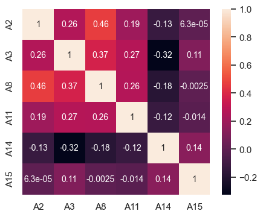

<h1>Table of Contents<span class="tocSkip"></span></h1>
<div class="toc"><ul class="toc-item"><li><span><a href="#Credit-Screening-Dataset" data-toc-modified-id="Credit-Screening-Dataset-1"><span class="toc-item-num">1&nbsp;&nbsp;</span>Credit Screening Dataset</a></span></li><li><span><a href="#Loading-necessary-libraries" data-toc-modified-id="Loading-necessary-libraries-2"><span class="toc-item-num">2&nbsp;&nbsp;</span>Loading necessary libraries</a></span></li><li><span><a href="#Importing-the-dataset" data-toc-modified-id="Importing-the-dataset-3"><span class="toc-item-num">3&nbsp;&nbsp;</span>Importing the dataset</a></span></li><li><span><a href="#Dataset-Information" data-toc-modified-id="Dataset-Information-4"><span class="toc-item-num">4&nbsp;&nbsp;</span>Dataset Information</a></span></li><li><span><a href="#Attributes-Information" data-toc-modified-id="Attributes-Information-5"><span class="toc-item-num">5&nbsp;&nbsp;</span>Attributes Information</a></span></li><li><span><a href="#Data-preprocessing" data-toc-modified-id="Data-preprocessing-6"><span class="toc-item-num">6&nbsp;&nbsp;</span>Data preprocessing</a></span><ul class="toc-item"><li><span><a href="#Converting-to-Dataframe-Format" data-toc-modified-id="Converting-to-Dataframe-Format-6.1"><span class="toc-item-num">6.1&nbsp;&nbsp;</span>Converting to Dataframe Format</a></span></li><li><span><a href="#Handling-Missing-values" data-toc-modified-id="Handling-Missing-values-6.2"><span class="toc-item-num">6.2&nbsp;&nbsp;</span>Handling Missing values</a></span></li><li><span><a href="#Converting-Class-symbols-of-Target-variable-to-binary-values" data-toc-modified-id="Converting-Class-symbols-of-Target-variable-to-binary-values-6.3"><span class="toc-item-num">6.3&nbsp;&nbsp;</span>Converting Class symbols of Target variable to binary values</a></span></li><li><span><a href="#Processing-Continous-Attributes" data-toc-modified-id="Processing-Continous-Attributes-6.4"><span class="toc-item-num">6.4&nbsp;&nbsp;</span>Processing Continous Attributes</a></span></li></ul></li><li><span><a href="#Univariate-Analysis---Continous-Variables" data-toc-modified-id="Univariate-Analysis---Continous-Variables-7"><span class="toc-item-num">7&nbsp;&nbsp;</span>Univariate Analysis - Continous Variables</a></span></li><li><span><a href="#Bivariate-Analysis---Continous-Variables" data-toc-modified-id="Bivariate-Analysis---Continous-Variables-8"><span class="toc-item-num">8&nbsp;&nbsp;</span>Bivariate Analysis - Continous Variables</a></span></li><li><span><a href="#Univariate-Analysis---Categorical-Variables" data-toc-modified-id="Univariate-Analysis---Categorical-Variables-9"><span class="toc-item-num">9&nbsp;&nbsp;</span>Univariate Analysis - Categorical Variables</a></span><ul class="toc-item"><li><span><a href="#Distribution-of-the-Target-Class" data-toc-modified-id="Distribution-of-the-Target-Class-9.1"><span class="toc-item-num">9.1&nbsp;&nbsp;</span>Distribution of the Target Class</a></span></li></ul></li><li><span><a href="#Train-Test-Split-the-dataset" data-toc-modified-id="Train-Test-Split-the-dataset-10"><span class="toc-item-num">10&nbsp;&nbsp;</span>Train Test Split the dataset</a></span></li><li><span><a href="#Transformation-Pipelines" data-toc-modified-id="Transformation-Pipelines-11"><span class="toc-item-num">11&nbsp;&nbsp;</span>Transformation Pipelines</a></span></li><li><span><a href="#Training-and-Testing-Models" data-toc-modified-id="Training-and-Testing-Models-12"><span class="toc-item-num">12&nbsp;&nbsp;</span>Training and Testing Models</a></span><ul class="toc-item"><li><span><a href="#Stochastic-Gradient-Descent-Classifier" data-toc-modified-id="Stochastic-Gradient-Descent-Classifier-12.1"><span class="toc-item-num">12.1&nbsp;&nbsp;</span>Stochastic Gradient Descent Classifier</a></span></li><li><span><a href="#Logistic-Regression-Classifier" data-toc-modified-id="Logistic-Regression-Classifier-12.2"><span class="toc-item-num">12.2&nbsp;&nbsp;</span>Logistic Regression Classifier</a></span></li><li><span><a href="#Random-Forest-Classifier" data-toc-modified-id="Random-Forest-Classifier-12.3"><span class="toc-item-num">12.3&nbsp;&nbsp;</span>Random Forest Classifier</a></span></li><li><span><a href="#KNN-Classifier" data-toc-modified-id="KNN-Classifier-12.4"><span class="toc-item-num">12.4&nbsp;&nbsp;</span>KNN Classifier</a></span></li><li><span><a href="#Naive-Bayes-Classifier" data-toc-modified-id="Naive-Bayes-Classifier-12.5"><span class="toc-item-num">12.5&nbsp;&nbsp;</span>Naive Bayes Classifier</a></span></li><li><span><a href="#Linear-Support-Vector-Classifier" data-toc-modified-id="Linear-Support-Vector-Classifier-12.6"><span class="toc-item-num">12.6&nbsp;&nbsp;</span>Linear Support Vector Classifier</a></span></li><li><span><a href="#Decision-Tree-Classifier" data-toc-modified-id="Decision-Tree-Classifier-12.7"><span class="toc-item-num">12.7&nbsp;&nbsp;</span>Decision Tree Classifier</a></span></li><li><span><a href="#Gradient-Boosting-Model" data-toc-modified-id="Gradient-Boosting-Model-12.8"><span class="toc-item-num">12.8&nbsp;&nbsp;</span>Gradient Boosting Model</a></span></li><li><span><a href="#Linear-Discriminant-Analysis-Model" data-toc-modified-id="Linear-Discriminant-Analysis-Model-12.9"><span class="toc-item-num">12.9&nbsp;&nbsp;</span>Linear Discriminant Analysis Model</a></span></li></ul></li><li><span><a href="#Listing-the-performance-from-all-the-models" data-toc-modified-id="Listing-the-performance-from-all-the-models-13"><span class="toc-item-num">13&nbsp;&nbsp;</span>Listing the performance from all the models</a></span></li><li><span><a href="#Model-Validation-using-K-Fold-CrossValidation" data-toc-modified-id="Model-Validation-using-K-Fold-CrossValidation-14"><span class="toc-item-num">14&nbsp;&nbsp;</span>Model Validation using K-Fold CrossValidation</a></span><ul class="toc-item"><li><span><a href="#Comparing-the-mean-and-standard-deviation-of-performance-measures" data-toc-modified-id="Comparing-the-mean-and-standard-deviation-of-performance-measures-14.1"><span class="toc-item-num">14.1&nbsp;&nbsp;</span>Comparing the mean and standard deviation of performance measures</a></span></li><li><span><a href="#Results-from-simple-Train-Test-split" data-toc-modified-id="Results-from-simple-Train-Test-split-14.2"><span class="toc-item-num">14.2&nbsp;&nbsp;</span>Results from simple Train Test split</a></span></li><li><span><a href="#Selecting-the-Algorithms-from-K-Fold-cross-validation" data-toc-modified-id="Selecting-the-Algorithms-from-K-Fold-cross-validation-14.3"><span class="toc-item-num">14.3&nbsp;&nbsp;</span>Selecting the Algorithms from K-Fold cross validation</a></span></li></ul></li><li><span><a href="#Tuning-the-Selected-Algorithm" data-toc-modified-id="Tuning-the-Selected-Algorithm-15"><span class="toc-item-num">15&nbsp;&nbsp;</span>Tuning the Selected Algorithm</a></span><ul class="toc-item"><li><span><a href="#Tuning-Logistic-Regression-Classifier" data-toc-modified-id="Tuning-Logistic-Regression-Classifier-15.1"><span class="toc-item-num">15.1&nbsp;&nbsp;</span>Tuning Logistic Regression Classifier</a></span></li><li><span><a href="#Tuning-RandomForest-Classifier" data-toc-modified-id="Tuning-RandomForest-Classifier-15.2"><span class="toc-item-num">15.2&nbsp;&nbsp;</span>Tuning RandomForest Classifier</a></span></li></ul></li><li><span><a href="#Training-the-final-Model-on-full-training-set" data-toc-modified-id="Training-the-final-Model-on-full-training-set-16"><span class="toc-item-num">16&nbsp;&nbsp;</span>Training the final Model on full training set</a></span><ul class="toc-item"><li><span><a href="#Testing-the-model-on-entire-train-set" data-toc-modified-id="Testing-the-model-on-entire-train-set-16.1"><span class="toc-item-num">16.1&nbsp;&nbsp;</span>Testing the model on entire train set</a></span></li></ul></li><li><span><a href="#Save-model-for-later-use" data-toc-modified-id="Save-model-for-later-use-17"><span class="toc-item-num">17&nbsp;&nbsp;</span>Save model for later use</a></span></li></ul></div>

# Credit Screening Dataset

This dataset has been downloaded from  UC Irvine Machine Learning Repository.  
https://archive.ics.uci.edu/ml/datasets/Credit+Approval  
  

This dataset is regarding credit card applications.  
The target variable/label is whether the application has been granted credit or not.  
All attribute names and values have been changed to meaningless symbols to protect 
confidentiality of the data.

**The objective is here to build a model to give binary output based on the input attributes.**

>**Summary of Key information**

    Number of Instances/training examples          : 690  
    Number of Instances with missing attributes    :  37  
    Number of qualified Instances/training examples : 653
    
    Number of Input Attributes                     : 15
    Number of categorical attributes               :  9
    Number of numerical attributes                 :  6
    
    Target Attribute Type                          : Binary Class
    Target Class distribution                      : 54%:45%
    Problem Identification                         : Binary Classification with balanced data set
    


```python
import os
print(os.environ['PATH'])
```

    /Users/bhaskarroy/opt/anaconda3/bin:/Users/bhaskarroy/opt/anaconda3/condabin:/usr/local/bin:/usr/bin:/bin:/usr/sbin:/sbin:/Library/TeX/texbin:/usr/local/share/dotnet:~/.dotnet/tools:/Library/Frameworks/Mono.framework/Versions/Current/Commands:/usr/local/mysql/bin


```python
from notebook.services.config import ConfigManager
cm = ConfigManager().update('notebook', {'limit_output': 20})
```

# Loading necessary libraries


```python
import numpy as np
import pandas as pd
import time
import seaborn as sns
import matplotlib.pyplot as plt

from eda import eda_overview, axes_utils

import category_encoders as ce 
from sklearn.preprocessing import LabelEncoder 
from sklearn.preprocessing import OrdinalEncoder

from sklearn.model_selection import train_test_split, learning_curve, KFold, cross_val_score
from sklearn.linear_model import LogisticRegression
from sklearn.tree import DecisionTreeClassifier
from sklearn.neighbors import KNeighborsClassifier
from sklearn.naive_bayes import GaussianNB
from sklearn.ensemble import RandomForestClassifier, GradientBoostingClassifier
from sklearn.svm import LinearSVC
from sklearn.discriminant_analysis import LinearDiscriminantAnalysis

from sklearn.metrics import recall_score, precision_score, accuracy_score,confusion_matrix, ConfusionMatrixDisplay, classification_report, f1_score
```


```python
pd.set_option('display.max_rows', 20)
pd.set_option('precision', 4)
```

# Importing the dataset


```python
path = "/Users/bhaskarroy/BHASKAR FILES/BHASKAR CAREER/Data Science/Practise/"  \
       "Python/UCI Machine Learning Repository/Credit Screening/"
```


```python
# Index
# credit.lisp
# credit.names
# crx.data
# crx.names


path1 = path + "crx.data" 
path_name = path + "credit.names"
path_crxname = path + "crx.names"
```


```python
datContent = [i.strip().split() for i in open(path1).readlines()]
```


```python
len(datContent)
```


    690


```python
print(dir(type(datContent[0][0])))
```

    ['__add__', '__class__', '__contains__', '__delattr__', '__dir__', '__doc__', '__eq__', '__format__', '__ge__', '__getattribute__', '__getitem__', '__getnewargs__', '__gt__', '__hash__', '__init__', '__init_subclass__', '__iter__', '__le__', '__len__', '__lt__', '__mod__', '__mul__', '__ne__', '__new__', '__reduce__', '__reduce_ex__', '__repr__', '__rmod__', '__rmul__', '__setattr__', '__sizeof__', '__str__', '__subclasshook__', 'capitalize', 'casefold', 'center', 'count', 'encode', 'endswith', 'expandtabs', 'find', 'format', 'format_map', 'index', 'isalnum', 'isalpha', 'isascii', 'isdecimal', 'isdigit', 'isidentifier', 'islower', 'isnumeric', 'isprintable', 'isspace', 'istitle', 'isupper', 'join', 'ljust', 'lower', 'lstrip', 'maketrans', 'partition', 'replace', 'rfind', 'rindex', 'rjust', 'rpartition', 'rsplit', 'rstrip', 'split', 'splitlines', 'startswith', 'strip', 'swapcase', 'title', 'translate', 'upper', 'zfill']


```python
s = "strdc,hgjfj,123,dkkf"
```


```python
# Inspecting the contents
datContent[0][0].split(sep = ",")
```


    ['b',
     '30.83',
     '0',
     'u',
     'g',
     'w',
     'v',
     '1.25',
     't',
     't',
     '01',
     'f',
     'g',
     '00202',
     '0',
     '+']


```python
len(datContent[0])
```


    1


# Dataset Information


```python
# Opening the file credit.names for the description of data set 
with open(path_name) as f:
    print(f.read())
```

    1. Title: Japanese Credit Screening (examples & domain theory)
    
    2. Source information:
       -- Creators: Chiharu Sano 
       -- Donor: Chiharu Sano
                 csano@bonnie.ICS.UCI.EDU
       -- Date: 3/19/92
    
    3. Past usage: 
       -- None Published
    
    4. Relevant information:
       --  Examples represent positive and negative instances of people who were and were not 
           granted credit.
       --  The theory was generated by talking to the individuals at a Japanese company that grants
           credit.
    
    5. Number of instances: 125
    
    
    
    


# Attributes Information


```python
# Opening the file crx.names for the description of data set 
with open(path_crxname) as f:
    print(f.read())
```

    
    1. Title: Credit Approval
    
    2. Sources: 
        (confidential)
        Submitted by quinlan@cs.su.oz.au
    
    3.  Past Usage:
    
        See Quinlan,
        * "Simplifying decision trees", Int J Man-Machine Studies 27,
          Dec 1987, pp. 221-234.
        * "C4.5: Programs for Machine Learning", Morgan Kaufmann, Oct 1992
      
    4.  Relevant Information:
    
        This file concerns credit card applications.  All attribute names
        and values have been changed to meaningless symbols to protect
        confidentiality of the data.
      
        This dataset is interesting because there is a good mix of
        attributes -- continuous, nominal with small numbers of
        values, and nominal with larger numbers of values.  There
        are also a few missing values.
      
    5.  Number of Instances: 690
    
    6.  Number of Attributes: 15 + class attribute
    
    7.  Attribute Information:
    
        A1:	b, a.
        A2:	continuous.
        A3:	continuous.
        A4:	u, y, l, t.
        A5:	g, p, gg.
        A6:	c, d, cc, i, j, k, m, r, q, w, x, e, aa, ff.
        A7:	v, h, bb, j, n, z, dd, ff, o.
        A8:	continuous.
        A9:	t, f.
        A10:	t, f.
        A11:	continuous.
        A12:	t, f.
        A13:	g, p, s.
        A14:	continuous.
        A15:	continuous.
        A16: +,-         (class attribute)
    
    8.  Missing Attribute Values:
        37 cases (5%) have one or more missing values.  The missing
        values from particular attributes are:
    
        A1:  12
        A2:  12
        A4:   6
        A5:   6
        A6:   9
        A7:   9
        A14: 13
    
    9.  Class Distribution
      
        +: 307 (44.5%)
        -: 383 (55.5%)
    
    


```python
with open(path+"Index") as f:
    print(f.read())
```

    Index of credit-screening
    
    02 Dec 1996      182 Index
    19 Sep 1992    32218 crx.data
    19 Sep 1992     1486 crx.names
    16 Jul 1992    12314 credit.lisp
    16 Jul 1992      522 credit.names
    


```python
with open(path+"credit.lisp") as f:
    print(f.read())
```

    ;; positive examples represent people that were granted credit
    (def-pred credit_screening :type (:person) 
      :pos
      ((s1) (s2) (s4) (s5) (s6) (s7) (s8) (s9) (s14) (s15) (s17) (s18) (s19)
       (s21) (s22) (s24) (s28) (s29) (s31) (s32) (s35) (s38) (s40) (s41)
       (s42) (s43) (s45) (s46) (s47) (s49) (s50) (s51) (s53) (s54) (s55)
       (s56) (s57) (s59) (s61) (s62) (s63) (s64) (s65) (s66) (s69) (s70)
       (s71) (s72) (s73) (s74) (s75) (s76) (s77) (s78) (s79) (s80) (s81)
       (s83) (s84) (s85) (s86) (s87) (s89) (s90) (s91) (s92) (s93) (s94)
       (s96) (s97) (s98) (s100) (s103) (s104) (s106) (s108) (s110) (s116)
       (s117) (s118) (s119) (s121) (s122) (s123) (s124))
      :neg
      ((s3) (s10) (s11) (s12) (s13) (s16) (s20) (s23) (s25) (s26) (s27) 
       (s30) (s33) (s34) (s36) (s37) (s39) (s44) (s48) (s52) (s58) (s60)
       (s67) (s68) (s82) (s88) (s95) (s99) (s101) (s102) (s105) (s107)
       (s109) (s111) (s112) (s113) (s114) (s115) (s120) (s125)))
    
    (def-pred jobless :type (:person) :pos
      ((s3) (s10) (s12) (s23) (s34) (s39) (s44) (s56) (s60) (s82) (s85) (s88)
       (s99) (s115)))
    
    ;; item purchased that loan is for.
    (def-pred purchase_item  :type (:person :atom) :pos
      ((s1 pc) (s2 pc) (s3 pc) (s4 pc) (s5 pc) (s6 pc) (s7 pc) (s8 pc) 
       (s9 pc) (s10 pc) (s11 car) (s12 car) (s13 car) (s14 car) (s15 car) 
       (s16 car) (s17 car) (s18 car) (s19 car) (s20 car) (s21 stereo)
       (s22 stereo) (s23 stereo) (s24 stereo) (s25 stereo) (s26 stereo) 
       (s27 stereo) (s28 stereo) (s29 stereo) (s30 stereo) (s31 stereo) 
       (s32 stereo) (s33 stereo) (s34 stereo) (s35 stereo) (s36 stereo) 
       (s37 stereo) (s38 stereo) (s39 stereo) (s40 stereo) (s41 stereo) 
       (s42 jewel) (s43 jewel) (s44 jewel) (s45 jewel) (s46 jewel) 
       (s47 jewel) (s48 jewel) (s49 jewel) (s50 jewel) (s51 jewel) 
       (s52 jewel) (s53 jewel) (s54 jewel) (s55 jewel) (s56 jewel) 
       (s57 jewel) (s58 jewel) (s59 jewel) (s60 jewel) (s61 jewel) 
       (s62 jewel) (s63 medinstru) (s64 medinstru) (s65 medinstru) 
       (s66 medinstru) (s67 medinstru) (s68 medinstru) (s69 medinstru) 
       (s70 medinstru) (s71 medinstru) (s72 medinstru) (s73 medinstru) 
       (s74 medinstru) (s75 medinstru) (s76 medinstru) (s77 medinstru) 
       (s78 medinstru) (s79 medinstru) (s80 medinstru) (s81 medinstru) 
       (s82 medinstru) (s83 medinstru) (s84 jewel) (s85 stereo)
       (s86 medinstru) (s87 stereo) (s88 stereo) (s89 stereo) 
       (s90 stereo) (s91 stereo) (s92 medinstru) (s93 medinstru) 
       (s94 medinstru) (s95 medinstru) (s96 jewel) (s97 jewel) 
       (s98 jewel) (s99 jewel) (s100 jewel) (s101 jewel) (s102 jewel) 
       (s103 jewel) (s104 jewel) (s105 jewel) (s106 bike) 
       (s107 bike) (s108 bike) (s109 bike) (s110 bike) (s111 bike) 
       (s112 bike) (s113 bike) (s114 bike) (s115 bike) (s116 furniture) 
       (s117 furniture) (s118 furniture) (s119 furniture) 
       (s120 furniture) (s121 furniture) (s122 furniture) 
       (s123 furniture) (s124 furniture) (s125 furniture)))
    
    (def-pred male :type (:person) :pos
      ((s6) (s7) (s8) (s9) (s10) (s16) (s17) (s18) (s19) (s20) (s21) (s22)
       (s25) (s27) (s29) (s37) (s38) (s39) (s40) (s41) (s42) (s43) (s45)
       (s48) (s49) (s51) (s58) (s59) (s60) (s61) (s62) (s68) (s69) (s70)
       (s71) (s72) (s74) (s76) (s77) (s79) (s80) (s82) (s84) (s86) (s89)
       (s90) (s91) (s92) (s94) (s97) (s98) (s102) (s103) (s104) (s105) (s106)
       (s107) (s108) (s109) (s110) (s121) (s122) (s123) (s124) (s125)))
    
    (def-pred female :type (:person) :pos
      ((s1) (s2) (s3) (s4) (s5) (s11) (s12) (s13) (s14) (s15) (s23) (s24) (s26)
       (s28) (s30) (s31) (s32) (s33) (s34) (s35) (s36) (s44) (s46) (s47) (s50)
       (s52) (s53) (s54) (s55) (s56) (s57) (s63) (s64) (s65) (s66) (s67) (s73)
       (s75) (s78) (s81) (s83) (s85) (s87) (s88) (s93) (s95) (s96) (s99) (s100)
       (s101) (s111) (s112) (s113) (s114) (s115) (s116) (s117) (s118) (s119)
       (s120)))
    
    (def-pred unmarried :type (:person) :pos
      ((s1) (s2) (s5) (s6) (s7) (s11) (s13) (s14) (s16) (s18) (s22) (s25) (s26)
       (s28) (s30) (s31) (s32) (s33) (s34) (s37) (s41) (s43) (s46) (s48) (s50)
       (s52) (s53) (s54) (s55) (s59) (s60) (s63) (s68) (s70) (s74) (s75) (s76)
       (s78) (s82) (s84) (s86) (s87) (s90) (s93) (s95) (s96) (s97) (s100) (s101)
       (s102) (s104) (s105) (s106) (s107) (s108) (s109) (s114) (s118) (s123)))
    
    ;; people who live in a problematic region
    (def-pred problematic_region :type (:person) :pos
      ((s3) (s5) (s23) (s30) (s33) (s39) (s48) (s60) (s68) (s72) (s76) (s78) 
       (s84) (s105)))
    
    (def-pred age :type (:person :number) :pos
      ((s1 18) (s2 20) (s3 25) (s4 40) (s5 50) (s6 18) (s7 22)
       (s8 28) (s9 40) (s10 50) (s11 18) (s12 20) (s13 25) 
       (s14 38) (s15 50) (s16 19) (s17 21) (s18 25) (s19 38) 
       (s20 50) (s21 42) (s22 28) (s23 55) (s24 21) (s25 81) 
       (s26 23) (s27 35) (s28 47) (s29 98) (s30 68) (s31 27) 
       (s32 19) (s33 23) (s34 25) (s35 31) (s36 34) (s37 20) 
       (s38 32) (s39 38) (s40 45) (s41 57) (s42 25) (s43 42) 
       (s44 61) (s45 48) (s46 29) (s47 35) (s48 40) (s49 31)
       (s50 37) (s51 23) (s52 70) (s53 21) (s54 29) (s55 37) 
       (s56 43) (s57 51) (s58 19) (s59 24) (s60 33) (s61 42) 
       (s62 59) (s63 32) (s64 37) (s65 41) (s66 50) (s67 55) 
       (s68 37) (s69 40) (s70 46) (s71 57) (s72 63) (s73 52) 
       (s74 27) (s75 35) (s76 26) (s77 59) (s78 23) (s79 51)
       (s80 38) (s81 48) (s82 67) (s83 33) (s84 37) (s85 52) 
       (s86 29) (s87 23) (s88 70) (s89 25) (s90 65) (s91 30) 
       (s92 35) (s93 27) (s94 40) (s95 37) (s96 40) (s97 27) 
       (s98 55) (s99 60) (s100 45) (s101 20) (s102 18) (s103 35) 
       (s104 35) (s105 35) (s106 18) (s107 18) (s108 22) (s109 22) 
       (s110 25) (s111 18) (s112 18) (s113 22) (s114 22) (s115 25) 
       (s116 40) (s117 50) (s118 30) (s119 35) (s120 25) (s121 40) 
       (s122 50) (s123 30) (s124 35) (s125 25)))
    
    ;; Amount of money on deposit in bank, Unit of currency is 10000 yen
    (def-pred deposit :type (:person :number) :pos
      ((s1 20) (s2 10) (s3 5) (s4 5) (s5 5) (s6 10) (s7 10) (s8 15) (s9 20)
       (s10 5) (s11 50) (s12 50) (s13 50) (s14 150) (s15 50) (s16 50) (s17 150)
       (s18 150) (s19 100) (s20 50) (s21 90) (s22 10) (s23 30) (s24 10) (s25 20)
       (s26 80) (s27 7) (s28 5) (s29 10) (s30 2) (s31 6) (s32 5) (s33 5) (s34 10)
       (s35 10) (s36 1) (s37 10) (s38 5) (s39 3) (s40 10) (s41 70) (s42 16)
       (s43 19) (s44 49) (s45 30) (s46 31) (s47 21) (s48 9) (s49 6) (s50 9)
       (s51 21) (s52 9) (s53 40) (s54 10) (s55 35) (s56 10) (s57 40) (s58 5)
       (s59 40) (s60 100) (s61 30) (s62 50) (s63 400) (s64 100) (s65 50) (s66 300)
       (s67 100) (s68 300) (s69 500) (s70 200) (s71 100) (s72 50) (s73 50)
       (s74 500) (s75 150) (s76 200) (s77 100) (s78 250) (s79 50) (s80 300)
       (s81 100) (s82 400) (s83 500) (s84 200) (s85 100) (s86 100) (s87 2)
       (s88 2) (s89 5) (s90 5) (s91 10) (s92 500) (s93 50) (s94 50) (s95 200)
       (s96 30) (s97 15) (s98 50) (s99 5) (s100 20) (s101 20) (s102 10) 
       (s103 20) (s104 10) (s105 10) (s106 15) (s107 10) (s108 20) (s109 10)
       (s110 10) (s111 10) (s112 10) (s113 20) (s114 10) (s115 10) (s116 50)
       (s117 100) (s118 50) (s119 20) (s120 30) (s121 60) (s122 90) (s123 70)
       (s124 20) (s125 20)))
    
    ;; monthly loan payment amount, Unit of currency is 10000 yen ($70)
    (def-pred monthly_payment :type (:person :number) :pos
      ((s1 2) (s2 2) (s3 4) (s4 7) (s5 4) (s6 5) (s7 3) (s8 4) (s9 2)
       (s10 4) (s11 8) (s12 10) (s13 5) (s14 10) (s15 15) (s16 7) (s17 3)
       (s18 10) (s19 10) (s20 10) (s21 2) (s22 10) (s23 10) (s24 1) (s25 4)
       (s26 10) (s27 10) (s28 3) (s29 15) (s30 7) (s31 10) (s32 2) (s33 1) (s34 4)
       (s35 2) (s36 10) (s37 2) (s38 4) (s39 1) (s40 7) (s41 6) (s42 3)
       (s43 9) (s44 8) (s45 2) (s46 10) (s47 19) (s48 9) (s49 2) (s50 5)
       (s51 9) (s52 4) (s53 5) (s54 2) (s55 3) (s56 2) (s57 3) (s58 1)
       (s59 5) (s60 2) (s61 3) (s62 4) (s63 20) (s64 80) (s65 50) (s66 30)
       (s67 60) (s68 50) (s69 20) (s70 50) (s71 50) (s72 50) (s73 20)
       (s74 10) (s75 18) (s76 20) (s77 20) (s78 10) (s79 20) (s80 10)
       (s81 20) (s82 15) (s83 12) (s84 50) (s85 5) (s86 30) (s87 2)
       (s88 10) (s89 2) (s90 2) (s91 10) (s92 20) (s93 50) (s94 50) (s95 40)
       (s96 2) (s97 2) (s98 3) (s99 10) (s100 20) (s101 10) (s102 7) 
       (s103 10) (s104 10) (s105 10) (s106 1) (s107 5) (s108 5) (s109 5)
       (s110 5) (s111 2) (s112 5) (s113 5) (s114 5) (s115 5) (s116 5)
       (s117 10) (s118 5) (s119 10) (s120 7) (s121 5) (s122 10) (s123 5)
       (s124 4) (s125 7)))
    
    ;; number of months expected to pay off the loan
    (def-pred numb_of_months :type (:person :number) :pos
      ((s1 15) (s2 20) (s3 12) (s4 12) (s5 12) (s6 8) (s7 8) (s8 10) (s9 20)
       (s10 12) (s11 20) (s12 20) (s13 20) (s14 20) (s15 20) (s16 20) (s17 20)
       (s18 20) (s19 20) (s20 30) (s21 6) (s22 5) (s23 8) (s24 12) (s25 10)
       (s26 6) (s27 4) (s28 7) (s29 5) (s30 8) (s31 6) (s32 20) (s33 10) (s34 20)
       (s35 10) (s36 20) (s37 20) (s38 10) (s39 20) (s40 20) (s41 5) (s42 20)
       (s43 8) (s44 4) (s45 10) (s46 8) (s47 5) (s48 10) (s49 15) (s50 12)
       (s51 10) (s52 8) (s53 10) (s54 12) (s55 10) (s56 20) (s57 10) (s58 20)
       (s59 10) (s60 5) (s61 10) (s62 10) (s63 20) (s64 10) (s65 20) (s66 20)
       (s67 20) (s68 10) (s69 20) (s70 10) (s71 20) (s72 20) (s73 20)
       (s74 5) (s75 12) (s76 10) (s77 20) (s78 10) (s79 20) (s80 10)
       (s81 20) (s82 5) (s83 5) (s84 10) (s85 5) (s86 20) (s87 10)
       (s88 5) (s89 10) (s90 10) (s91 10) (s92 20) (s93 20) (s94 20) (s95 20)
       (s96 10) (s97 12) (s98 10) (s99 10) (s100 10) (s101 10) (s102 12) 
       (s103 10) (s104 10) (s105 10) (s106 10) (s107 10) (s108 10) (s109 10)
       (s110 10) (s111 10) (s112 10) (s113 10) (s114 10) (s115 10) (s116 20)
       (s117 12) (s118 20) (s119 15) (s120 20) (s121 20) (s122 12) (s123 20)
       (s124 15) (s125 20)))
    
    ;; number of years working at current company
    (def-pred numb_of_years_in_company :type (:person :number) :pos
      ((s1 1) (s2 2) (s3 0) (S4 2) (S5 25) (s6 1) (s7 4) (s8 5) (s9 15)
       (s10 0) (s11 1) (s12 2) (s13 5) (s14 15) (s16 2) (s17 3) (s18 2)
       (s19 15) (s20 2) (s21 7) (s22 3) (s23 0) (s24 1) (s25 0) (s26 1)
       (s27 5) (s28 8) (s29 0) (s30 0) (s31 4) (s32 1) (s33 3) (s34 0) 
       (s35 9) (s36 12) (s37 2) (s38 14) (s39 0) (s40 1) (s41 35) 
       (s42 3) (s43 7) (s44 0) (s45 11) (s46 5) (s47 13) (s48 1) (s49 6)
       (s50 9) (s51 2) (s52 0) (s53 3) (s54 7) (s55 13) (s56 0) (s57 11)
       (s58 1) (s59 2) (s60 0) (s61 20) (s62 37) (s63 2) (s64 1) 
       (s65 18) (s66 27) (s67 30) (s68 1) (s69 10) (s70 18) (s71 30)
       (s72 25) (s73 11) (s74 2)(s75 7) (s76 13) (s77 3)
       (s78 1) (s79 9) (s80 5) (s81 6) (s82 0) (s83 6)
       (s84 25) (s85 0) (s86 1) (s87 5) (s88 0) (s89 5)
       (s90 5) (s91 7) (s92 7) (s93 1) (s94 12) (s95 2)
       (s96 5) (s97 5) (s98 25) (s99 0) (s100 10) (s101 2)
       (s102 1) (s103 13) (s104 2) (s105 2) (s106 1) (s107 1)
       (s108 5) (s109 2) (s110 5) (s111 1) (s112 1) (s113 5)
       (s114 2) (s115 5) (s116 20) (s117 20) (s118 3) (s119 13)
       (s120 2) (s121 20) (s122 20) (s123 10) (s124 13) (s125 1)))
    
    (def-rule jobless_mascu_reject
      (((jobles_mascu_reject ?s) 
        (jobless ?s) 
        (male ?s))))
    
    ;;This is a quite discriminatory rule against feminine, but the reality of
    ;;Japan presently seems so.
    (def-rule jobless_unmarried_fem_reject
       (((jobless_unmarried_fem_reject ?s) 
         (jobless ?s) 
         (female ?s) 
         (unmarried ?s))))
    
    (def-rule jobless_unmatch_fem_reject
       (((jobless_unmatch_fem_reject ?s) 
         (jobless ?s) 
         (female ?s) 
         (not (unmarried ?s)) 
         (unmatch_fem ?s))))
    
    (def-rule unmatch_fem
      (((unmatch_fem ?s)
        (female ?s)
        (purchase_item ?s bike))
       ((unmatch_fem ?s)
        (female ?s)
        ;(aged_more_60 ?s ?b)
        (deposit ?s ?b)
        (monthly_payment ?s ?c)
        (numb_of_months ?s ?d)
        (is ?m (* ?c ?d))
        (>  ?m ?b))))
    
    (def-rule discredit_bad_region
      (((discredit_bad_region ?s)
        (problematic_region ?s)
        (numb_of_years_in_company ?s ?n)
        (not (< 10 ?n)))))
    				      
    (def-rule rejected_aged_unstable_work
      (((reject_aged_unstable_work ?s)
        (age ?s ?n1)
        (< 59 ?n1)
        (numb_of_years_in_company ?s ?n2)
        (< ?n2 3))))
    
    (def-rule bad_credit
      (((bad_credit ?s)(rejected_aged_unstable_work ?s))
       ((bad_credit ?s )(discredit_bad_region ?s))
       ((bad_credit ?s )(jobless_unmatch_fem_reject ?s))
       ((bad_credit ?s )(jobless_unmarried_fem_reject ?s))
       ((bad_credit ?s )(jobless_mascu_reject ?s))))
    
    (def-rule ok_credit 
      (((ok_credit ?s )
        ;(not (rejected_aged_unstable_work ?s))
        (not(discredit_bad_region ?s))
        (not(jobless_unmatch_fem_reject ?s))
        (not(jobless_unmarried_fem_reject ?s))
        (not(jobless_mascu_reject ?s)))))
    
    
    
    


# Data preprocessing  

Following actions were undertaken:

- Converting to Dataframe Format
- As attribute names are anonymised, create standard feature name starting with 'A' and suffixed with feature number
- Handling Missing values : 37 rows had missing values and are not being considered for model building
- Converting Class symbols of Target variable to binary values
- Processing Continous Attributes : Based on inspection, continuous attributes have been converted to float type.


## Converting to Dataframe Format


```python
# Inspecting the data
# We find that all the elements in a row is fused as one element.
# We need to use comma for splitting
datContent[0:5]
```


    [['b,30.83,0,u,g,w,v,1.25,t,t,01,f,g,00202,0,+'],
     ['a,58.67,4.46,u,g,q,h,3.04,t,t,06,f,g,00043,560,+'],
     ['a,24.50,0.5,u,g,q,h,1.5,t,f,0,f,g,00280,824,+'],
     ['b,27.83,1.54,u,g,w,v,3.75,t,t,05,t,g,00100,3,+'],
     ['b,20.17,5.625,u,g,w,v,1.71,t,f,0,f,s,00120,0,+']]


```python
# Splitting using comma to get individual elements
print(datContent[0][0].split(sep = ","))
```

    ['b', '30.83', '0', 'u', 'g', 'w', 'v', '1.25', 't', 't', '01', 'f', 'g', '00202', '0', '+']


```python
# The Number of attributes/features is 16
attrCount = len(datContent[0][0].split(sep = ","))
attrCount
```


    16


```python
# As all features names have been changed/anonymised, 
# we will create standard feature name starting with 'A' and suffixed with feature number
colNames = ["A"+str(i+1) for i in range(attrCount)]
print(colNames)
```

    ['A1', 'A2', 'A3', 'A4', 'A5', 'A6', 'A7', 'A8', 'A9', 'A10', 'A11', 'A12', 'A13', 'A14', 'A15', 'A16']


```python
# Extracting values/data that will be passed as data to create the Dataframe
rawData = []

for i in datContent:
    for j in i:
        rawData.append(j.split(sep = ","))      
```


```python
# Creating the Dataframe
df = pd.DataFrame(rawData, columns = colNames)

# Inspecting the Dataframe
df.head()
```


<div>
<style scoped>
    .dataframe tbody tr th:only-of-type {
        vertical-align: middle;
    }

    .dataframe tbody tr th {
        vertical-align: top;
    }

    .dataframe thead th {
        text-align: right;
    }
</style>
<table border="1" class="dataframe">
  <thead>
    <tr style="text-align: right;">
      <th></th>
      <th>A1</th>
      <th>A2</th>
      <th>A3</th>
      <th>A4</th>
      <th>A5</th>
      <th>A6</th>
      <th>A7</th>
      <th>A8</th>
      <th>A9</th>
      <th>A10</th>
      <th>A11</th>
      <th>A12</th>
      <th>A13</th>
      <th>A14</th>
      <th>A15</th>
      <th>A16</th>
    </tr>
  </thead>
  <tbody>
    <tr>
      <th>0</th>
      <td>b</td>
      <td>30.83</td>
      <td>0</td>
      <td>u</td>
      <td>g</td>
      <td>w</td>
      <td>v</td>
      <td>1.25</td>
      <td>t</td>
      <td>t</td>
      <td>01</td>
      <td>f</td>
      <td>g</td>
      <td>00202</td>
      <td>0</td>
      <td>+</td>
    </tr>
    <tr>
      <th>1</th>
      <td>a</td>
      <td>58.67</td>
      <td>4.46</td>
      <td>u</td>
      <td>g</td>
      <td>q</td>
      <td>h</td>
      <td>3.04</td>
      <td>t</td>
      <td>t</td>
      <td>06</td>
      <td>f</td>
      <td>g</td>
      <td>00043</td>
      <td>560</td>
      <td>+</td>
    </tr>
    <tr>
      <th>2</th>
      <td>a</td>
      <td>24.50</td>
      <td>0.5</td>
      <td>u</td>
      <td>g</td>
      <td>q</td>
      <td>h</td>
      <td>1.5</td>
      <td>t</td>
      <td>f</td>
      <td>0</td>
      <td>f</td>
      <td>g</td>
      <td>00280</td>
      <td>824</td>
      <td>+</td>
    </tr>
    <tr>
      <th>3</th>
      <td>b</td>
      <td>27.83</td>
      <td>1.54</td>
      <td>u</td>
      <td>g</td>
      <td>w</td>
      <td>v</td>
      <td>3.75</td>
      <td>t</td>
      <td>t</td>
      <td>05</td>
      <td>t</td>
      <td>g</td>
      <td>00100</td>
      <td>3</td>
      <td>+</td>
    </tr>
    <tr>
      <th>4</th>
      <td>b</td>
      <td>20.17</td>
      <td>5.625</td>
      <td>u</td>
      <td>g</td>
      <td>w</td>
      <td>v</td>
      <td>1.71</td>
      <td>t</td>
      <td>f</td>
      <td>0</td>
      <td>f</td>
      <td>s</td>
      <td>00120</td>
      <td>0</td>
      <td>+</td>
    </tr>
  </tbody>
</table>
</div>


```python
# Inspecting the dataframe 
# We find that features 'A2','A16' have symbols that would require further preprocessing 
df.describe()
```


<div>
<style scoped>
    .dataframe tbody tr th:only-of-type {
        vertical-align: middle;
    }

    .dataframe tbody tr th {
        vertical-align: top;
    }

    .dataframe thead th {
        text-align: right;
    }
</style>
<table border="1" class="dataframe">
  <thead>
    <tr style="text-align: right;">
      <th></th>
      <th>A1</th>
      <th>A2</th>
      <th>A3</th>
      <th>A4</th>
      <th>A5</th>
      <th>A6</th>
      <th>A7</th>
      <th>A8</th>
      <th>A9</th>
      <th>A10</th>
      <th>A11</th>
      <th>A12</th>
      <th>A13</th>
      <th>A14</th>
      <th>A15</th>
      <th>A16</th>
    </tr>
  </thead>
  <tbody>
    <tr>
      <th>count</th>
      <td>690</td>
      <td>690</td>
      <td>690</td>
      <td>690</td>
      <td>690</td>
      <td>690</td>
      <td>690</td>
      <td>690</td>
      <td>690</td>
      <td>690</td>
      <td>690</td>
      <td>690</td>
      <td>690</td>
      <td>690</td>
      <td>690</td>
      <td>690</td>
    </tr>
    <tr>
      <th>unique</th>
      <td>3</td>
      <td>350</td>
      <td>215</td>
      <td>4</td>
      <td>4</td>
      <td>15</td>
      <td>10</td>
      <td>132</td>
      <td>2</td>
      <td>2</td>
      <td>23</td>
      <td>2</td>
      <td>3</td>
      <td>171</td>
      <td>240</td>
      <td>2</td>
    </tr>
    <tr>
      <th>top</th>
      <td>b</td>
      <td>?</td>
      <td>1.5</td>
      <td>u</td>
      <td>g</td>
      <td>c</td>
      <td>v</td>
      <td>0</td>
      <td>t</td>
      <td>f</td>
      <td>0</td>
      <td>f</td>
      <td>g</td>
      <td>00000</td>
      <td>0</td>
      <td>-</td>
    </tr>
    <tr>
      <th>freq</th>
      <td>468</td>
      <td>12</td>
      <td>21</td>
      <td>519</td>
      <td>519</td>
      <td>137</td>
      <td>399</td>
      <td>70</td>
      <td>361</td>
      <td>395</td>
      <td>395</td>
      <td>374</td>
      <td>625</td>
      <td>132</td>
      <td>295</td>
      <td>383</td>
    </tr>
  </tbody>
</table>
</div>


```python
# Checking the datatypes to decide the datatype conversions required feature wise
df.info()
```

    <class 'pandas.core.frame.DataFrame'>
    RangeIndex: 690 entries, 0 to 689
    Data columns (total 16 columns):
     #   Column  Non-Null Count  Dtype 
    ---  ------  --------------  ----- 
     0   A1      690 non-null    object
     1   A2      690 non-null    object
     2   A3      690 non-null    object
     3   A4      690 non-null    object
     4   A5      690 non-null    object
     5   A6      690 non-null    object
     6   A7      690 non-null    object
     7   A8      690 non-null    object
     8   A9      690 non-null    object
     9   A10     690 non-null    object
     10  A11     690 non-null    object
     11  A12     690 non-null    object
     12  A13     690 non-null    object
     13  A14     690 non-null    object
     14  A15     690 non-null    object
     15  A16     690 non-null    object
    dtypes: object(16)
    memory usage: 86.4+ KB


## Handling Missing values


```python
#df['A2'].astype("float")
df1 = df[(df == "?").any(axis = 1)]
```


```python
df1
```


<div>
<style scoped>
    .dataframe tbody tr th:only-of-type {
        vertical-align: middle;
    }

    .dataframe tbody tr th {
        vertical-align: top;
    }

    .dataframe thead th {
        text-align: right;
    }
</style>
<table border="1" class="dataframe">
  <thead>
    <tr style="text-align: right;">
      <th></th>
      <th>A1</th>
      <th>A2</th>
      <th>A3</th>
      <th>A4</th>
      <th>A5</th>
      <th>A6</th>
      <th>A7</th>
      <th>A8</th>
      <th>A9</th>
      <th>A10</th>
      <th>A11</th>
      <th>A12</th>
      <th>A13</th>
      <th>A14</th>
      <th>A15</th>
      <th>A16</th>
    </tr>
  </thead>
  <tbody>
    <tr>
      <th>71</th>
      <td>b</td>
      <td>34.83</td>
      <td>4</td>
      <td>u</td>
      <td>g</td>
      <td>d</td>
      <td>bb</td>
      <td>12.5</td>
      <td>t</td>
      <td>f</td>
      <td>0</td>
      <td>t</td>
      <td>g</td>
      <td>?</td>
      <td>0</td>
      <td>-</td>
    </tr>
    <tr>
      <th>83</th>
      <td>a</td>
      <td>?</td>
      <td>3.5</td>
      <td>u</td>
      <td>g</td>
      <td>d</td>
      <td>v</td>
      <td>3</td>
      <td>t</td>
      <td>f</td>
      <td>0</td>
      <td>t</td>
      <td>g</td>
      <td>00300</td>
      <td>0</td>
      <td>-</td>
    </tr>
    <tr>
      <th>86</th>
      <td>b</td>
      <td>?</td>
      <td>0.375</td>
      <td>u</td>
      <td>g</td>
      <td>d</td>
      <td>v</td>
      <td>0.875</td>
      <td>t</td>
      <td>f</td>
      <td>0</td>
      <td>t</td>
      <td>s</td>
      <td>00928</td>
      <td>0</td>
      <td>-</td>
    </tr>
    <tr>
      <th>92</th>
      <td>b</td>
      <td>?</td>
      <td>5</td>
      <td>y</td>
      <td>p</td>
      <td>aa</td>
      <td>v</td>
      <td>8.5</td>
      <td>t</td>
      <td>f</td>
      <td>0</td>
      <td>f</td>
      <td>g</td>
      <td>00000</td>
      <td>0</td>
      <td>-</td>
    </tr>
    <tr>
      <th>97</th>
      <td>b</td>
      <td>?</td>
      <td>0.5</td>
      <td>u</td>
      <td>g</td>
      <td>c</td>
      <td>bb</td>
      <td>0.835</td>
      <td>t</td>
      <td>f</td>
      <td>0</td>
      <td>t</td>
      <td>s</td>
      <td>00320</td>
      <td>0</td>
      <td>-</td>
    </tr>
    <tr>
      <th>...</th>
      <td>...</td>
      <td>...</td>
      <td>...</td>
      <td>...</td>
      <td>...</td>
      <td>...</td>
      <td>...</td>
      <td>...</td>
      <td>...</td>
      <td>...</td>
      <td>...</td>
      <td>...</td>
      <td>...</td>
      <td>...</td>
      <td>...</td>
      <td>...</td>
    </tr>
    <tr>
      <th>608</th>
      <td>b</td>
      <td>?</td>
      <td>0.04</td>
      <td>y</td>
      <td>p</td>
      <td>d</td>
      <td>v</td>
      <td>4.25</td>
      <td>f</td>
      <td>f</td>
      <td>0</td>
      <td>t</td>
      <td>g</td>
      <td>00460</td>
      <td>0</td>
      <td>-</td>
    </tr>
    <tr>
      <th>622</th>
      <td>a</td>
      <td>25.58</td>
      <td>0</td>
      <td>?</td>
      <td>?</td>
      <td>?</td>
      <td>?</td>
      <td>0</td>
      <td>f</td>
      <td>f</td>
      <td>0</td>
      <td>f</td>
      <td>p</td>
      <td>?</td>
      <td>0</td>
      <td>+</td>
    </tr>
    <tr>
      <th>626</th>
      <td>b</td>
      <td>22.00</td>
      <td>7.835</td>
      <td>y</td>
      <td>p</td>
      <td>i</td>
      <td>bb</td>
      <td>0.165</td>
      <td>f</td>
      <td>f</td>
      <td>0</td>
      <td>t</td>
      <td>g</td>
      <td>?</td>
      <td>0</td>
      <td>-</td>
    </tr>
    <tr>
      <th>641</th>
      <td>?</td>
      <td>33.17</td>
      <td>2.25</td>
      <td>y</td>
      <td>p</td>
      <td>cc</td>
      <td>v</td>
      <td>3.5</td>
      <td>f</td>
      <td>f</td>
      <td>0</td>
      <td>t</td>
      <td>g</td>
      <td>00200</td>
      <td>141</td>
      <td>-</td>
    </tr>
    <tr>
      <th>673</th>
      <td>?</td>
      <td>29.50</td>
      <td>2</td>
      <td>y</td>
      <td>p</td>
      <td>e</td>
      <td>h</td>
      <td>2</td>
      <td>f</td>
      <td>f</td>
      <td>0</td>
      <td>f</td>
      <td>g</td>
      <td>00256</td>
      <td>17</td>
      <td>-</td>
    </tr>
  </tbody>
</table>
<p>37 rows × 16 columns</p>
</div>


```python
# Selecting a subset without any missing values
df2 = df[(df != "?").all(axis = 1)]
df2.shape
```


    (653, 16)


```python
df2.head()
```


<div>
<style scoped>
    .dataframe tbody tr th:only-of-type {
        vertical-align: middle;
    }

    .dataframe tbody tr th {
        vertical-align: top;
    }

    .dataframe thead th {
        text-align: right;
    }
</style>
<table border="1" class="dataframe">
  <thead>
    <tr style="text-align: right;">
      <th></th>
      <th>A1</th>
      <th>A2</th>
      <th>A3</th>
      <th>A4</th>
      <th>A5</th>
      <th>A6</th>
      <th>A7</th>
      <th>A8</th>
      <th>A9</th>
      <th>A10</th>
      <th>A11</th>
      <th>A12</th>
      <th>A13</th>
      <th>A14</th>
      <th>A15</th>
      <th>A16</th>
    </tr>
  </thead>
  <tbody>
    <tr>
      <th>0</th>
      <td>b</td>
      <td>30.83</td>
      <td>0</td>
      <td>u</td>
      <td>g</td>
      <td>w</td>
      <td>v</td>
      <td>1.25</td>
      <td>t</td>
      <td>t</td>
      <td>01</td>
      <td>f</td>
      <td>g</td>
      <td>00202</td>
      <td>0</td>
      <td>+</td>
    </tr>
    <tr>
      <th>1</th>
      <td>a</td>
      <td>58.67</td>
      <td>4.46</td>
      <td>u</td>
      <td>g</td>
      <td>q</td>
      <td>h</td>
      <td>3.04</td>
      <td>t</td>
      <td>t</td>
      <td>06</td>
      <td>f</td>
      <td>g</td>
      <td>00043</td>
      <td>560</td>
      <td>+</td>
    </tr>
    <tr>
      <th>2</th>
      <td>a</td>
      <td>24.50</td>
      <td>0.5</td>
      <td>u</td>
      <td>g</td>
      <td>q</td>
      <td>h</td>
      <td>1.5</td>
      <td>t</td>
      <td>f</td>
      <td>0</td>
      <td>f</td>
      <td>g</td>
      <td>00280</td>
      <td>824</td>
      <td>+</td>
    </tr>
    <tr>
      <th>3</th>
      <td>b</td>
      <td>27.83</td>
      <td>1.54</td>
      <td>u</td>
      <td>g</td>
      <td>w</td>
      <td>v</td>
      <td>3.75</td>
      <td>t</td>
      <td>t</td>
      <td>05</td>
      <td>t</td>
      <td>g</td>
      <td>00100</td>
      <td>3</td>
      <td>+</td>
    </tr>
    <tr>
      <th>4</th>
      <td>b</td>
      <td>20.17</td>
      <td>5.625</td>
      <td>u</td>
      <td>g</td>
      <td>w</td>
      <td>v</td>
      <td>1.71</td>
      <td>t</td>
      <td>f</td>
      <td>0</td>
      <td>f</td>
      <td>s</td>
      <td>00120</td>
      <td>0</td>
      <td>+</td>
    </tr>
  </tbody>
</table>
</div>


## Converting Class symbols of Target variable to binary values


```python
# Below code may return Setting with Copy warning
# Use df._is_view to check if a dataframe is a view or copy 
# df2.loc[:, 'A16'] = df2['A16'].map({"-": 0, "+":1}).values

# Use df.assign instead.
# https://stackoverflow.com/questions/36846060/how-to-replace-an-entire-column-on-pandas-dataframe
df2 = df2.assign(A16 = df2['A16'].map({"-": 0, "+":1}))
```


```python
df2
```


<div>
<style scoped>
    .dataframe tbody tr th:only-of-type {
        vertical-align: middle;
    }

    .dataframe tbody tr th {
        vertical-align: top;
    }

    .dataframe thead th {
        text-align: right;
    }
</style>
<table border="1" class="dataframe">
  <thead>
    <tr style="text-align: right;">
      <th></th>
      <th>A1</th>
      <th>A2</th>
      <th>A3</th>
      <th>A4</th>
      <th>A5</th>
      <th>A6</th>
      <th>A7</th>
      <th>A8</th>
      <th>A9</th>
      <th>A10</th>
      <th>A11</th>
      <th>A12</th>
      <th>A13</th>
      <th>A14</th>
      <th>A15</th>
      <th>A16</th>
    </tr>
  </thead>
  <tbody>
    <tr>
      <th>0</th>
      <td>b</td>
      <td>30.83</td>
      <td>0</td>
      <td>u</td>
      <td>g</td>
      <td>w</td>
      <td>v</td>
      <td>1.25</td>
      <td>t</td>
      <td>t</td>
      <td>01</td>
      <td>f</td>
      <td>g</td>
      <td>00202</td>
      <td>0</td>
      <td>1</td>
    </tr>
    <tr>
      <th>1</th>
      <td>a</td>
      <td>58.67</td>
      <td>4.46</td>
      <td>u</td>
      <td>g</td>
      <td>q</td>
      <td>h</td>
      <td>3.04</td>
      <td>t</td>
      <td>t</td>
      <td>06</td>
      <td>f</td>
      <td>g</td>
      <td>00043</td>
      <td>560</td>
      <td>1</td>
    </tr>
    <tr>
      <th>2</th>
      <td>a</td>
      <td>24.50</td>
      <td>0.5</td>
      <td>u</td>
      <td>g</td>
      <td>q</td>
      <td>h</td>
      <td>1.5</td>
      <td>t</td>
      <td>f</td>
      <td>0</td>
      <td>f</td>
      <td>g</td>
      <td>00280</td>
      <td>824</td>
      <td>1</td>
    </tr>
    <tr>
      <th>3</th>
      <td>b</td>
      <td>27.83</td>
      <td>1.54</td>
      <td>u</td>
      <td>g</td>
      <td>w</td>
      <td>v</td>
      <td>3.75</td>
      <td>t</td>
      <td>t</td>
      <td>05</td>
      <td>t</td>
      <td>g</td>
      <td>00100</td>
      <td>3</td>
      <td>1</td>
    </tr>
    <tr>
      <th>4</th>
      <td>b</td>
      <td>20.17</td>
      <td>5.625</td>
      <td>u</td>
      <td>g</td>
      <td>w</td>
      <td>v</td>
      <td>1.71</td>
      <td>t</td>
      <td>f</td>
      <td>0</td>
      <td>f</td>
      <td>s</td>
      <td>00120</td>
      <td>0</td>
      <td>1</td>
    </tr>
    <tr>
      <th>...</th>
      <td>...</td>
      <td>...</td>
      <td>...</td>
      <td>...</td>
      <td>...</td>
      <td>...</td>
      <td>...</td>
      <td>...</td>
      <td>...</td>
      <td>...</td>
      <td>...</td>
      <td>...</td>
      <td>...</td>
      <td>...</td>
      <td>...</td>
      <td>...</td>
    </tr>
    <tr>
      <th>685</th>
      <td>b</td>
      <td>21.08</td>
      <td>10.085</td>
      <td>y</td>
      <td>p</td>
      <td>e</td>
      <td>h</td>
      <td>1.25</td>
      <td>f</td>
      <td>f</td>
      <td>0</td>
      <td>f</td>
      <td>g</td>
      <td>00260</td>
      <td>0</td>
      <td>0</td>
    </tr>
    <tr>
      <th>686</th>
      <td>a</td>
      <td>22.67</td>
      <td>0.75</td>
      <td>u</td>
      <td>g</td>
      <td>c</td>
      <td>v</td>
      <td>2</td>
      <td>f</td>
      <td>t</td>
      <td>02</td>
      <td>t</td>
      <td>g</td>
      <td>00200</td>
      <td>394</td>
      <td>0</td>
    </tr>
    <tr>
      <th>687</th>
      <td>a</td>
      <td>25.25</td>
      <td>13.5</td>
      <td>y</td>
      <td>p</td>
      <td>ff</td>
      <td>ff</td>
      <td>2</td>
      <td>f</td>
      <td>t</td>
      <td>01</td>
      <td>t</td>
      <td>g</td>
      <td>00200</td>
      <td>1</td>
      <td>0</td>
    </tr>
    <tr>
      <th>688</th>
      <td>b</td>
      <td>17.92</td>
      <td>0.205</td>
      <td>u</td>
      <td>g</td>
      <td>aa</td>
      <td>v</td>
      <td>0.04</td>
      <td>f</td>
      <td>f</td>
      <td>0</td>
      <td>f</td>
      <td>g</td>
      <td>00280</td>
      <td>750</td>
      <td>0</td>
    </tr>
    <tr>
      <th>689</th>
      <td>b</td>
      <td>35.00</td>
      <td>3.375</td>
      <td>u</td>
      <td>g</td>
      <td>c</td>
      <td>h</td>
      <td>8.29</td>
      <td>f</td>
      <td>f</td>
      <td>0</td>
      <td>t</td>
      <td>g</td>
      <td>00000</td>
      <td>0</td>
      <td>0</td>
    </tr>
  </tbody>
</table>
<p>653 rows × 16 columns</p>
</div>


```python
df2
```


<div>
<style scoped>
    .dataframe tbody tr th:only-of-type {
        vertical-align: middle;
    }

    .dataframe tbody tr th {
        vertical-align: top;
    }

    .dataframe thead th {
        text-align: right;
    }
</style>
<table border="1" class="dataframe">
  <thead>
    <tr style="text-align: right;">
      <th></th>
      <th>A1</th>
      <th>A2</th>
      <th>A3</th>
      <th>A4</th>
      <th>A5</th>
      <th>A6</th>
      <th>A7</th>
      <th>A8</th>
      <th>A9</th>
      <th>A10</th>
      <th>A11</th>
      <th>A12</th>
      <th>A13</th>
      <th>A14</th>
      <th>A15</th>
      <th>A16</th>
    </tr>
  </thead>
  <tbody>
    <tr>
      <th>0</th>
      <td>b</td>
      <td>30.83</td>
      <td>0</td>
      <td>u</td>
      <td>g</td>
      <td>w</td>
      <td>v</td>
      <td>1.25</td>
      <td>t</td>
      <td>t</td>
      <td>01</td>
      <td>f</td>
      <td>g</td>
      <td>00202</td>
      <td>0</td>
      <td>1</td>
    </tr>
    <tr>
      <th>1</th>
      <td>a</td>
      <td>58.67</td>
      <td>4.46</td>
      <td>u</td>
      <td>g</td>
      <td>q</td>
      <td>h</td>
      <td>3.04</td>
      <td>t</td>
      <td>t</td>
      <td>06</td>
      <td>f</td>
      <td>g</td>
      <td>00043</td>
      <td>560</td>
      <td>1</td>
    </tr>
    <tr>
      <th>2</th>
      <td>a</td>
      <td>24.50</td>
      <td>0.5</td>
      <td>u</td>
      <td>g</td>
      <td>q</td>
      <td>h</td>
      <td>1.5</td>
      <td>t</td>
      <td>f</td>
      <td>0</td>
      <td>f</td>
      <td>g</td>
      <td>00280</td>
      <td>824</td>
      <td>1</td>
    </tr>
    <tr>
      <th>3</th>
      <td>b</td>
      <td>27.83</td>
      <td>1.54</td>
      <td>u</td>
      <td>g</td>
      <td>w</td>
      <td>v</td>
      <td>3.75</td>
      <td>t</td>
      <td>t</td>
      <td>05</td>
      <td>t</td>
      <td>g</td>
      <td>00100</td>
      <td>3</td>
      <td>1</td>
    </tr>
    <tr>
      <th>4</th>
      <td>b</td>
      <td>20.17</td>
      <td>5.625</td>
      <td>u</td>
      <td>g</td>
      <td>w</td>
      <td>v</td>
      <td>1.71</td>
      <td>t</td>
      <td>f</td>
      <td>0</td>
      <td>f</td>
      <td>s</td>
      <td>00120</td>
      <td>0</td>
      <td>1</td>
    </tr>
    <tr>
      <th>...</th>
      <td>...</td>
      <td>...</td>
      <td>...</td>
      <td>...</td>
      <td>...</td>
      <td>...</td>
      <td>...</td>
      <td>...</td>
      <td>...</td>
      <td>...</td>
      <td>...</td>
      <td>...</td>
      <td>...</td>
      <td>...</td>
      <td>...</td>
      <td>...</td>
    </tr>
    <tr>
      <th>685</th>
      <td>b</td>
      <td>21.08</td>
      <td>10.085</td>
      <td>y</td>
      <td>p</td>
      <td>e</td>
      <td>h</td>
      <td>1.25</td>
      <td>f</td>
      <td>f</td>
      <td>0</td>
      <td>f</td>
      <td>g</td>
      <td>00260</td>
      <td>0</td>
      <td>0</td>
    </tr>
    <tr>
      <th>686</th>
      <td>a</td>
      <td>22.67</td>
      <td>0.75</td>
      <td>u</td>
      <td>g</td>
      <td>c</td>
      <td>v</td>
      <td>2</td>
      <td>f</td>
      <td>t</td>
      <td>02</td>
      <td>t</td>
      <td>g</td>
      <td>00200</td>
      <td>394</td>
      <td>0</td>
    </tr>
    <tr>
      <th>687</th>
      <td>a</td>
      <td>25.25</td>
      <td>13.5</td>
      <td>y</td>
      <td>p</td>
      <td>ff</td>
      <td>ff</td>
      <td>2</td>
      <td>f</td>
      <td>t</td>
      <td>01</td>
      <td>t</td>
      <td>g</td>
      <td>00200</td>
      <td>1</td>
      <td>0</td>
    </tr>
    <tr>
      <th>688</th>
      <td>b</td>
      <td>17.92</td>
      <td>0.205</td>
      <td>u</td>
      <td>g</td>
      <td>aa</td>
      <td>v</td>
      <td>0.04</td>
      <td>f</td>
      <td>f</td>
      <td>0</td>
      <td>f</td>
      <td>g</td>
      <td>00280</td>
      <td>750</td>
      <td>0</td>
    </tr>
    <tr>
      <th>689</th>
      <td>b</td>
      <td>35.00</td>
      <td>3.375</td>
      <td>u</td>
      <td>g</td>
      <td>c</td>
      <td>h</td>
      <td>8.29</td>
      <td>f</td>
      <td>f</td>
      <td>0</td>
      <td>t</td>
      <td>g</td>
      <td>00000</td>
      <td>0</td>
      <td>0</td>
    </tr>
  </tbody>
</table>
<p>653 rows × 16 columns</p>
</div>


```python
from eda import datasets
datasets.credit_screening()
```


<div>
<style scoped>
    .dataframe tbody tr th:only-of-type {
        vertical-align: middle;
    }

    .dataframe tbody tr th {
        vertical-align: top;
    }

    .dataframe thead th {
        text-align: right;
    }
</style>
<table border="1" class="dataframe">
  <thead>
    <tr style="text-align: right;">
      <th></th>
      <th>A1</th>
      <th>A2</th>
      <th>A3</th>
      <th>A4</th>
      <th>A5</th>
      <th>A6</th>
      <th>A7</th>
      <th>A8</th>
      <th>A9</th>
      <th>A10</th>
      <th>A11</th>
      <th>A12</th>
      <th>A13</th>
      <th>A14</th>
      <th>A15</th>
      <th>A16</th>
    </tr>
  </thead>
  <tbody>
    <tr>
      <th>0</th>
      <td>b</td>
      <td>30.83</td>
      <td>0.000</td>
      <td>u</td>
      <td>g</td>
      <td>w</td>
      <td>v</td>
      <td>1.25</td>
      <td>t</td>
      <td>t</td>
      <td>1.0</td>
      <td>f</td>
      <td>g</td>
      <td>202.0</td>
      <td>0.0</td>
      <td>1</td>
    </tr>
    <tr>
      <th>1</th>
      <td>a</td>
      <td>58.67</td>
      <td>4.460</td>
      <td>u</td>
      <td>g</td>
      <td>q</td>
      <td>h</td>
      <td>3.04</td>
      <td>t</td>
      <td>t</td>
      <td>6.0</td>
      <td>f</td>
      <td>g</td>
      <td>43.0</td>
      <td>560.0</td>
      <td>1</td>
    </tr>
    <tr>
      <th>2</th>
      <td>a</td>
      <td>24.50</td>
      <td>0.500</td>
      <td>u</td>
      <td>g</td>
      <td>q</td>
      <td>h</td>
      <td>1.50</td>
      <td>t</td>
      <td>f</td>
      <td>0.0</td>
      <td>f</td>
      <td>g</td>
      <td>280.0</td>
      <td>824.0</td>
      <td>1</td>
    </tr>
    <tr>
      <th>3</th>
      <td>b</td>
      <td>27.83</td>
      <td>1.540</td>
      <td>u</td>
      <td>g</td>
      <td>w</td>
      <td>v</td>
      <td>3.75</td>
      <td>t</td>
      <td>t</td>
      <td>5.0</td>
      <td>t</td>
      <td>g</td>
      <td>100.0</td>
      <td>3.0</td>
      <td>1</td>
    </tr>
    <tr>
      <th>4</th>
      <td>b</td>
      <td>20.17</td>
      <td>5.625</td>
      <td>u</td>
      <td>g</td>
      <td>w</td>
      <td>v</td>
      <td>1.71</td>
      <td>t</td>
      <td>f</td>
      <td>0.0</td>
      <td>f</td>
      <td>s</td>
      <td>120.0</td>
      <td>0.0</td>
      <td>1</td>
    </tr>
    <tr>
      <th>...</th>
      <td>...</td>
      <td>...</td>
      <td>...</td>
      <td>...</td>
      <td>...</td>
      <td>...</td>
      <td>...</td>
      <td>...</td>
      <td>...</td>
      <td>...</td>
      <td>...</td>
      <td>...</td>
      <td>...</td>
      <td>...</td>
      <td>...</td>
      <td>...</td>
    </tr>
    <tr>
      <th>685</th>
      <td>b</td>
      <td>21.08</td>
      <td>10.085</td>
      <td>y</td>
      <td>p</td>
      <td>e</td>
      <td>h</td>
      <td>1.25</td>
      <td>f</td>
      <td>f</td>
      <td>0.0</td>
      <td>f</td>
      <td>g</td>
      <td>260.0</td>
      <td>0.0</td>
      <td>0</td>
    </tr>
    <tr>
      <th>686</th>
      <td>a</td>
      <td>22.67</td>
      <td>0.750</td>
      <td>u</td>
      <td>g</td>
      <td>c</td>
      <td>v</td>
      <td>2.00</td>
      <td>f</td>
      <td>t</td>
      <td>2.0</td>
      <td>t</td>
      <td>g</td>
      <td>200.0</td>
      <td>394.0</td>
      <td>0</td>
    </tr>
    <tr>
      <th>687</th>
      <td>a</td>
      <td>25.25</td>
      <td>13.500</td>
      <td>y</td>
      <td>p</td>
      <td>ff</td>
      <td>ff</td>
      <td>2.00</td>
      <td>f</td>
      <td>t</td>
      <td>1.0</td>
      <td>t</td>
      <td>g</td>
      <td>200.0</td>
      <td>1.0</td>
      <td>0</td>
    </tr>
    <tr>
      <th>688</th>
      <td>b</td>
      <td>17.92</td>
      <td>0.205</td>
      <td>u</td>
      <td>g</td>
      <td>aa</td>
      <td>v</td>
      <td>0.04</td>
      <td>f</td>
      <td>f</td>
      <td>0.0</td>
      <td>f</td>
      <td>g</td>
      <td>280.0</td>
      <td>750.0</td>
      <td>0</td>
    </tr>
    <tr>
      <th>689</th>
      <td>b</td>
      <td>35.00</td>
      <td>3.375</td>
      <td>u</td>
      <td>g</td>
      <td>c</td>
      <td>h</td>
      <td>8.29</td>
      <td>f</td>
      <td>f</td>
      <td>0.0</td>
      <td>t</td>
      <td>g</td>
      <td>0.0</td>
      <td>0.0</td>
      <td>0</td>
    </tr>
  </tbody>
</table>
<p>653 rows × 16 columns</p>
</div>


## Processing Continous Attributes


```python
# Continous Variables are A2, A3, A11, A14, A15
contAttr = ['A2', 'A3','A8', 'A11', 'A14', 'A15']
```


```python
for i in contAttr:
    df2.loc[:,i] = df2[i].astype("float")
```


```python
df2
```


<div>
<style scoped>
    .dataframe tbody tr th:only-of-type {
        vertical-align: middle;
    }

    .dataframe tbody tr th {
        vertical-align: top;
    }

    .dataframe thead th {
        text-align: right;
    }
</style>
<table border="1" class="dataframe">
  <thead>
    <tr style="text-align: right;">
      <th></th>
      <th>A1</th>
      <th>A2</th>
      <th>A3</th>
      <th>A4</th>
      <th>A5</th>
      <th>A6</th>
      <th>A7</th>
      <th>A8</th>
      <th>A9</th>
      <th>A10</th>
      <th>A11</th>
      <th>A12</th>
      <th>A13</th>
      <th>A14</th>
      <th>A15</th>
      <th>A16</th>
    </tr>
  </thead>
  <tbody>
    <tr>
      <th>0</th>
      <td>b</td>
      <td>30.83</td>
      <td>0.000</td>
      <td>u</td>
      <td>g</td>
      <td>w</td>
      <td>v</td>
      <td>1.25</td>
      <td>t</td>
      <td>t</td>
      <td>1.0</td>
      <td>f</td>
      <td>g</td>
      <td>202.0</td>
      <td>0.0</td>
      <td>1</td>
    </tr>
    <tr>
      <th>1</th>
      <td>a</td>
      <td>58.67</td>
      <td>4.460</td>
      <td>u</td>
      <td>g</td>
      <td>q</td>
      <td>h</td>
      <td>3.04</td>
      <td>t</td>
      <td>t</td>
      <td>6.0</td>
      <td>f</td>
      <td>g</td>
      <td>43.0</td>
      <td>560.0</td>
      <td>1</td>
    </tr>
    <tr>
      <th>2</th>
      <td>a</td>
      <td>24.50</td>
      <td>0.500</td>
      <td>u</td>
      <td>g</td>
      <td>q</td>
      <td>h</td>
      <td>1.50</td>
      <td>t</td>
      <td>f</td>
      <td>0.0</td>
      <td>f</td>
      <td>g</td>
      <td>280.0</td>
      <td>824.0</td>
      <td>1</td>
    </tr>
    <tr>
      <th>3</th>
      <td>b</td>
      <td>27.83</td>
      <td>1.540</td>
      <td>u</td>
      <td>g</td>
      <td>w</td>
      <td>v</td>
      <td>3.75</td>
      <td>t</td>
      <td>t</td>
      <td>5.0</td>
      <td>t</td>
      <td>g</td>
      <td>100.0</td>
      <td>3.0</td>
      <td>1</td>
    </tr>
    <tr>
      <th>4</th>
      <td>b</td>
      <td>20.17</td>
      <td>5.625</td>
      <td>u</td>
      <td>g</td>
      <td>w</td>
      <td>v</td>
      <td>1.71</td>
      <td>t</td>
      <td>f</td>
      <td>0.0</td>
      <td>f</td>
      <td>s</td>
      <td>120.0</td>
      <td>0.0</td>
      <td>1</td>
    </tr>
    <tr>
      <th>...</th>
      <td>...</td>
      <td>...</td>
      <td>...</td>
      <td>...</td>
      <td>...</td>
      <td>...</td>
      <td>...</td>
      <td>...</td>
      <td>...</td>
      <td>...</td>
      <td>...</td>
      <td>...</td>
      <td>...</td>
      <td>...</td>
      <td>...</td>
      <td>...</td>
    </tr>
    <tr>
      <th>685</th>
      <td>b</td>
      <td>21.08</td>
      <td>10.085</td>
      <td>y</td>
      <td>p</td>
      <td>e</td>
      <td>h</td>
      <td>1.25</td>
      <td>f</td>
      <td>f</td>
      <td>0.0</td>
      <td>f</td>
      <td>g</td>
      <td>260.0</td>
      <td>0.0</td>
      <td>0</td>
    </tr>
    <tr>
      <th>686</th>
      <td>a</td>
      <td>22.67</td>
      <td>0.750</td>
      <td>u</td>
      <td>g</td>
      <td>c</td>
      <td>v</td>
      <td>2.00</td>
      <td>f</td>
      <td>t</td>
      <td>2.0</td>
      <td>t</td>
      <td>g</td>
      <td>200.0</td>
      <td>394.0</td>
      <td>0</td>
    </tr>
    <tr>
      <th>687</th>
      <td>a</td>
      <td>25.25</td>
      <td>13.500</td>
      <td>y</td>
      <td>p</td>
      <td>ff</td>
      <td>ff</td>
      <td>2.00</td>
      <td>f</td>
      <td>t</td>
      <td>1.0</td>
      <td>t</td>
      <td>g</td>
      <td>200.0</td>
      <td>1.0</td>
      <td>0</td>
    </tr>
    <tr>
      <th>688</th>
      <td>b</td>
      <td>17.92</td>
      <td>0.205</td>
      <td>u</td>
      <td>g</td>
      <td>aa</td>
      <td>v</td>
      <td>0.04</td>
      <td>f</td>
      <td>f</td>
      <td>0.0</td>
      <td>f</td>
      <td>g</td>
      <td>280.0</td>
      <td>750.0</td>
      <td>0</td>
    </tr>
    <tr>
      <th>689</th>
      <td>b</td>
      <td>35.00</td>
      <td>3.375</td>
      <td>u</td>
      <td>g</td>
      <td>c</td>
      <td>h</td>
      <td>8.29</td>
      <td>f</td>
      <td>f</td>
      <td>0.0</td>
      <td>t</td>
      <td>g</td>
      <td>0.0</td>
      <td>0.0</td>
      <td>0</td>
    </tr>
  </tbody>
</table>
<p>653 rows × 16 columns</p>
</div>


# Univariate Analysis - Continous Variables  
  
  
Findings from the distribution of numeric variables at overall level and considering the application status are as below:  
- The dispersion/standard deviation of numeric variables for the applications granted credit extends over a wide range.
- The shape of distribution is similar in both groups for the variables 'A2', 'A3' and 'A14'.
- In particular, Numeric variables **'A11' and 'A15'** is concentrated to a **very narrow range** for the applications not granted credit.


```python
eda_overview.UVA_numeric(data = df2, var_group = contAttr)
```


    

    


```python
# Apply the default theme
sns.set_theme()
t = eda_overview.UVA_numeric_classwise(df2, 'A16', ['A16'], 
                                       colcount = 3, colwidth = 3,
                                       rowheight = 4,
                                       plot_type = 'histogram', element = 'step')

plt.gcf().savefig(path+'Numeric_interaction_class.png', dpi = 150)
```


    

    


```python
t = eda_overview.distribution_comparison(df2, 'A16',['A16'])[0]
t
```


<div>
<style scoped>
    .dataframe tbody tr th:only-of-type {
        vertical-align: middle;
    }

    .dataframe tbody tr th {
        vertical-align: top;
    }

    .dataframe thead tr th {
        text-align: left;
    }

    .dataframe thead tr:last-of-type th {
        text-align: right;
    }
</style>
<table border="1" class="dataframe">
  <thead>
    <tr>
      <th>Value</th>
      <th colspan="2" halign="left">Maximum</th>
      <th colspan="2" halign="left">Minimum</th>
      <th colspan="2" halign="left">Range</th>
      <th colspan="2" halign="left">Standard Deviation</th>
      <th colspan="2" halign="left">Unique Value count</th>
    </tr>
    <tr>
      <th>A16 category</th>
      <th>0</th>
      <th>1</th>
      <th>0</th>
      <th>1</th>
      <th>0</th>
      <th>1</th>
      <th>0</th>
      <th>1</th>
      <th>0</th>
      <th>1</th>
    </tr>
    <tr>
      <th>Continous Attributes</th>
      <th></th>
      <th></th>
      <th></th>
      <th></th>
      <th></th>
      <th></th>
      <th></th>
      <th></th>
      <th></th>
      <th></th>
    </tr>
  </thead>
  <tbody>
    <tr>
      <th>A2</th>
      <td>74.830</td>
      <td>76.75</td>
      <td>15.17</td>
      <td>13.75</td>
      <td>59.660</td>
      <td>63.0</td>
      <td>10.7192</td>
      <td>12.6894</td>
      <td>222</td>
      <td>219</td>
    </tr>
    <tr>
      <th>A3</th>
      <td>26.335</td>
      <td>28.00</td>
      <td>0.00</td>
      <td>0.00</td>
      <td>26.335</td>
      <td>28.0</td>
      <td>4.3931</td>
      <td>5.4927</td>
      <td>146</td>
      <td>146</td>
    </tr>
    <tr>
      <th>A8</th>
      <td>13.875</td>
      <td>28.50</td>
      <td>0.00</td>
      <td>0.00</td>
      <td>13.875</td>
      <td>28.5</td>
      <td>2.0293</td>
      <td>4.1674</td>
      <td>67</td>
      <td>117</td>
    </tr>
    <tr>
      <th>A11</th>
      <td>20.000</td>
      <td>67.00</td>
      <td>0.00</td>
      <td>0.00</td>
      <td>20.000</td>
      <td>67.0</td>
      <td>1.9584</td>
      <td>6.3981</td>
      <td>12</td>
      <td>23</td>
    </tr>
    <tr>
      <th>A14</th>
      <td>2000.000</td>
      <td>840.00</td>
      <td>0.00</td>
      <td>0.00</td>
      <td>2000.000</td>
      <td>840.0</td>
      <td>172.0580</td>
      <td>162.5435</td>
      <td>100</td>
      <td>108</td>
    </tr>
    <tr>
      <th>A15</th>
      <td>5552.000</td>
      <td>100000.00</td>
      <td>0.00</td>
      <td>0.00</td>
      <td>5552.000</td>
      <td>100000.0</td>
      <td>632.7817</td>
      <td>7660.9492</td>
      <td>110</td>
      <td>145</td>
    </tr>
  </tbody>
</table>
</div>


```python
t.to_csv(path +'NumericDistributionComparison.csv')
```


```python
# Inspecting number of unique values
df2[contAttr].nunique()
```


    A2     340
    A3     213
    A8     131
    A11     23
    A14    164
    A15    229
    dtype: int64


# Bivariate Analysis - Continous Variables  
  
Findings from the correlation plot are as below :  
- No significant correlation between any pair of the features
- No significant correlation between any pair of feature and target  


```python
# Continous Variables are A2, A3, A11, A14, A15
contAttr = ['A2', 'A3','A8', 'A11', 'A14', 'A15']

# Target Variable is A16
targetAttr = ['A16']
```


```python
df2[contAttr+targetAttr]
```


<div>
<style scoped>
    .dataframe tbody tr th:only-of-type {
        vertical-align: middle;
    }

    .dataframe tbody tr th {
        vertical-align: top;
    }

    .dataframe thead th {
        text-align: right;
    }
</style>
<table border="1" class="dataframe">
  <thead>
    <tr style="text-align: right;">
      <th></th>
      <th>A2</th>
      <th>A3</th>
      <th>A8</th>
      <th>A11</th>
      <th>A14</th>
      <th>A15</th>
      <th>A16</th>
    </tr>
  </thead>
  <tbody>
    <tr>
      <th>0</th>
      <td>30.83</td>
      <td>0.000</td>
      <td>1.25</td>
      <td>1.0</td>
      <td>202.0</td>
      <td>0.0</td>
      <td>1</td>
    </tr>
    <tr>
      <th>1</th>
      <td>58.67</td>
      <td>4.460</td>
      <td>3.04</td>
      <td>6.0</td>
      <td>43.0</td>
      <td>560.0</td>
      <td>1</td>
    </tr>
    <tr>
      <th>2</th>
      <td>24.50</td>
      <td>0.500</td>
      <td>1.50</td>
      <td>0.0</td>
      <td>280.0</td>
      <td>824.0</td>
      <td>1</td>
    </tr>
    <tr>
      <th>3</th>
      <td>27.83</td>
      <td>1.540</td>
      <td>3.75</td>
      <td>5.0</td>
      <td>100.0</td>
      <td>3.0</td>
      <td>1</td>
    </tr>
    <tr>
      <th>4</th>
      <td>20.17</td>
      <td>5.625</td>
      <td>1.71</td>
      <td>0.0</td>
      <td>120.0</td>
      <td>0.0</td>
      <td>1</td>
    </tr>
    <tr>
      <th>...</th>
      <td>...</td>
      <td>...</td>
      <td>...</td>
      <td>...</td>
      <td>...</td>
      <td>...</td>
      <td>...</td>
    </tr>
    <tr>
      <th>685</th>
      <td>21.08</td>
      <td>10.085</td>
      <td>1.25</td>
      <td>0.0</td>
      <td>260.0</td>
      <td>0.0</td>
      <td>0</td>
    </tr>
    <tr>
      <th>686</th>
      <td>22.67</td>
      <td>0.750</td>
      <td>2.00</td>
      <td>2.0</td>
      <td>200.0</td>
      <td>394.0</td>
      <td>0</td>
    </tr>
    <tr>
      <th>687</th>
      <td>25.25</td>
      <td>13.500</td>
      <td>2.00</td>
      <td>1.0</td>
      <td>200.0</td>
      <td>1.0</td>
      <td>0</td>
    </tr>
    <tr>
      <th>688</th>
      <td>17.92</td>
      <td>0.205</td>
      <td>0.04</td>
      <td>0.0</td>
      <td>280.0</td>
      <td>750.0</td>
      <td>0</td>
    </tr>
    <tr>
      <th>689</th>
      <td>35.00</td>
      <td>3.375</td>
      <td>8.29</td>
      <td>0.0</td>
      <td>0.0</td>
      <td>0.0</td>
      <td>0</td>
    </tr>
  </tbody>
</table>
<p>653 rows × 7 columns</p>
</div>


```python
# Bivariate analysis at overall level

plt.rcdefaults()
#sns.set('notebook')
#sns.set_theme(style = 'whitegrid')
sns.set_context(font_scale = 0.6)
from pandas.plotting import scatter_matrix
scatter_matrix(df2[contAttr+targetAttr], figsize = (12,8));
```


    

    


```python
# Bivariate analysis taking into account the target categories

#sns.set('notebook')
sns.set_theme(style="darkgrid")
sns.pairplot(df2[contAttr+targetAttr],hue= 'A16',height = 2)
```


    <seaborn.axisgrid.PairGrid at 0x7f8e077a2160>


    

    


```python
df2[contAttr+targetAttr].dtypes
```


    A2     float64
    A3     float64
    A8     float64
    A11    float64
    A14    float64
    A15    float64
    A16      int64
    dtype: object


```python
# Correlation table
df2[contAttr].corr()
```


<div>
<style scoped>
    .dataframe tbody tr th:only-of-type {
        vertical-align: middle;
    }

    .dataframe tbody tr th {
        vertical-align: top;
    }

    .dataframe thead th {
        text-align: right;
    }
</style>
<table border="1" class="dataframe">
  <thead>
    <tr style="text-align: right;">
      <th></th>
      <th>A2</th>
      <th>A3</th>
      <th>A8</th>
      <th>A11</th>
      <th>A14</th>
      <th>A15</th>
    </tr>
  </thead>
  <tbody>
    <tr>
      <th>A2</th>
      <td>1.0000</td>
      <td>0.2177</td>
      <td>0.4176</td>
      <td>0.1982</td>
      <td>-0.0846</td>
      <td>0.0291</td>
    </tr>
    <tr>
      <th>A3</th>
      <td>0.2177</td>
      <td>1.0000</td>
      <td>0.3006</td>
      <td>0.2698</td>
      <td>-0.2171</td>
      <td>0.1198</td>
    </tr>
    <tr>
      <th>A8</th>
      <td>0.4176</td>
      <td>0.3006</td>
      <td>1.0000</td>
      <td>0.3273</td>
      <td>-0.0648</td>
      <td>0.0522</td>
    </tr>
    <tr>
      <th>A11</th>
      <td>0.1982</td>
      <td>0.2698</td>
      <td>0.3273</td>
      <td>1.0000</td>
      <td>-0.1161</td>
      <td>0.0584</td>
    </tr>
    <tr>
      <th>A14</th>
      <td>-0.0846</td>
      <td>-0.2171</td>
      <td>-0.0648</td>
      <td>-0.1161</td>
      <td>1.0000</td>
      <td>0.0734</td>
    </tr>
    <tr>
      <th>A15</th>
      <td>0.0291</td>
      <td>0.1198</td>
      <td>0.0522</td>
      <td>0.0584</td>
      <td>0.0734</td>
      <td>1.0000</td>
    </tr>
  </tbody>
</table>
</div>


```python
# Heatmap for correlation of numeric attributes
sns.heatmap(df2[contAttr].corr(), annot = True);
```


    

    


```python
# Correlation matrix for customers not granted credit
sns.heatmap(df2[df2['A16'] == 0][contAttr].corr(), annot = True);
```


    

    


```python
# Correlation matrix for customers granted credit
sns.heatmap(df2[df2['A16'] == 1][contAttr].corr(), annot = True);
```


    

    


# Univariate Analysis - Categorical Variables


```python
# Continous Variables are A2, A3, A8, A11, A14, A15
# Categorical Input Variables are A1, A4, A5, A6, A7, A9, A10, A12, A13
# Target Variable is A16 and is categorical.

catAttr = ["A1","A4", "A5", "A6", "A7", "A9", "A10", "A12", "A13"]
```


```python
eda_overview.UVA_category(df2, var_group = catAttr + targetAttr,
                          colwidth = 5,
                          rowheight = 3,
                          colcount = 2,
                          axlabel_fntsize =10,
                          ax_xticklabel_fntsize = 9,
                          ax_yticklabel_fntsize = 8,
                          change_ratio = 0.6,
                          infofntsize = 10)
```


    

    


## Distribution of the Target Class  
Dataset is balanced as the ratio of the binary classes is ~55:45.  
We can use **Accuracy as a Evaluation metric** for the classifier model.


```python
plt.figure(figsize = (4,3), dpi = 100)
ax = sns.countplot(x = 'A16', data = df2, )
ax.set_ylim(0, 1.1*ax.get_ylim()[1])

axes_utils.Add_data_labels(ax.patches)
axes_utils.Change_barWidth(ax.patches, 0.8)
axes_utils.Add_valuecountsinfo(ax, 'A16',df2)
```


    

    


# Train Test Split the dataset


```python
X, y = df2.drop(targetAttr, axis = 1), df2['A16']
```


```python
# Train test split
X_train, X_test, y_train, y_test = train_test_split(X, y, random_state=42, stratify = y)
```


```python
print("X_train shape : {}".format(X_train.shape))
print("X_test shape : {}".format(X_test.shape))
print("y_train shape : {}".format(y_train.shape))
print("y_test shape : {}".format(y_test.shape))
```

    X_train shape : (489, 15)
    X_test shape : (164, 15)
    y_train shape : (489,)
    y_test shape : (164,)


```python
X_train.head()
```


<div>
<style scoped>
    .dataframe tbody tr th:only-of-type {
        vertical-align: middle;
    }

    .dataframe tbody tr th {
        vertical-align: top;
    }

    .dataframe thead th {
        text-align: right;
    }
</style>
<table border="1" class="dataframe">
  <thead>
    <tr style="text-align: right;">
      <th></th>
      <th>A1</th>
      <th>A2</th>
      <th>A3</th>
      <th>A4</th>
      <th>A5</th>
      <th>A6</th>
      <th>A7</th>
      <th>A8</th>
      <th>A9</th>
      <th>A10</th>
      <th>A11</th>
      <th>A12</th>
      <th>A13</th>
      <th>A14</th>
      <th>A15</th>
    </tr>
  </thead>
  <tbody>
    <tr>
      <th>7</th>
      <td>a</td>
      <td>22.92</td>
      <td>11.585</td>
      <td>u</td>
      <td>g</td>
      <td>cc</td>
      <td>v</td>
      <td>0.040</td>
      <td>t</td>
      <td>f</td>
      <td>0.0</td>
      <td>f</td>
      <td>g</td>
      <td>80.0</td>
      <td>1349.0</td>
    </tr>
    <tr>
      <th>64</th>
      <td>b</td>
      <td>26.67</td>
      <td>4.250</td>
      <td>u</td>
      <td>g</td>
      <td>cc</td>
      <td>v</td>
      <td>4.290</td>
      <td>t</td>
      <td>t</td>
      <td>1.0</td>
      <td>t</td>
      <td>g</td>
      <td>120.0</td>
      <td>0.0</td>
    </tr>
    <tr>
      <th>320</th>
      <td>b</td>
      <td>21.25</td>
      <td>1.500</td>
      <td>u</td>
      <td>g</td>
      <td>w</td>
      <td>v</td>
      <td>1.500</td>
      <td>f</td>
      <td>f</td>
      <td>0.0</td>
      <td>f</td>
      <td>g</td>
      <td>150.0</td>
      <td>8.0</td>
    </tr>
    <tr>
      <th>358</th>
      <td>b</td>
      <td>32.42</td>
      <td>3.000</td>
      <td>u</td>
      <td>g</td>
      <td>d</td>
      <td>v</td>
      <td>0.165</td>
      <td>f</td>
      <td>f</td>
      <td>0.0</td>
      <td>t</td>
      <td>g</td>
      <td>120.0</td>
      <td>0.0</td>
    </tr>
    <tr>
      <th>628</th>
      <td>b</td>
      <td>29.25</td>
      <td>13.000</td>
      <td>u</td>
      <td>g</td>
      <td>d</td>
      <td>h</td>
      <td>0.500</td>
      <td>f</td>
      <td>f</td>
      <td>0.0</td>
      <td>f</td>
      <td>g</td>
      <td>228.0</td>
      <td>0.0</td>
    </tr>
  </tbody>
</table>
</div>


# Transformation Pipelines


```python
# Creating numeric Pipeline for standard scaling of numeric features 

from sklearn.pipeline import Pipeline
from sklearn.preprocessing import StandardScaler

num_pipeline = Pipeline([
    ('std_scaler', StandardScaler())])
```


```python
from sklearn import set_config

set_config(display="diagram")
num_pipeline
```


<style>#sk-a4073554-a145-4a30-aee4-34fa01b13ef9 {color: black;background-color: white;}#sk-a4073554-a145-4a30-aee4-34fa01b13ef9 pre{padding: 0;}#sk-a4073554-a145-4a30-aee4-34fa01b13ef9 div.sk-toggleable {background-color: white;}#sk-a4073554-a145-4a30-aee4-34fa01b13ef9 label.sk-toggleable__label {cursor: pointer;display: block;width: 100%;margin-bottom: 0;padding: 0.3em;box-sizing: border-box;text-align: center;}#sk-a4073554-a145-4a30-aee4-34fa01b13ef9 label.sk-toggleable__label-arrow:before {content: "▸";float: left;margin-right: 0.25em;color: #696969;}#sk-a4073554-a145-4a30-aee4-34fa01b13ef9 label.sk-toggleable__label-arrow:hover:before {color: black;}#sk-a4073554-a145-4a30-aee4-34fa01b13ef9 div.sk-estimator:hover label.sk-toggleable__label-arrow:before {color: black;}#sk-a4073554-a145-4a30-aee4-34fa01b13ef9 div.sk-toggleable__content {max-height: 0;max-width: 0;overflow: hidden;text-align: left;background-color: #f0f8ff;}#sk-a4073554-a145-4a30-aee4-34fa01b13ef9 div.sk-toggleable__content pre {margin: 0.2em;color: black;border-radius: 0.25em;background-color: #f0f8ff;}#sk-a4073554-a145-4a30-aee4-34fa01b13ef9 input.sk-toggleable__control:checked~div.sk-toggleable__content {max-height: 200px;max-width: 100%;overflow: auto;}#sk-a4073554-a145-4a30-aee4-34fa01b13ef9 input.sk-toggleable__control:checked~label.sk-toggleable__label-arrow:before {content: "▾";}#sk-a4073554-a145-4a30-aee4-34fa01b13ef9 div.sk-estimator input.sk-toggleable__control:checked~label.sk-toggleable__label {background-color: #d4ebff;}#sk-a4073554-a145-4a30-aee4-34fa01b13ef9 div.sk-label input.sk-toggleable__control:checked~label.sk-toggleable__label {background-color: #d4ebff;}#sk-a4073554-a145-4a30-aee4-34fa01b13ef9 input.sk-hidden--visually {border: 0;clip: rect(1px 1px 1px 1px);clip: rect(1px, 1px, 1px, 1px);height: 1px;margin: -1px;overflow: hidden;padding: 0;position: absolute;width: 1px;}#sk-a4073554-a145-4a30-aee4-34fa01b13ef9 div.sk-estimator {font-family: monospace;background-color: #f0f8ff;border: 1px dotted black;border-radius: 0.25em;box-sizing: border-box;margin-bottom: 0.5em;}#sk-a4073554-a145-4a30-aee4-34fa01b13ef9 div.sk-estimator:hover {background-color: #d4ebff;}#sk-a4073554-a145-4a30-aee4-34fa01b13ef9 div.sk-parallel-item::after {content: "";width: 100%;border-bottom: 1px solid gray;flex-grow: 1;}#sk-a4073554-a145-4a30-aee4-34fa01b13ef9 div.sk-label:hover label.sk-toggleable__label {background-color: #d4ebff;}#sk-a4073554-a145-4a30-aee4-34fa01b13ef9 div.sk-serial::before {content: "";position: absolute;border-left: 1px solid gray;box-sizing: border-box;top: 2em;bottom: 0;left: 50%;}#sk-a4073554-a145-4a30-aee4-34fa01b13ef9 div.sk-serial {display: flex;flex-direction: column;align-items: center;background-color: white;padding-right: 0.2em;padding-left: 0.2em;}#sk-a4073554-a145-4a30-aee4-34fa01b13ef9 div.sk-item {z-index: 1;}#sk-a4073554-a145-4a30-aee4-34fa01b13ef9 div.sk-parallel {display: flex;align-items: stretch;justify-content: center;background-color: white;}#sk-a4073554-a145-4a30-aee4-34fa01b13ef9 div.sk-parallel::before {content: "";position: absolute;border-left: 1px solid gray;box-sizing: border-box;top: 2em;bottom: 0;left: 50%;}#sk-a4073554-a145-4a30-aee4-34fa01b13ef9 div.sk-parallel-item {display: flex;flex-direction: column;position: relative;background-color: white;}#sk-a4073554-a145-4a30-aee4-34fa01b13ef9 div.sk-parallel-item:first-child::after {align-self: flex-end;width: 50%;}#sk-a4073554-a145-4a30-aee4-34fa01b13ef9 div.sk-parallel-item:last-child::after {align-self: flex-start;width: 50%;}#sk-a4073554-a145-4a30-aee4-34fa01b13ef9 div.sk-parallel-item:only-child::after {width: 0;}#sk-a4073554-a145-4a30-aee4-34fa01b13ef9 div.sk-dashed-wrapped {border: 1px dashed gray;margin: 0 0.4em 0.5em 0.4em;box-sizing: border-box;padding-bottom: 0.4em;background-color: white;position: relative;}#sk-a4073554-a145-4a30-aee4-34fa01b13ef9 div.sk-label label {font-family: monospace;font-weight: bold;background-color: white;display: inline-block;line-height: 1.2em;}#sk-a4073554-a145-4a30-aee4-34fa01b13ef9 div.sk-label-container {position: relative;z-index: 2;text-align: center;}#sk-a4073554-a145-4a30-aee4-34fa01b13ef9 div.sk-container {/* jupyter's `normalize.less` sets `[hidden] { display: none; }` but bootstrap.min.css set `[hidden] { display: none !important; }` so we also need the `!important` here to be able to override the default hidden behavior on the sphinx rendered scikit-learn.org. See: https://github.com/scikit-learn/scikit-learn/issues/21755 */display: inline-block !important;position: relative;}#sk-a4073554-a145-4a30-aee4-34fa01b13ef9 div.sk-text-repr-fallback {display: none;}</style><div id="sk-a4073554-a145-4a30-aee4-34fa01b13ef9" class="sk-top-container"><div class="sk-text-repr-fallback"><pre>Pipeline(steps=[(&#x27;std_scaler&#x27;, StandardScaler())])</pre><b>Please rerun this cell to show the HTML repr or trust the notebook.</b></div><div class="sk-container" hidden><div class="sk-item sk-dashed-wrapped"><div class="sk-label-container"><div class="sk-label sk-toggleable"><input class="sk-toggleable__control sk-hidden--visually" id="e66fe299-b748-488e-a4b3-01066a0d08d1" type="checkbox" ><label for="e66fe299-b748-488e-a4b3-01066a0d08d1" class="sk-toggleable__label sk-toggleable__label-arrow">Pipeline</label><div class="sk-toggleable__content"><pre>Pipeline(steps=[(&#x27;std_scaler&#x27;, StandardScaler())])</pre></div></div></div><div class="sk-serial"><div class="sk-item"><div class="sk-estimator sk-toggleable"><input class="sk-toggleable__control sk-hidden--visually" id="76b407e8-2319-4348-ae17-55c9b2802563" type="checkbox" ><label for="76b407e8-2319-4348-ae17-55c9b2802563" class="sk-toggleable__label sk-toggleable__label-arrow">StandardScaler</label><div class="sk-toggleable__content"><pre>StandardScaler()</pre></div></div></div></div></div></div></div>


```python
df2_num_tr = num_pipeline.fit_transform(df2[contAttr])
pd.DataFrame(df2_num_tr)
```


<div>
<style scoped>
    .dataframe tbody tr th:only-of-type {
        vertical-align: middle;
    }

    .dataframe tbody tr th {
        vertical-align: top;
    }

    .dataframe thead th {
        text-align: right;
    }
</style>
<table border="1" class="dataframe">
  <thead>
    <tr style="text-align: right;">
      <th></th>
      <th>0</th>
      <th>1</th>
      <th>2</th>
      <th>3</th>
      <th>4</th>
      <th>5</th>
    </tr>
  </thead>
  <tbody>
    <tr>
      <th>0</th>
      <td>-0.0570</td>
      <td>-0.9614</td>
      <td>-0.2952</td>
      <td>-0.3026</td>
      <td>0.1287</td>
      <td>-0.1931</td>
    </tr>
    <tr>
      <th>1</th>
      <td>2.2965</td>
      <td>-0.0736</td>
      <td>0.2362</td>
      <td>0.7045</td>
      <td>-0.8168</td>
      <td>-0.0864</td>
    </tr>
    <tr>
      <th>2</th>
      <td>-0.5921</td>
      <td>-0.8619</td>
      <td>-0.2210</td>
      <td>-0.5040</td>
      <td>0.5925</td>
      <td>-0.0362</td>
    </tr>
    <tr>
      <th>3</th>
      <td>-0.3106</td>
      <td>-0.6549</td>
      <td>0.4470</td>
      <td>0.5031</td>
      <td>-0.4779</td>
      <td>-0.1926</td>
    </tr>
    <tr>
      <th>4</th>
      <td>-0.9581</td>
      <td>0.1584</td>
      <td>-0.1586</td>
      <td>-0.5040</td>
      <td>-0.3589</td>
      <td>-0.1931</td>
    </tr>
    <tr>
      <th>...</th>
      <td>...</td>
      <td>...</td>
      <td>...</td>
      <td>...</td>
      <td>...</td>
      <td>...</td>
    </tr>
    <tr>
      <th>648</th>
      <td>-0.8812</td>
      <td>1.0462</td>
      <td>-0.2952</td>
      <td>-0.5040</td>
      <td>0.4736</td>
      <td>-0.1931</td>
    </tr>
    <tr>
      <th>649</th>
      <td>-0.7468</td>
      <td>-0.8121</td>
      <td>-0.0725</td>
      <td>-0.1012</td>
      <td>0.1168</td>
      <td>-0.1181</td>
    </tr>
    <tr>
      <th>650</th>
      <td>-0.5287</td>
      <td>1.7261</td>
      <td>-0.0725</td>
      <td>-0.3026</td>
      <td>0.1168</td>
      <td>-0.1929</td>
    </tr>
    <tr>
      <th>651</th>
      <td>-1.1483</td>
      <td>-0.9206</td>
      <td>-0.6544</td>
      <td>-0.5040</td>
      <td>0.5925</td>
      <td>-0.0502</td>
    </tr>
    <tr>
      <th>652</th>
      <td>0.2956</td>
      <td>-0.2896</td>
      <td>1.7948</td>
      <td>-0.5040</td>
      <td>-1.0725</td>
      <td>-0.1931</td>
    </tr>
  </tbody>
</table>
<p>653 rows × 6 columns</p>
</div>


```python
# Transforming the X_train and X_test
```


```python
from sklearn.compose import ColumnTransformer 
from sklearn.preprocessing import OneHotEncoder

# Segregating the numeric and categorical features
num_attribs = ['A2', 'A3','A8', 'A11', 'A14', 'A15']
cat_attribs = ["A1","A4", "A5", "A6", "A7", "A9", "A10", "A12", "A13"] 

# Creating Column Transformer for selectively applying tranformations
# both standard scaling and one hot encoding
full_pipeline = ColumnTransformer([
    ("num", num_pipeline, num_attribs), 
    ("cat", OneHotEncoder(handle_unknown='ignore'), cat_attribs)])

# Creating Column Transformer for selectively applying tranformations
# only one hot encoding and no standard scaling
categorical_pipeline = ColumnTransformer([
    ("num_selector", "passthrough", num_attribs), 
    ("cat", OneHotEncoder(handle_unknown='ignore'), cat_attribs)])
```


```python
# Displaying the full_pipeline
from sklearn import set_config

set_config(display="diagram")
full_pipeline
```


<style>#sk-0ec09780-459b-450a-933b-ae5931cdd16a {color: black;background-color: white;}#sk-0ec09780-459b-450a-933b-ae5931cdd16a pre{padding: 0;}#sk-0ec09780-459b-450a-933b-ae5931cdd16a div.sk-toggleable {background-color: white;}#sk-0ec09780-459b-450a-933b-ae5931cdd16a label.sk-toggleable__label {cursor: pointer;display: block;width: 100%;margin-bottom: 0;padding: 0.3em;box-sizing: border-box;text-align: center;}#sk-0ec09780-459b-450a-933b-ae5931cdd16a label.sk-toggleable__label-arrow:before {content: "▸";float: left;margin-right: 0.25em;color: #696969;}#sk-0ec09780-459b-450a-933b-ae5931cdd16a label.sk-toggleable__label-arrow:hover:before {color: black;}#sk-0ec09780-459b-450a-933b-ae5931cdd16a div.sk-estimator:hover label.sk-toggleable__label-arrow:before {color: black;}#sk-0ec09780-459b-450a-933b-ae5931cdd16a div.sk-toggleable__content {max-height: 0;max-width: 0;overflow: hidden;text-align: left;background-color: #f0f8ff;}#sk-0ec09780-459b-450a-933b-ae5931cdd16a div.sk-toggleable__content pre {margin: 0.2em;color: black;border-radius: 0.25em;background-color: #f0f8ff;}#sk-0ec09780-459b-450a-933b-ae5931cdd16a input.sk-toggleable__control:checked~div.sk-toggleable__content {max-height: 200px;max-width: 100%;overflow: auto;}#sk-0ec09780-459b-450a-933b-ae5931cdd16a input.sk-toggleable__control:checked~label.sk-toggleable__label-arrow:before {content: "▾";}#sk-0ec09780-459b-450a-933b-ae5931cdd16a div.sk-estimator input.sk-toggleable__control:checked~label.sk-toggleable__label {background-color: #d4ebff;}#sk-0ec09780-459b-450a-933b-ae5931cdd16a div.sk-label input.sk-toggleable__control:checked~label.sk-toggleable__label {background-color: #d4ebff;}#sk-0ec09780-459b-450a-933b-ae5931cdd16a input.sk-hidden--visually {border: 0;clip: rect(1px 1px 1px 1px);clip: rect(1px, 1px, 1px, 1px);height: 1px;margin: -1px;overflow: hidden;padding: 0;position: absolute;width: 1px;}#sk-0ec09780-459b-450a-933b-ae5931cdd16a div.sk-estimator {font-family: monospace;background-color: #f0f8ff;border: 1px dotted black;border-radius: 0.25em;box-sizing: border-box;margin-bottom: 0.5em;}#sk-0ec09780-459b-450a-933b-ae5931cdd16a div.sk-estimator:hover {background-color: #d4ebff;}#sk-0ec09780-459b-450a-933b-ae5931cdd16a div.sk-parallel-item::after {content: "";width: 100%;border-bottom: 1px solid gray;flex-grow: 1;}#sk-0ec09780-459b-450a-933b-ae5931cdd16a div.sk-label:hover label.sk-toggleable__label {background-color: #d4ebff;}#sk-0ec09780-459b-450a-933b-ae5931cdd16a div.sk-serial::before {content: "";position: absolute;border-left: 1px solid gray;box-sizing: border-box;top: 2em;bottom: 0;left: 50%;}#sk-0ec09780-459b-450a-933b-ae5931cdd16a div.sk-serial {display: flex;flex-direction: column;align-items: center;background-color: white;padding-right: 0.2em;padding-left: 0.2em;}#sk-0ec09780-459b-450a-933b-ae5931cdd16a div.sk-item {z-index: 1;}#sk-0ec09780-459b-450a-933b-ae5931cdd16a div.sk-parallel {display: flex;align-items: stretch;justify-content: center;background-color: white;}#sk-0ec09780-459b-450a-933b-ae5931cdd16a div.sk-parallel::before {content: "";position: absolute;border-left: 1px solid gray;box-sizing: border-box;top: 2em;bottom: 0;left: 50%;}#sk-0ec09780-459b-450a-933b-ae5931cdd16a div.sk-parallel-item {display: flex;flex-direction: column;position: relative;background-color: white;}#sk-0ec09780-459b-450a-933b-ae5931cdd16a div.sk-parallel-item:first-child::after {align-self: flex-end;width: 50%;}#sk-0ec09780-459b-450a-933b-ae5931cdd16a div.sk-parallel-item:last-child::after {align-self: flex-start;width: 50%;}#sk-0ec09780-459b-450a-933b-ae5931cdd16a div.sk-parallel-item:only-child::after {width: 0;}#sk-0ec09780-459b-450a-933b-ae5931cdd16a div.sk-dashed-wrapped {border: 1px dashed gray;margin: 0 0.4em 0.5em 0.4em;box-sizing: border-box;padding-bottom: 0.4em;background-color: white;position: relative;}#sk-0ec09780-459b-450a-933b-ae5931cdd16a div.sk-label label {font-family: monospace;font-weight: bold;background-color: white;display: inline-block;line-height: 1.2em;}#sk-0ec09780-459b-450a-933b-ae5931cdd16a div.sk-label-container {position: relative;z-index: 2;text-align: center;}#sk-0ec09780-459b-450a-933b-ae5931cdd16a div.sk-container {/* jupyter's `normalize.less` sets `[hidden] { display: none; }` but bootstrap.min.css set `[hidden] { display: none !important; }` so we also need the `!important` here to be able to override the default hidden behavior on the sphinx rendered scikit-learn.org. See: https://github.com/scikit-learn/scikit-learn/issues/21755 */display: inline-block !important;position: relative;}#sk-0ec09780-459b-450a-933b-ae5931cdd16a div.sk-text-repr-fallback {display: none;}</style><div id="sk-0ec09780-459b-450a-933b-ae5931cdd16a" class="sk-top-container"><div class="sk-text-repr-fallback"><pre>ColumnTransformer(transformers=[(&#x27;num&#x27;,
                                 Pipeline(steps=[(&#x27;std_scaler&#x27;,
                                                  StandardScaler())]),
                                 [&#x27;A2&#x27;, &#x27;A3&#x27;, &#x27;A8&#x27;, &#x27;A11&#x27;, &#x27;A14&#x27;, &#x27;A15&#x27;]),
                                (&#x27;cat&#x27;, OneHotEncoder(handle_unknown=&#x27;ignore&#x27;),
                                 [&#x27;A1&#x27;, &#x27;A4&#x27;, &#x27;A5&#x27;, &#x27;A6&#x27;, &#x27;A7&#x27;, &#x27;A9&#x27;, &#x27;A10&#x27;,
                                  &#x27;A12&#x27;, &#x27;A13&#x27;])])</pre><b>Please rerun this cell to show the HTML repr or trust the notebook.</b></div><div class="sk-container" hidden><div class="sk-item sk-dashed-wrapped"><div class="sk-label-container"><div class="sk-label sk-toggleable"><input class="sk-toggleable__control sk-hidden--visually" id="0dc25295-1a6c-4c6e-b0d8-cb4410067a1a" type="checkbox" ><label for="0dc25295-1a6c-4c6e-b0d8-cb4410067a1a" class="sk-toggleable__label sk-toggleable__label-arrow">ColumnTransformer</label><div class="sk-toggleable__content"><pre>ColumnTransformer(transformers=[(&#x27;num&#x27;,
                                 Pipeline(steps=[(&#x27;std_scaler&#x27;,
                                                  StandardScaler())]),
                                 [&#x27;A2&#x27;, &#x27;A3&#x27;, &#x27;A8&#x27;, &#x27;A11&#x27;, &#x27;A14&#x27;, &#x27;A15&#x27;]),
                                (&#x27;cat&#x27;, OneHotEncoder(handle_unknown=&#x27;ignore&#x27;),
                                 [&#x27;A1&#x27;, &#x27;A4&#x27;, &#x27;A5&#x27;, &#x27;A6&#x27;, &#x27;A7&#x27;, &#x27;A9&#x27;, &#x27;A10&#x27;,
                                  &#x27;A12&#x27;, &#x27;A13&#x27;])])</pre></div></div></div><div class="sk-parallel"><div class="sk-parallel-item"><div class="sk-item"><div class="sk-label-container"><div class="sk-label sk-toggleable"><input class="sk-toggleable__control sk-hidden--visually" id="ed0194aa-9d8d-46c6-ba06-f1ffc9cd0779" type="checkbox" ><label for="ed0194aa-9d8d-46c6-ba06-f1ffc9cd0779" class="sk-toggleable__label sk-toggleable__label-arrow">num</label><div class="sk-toggleable__content"><pre>[&#x27;A2&#x27;, &#x27;A3&#x27;, &#x27;A8&#x27;, &#x27;A11&#x27;, &#x27;A14&#x27;, &#x27;A15&#x27;]</pre></div></div></div><div class="sk-serial"><div class="sk-item"><div class="sk-serial"><div class="sk-item"><div class="sk-estimator sk-toggleable"><input class="sk-toggleable__control sk-hidden--visually" id="e287103f-dd20-43a7-87cc-f422a00c7e82" type="checkbox" ><label for="e287103f-dd20-43a7-87cc-f422a00c7e82" class="sk-toggleable__label sk-toggleable__label-arrow">StandardScaler</label><div class="sk-toggleable__content"><pre>StandardScaler()</pre></div></div></div></div></div></div></div></div><div class="sk-parallel-item"><div class="sk-item"><div class="sk-label-container"><div class="sk-label sk-toggleable"><input class="sk-toggleable__control sk-hidden--visually" id="55bf0425-548a-44e9-9b44-ad2dc84ed481" type="checkbox" ><label for="55bf0425-548a-44e9-9b44-ad2dc84ed481" class="sk-toggleable__label sk-toggleable__label-arrow">cat</label><div class="sk-toggleable__content"><pre>[&#x27;A1&#x27;, &#x27;A4&#x27;, &#x27;A5&#x27;, &#x27;A6&#x27;, &#x27;A7&#x27;, &#x27;A9&#x27;, &#x27;A10&#x27;, &#x27;A12&#x27;, &#x27;A13&#x27;]</pre></div></div></div><div class="sk-serial"><div class="sk-item"><div class="sk-estimator sk-toggleable"><input class="sk-toggleable__control sk-hidden--visually" id="9e9d6f40-60f0-4332-af10-d53629f7bb46" type="checkbox" ><label for="9e9d6f40-60f0-4332-af10-d53629f7bb46" class="sk-toggleable__label sk-toggleable__label-arrow">OneHotEncoder</label><div class="sk-toggleable__content"><pre>OneHotEncoder(handle_unknown=&#x27;ignore&#x27;)</pre></div></div></div></div></div></div></div></div></div></div>


```python
# Displaying the categorical_pipeline
from sklearn import set_config

set_config(display="diagram")
categorical_pipeline
```


<style>#sk-41941b67-dd80-47f5-aed4-be87e22be7d1 {color: black;background-color: white;}#sk-41941b67-dd80-47f5-aed4-be87e22be7d1 pre{padding: 0;}#sk-41941b67-dd80-47f5-aed4-be87e22be7d1 div.sk-toggleable {background-color: white;}#sk-41941b67-dd80-47f5-aed4-be87e22be7d1 label.sk-toggleable__label {cursor: pointer;display: block;width: 100%;margin-bottom: 0;padding: 0.3em;box-sizing: border-box;text-align: center;}#sk-41941b67-dd80-47f5-aed4-be87e22be7d1 label.sk-toggleable__label-arrow:before {content: "▸";float: left;margin-right: 0.25em;color: #696969;}#sk-41941b67-dd80-47f5-aed4-be87e22be7d1 label.sk-toggleable__label-arrow:hover:before {color: black;}#sk-41941b67-dd80-47f5-aed4-be87e22be7d1 div.sk-estimator:hover label.sk-toggleable__label-arrow:before {color: black;}#sk-41941b67-dd80-47f5-aed4-be87e22be7d1 div.sk-toggleable__content {max-height: 0;max-width: 0;overflow: hidden;text-align: left;background-color: #f0f8ff;}#sk-41941b67-dd80-47f5-aed4-be87e22be7d1 div.sk-toggleable__content pre {margin: 0.2em;color: black;border-radius: 0.25em;background-color: #f0f8ff;}#sk-41941b67-dd80-47f5-aed4-be87e22be7d1 input.sk-toggleable__control:checked~div.sk-toggleable__content {max-height: 200px;max-width: 100%;overflow: auto;}#sk-41941b67-dd80-47f5-aed4-be87e22be7d1 input.sk-toggleable__control:checked~label.sk-toggleable__label-arrow:before {content: "▾";}#sk-41941b67-dd80-47f5-aed4-be87e22be7d1 div.sk-estimator input.sk-toggleable__control:checked~label.sk-toggleable__label {background-color: #d4ebff;}#sk-41941b67-dd80-47f5-aed4-be87e22be7d1 div.sk-label input.sk-toggleable__control:checked~label.sk-toggleable__label {background-color: #d4ebff;}#sk-41941b67-dd80-47f5-aed4-be87e22be7d1 input.sk-hidden--visually {border: 0;clip: rect(1px 1px 1px 1px);clip: rect(1px, 1px, 1px, 1px);height: 1px;margin: -1px;overflow: hidden;padding: 0;position: absolute;width: 1px;}#sk-41941b67-dd80-47f5-aed4-be87e22be7d1 div.sk-estimator {font-family: monospace;background-color: #f0f8ff;border: 1px dotted black;border-radius: 0.25em;box-sizing: border-box;margin-bottom: 0.5em;}#sk-41941b67-dd80-47f5-aed4-be87e22be7d1 div.sk-estimator:hover {background-color: #d4ebff;}#sk-41941b67-dd80-47f5-aed4-be87e22be7d1 div.sk-parallel-item::after {content: "";width: 100%;border-bottom: 1px solid gray;flex-grow: 1;}#sk-41941b67-dd80-47f5-aed4-be87e22be7d1 div.sk-label:hover label.sk-toggleable__label {background-color: #d4ebff;}#sk-41941b67-dd80-47f5-aed4-be87e22be7d1 div.sk-serial::before {content: "";position: absolute;border-left: 1px solid gray;box-sizing: border-box;top: 2em;bottom: 0;left: 50%;}#sk-41941b67-dd80-47f5-aed4-be87e22be7d1 div.sk-serial {display: flex;flex-direction: column;align-items: center;background-color: white;padding-right: 0.2em;padding-left: 0.2em;}#sk-41941b67-dd80-47f5-aed4-be87e22be7d1 div.sk-item {z-index: 1;}#sk-41941b67-dd80-47f5-aed4-be87e22be7d1 div.sk-parallel {display: flex;align-items: stretch;justify-content: center;background-color: white;}#sk-41941b67-dd80-47f5-aed4-be87e22be7d1 div.sk-parallel::before {content: "";position: absolute;border-left: 1px solid gray;box-sizing: border-box;top: 2em;bottom: 0;left: 50%;}#sk-41941b67-dd80-47f5-aed4-be87e22be7d1 div.sk-parallel-item {display: flex;flex-direction: column;position: relative;background-color: white;}#sk-41941b67-dd80-47f5-aed4-be87e22be7d1 div.sk-parallel-item:first-child::after {align-self: flex-end;width: 50%;}#sk-41941b67-dd80-47f5-aed4-be87e22be7d1 div.sk-parallel-item:last-child::after {align-self: flex-start;width: 50%;}#sk-41941b67-dd80-47f5-aed4-be87e22be7d1 div.sk-parallel-item:only-child::after {width: 0;}#sk-41941b67-dd80-47f5-aed4-be87e22be7d1 div.sk-dashed-wrapped {border: 1px dashed gray;margin: 0 0.4em 0.5em 0.4em;box-sizing: border-box;padding-bottom: 0.4em;background-color: white;position: relative;}#sk-41941b67-dd80-47f5-aed4-be87e22be7d1 div.sk-label label {font-family: monospace;font-weight: bold;background-color: white;display: inline-block;line-height: 1.2em;}#sk-41941b67-dd80-47f5-aed4-be87e22be7d1 div.sk-label-container {position: relative;z-index: 2;text-align: center;}#sk-41941b67-dd80-47f5-aed4-be87e22be7d1 div.sk-container {/* jupyter's `normalize.less` sets `[hidden] { display: none; }` but bootstrap.min.css set `[hidden] { display: none !important; }` so we also need the `!important` here to be able to override the default hidden behavior on the sphinx rendered scikit-learn.org. See: https://github.com/scikit-learn/scikit-learn/issues/21755 */display: inline-block !important;position: relative;}#sk-41941b67-dd80-47f5-aed4-be87e22be7d1 div.sk-text-repr-fallback {display: none;}</style><div id="sk-41941b67-dd80-47f5-aed4-be87e22be7d1" class="sk-top-container"><div class="sk-text-repr-fallback"><pre>ColumnTransformer(transformers=[(&#x27;num_selector&#x27;, &#x27;passthrough&#x27;,
                                 [&#x27;A2&#x27;, &#x27;A3&#x27;, &#x27;A8&#x27;, &#x27;A11&#x27;, &#x27;A14&#x27;, &#x27;A15&#x27;]),
                                (&#x27;cat&#x27;, OneHotEncoder(handle_unknown=&#x27;ignore&#x27;),
                                 [&#x27;A1&#x27;, &#x27;A4&#x27;, &#x27;A5&#x27;, &#x27;A6&#x27;, &#x27;A7&#x27;, &#x27;A9&#x27;, &#x27;A10&#x27;,
                                  &#x27;A12&#x27;, &#x27;A13&#x27;])])</pre><b>Please rerun this cell to show the HTML repr or trust the notebook.</b></div><div class="sk-container" hidden><div class="sk-item sk-dashed-wrapped"><div class="sk-label-container"><div class="sk-label sk-toggleable"><input class="sk-toggleable__control sk-hidden--visually" id="4c4f7e98-985a-4599-a393-068892b43caa" type="checkbox" ><label for="4c4f7e98-985a-4599-a393-068892b43caa" class="sk-toggleable__label sk-toggleable__label-arrow">ColumnTransformer</label><div class="sk-toggleable__content"><pre>ColumnTransformer(transformers=[(&#x27;num_selector&#x27;, &#x27;passthrough&#x27;,
                                 [&#x27;A2&#x27;, &#x27;A3&#x27;, &#x27;A8&#x27;, &#x27;A11&#x27;, &#x27;A14&#x27;, &#x27;A15&#x27;]),
                                (&#x27;cat&#x27;, OneHotEncoder(handle_unknown=&#x27;ignore&#x27;),
                                 [&#x27;A1&#x27;, &#x27;A4&#x27;, &#x27;A5&#x27;, &#x27;A6&#x27;, &#x27;A7&#x27;, &#x27;A9&#x27;, &#x27;A10&#x27;,
                                  &#x27;A12&#x27;, &#x27;A13&#x27;])])</pre></div></div></div><div class="sk-parallel"><div class="sk-parallel-item"><div class="sk-item"><div class="sk-label-container"><div class="sk-label sk-toggleable"><input class="sk-toggleable__control sk-hidden--visually" id="1c959b75-e654-4c64-94ca-028657e3ecfd" type="checkbox" ><label for="1c959b75-e654-4c64-94ca-028657e3ecfd" class="sk-toggleable__label sk-toggleable__label-arrow">num_selector</label><div class="sk-toggleable__content"><pre>[&#x27;A2&#x27;, &#x27;A3&#x27;, &#x27;A8&#x27;, &#x27;A11&#x27;, &#x27;A14&#x27;, &#x27;A15&#x27;]</pre></div></div></div><div class="sk-serial"><div class="sk-item"><div class="sk-estimator sk-toggleable"><input class="sk-toggleable__control sk-hidden--visually" id="b0033b16-f9d3-4dd5-9c88-42a4487e13bf" type="checkbox" ><label for="b0033b16-f9d3-4dd5-9c88-42a4487e13bf" class="sk-toggleable__label sk-toggleable__label-arrow">passthrough</label><div class="sk-toggleable__content"><pre>passthrough</pre></div></div></div></div></div></div><div class="sk-parallel-item"><div class="sk-item"><div class="sk-label-container"><div class="sk-label sk-toggleable"><input class="sk-toggleable__control sk-hidden--visually" id="acb9427f-43c7-446e-98f0-50735c075a6f" type="checkbox" ><label for="acb9427f-43c7-446e-98f0-50735c075a6f" class="sk-toggleable__label sk-toggleable__label-arrow">cat</label><div class="sk-toggleable__content"><pre>[&#x27;A1&#x27;, &#x27;A4&#x27;, &#x27;A5&#x27;, &#x27;A6&#x27;, &#x27;A7&#x27;, &#x27;A9&#x27;, &#x27;A10&#x27;, &#x27;A12&#x27;, &#x27;A13&#x27;]</pre></div></div></div><div class="sk-serial"><div class="sk-item"><div class="sk-estimator sk-toggleable"><input class="sk-toggleable__control sk-hidden--visually" id="1bdf2d94-0b72-4b1b-8e3a-cdd03c0f800d" type="checkbox" ><label for="1bdf2d94-0b72-4b1b-8e3a-cdd03c0f800d" class="sk-toggleable__label sk-toggleable__label-arrow">OneHotEncoder</label><div class="sk-toggleable__content"><pre>OneHotEncoder(handle_unknown=&#x27;ignore&#x27;)</pre></div></div></div></div></div></div></div></div></div></div>


```python
# Learning the parameters for transforming from train set using full_pipeline 
# Transforming both train and test set
X_train_tr1 = full_pipeline.fit_transform(X_train)
X_test_tr1 = full_pipeline.transform(X_test)
```


```python
# Learning the parameters for transforming from train set using categorical pipeline
# Transforming both train and test set
X_train_tr2 = categorical_pipeline.fit_transform(X_train)
X_test_tr2 = categorical_pipeline.transform(X_test)
```


```python
# Transforming the target variable
```


```python
from sklearn.preprocessing import LabelEncoder

# prepare input data
def prepare_targets(y_train, y_test): 
    le = LabelEncoder()
    le.fit(np.ravel(y_train))
    y_train_enc = le.transform(np.ravel(y_train)) 
    y_test_enc = le.transform(np.ravel(y_test)) 
    
    return y_train_enc, y_test_enc
```


```python
y_train_tr, y_test_tr = prepare_targets(y_train, y_test)
```

# Training and Testing Models


```python
# Function for returning a string containing
# Classification report and the accuracy, precision, recall and F1 measures on train and test data
# The average parameter for the measures is 'macro' as the minority class is of importance.

from sklearn.metrics import recall_score, precision_score, accuracy_score, \
    confusion_matrix, ConfusionMatrixDisplay, classification_report, f1_score, \
    roc_curve, auc

def evaluation_parametrics(y_train,yp_train,y_test,yp_test,average_param = 'weighted'):
    '''
    average_param : values can be 'weighted', 'micro', 'macro'.
    Check link:
    https://scikit-learn.org/stable/modules/model_evaluation.html#scoring-parameter
    https://scikit-learn.org/stable/modules/classes.html#module-sklearn.metrics
    https://scikit-learn.org/stable/modules/generated/sklearn.metrics.precision_score.html#sklearn.metrics.precision_score
    '''
    d = 2
    txt = "-"*60 \
    + "\nClassification Report for Train Data\n" \
    + classification_report(y_train, yp_train) \
    + "\nClassification Report for Test Data\n" \
    + classification_report(y_test, yp_test) \
    + "\n" + "-"*60 + "\n" \
    + "Accuracy on Train Data is: {}".format(round(accuracy_score(y_train,yp_train),d)) \
    + '\n' \
    + "Accuracy on Test Data is: {}".format(round(accuracy_score(y_test,yp_test),d)) \
    + "\n" + "-"*60 + "\n" \
    + "Precision on Train Data is: {}".format(round(precision_score(y_train,yp_train,average = average_param),d)) \
    + "\n" \
    + "Precision on Test Data is: {}".format(round(precision_score(y_test,yp_test,average = average_param),d)) \
    + "\n" + "-"*60 + "\n" \
    + "Recall on Train Data is: {}".format(round(recall_score(y_train,yp_train,average = average_param),d)) \
    + "\n" \
    + 'Recall on Test Data is: {}'.format(round(recall_score(y_test,yp_test,average = average_param),d)) \
    + "\n" + "-"*60 + "\n" \
    + "F1 Score on Train Data is: {}".format(round(f1_score(y_train,yp_train,average = average_param),d)) \
    + "\n" \
    + "F1 Score on Test Data is: {}".format(round(f1_score(y_test,yp_test,average = average_param),d)) \
    + "\n" + "-"*60 + "\n" 
    return txt
```


```python
def Confusion_matrix_ROC_AUC(name, alias, pipeline,
                             X_train_tr, y_train_tr,
                             X_test_tr,y_test_tr):
    '''
    This function reurns three plots :
        - Confusion matrix on testset predictions
        - Classification report for performance on train and test set
        - roc and auc curve for test set predictions

    The arguments are :
        name : short/terse name for the composite estimator
        alias : descriptive name for the composite estimator
        pipeline : Composite estimator
        X_train_tr, y_train_tr : train set feature matrix, train set target
        X_test_tr,y_test_tr : test set feature matrix, test set target

    For reference, below is a list containing the tuple of (name, alias, pipeline)
          [('SGD', 'Stochastic Gradient Classifier',SGDClassifier(random_state=42)),
          ('LR','Logistic Regression Classifier', LogisticRegression(max_iter = 1000,random_state = 48)),
          ('RF','Random Forest Classifier', RandomForestClassifier(max_depth=2, random_state=42)),
          ('KNN','KNN Classifier',KNeighborsClassifier(n_neighbors = 7)),
          ('NB','Naive Bayes Classifier', GaussianNB()),
          ('SVC','Support Vector Classifier',
          `LinearSVC(class_weight='balanced', verbose=False, max_iter=10000, tol=1e-4, C=0.1)),
          ('CART', 'CART', DecisionTreeClassifier(max_depth = 7,random_state = 48)),
          ('GBM','Gradient Boosting Classifier',
           GradientBoostingClassifier(n_estimators=50, max_depth=10)),
          ('LDA', 'LDA Classifier', LinearDiscriminantAnalysis())]

    For instance, if the classifier is an SGDClassifier, the suggested name and alias are :
    'SGD'/'sgdclf', 'Stochastic Gradient Classifier'.

    It is recommended to adhere to name and alias conventions,
        - as the name argument is used to for checking whether calibrated Classifier CV is required or not.
        - as the alias argument will be used as title in the Classification report plot.

    Call the functions : evaluation_parametrics
    Check the links :
        https://peps.python.org/pep-0008/#maximum-line-length
        https://scikit-learn.org/stable/glossary.html#term-predict_proba

    Example :
        >> Confusion_matrix_ROC_AUC('sgd_clf','Stochastic Gradient Classifier',sgd_clf,
                                    X_train_tr, y_train_tr, X_test_tr,y_test_tr)

    '''
    from sklearn.metrics import recall_score, precision_score, accuracy_score, \
    confusion_matrix, ConfusionMatrixDisplay, classification_report, f1_score, \
    roc_curve, auc

    from sklearn.calibration import CalibratedClassifierCV

    fig = plt.figure(figsize=(10,5), dpi = 130)
    gridsize = (2, 3)
    ax1 = plt.subplot2grid(gridsize, (0, 0), colspan=1, rowspan=1)
    ax2 = plt.subplot2grid(gridsize, (0, 1), colspan = 2, rowspan = 2)
    ax3 = plt.subplot2grid(gridsize, (1, 0), colspan = 1)

    sns.set(font_scale=0.75) # Adjust to fit
    #---------------------------------------------------------------------------------
    # Displaying the confusion Matrix

    #ax1 = fig.add_subplot(1,3,2)

    # Fitting the model
    model = pipeline
    model.fit(X_train_tr, y_train_tr)

    # Predictions on train and test set
    yp_train_tr = model.predict(X_train_tr)
    yp_test_tr = model.predict(X_test_tr)

    # Creating the confusion matrix for test set results
    cm = confusion_matrix(y_test_tr, yp_test_tr, labels= pipeline.classes_)
    disp = ConfusionMatrixDisplay(confusion_matrix=cm, display_labels= pipeline.classes_)

    ax1.grid(False)
    disp.plot(ax = ax1)
    ax1.set_title('Confusion Matrix on testset pred')


    #---------------------------------------------------------------------------------
    # Displaying the evaluation results that include the classification report
    #ax2 = fig.add_subplot(1,3,2)

    eval_results = (str(alias) \
                    +'\n' \
                    + evaluation_parametrics(y_train_tr,yp_train_tr,
                                             y_test_tr,yp_test_tr))

    ax2.annotate(xy = (0,1), text = eval_results, size = 8,
                 ha = 'left', va = 'top', font = 'Andale Mono')
    ax2.patch.set(visible = False)
    ax2.tick_params(top=False, bottom=False, left=False, right=False,
                    labelleft=False, labelbottom=False)
    #ax2.ticks.off

    #---------------------------------------------------------------------------------
    # Displaying the ROC AUC curve
    import re
    pattern = re.compile('(sgd|SGD|SVC)')
    if re.search(pattern, name) :
        print('Calibrated Classifier CV needed.')
        #base_model = SGDClassifier()
        model = CalibratedClassifierCV(pipeline)
    else :
        print('Calibrated Classifier CV not needed.')
        model = pipeline

    # Fitting the model
    model.fit(X_train_tr, y_train_tr)

    #https://scikit-learn.org/stable/glossary.html#term-predict_proba
    preds = model.predict_proba(X_test_tr)
    pred = pd.Series(preds[:,1])

    fpr, tpr, thresholds = roc_curve(y_test_tr, pred)
    auc_score = auc(fpr, tpr)
    label='%s: auc=%f' % (name, auc_score)

    ax3.plot(fpr, tpr, linewidth=1)
    ax3.fill_between(fpr, tpr,  label = label, linewidth=1, alpha = 0.1, ec = 'black')
    ax3.plot([0, 1], [0, 1], 'k--') #x=y line.
    ax3.set_xlim([0.0, 1.0])
    ax3.set_ylim([0.0, 1.05])
    ax3.set_xlabel('False Positive Rate')
    ax3.set_ylabel('True Positive Rate')
    ax3.set_title('ROC curve')
    ax3.legend(loc = 'lower right')

    fig.tight_layout()
    plt.show()
    return fig
```


```python
# Creating a dictionary to store the performace measures on train and test data
# Note the precion, recall and F1 score measures are weighted averages taking into consideration the class sizes

def create_dict(model, modelname, y_train, yp_train, y_test, yp_test, average_param = 'weighted'):
    '''
    average_param : values can be 'weighted', 'micro', 'macro'.
    Check link:
            https://scikit-learn.org/stable/modules/model_evaluation.html#scoring-parameter
            https://scikit-learn.org/stable/modules/classes.html#module-sklearn.metrics
            https://scikit-learn.org/stable/modules/generated/sklearn.metrics.precision_score.html#sklearn.metrics.precision_score
    
    '''
    d = 4
    dict1 = {modelname :  {"Accuracy":{"Train": float(np.round(accuracy_score(y_train,yp_train), d)),
                                       "Test": float(np.round(accuracy_score(y_test,yp_test),d))},
                           "F1" : {"Train": float(np.round(f1_score(y_train,yp_train,average = average_param),d)),
                                  "Test": float(np.round(f1_score(y_test,yp_test,average = average_param),d))},
                           "Recall": {"Train": float(np.round(recall_score(y_train,yp_train,average = average_param),d)),
                                      "Test": float(np.round(recall_score(y_test,yp_test,average = average_param),d))},
                           "Precision" :{"Train": float(np.round(precision_score(y_train,yp_train,average = average_param),d)),
                                         "Test": float(np.round(precision_score(y_test,yp_test,average = average_param),d))
                                       }}
            }
    return dict1

dict_perf = {}
```


```python
# Display the performance measure outputs for all the classifiers
# unpacking the dictionary to dataframe

def display_results(dict_perf):
    pd.set_option('precision', 4)
    user_ids = []
    frames = []
    for user_id, d in dict_perf.items():
        user_ids.append(user_id)
        frames.append(pd.DataFrame.from_dict(d, orient='columns'))

    df = pd.concat(frames, keys=user_ids)
    df = df.unstack(level = -1)
    return df
```

##  Stochastic Gradient Descent Classifier


```python
from sklearn.linear_model import SGDClassifier 
from sklearn.calibration import CalibratedClassifierCV

name = 'sgdclf'
sgd_clf = SGDClassifier(random_state=42)

st_time = time.time()
sgd_clf.fit(X_train_tr1, y_train_tr)

yp_train_tr = sgd_clf.predict(X_train_tr1)
yp_test_tr = sgd_clf.predict(X_test_tr1)

en_time = time.time()
print('Total time: {:.2f}s'.format(en_time-st_time))

#print(evaluation_parametrics(y_train_tr,yp_train_tr,y_test_tr,yp_test_tr,average_param = 'weighted'))

dict1 = create_dict(sgd_clf, "SGD Classifier", 
                    y_train_tr, yp_train_tr, y_test_tr, yp_test_tr)
dict_perf.update(dict1)

sns.set(font_scale=0.75)
fig = Confusion_matrix_ROC_AUC('sgd_clf','Stochastic Gradient Classifier',
                         sgd_clf, X_train_tr1, y_train_tr,X_test_tr1,y_test_tr)

fig.savefig(path+'StochasticGradientClassifier.png', dpi = 150)
```

    Total time: 0.01s
    Calibrated Classifier CV needed.


    

    


## Logistic Regression Classifier


```python
lr = LogisticRegression(max_iter = 1000,random_state = 48)

st_time = time.time()
lr.fit(X_train_tr1, y_train_tr)

yp_train_tr = lr.predict(X_train_tr1)
yp_test_tr = lr.predict(X_test_tr1)

en_time = time.time()
print('Total time: {:.2f}s'.format(en_time-st_time))

#print(evaluation_parametrics(y_train_tr,yp_train_tr,y_test_tr,yp_test_tr))

dict1 = create_dict(lr, "Logistic Regression Classifier", y_train_tr, yp_train_tr, y_test_tr, yp_test_tr)
dict_perf.update(dict1)

fig = Confusion_matrix_ROC_AUC('lr','Logistic Regression Classifier',lr, X_train_tr1, y_train_tr,X_test_tr1,y_test_tr)
```

    Total time: 0.02s
    Calibrated Classifier CV not needed.


    

    


## Random Forest Classifier


```python
rf_clf = RandomForestClassifier(max_depth=5, random_state=42)

st_time = time.time()
rf_clf.fit(X_train_tr2, y_train_tr)

yp_train_tr = rf_clf.predict(X_train_tr2)
yp_test_tr = rf_clf.predict(X_test_tr2)

en_time = time.time()
print('Total time: {:.2f}s'.format(en_time-st_time))

#print(evaluation_parametrics(y_train_tr,yp_train_tr,y_test_tr,yp_test_tr))

dict1 = create_dict(rf_clf, "Random Forest Classifier", 
                    y_train_tr, yp_train_tr, y_test_tr, yp_test_tr)
dict_perf.update(dict1)

fig = Confusion_matrix_ROC_AUC('rf_clf','Random Forest Classifier',rf_clf,
                         X_train_tr2, y_train_tr,X_test_tr2,y_test_tr)
```

    Total time: 0.14s
    Calibrated Classifier CV not needed.


    

    


## KNN Classifier


```python
# training a KNN classifier
knn_clf = KNeighborsClassifier(n_neighbors = 7)

st_time = time.time()
knn_clf.fit(X_train_tr1, y_train_tr)

yp_train_tr = knn_clf.predict(X_train_tr1)
yp_test_tr = knn_clf.predict(X_test_tr1)

en_time = time.time()
print('Total time: {:.2f}s'.format(en_time-st_time))

#print(evaluation_parametrics(y_train_tr,yp_train_tr,y_test_tr,yp_test_tr))

dict1 = create_dict(knn_clf, "k-Nearest Neighbor Classifier", y_train_tr, yp_train_tr, y_test_tr, yp_test_tr)
dict_perf.update(dict1)

fig = Confusion_matrix_ROC_AUC('knn_clf', "k-Nearest Neighbor Classifier",knn_clf,
                         X_train_tr1, y_train_tr,X_test_tr1,y_test_tr)
```

    Total time: 0.04s
    Calibrated Classifier CV not needed.


    

    


## Naive Bayes Classifier


```python
# training a Naive Bayes classifier
from sklearn.naive_bayes import GaussianNB
gnb_clf = GaussianNB()

st_time = time.time()
gnb_clf.fit(X_train_tr2, y_train_tr)

yp_train_tr = gnb_clf.predict(X_train_tr2)
yp_test_tr = gnb_clf.predict(X_test_tr2)

en_time = time.time()
print('Total time: {:.2f}s'.format(en_time-st_time))

#print(evaluation_parametrics(y_train_tr,yp_train_tr,y_test_tr,yp_test_tr))

dict1 = create_dict(gnb_clf, "Gaussian Naive Bayes Classifier", y_train_tr, yp_train_tr, y_test_tr, yp_test_tr)
dict_perf.update(dict1)

fig = Confusion_matrix_ROC_AUC('gnb_clf', "Gaussian Naive Bayes Classifier",gnb_clf,
                         X_train_tr2, y_train_tr,X_test_tr2,y_test_tr)
```

    Total time: 0.00s
    Calibrated Classifier CV not needed.


    

    


## Linear Support Vector Classifier


```python
svm = LinearSVC(class_weight='balanced', verbose=False, max_iter=10000, tol=1e-4, C=0.1)

st_time = time.time()
svm.fit(X_train_tr1,y_train_tr)

yp_train_tr = svm.predict(X_train_tr1)
yp_test_tr = svm.predict(X_test_tr1)

en_time = time.time()
print('Total time: {:.2f}s'.format(en_time-st_time))

#print(evaluation_parametrics(y_train_tr,yp_train_tr,y_test_tr,yp_test_tr))

dict1 = create_dict(svm, "Support Vector Classifier", y_train_tr, yp_train_tr, y_test_tr, yp_test_tr)
dict_perf.update(dict1)

fig = Confusion_matrix_ROC_AUC('LinearSVC', "Support Vector Classifier",svm,
                         X_train_tr1, y_train_tr,X_test_tr1,y_test_tr)
```

    Total time: 0.00s
    Calibrated Classifier CV needed.


    

    


## Decision Tree Classifier


```python
dt = DecisionTreeClassifier(max_depth = 5,random_state = 48) 
# Keeping max_depth = 7 to avoid overfitting
dt.fit(X_train_tr2,y_train_tr)

yp_train_tr = dt.predict(X_train_tr2)
yp_test_tr = dt.predict(X_test_tr2)

en_time = time.time()
print('Total time: {:.2f}s'.format(en_time-st_time))

#print(evaluation_parametrics(y_train_tr,yp_train_tr,y_test_tr,yp_test_tr))

dict1 = create_dict(dt, "Decision Tree Classifier", y_train_tr, yp_train_tr, y_test_tr, yp_test_tr)
dict_perf.update(dict1)

fig = Confusion_matrix_ROC_AUC('dt', "Decision Tree Classifier", dt,
                         X_train_tr2, y_train_tr,X_test_tr2,y_test_tr)

```

    Total time: 0.51s
    Calibrated Classifier CV not needed.


    

    


## Gradient Boosting Model


```python
gb_model = GradientBoostingClassifier(n_estimators=50, max_depth=5)

st_time = time.time()
gb_model.fit(X_train_tr2,y_train_tr)

yp_train_tr = gb_model.predict(X_train_tr2)
yp_test_tr = gb_model.predict(X_test_tr2)

en_time = time.time()
print('Total time: {:.2f}s'.format(en_time-st_time))

#print(evaluation_parametrics(y_train_tr,yp_train_tr,y_test_tr,yp_test_tr))

dict1 = create_dict(gb_model, "Gradient Boosting Classifier", y_train_tr, yp_train_tr, y_test_tr, yp_test_tr)
dict_perf.update(dict1)


fig = Confusion_matrix_ROC_AUC('gb_model', "Gradient Boosting Classifier", gb_model,
                         X_train_tr2, y_train_tr,X_test_tr2,y_test_tr)

```

    Total time: 0.11s
    Calibrated Classifier CV not needed.


    

    


## Linear Discriminant Analysis Model


```python
lda_model = LinearDiscriminantAnalysis()

st_time = time.time()
lda_model.fit(X_train_tr1,y_train_tr)

yp_train_tr = lda_model.predict(X_train_tr1)
yp_test_tr = lda_model.predict(X_test_tr1)

en_time = time.time()
#print('Total time: {:.2f}s'.format(en_time-st_time))

evaluation_parametrics(y_train_tr,yp_train_tr,y_test_tr,yp_test_tr)

dict1 = create_dict(lda_model, "Linear Discriminant Analysis Classifier",
                    y_train_tr, yp_train_tr, y_test_tr, yp_test_tr)
dict_perf.update(dict1)

fig = Confusion_matrix_ROC_AUC('lda_model', "Linear Discriminant Analysis Classifier", lda_model,
                         X_train_tr1, y_train_tr,X_test_tr1,y_test_tr)
```

    Calibrated Classifier CV not needed.


    

    


```python
from matplotlib import pyplot as plt
import sklearn
from sklearn.metrics import roc_curve, auc
#from sklearn.cross_validation import train_test_split 
from sklearn.linear_model import LogisticRegression 
from sklearn.tree import DecisionTreeClassifier
from sklearn.ensemble import RandomForestClassifier 
from sklearn.naive_bayes import GaussianNB

# name -> (line format, classifier) 
CLASS_MAP = {
    'LogisticRegression':('-', LogisticRegression()),
    'Naive Bayes': ('--', GaussianNB()),
    'Decision Tree':('.-', DecisionTreeClassifier(max_depth=5)), 
    'Random Forest':(':', RandomForestClassifier( max_depth=5, n_estimators=10, max_features=1)),
}

# Divide cols by independent/dependent, rows by test/ train
#X, Y = df[df.columns[:3]], (df['species']=='virginica') X_train, X_test, Y_train, Y_test = \
#train_test_split(X, Y, test_size=.8)

#X_train_tr, y_train_tr,X_test_tr,y_test_tr

for name, (line_fmt, model) in CLASS_MAP.items():
    model.fit(X_train_tr1, y_train_tr)
    # array w one col per label
    preds = model.predict_proba(X_test_tr1)
    pred = pd.Series(preds[:,1])
    fpr, tpr, thresholds = roc_curve(y_test_tr, pred) 
    auc_score = auc(fpr, tpr)
    label='%s: auc=%f' % (name, auc_score) 
    plt.plot(fpr, tpr, line_fmt,
             linewidth=1, label=label)
    plt.legend(loc="lower right") 
    plt.title('Comparing Classifiers')
```


    

    


# Listing the performance from all the models


```python
display_results(dict_perf).style.background_gradient(cmap='Blues')
```


<style  type="text/css" >
#T_9d483_row0_col0,#T_9d483_row0_col4{
            background-color:  #f2f7fd;
            color:  #000000;
        }#T_9d483_row0_col1,#T_9d483_row0_col3,#T_9d483_row0_col5,#T_9d483_row0_col7,#T_9d483_row4_col0,#T_9d483_row4_col2,#T_9d483_row4_col4,#T_9d483_row4_col6{
            background-color:  #f7fbff;
            color:  #000000;
        }#T_9d483_row0_col2{
            background-color:  #f0f6fd;
            color:  #000000;
        }#T_9d483_row0_col6{
            background-color:  #eff6fc;
            color:  #000000;
        }#T_9d483_row1_col0,#T_9d483_row1_col4{
            background-color:  #c6dbef;
            color:  #000000;
        }#T_9d483_row1_col1,#T_9d483_row1_col3,#T_9d483_row1_col5,#T_9d483_row2_col1,#T_9d483_row2_col3,#T_9d483_row2_col5,#T_9d483_row5_col7,#T_9d483_row7_col0,#T_9d483_row7_col2,#T_9d483_row7_col4,#T_9d483_row7_col6{
            background-color:  #08306b;
            color:  #f1f1f1;
        }#T_9d483_row1_col2{
            background-color:  #c3daee;
            color:  #000000;
        }#T_9d483_row1_col6{
            background-color:  #c4daee;
            color:  #000000;
        }#T_9d483_row1_col7{
            background-color:  #083573;
            color:  #f1f1f1;
        }#T_9d483_row2_col0,#T_9d483_row2_col4{
            background-color:  #7fb9da;
            color:  #000000;
        }#T_9d483_row2_col2{
            background-color:  #7db8da;
            color:  #000000;
        }#T_9d483_row2_col6{
            background-color:  #82bbdb;
            color:  #000000;
        }#T_9d483_row2_col7{
            background-color:  #08468b;
            color:  #f1f1f1;
        }#T_9d483_row3_col0,#T_9d483_row3_col4{
            background-color:  #d9e7f5;
            color:  #000000;
        }#T_9d483_row3_col1,#T_9d483_row3_col5{
            background-color:  #1967ad;
            color:  #f1f1f1;
        }#T_9d483_row3_col2,#T_9d483_row5_col6{
            background-color:  #d8e7f5;
            color:  #000000;
        }#T_9d483_row3_col3{
            background-color:  #1b69af;
            color:  #f1f1f1;
        }#T_9d483_row3_col6{
            background-color:  #dae8f6;
            color:  #000000;
        }#T_9d483_row3_col7{
            background-color:  #3181bd;
            color:  #000000;
        }#T_9d483_row4_col1,#T_9d483_row4_col5,#T_9d483_row6_col1,#T_9d483_row6_col5{
            background-color:  #a4cce3;
            color:  #000000;
        }#T_9d483_row4_col3{
            background-color:  #add0e6;
            color:  #000000;
        }#T_9d483_row4_col7{
            background-color:  #b0d2e7;
            color:  #000000;
        }#T_9d483_row5_col0,#T_9d483_row5_col4{
            background-color:  #e1edf8;
            color:  #000000;
        }#T_9d483_row5_col1,#T_9d483_row5_col3,#T_9d483_row5_col5{
            background-color:  #084387;
            color:  #f1f1f1;
        }#T_9d483_row5_col2{
            background-color:  #dfecf7;
            color:  #000000;
        }#T_9d483_row6_col0,#T_9d483_row6_col4{
            background-color:  #74b3d8;
            color:  #000000;
        }#T_9d483_row6_col2{
            background-color:  #72b2d8;
            color:  #000000;
        }#T_9d483_row6_col3{
            background-color:  #a8cee4;
            color:  #000000;
        }#T_9d483_row6_col6{
            background-color:  #77b5d9;
            color:  #000000;
        }#T_9d483_row6_col7{
            background-color:  #bfd8ed;
            color:  #000000;
        }#T_9d483_row7_col1,#T_9d483_row7_col3,#T_9d483_row7_col5{
            background-color:  #3d8dc4;
            color:  #000000;
        }#T_9d483_row7_col7{
            background-color:  #4d99ca;
            color:  #000000;
        }#T_9d483_row8_col0,#T_9d483_row8_col4{
            background-color:  #dce9f6;
            color:  #000000;
        }#T_9d483_row8_col1,#T_9d483_row8_col5{
            background-color:  #0b559f;
            color:  #f1f1f1;
        }#T_9d483_row8_col2{
            background-color:  #d9e8f5;
            color:  #000000;
        }#T_9d483_row8_col3{
            background-color:  #0c56a0;
            color:  #f1f1f1;
        }#T_9d483_row8_col6{
            background-color:  #d1e2f3;
            color:  #000000;
        }#T_9d483_row8_col7{
            background-color:  #083c7d;
            color:  #f1f1f1;
        }</style><table id="T_9d483_" ><thead>    <tr>        <th class="blank level0" ></th>        <th class="col_heading level0 col0" colspan="2">Accuracy</th>        <th class="col_heading level0 col2" colspan="2">F1</th>        <th class="col_heading level0 col4" colspan="2">Recall</th>        <th class="col_heading level0 col6" colspan="2">Precision</th>    </tr>    <tr>        <th class="blank level1" ></th>        <th class="col_heading level1 col0" >Train</th>        <th class="col_heading level1 col1" >Test</th>        <th class="col_heading level1 col2" >Train</th>        <th class="col_heading level1 col3" >Test</th>        <th class="col_heading level1 col4" >Train</th>        <th class="col_heading level1 col5" >Test</th>        <th class="col_heading level1 col6" >Train</th>        <th class="col_heading level1 col7" >Test</th>    </tr></thead><tbody>
                <tr>
                        <th id="T_9d483_level0_row0" class="row_heading level0 row0" >SGD Classifier</th>
                        <td id="T_9d483_row0_col0" class="data row0 col0" >0.8528</td>
                        <td id="T_9d483_row0_col1" class="data row0 col1" >0.8049</td>
                        <td id="T_9d483_row0_col2" class="data row0 col2" >0.8531</td>
                        <td id="T_9d483_row0_col3" class="data row0 col3" >0.8053</td>
                        <td id="T_9d483_row0_col4" class="data row0 col4" >0.8528</td>
                        <td id="T_9d483_row0_col5" class="data row0 col5" >0.8049</td>
                        <td id="T_9d483_row0_col6" class="data row0 col6" >0.8568</td>
                        <td id="T_9d483_row0_col7" class="data row0 col7" >0.8117</td>
            </tr>
            <tr>
                        <th id="T_9d483_level0_row1" class="row_heading level0 row1" >Logistic Regression Classifier</th>
                        <td id="T_9d483_row1_col0" class="data row1 col0" >0.8855</td>
                        <td id="T_9d483_row1_col1" class="data row1 col1" >0.8902</td>
                        <td id="T_9d483_row1_col2" class="data row1 col2" >0.8857</td>
                        <td id="T_9d483_row1_col3" class="data row1 col3" >0.8905</td>
                        <td id="T_9d483_row1_col4" class="data row1 col4" >0.8855</td>
                        <td id="T_9d483_row1_col5" class="data row1 col5" >0.8902</td>
                        <td id="T_9d483_row1_col6" class="data row1 col6" >0.8878</td>
                        <td id="T_9d483_row1_col7" class="data row1 col7" >0.8974</td>
            </tr>
            <tr>
                        <th id="T_9d483_level0_row2" class="row_heading level0 row2" >Random Forest Classifier</th>
                        <td id="T_9d483_row2_col0" class="data row2 col0" >0.9141</td>
                        <td id="T_9d483_row2_col1" class="data row2 col1" >0.8902</td>
                        <td id="T_9d483_row2_col2" class="data row2 col2" >0.9142</td>
                        <td id="T_9d483_row2_col3" class="data row2 col3" >0.8904</td>
                        <td id="T_9d483_row2_col4" class="data row2 col4" >0.9141</td>
                        <td id="T_9d483_row2_col5" class="data row2 col5" >0.8902</td>
                        <td id="T_9d483_row2_col6" class="data row2 col6" >0.9144</td>
                        <td id="T_9d483_row2_col7" class="data row2 col7" >0.8917</td>
            </tr>
            <tr>
                        <th id="T_9d483_level0_row3" class="row_heading level0 row3" >k-Nearest Neighbor Classifier</th>
                        <td id="T_9d483_row3_col0" class="data row3 col0" >0.8712</td>
                        <td id="T_9d483_row3_col1" class="data row3 col1" >0.8720</td>
                        <td id="T_9d483_row3_col2" class="data row3 col2" >0.8707</td>
                        <td id="T_9d483_row3_col3" class="data row3 col3" >0.8717</td>
                        <td id="T_9d483_row3_col4" class="data row3 col4" >0.8712</td>
                        <td id="T_9d483_row3_col5" class="data row3 col5" >0.8720</td>
                        <td id="T_9d483_row3_col6" class="data row3 col6" >0.8719</td>
                        <td id="T_9d483_row3_col7" class="data row3 col7" >0.8720</td>
            </tr>
            <tr>
                        <th id="T_9d483_level0_row4" class="row_heading level0 row4" >Gaussian Naive Bayes Classifier</th>
                        <td id="T_9d483_row4_col0" class="data row4 col0" >0.8487</td>
                        <td id="T_9d483_row4_col1" class="data row4 col1" >0.8354</td>
                        <td id="T_9d483_row4_col2" class="data row4 col2" >0.8475</td>
                        <td id="T_9d483_row4_col3" class="data row4 col3" >0.8335</td>
                        <td id="T_9d483_row4_col4" class="data row4 col4" >0.8487</td>
                        <td id="T_9d483_row4_col5" class="data row4 col5" >0.8354</td>
                        <td id="T_9d483_row4_col6" class="data row4 col6" >0.8512</td>
                        <td id="T_9d483_row4_col7" class="data row4 col7" >0.8395</td>
            </tr>
            <tr>
                        <th id="T_9d483_level0_row5" class="row_heading level0 row5" >Support Vector Classifier</th>
                        <td id="T_9d483_row5_col0" class="data row5 col0" >0.8650</td>
                        <td id="T_9d483_row5_col1" class="data row5 col1" >0.8841</td>
                        <td id="T_9d483_row5_col2" class="data row5 col2" >0.8652</td>
                        <td id="T_9d483_row5_col3" class="data row5 col3" >0.8842</td>
                        <td id="T_9d483_row5_col4" class="data row5 col4" >0.8650</td>
                        <td id="T_9d483_row5_col5" class="data row5 col5" >0.8841</td>
                        <td id="T_9d483_row5_col6" class="data row5 col6" >0.8738</td>
                        <td id="T_9d483_row5_col7" class="data row5 col7" >0.8992</td>
            </tr>
            <tr>
                        <th id="T_9d483_level0_row6" class="row_heading level0 row6" >Decision Tree Classifier</th>
                        <td id="T_9d483_row6_col0" class="data row6 col0" >0.9182</td>
                        <td id="T_9d483_row6_col1" class="data row6 col1" >0.8354</td>
                        <td id="T_9d483_row6_col2" class="data row6 col2" >0.9181</td>
                        <td id="T_9d483_row6_col3" class="data row6 col3" >0.8347</td>
                        <td id="T_9d483_row6_col4" class="data row6 col4" >0.9182</td>
                        <td id="T_9d483_row6_col5" class="data row6 col5" >0.8354</td>
                        <td id="T_9d483_row6_col6" class="data row6 col6" >0.9184</td>
                        <td id="T_9d483_row6_col7" class="data row6 col7" >0.8356</td>
            </tr>
            <tr>
                        <th id="T_9d483_level0_row7" class="row_heading level0 row7" >Gradient Boosting Classifier</th>
                        <td id="T_9d483_row7_col0" class="data row7 col0" >0.9939</td>
                        <td id="T_9d483_row7_col1" class="data row7 col1" >0.8598</td>
                        <td id="T_9d483_row7_col2" class="data row7 col2" >0.9939</td>
                        <td id="T_9d483_row7_col3" class="data row7 col3" >0.8601</td>
                        <td id="T_9d483_row7_col4" class="data row7 col4" >0.9939</td>
                        <td id="T_9d483_row7_col5" class="data row7 col5" >0.8598</td>
                        <td id="T_9d483_row7_col6" class="data row7 col6" >0.9939</td>
                        <td id="T_9d483_row7_col7" class="data row7 col7" >0.8635</td>
            </tr>
            <tr>
                        <th id="T_9d483_level0_row8" class="row_heading level0 row8" >Linear Discriminant Analysis Classifier</th>
                        <td id="T_9d483_row8_col0" class="data row8 col0" >0.8691</td>
                        <td id="T_9d483_row8_col1" class="data row8 col1" >0.8780</td>
                        <td id="T_9d483_row8_col2" class="data row8 col2" >0.8693</td>
                        <td id="T_9d483_row8_col3" class="data row8 col3" >0.8780</td>
                        <td id="T_9d483_row8_col4" class="data row8 col4" >0.8691</td>
                        <td id="T_9d483_row8_col5" class="data row8 col5" >0.8780</td>
                        <td id="T_9d483_row8_col6" class="data row8 col6" >0.8789</td>
                        <td id="T_9d483_row8_col7" class="data row8 col7" >0.8949</td>
            </tr>
    </tbody></table>


# Model Validation using K-Fold CrossValidation


```python
# Test options and evaluation metric
num_folds = 10
seed = 7
scoring = 'accuracy'
```


```python
# Creating ColumnTransformer for preprocessing the training data folds and testing data fold within the k-fold 
# Note that training data folds will be fitted and transformed
# The test data folds will be transformed

from sklearn.compose import ColumnTransformer 
from sklearn.preprocessing import OneHotEncoder

num_attribs = ['A2', 'A3','A8', 'A11', 'A14', 'A15']
cat_attribs = ["A1","A4", "A5", "A6", "A7", "A9", "A10", "A12", "A13"] 

preprocessor1 = ColumnTransformer([
    ("num", num_pipeline, num_attribs), 
    ("cat", OneHotEncoder(handle_unknown='ignore'), cat_attribs)])

preprocessor2 = ColumnTransformer([("cat", OneHotEncoder(handle_unknown='ignore'), cat_attribs)],
                                  remainder = 'passthrough')

```


```python
# Creating list of classifier models
models = [('SGD',SGDClassifier(random_state=42)),
          ('LR',LogisticRegression(max_iter = 1000,random_state = 48)),
          ('RF',RandomForestClassifier(max_depth=2, random_state=42)),
          ('KNN',KNeighborsClassifier(n_neighbors = 7)),
          ('NB',GaussianNB()),
          ('SVC',LinearSVC(class_weight='balanced', verbose=False, max_iter=10000, tol=1e-4, C=0.1)),
          ('CART',DecisionTreeClassifier(max_depth = 7,random_state = 48)),
          ('GBM',GradientBoostingClassifier(n_estimators=50, max_depth=10)),
          ('LDA',LinearDiscriminantAnalysis())
         ]
```


```python
# Creating the pipeline of model and the preprocessor for feeding into the k-fold crossvalidation 
pipelines_list = []
for i in models:
    if i[0] not in ['RF','CART', 'GBM']:
        pipelines_list.append(('Scaled'+str(i[0]), Pipeline([('Preprocessor1', preprocessor1),i])))
    else:
        pipelines_list.append((str(i[0]), Pipeline([('Preprocessor2', preprocessor2),i])))
```


```python
# Checking the pipeline
pipelines_list
```


    [('ScaledSGD',
      Pipeline(steps=[('Preprocessor1',
                       ColumnTransformer(transformers=[('num',
                                                        Pipeline(steps=[('std_scaler',
                                                                         StandardScaler())]),
                                                        ['A2', 'A3', 'A8', 'A11',
                                                         'A14', 'A15']),
                                                       ('cat',
                                                        OneHotEncoder(handle_unknown='ignore'),
                                                        ['A1', 'A4', 'A5', 'A6', 'A7',
                                                         'A9', 'A10', 'A12',
                                                         'A13'])])),
                      ('SGD', SGDClassifier(random_state=42))])),
     ('ScaledLR',
      Pipeline(steps=[('Preprocessor1',
                       ColumnTransformer(transformers=[('num',
                                                        Pipeline(steps=[('std_scaler',
                                                                         StandardScaler())]),
                                                        ['A2', 'A3', 'A8', 'A11',
                                                         'A14', 'A15']),
                                                       ('cat',
                                                        OneHotEncoder(handle_unknown='ignore'),
                                                        ['A1', 'A4', 'A5', 'A6', 'A7',
                                                         'A9', 'A10', 'A12',
                                                         'A13'])])),
                      ('LR', LogisticRegression(max_iter=1000, random_state=48))])),
     ('RF',
      Pipeline(steps=[('Preprocessor2',
                       ColumnTransformer(remainder='passthrough',
                                         transformers=[('cat',
                                                        OneHotEncoder(handle_unknown='ignore'),
                                                        ['A1', 'A4', 'A5', 'A6', 'A7',
                                                         'A9', 'A10', 'A12',
                                                         'A13'])])),
                      ('RF', RandomForestClassifier(max_depth=2, random_state=42))])),
     ('ScaledKNN',
      Pipeline(steps=[('Preprocessor1',
                       ColumnTransformer(transformers=[('num',
                                                        Pipeline(steps=[('std_scaler',
                                                                         StandardScaler())]),
                                                        ['A2', 'A3', 'A8', 'A11',
                                                         'A14', 'A15']),
                                                       ('cat',
                                                        OneHotEncoder(handle_unknown='ignore'),
                                                        ['A1', 'A4', 'A5', 'A6', 'A7',
                                                         'A9', 'A10', 'A12',
                                                         'A13'])])),
                      ('KNN', KNeighborsClassifier(n_neighbors=7))])),
     ('ScaledNB',
      Pipeline(steps=[('Preprocessor1',
                       ColumnTransformer(transformers=[('num',
                                                        Pipeline(steps=[('std_scaler',
                                                                         StandardScaler())]),
                                                        ['A2', 'A3', 'A8', 'A11',
                                                         'A14', 'A15']),
                                                       ('cat',
                                                        OneHotEncoder(handle_unknown='ignore'),
                                                        ['A1', 'A4', 'A5', 'A6', 'A7',
                                                         'A9', 'A10', 'A12',
                                                         'A13'])])),
                      ('NB', GaussianNB())])),
     ('ScaledSVC',
      Pipeline(steps=[('Preprocessor1',
                       ColumnTransformer(transformers=[('num',
                                                        Pipeline(steps=[('std_scaler',
                                                                         StandardScaler())]),
                                                        ['A2', 'A3', 'A8', 'A11',
                                                         'A14', 'A15']),
                                                       ('cat',
                                                        OneHotEncoder(handle_unknown='ignore'),
                                                        ['A1', 'A4', 'A5', 'A6', 'A7',
                                                         'A9', 'A10', 'A12',
                                                         'A13'])])),
                      ('SVC',
                       LinearSVC(C=0.1, class_weight='balanced', max_iter=10000,
                                 verbose=False))])),
     ('CART',
      Pipeline(steps=[('Preprocessor2',
                       ColumnTransformer(remainder='passthrough',
                                         transformers=[('cat',
                                                        OneHotEncoder(handle_unknown='ignore'),
                                                        ['A1', 'A4', 'A5', 'A6', 'A7',
                                                         'A9', 'A10', 'A12',
                                                         'A13'])])),
                      ('CART', DecisionTreeClassifier(max_depth=7, random_state=48))])),
     ('GBM',
      Pipeline(steps=[('Preprocessor2',
                       ColumnTransformer(remainder='passthrough',
                                         transformers=[('cat',
                                                        OneHotEncoder(handle_unknown='ignore'),
                                                        ['A1', 'A4', 'A5', 'A6', 'A7',
                                                         'A9', 'A10', 'A12',
                                                         'A13'])])),
                      ('GBM',
                       GradientBoostingClassifier(max_depth=10, n_estimators=50))])),
     ('ScaledLDA',
      Pipeline(steps=[('Preprocessor1',
                       ColumnTransformer(transformers=[('num',
                                                        Pipeline(steps=[('std_scaler',
                                                                         StandardScaler())]),
                                                        ['A2', 'A3', 'A8', 'A11',
                                                         'A14', 'A15']),
                                                       ('cat',
                                                        OneHotEncoder(handle_unknown='ignore'),
                                                        ['A1', 'A4', 'A5', 'A6', 'A7',
                                                         'A9', 'A10', 'A12',
                                                         'A13'])])),
                      ('LDA', LinearDiscriminantAnalysis())]))]


```python
# Evaluating the Algorithms
results = []
names = []

st_time = time.time()
for name, pipeline in pipelines_list:
    kfold = KFold(n_splits=num_folds, random_state=seed, shuffle = True)
    cv_results = cross_val_score(pipeline, X_train, y_train, cv=kfold, scoring=scoring) 
    print(type(pipeline))
    results.append(cv_results)
    names.append(name)
    msg = "{:<10}: {:<6} ({:^6})".format(name, cv_results.mean().round(4), cv_results.std().round(4))
    print(msg)
    print(X_train)
    
en_time = time.time()
print('Total time: {:.4f}s'.format(en_time-st_time))
```

    <class 'sklearn.pipeline.Pipeline'>
    ScaledSGD : 0.8119 (0.0897)
        A1     A2      A3 A4 A5  A6  A7     A8 A9 A10  A11 A12 A13    A14     A15
    7    a  22.92  11.585  u  g  cc   v  0.040  t   f  0.0   f   g   80.0  1349.0
    64   b  26.67   4.250  u  g  cc   v  4.290  t   t  1.0   t   g  120.0     0.0
    320  b  21.25   1.500  u  g   w   v  1.500  f   f  0.0   f   g  150.0     8.0
    358  b  32.42   3.000  u  g   d   v  0.165  f   f  0.0   t   g  120.0     0.0
    628  b  29.25  13.000  u  g   d   h  0.500  f   f  0.0   f   g  228.0     0.0
    ..  ..    ...     ... .. ..  ..  ..    ... ..  ..  ...  ..  ..    ...     ...
    621  b  22.67   0.165  u  g   c   j  2.250  f   f  0.0   t   s    0.0     0.0
    521  a  30.00   5.290  u  g   e  dd  2.250  t   t  5.0   t   g   99.0   500.0
    156  a  28.50   3.040  y  p   x   h  2.540  t   t  1.0   f   g   70.0     0.0
    509  b  21.00   4.790  y  p   w   v  2.250  t   t  1.0   t   g   80.0   300.0
    119  a  20.75  10.335  u  g  cc   h  0.335  t   t  1.0   t   g   80.0    50.0
    
    [489 rows x 15 columns]
    <class 'sklearn.pipeline.Pipeline'>
    ScaledLR  : 0.8569 (0.0481)
        A1     A2      A3 A4 A5  A6  A7     A8 A9 A10  A11 A12 A13    A14     A15
    7    a  22.92  11.585  u  g  cc   v  0.040  t   f  0.0   f   g   80.0  1349.0
    64   b  26.67   4.250  u  g  cc   v  4.290  t   t  1.0   t   g  120.0     0.0
    320  b  21.25   1.500  u  g   w   v  1.500  f   f  0.0   f   g  150.0     8.0
    358  b  32.42   3.000  u  g   d   v  0.165  f   f  0.0   t   g  120.0     0.0
    628  b  29.25  13.000  u  g   d   h  0.500  f   f  0.0   f   g  228.0     0.0
    ..  ..    ...     ... .. ..  ..  ..    ... ..  ..  ...  ..  ..    ...     ...
    621  b  22.67   0.165  u  g   c   j  2.250  f   f  0.0   t   s    0.0     0.0
    521  a  30.00   5.290  u  g   e  dd  2.250  t   t  5.0   t   g   99.0   500.0
    156  a  28.50   3.040  y  p   x   h  2.540  t   t  1.0   f   g   70.0     0.0
    509  b  21.00   4.790  y  p   w   v  2.250  t   t  1.0   t   g   80.0   300.0
    119  a  20.75  10.335  u  g  cc   h  0.335  t   t  1.0   t   g   80.0    50.0
    
    [489 rows x 15 columns]
    <class 'sklearn.pipeline.Pipeline'>
    RF        : 0.8589 (0.0494)
        A1     A2      A3 A4 A5  A6  A7     A8 A9 A10  A11 A12 A13    A14     A15
    7    a  22.92  11.585  u  g  cc   v  0.040  t   f  0.0   f   g   80.0  1349.0
    64   b  26.67   4.250  u  g  cc   v  4.290  t   t  1.0   t   g  120.0     0.0
    320  b  21.25   1.500  u  g   w   v  1.500  f   f  0.0   f   g  150.0     8.0
    358  b  32.42   3.000  u  g   d   v  0.165  f   f  0.0   t   g  120.0     0.0
    628  b  29.25  13.000  u  g   d   h  0.500  f   f  0.0   f   g  228.0     0.0
    ..  ..    ...     ... .. ..  ..  ..    ... ..  ..  ...  ..  ..    ...     ...
    621  b  22.67   0.165  u  g   c   j  2.250  f   f  0.0   t   s    0.0     0.0
    521  a  30.00   5.290  u  g   e  dd  2.250  t   t  5.0   t   g   99.0   500.0
    156  a  28.50   3.040  y  p   x   h  2.540  t   t  1.0   f   g   70.0     0.0
    509  b  21.00   4.790  y  p   w   v  2.250  t   t  1.0   t   g   80.0   300.0
    119  a  20.75  10.335  u  g  cc   h  0.335  t   t  1.0   t   g   80.0    50.0
    
    [489 rows x 15 columns]
    <class 'sklearn.pipeline.Pipeline'>
    ScaledKNN : 0.8406 (0.0622)
        A1     A2      A3 A4 A5  A6  A7     A8 A9 A10  A11 A12 A13    A14     A15
    7    a  22.92  11.585  u  g  cc   v  0.040  t   f  0.0   f   g   80.0  1349.0
    64   b  26.67   4.250  u  g  cc   v  4.290  t   t  1.0   t   g  120.0     0.0
    320  b  21.25   1.500  u  g   w   v  1.500  f   f  0.0   f   g  150.0     8.0
    358  b  32.42   3.000  u  g   d   v  0.165  f   f  0.0   t   g  120.0     0.0
    628  b  29.25  13.000  u  g   d   h  0.500  f   f  0.0   f   g  228.0     0.0
    ..  ..    ...     ... .. ..  ..  ..    ... ..  ..  ...  ..  ..    ...     ...
    621  b  22.67   0.165  u  g   c   j  2.250  f   f  0.0   t   s    0.0     0.0
    521  a  30.00   5.290  u  g   e  dd  2.250  t   t  5.0   t   g   99.0   500.0
    156  a  28.50   3.040  y  p   x   h  2.540  t   t  1.0   f   g   70.0     0.0
    509  b  21.00   4.790  y  p   w   v  2.250  t   t  1.0   t   g   80.0   300.0
    119  a  20.75  10.335  u  g  cc   h  0.335  t   t  1.0   t   g   80.0    50.0
    
    [489 rows x 15 columns]
    <class 'sklearn.pipeline.Pipeline'>
    ScaledNB  : 0.6685 (0.0645)
        A1     A2      A3 A4 A5  A6  A7     A8 A9 A10  A11 A12 A13    A14     A15
    7    a  22.92  11.585  u  g  cc   v  0.040  t   f  0.0   f   g   80.0  1349.0
    64   b  26.67   4.250  u  g  cc   v  4.290  t   t  1.0   t   g  120.0     0.0
    320  b  21.25   1.500  u  g   w   v  1.500  f   f  0.0   f   g  150.0     8.0
    358  b  32.42   3.000  u  g   d   v  0.165  f   f  0.0   t   g  120.0     0.0
    628  b  29.25  13.000  u  g   d   h  0.500  f   f  0.0   f   g  228.0     0.0
    ..  ..    ...     ... .. ..  ..  ..    ... ..  ..  ...  ..  ..    ...     ...
    621  b  22.67   0.165  u  g   c   j  2.250  f   f  0.0   t   s    0.0     0.0
    521  a  30.00   5.290  u  g   e  dd  2.250  t   t  5.0   t   g   99.0   500.0
    156  a  28.50   3.040  y  p   x   h  2.540  t   t  1.0   f   g   70.0     0.0
    509  b  21.00   4.790  y  p   w   v  2.250  t   t  1.0   t   g   80.0   300.0
    119  a  20.75  10.335  u  g  cc   h  0.335  t   t  1.0   t   g   80.0    50.0
    
    [489 rows x 15 columns]
    <class 'sklearn.pipeline.Pipeline'>
    ScaledSVC : 0.8529 (0.0424)
        A1     A2      A3 A4 A5  A6  A7     A8 A9 A10  A11 A12 A13    A14     A15
    7    a  22.92  11.585  u  g  cc   v  0.040  t   f  0.0   f   g   80.0  1349.0
    64   b  26.67   4.250  u  g  cc   v  4.290  t   t  1.0   t   g  120.0     0.0
    320  b  21.25   1.500  u  g   w   v  1.500  f   f  0.0   f   g  150.0     8.0
    358  b  32.42   3.000  u  g   d   v  0.165  f   f  0.0   t   g  120.0     0.0
    628  b  29.25  13.000  u  g   d   h  0.500  f   f  0.0   f   g  228.0     0.0
    ..  ..    ...     ... .. ..  ..  ..    ... ..  ..  ...  ..  ..    ...     ...
    621  b  22.67   0.165  u  g   c   j  2.250  f   f  0.0   t   s    0.0     0.0
    521  a  30.00   5.290  u  g   e  dd  2.250  t   t  5.0   t   g   99.0   500.0
    156  a  28.50   3.040  y  p   x   h  2.540  t   t  1.0   f   g   70.0     0.0
    509  b  21.00   4.790  y  p   w   v  2.250  t   t  1.0   t   g   80.0   300.0
    119  a  20.75  10.335  u  g  cc   h  0.335  t   t  1.0   t   g   80.0    50.0
    
    [489 rows x 15 columns]
    <class 'sklearn.pipeline.Pipeline'>
    CART      : 0.8283 (0.0387)
        A1     A2      A3 A4 A5  A6  A7     A8 A9 A10  A11 A12 A13    A14     A15
    7    a  22.92  11.585  u  g  cc   v  0.040  t   f  0.0   f   g   80.0  1349.0
    64   b  26.67   4.250  u  g  cc   v  4.290  t   t  1.0   t   g  120.0     0.0
    320  b  21.25   1.500  u  g   w   v  1.500  f   f  0.0   f   g  150.0     8.0
    358  b  32.42   3.000  u  g   d   v  0.165  f   f  0.0   t   g  120.0     0.0
    628  b  29.25  13.000  u  g   d   h  0.500  f   f  0.0   f   g  228.0     0.0
    ..  ..    ...     ... .. ..  ..  ..    ... ..  ..  ...  ..  ..    ...     ...
    621  b  22.67   0.165  u  g   c   j  2.250  f   f  0.0   t   s    0.0     0.0
    521  a  30.00   5.290  u  g   e  dd  2.250  t   t  5.0   t   g   99.0   500.0
    156  a  28.50   3.040  y  p   x   h  2.540  t   t  1.0   f   g   70.0     0.0
    509  b  21.00   4.790  y  p   w   v  2.250  t   t  1.0   t   g   80.0   300.0
    119  a  20.75  10.335  u  g  cc   h  0.335  t   t  1.0   t   g   80.0    50.0
    
    [489 rows x 15 columns]
    <class 'sklearn.pipeline.Pipeline'>
    GBM       : 0.8099 (0.0481)
        A1     A2      A3 A4 A5  A6  A7     A8 A9 A10  A11 A12 A13    A14     A15
    7    a  22.92  11.585  u  g  cc   v  0.040  t   f  0.0   f   g   80.0  1349.0
    64   b  26.67   4.250  u  g  cc   v  4.290  t   t  1.0   t   g  120.0     0.0
    320  b  21.25   1.500  u  g   w   v  1.500  f   f  0.0   f   g  150.0     8.0
    358  b  32.42   3.000  u  g   d   v  0.165  f   f  0.0   t   g  120.0     0.0
    628  b  29.25  13.000  u  g   d   h  0.500  f   f  0.0   f   g  228.0     0.0
    ..  ..    ...     ... .. ..  ..  ..    ... ..  ..  ...  ..  ..    ...     ...
    621  b  22.67   0.165  u  g   c   j  2.250  f   f  0.0   t   s    0.0     0.0
    521  a  30.00   5.290  u  g   e  dd  2.250  t   t  5.0   t   g   99.0   500.0
    156  a  28.50   3.040  y  p   x   h  2.540  t   t  1.0   f   g   70.0     0.0
    509  b  21.00   4.790  y  p   w   v  2.250  t   t  1.0   t   g   80.0   300.0
    119  a  20.75  10.335  u  g  cc   h  0.335  t   t  1.0   t   g   80.0    50.0
    
    [489 rows x 15 columns]
    <class 'sklearn.pipeline.Pipeline'>
    ScaledLDA : 0.8529 (0.0433)
        A1     A2      A3 A4 A5  A6  A7     A8 A9 A10  A11 A12 A13    A14     A15
    7    a  22.92  11.585  u  g  cc   v  0.040  t   f  0.0   f   g   80.0  1349.0
    64   b  26.67   4.250  u  g  cc   v  4.290  t   t  1.0   t   g  120.0     0.0
    320  b  21.25   1.500  u  g   w   v  1.500  f   f  0.0   f   g  150.0     8.0
    358  b  32.42   3.000  u  g   d   v  0.165  f   f  0.0   t   g  120.0     0.0
    628  b  29.25  13.000  u  g   d   h  0.500  f   f  0.0   f   g  228.0     0.0
    ..  ..    ...     ... .. ..  ..  ..    ... ..  ..  ...  ..  ..    ...     ...
    621  b  22.67   0.165  u  g   c   j  2.250  f   f  0.0   t   s    0.0     0.0
    521  a  30.00   5.290  u  g   e  dd  2.250  t   t  5.0   t   g   99.0   500.0
    156  a  28.50   3.040  y  p   x   h  2.540  t   t  1.0   f   g   70.0     0.0
    509  b  21.00   4.790  y  p   w   v  2.250  t   t  1.0   t   g   80.0   300.0
    119  a  20.75  10.335  u  g  cc   h  0.335  t   t  1.0   t   g   80.0    50.0
    
    [489 rows x 15 columns]
    Total time: 4.4356s


```python
tmp = pd.DataFrame(results).transpose()
tmp.columns = names
tmp
```


<div>
<style scoped>
    .dataframe tbody tr th:only-of-type {
        vertical-align: middle;
    }

    .dataframe tbody tr th {
        vertical-align: top;
    }

    .dataframe thead th {
        text-align: right;
    }
</style>
<table border="1" class="dataframe">
  <thead>
    <tr style="text-align: right;">
      <th></th>
      <th>ScaledSGD</th>
      <th>ScaledLR</th>
      <th>RF</th>
      <th>ScaledKNN</th>
      <th>ScaledNB</th>
      <th>ScaledSVC</th>
      <th>CART</th>
      <th>GBM</th>
      <th>ScaledLDA</th>
    </tr>
  </thead>
  <tbody>
    <tr>
      <th>0</th>
      <td>0.8571</td>
      <td>0.9184</td>
      <td>0.9388</td>
      <td>0.9184</td>
      <td>0.6735</td>
      <td>0.9184</td>
      <td>0.7959</td>
      <td>0.8980</td>
      <td>0.9184</td>
    </tr>
    <tr>
      <th>1</th>
      <td>0.6735</td>
      <td>0.8367</td>
      <td>0.7755</td>
      <td>0.7143</td>
      <td>0.6122</td>
      <td>0.7959</td>
      <td>0.8163</td>
      <td>0.7959</td>
      <td>0.8163</td>
    </tr>
    <tr>
      <th>2</th>
      <td>0.8367</td>
      <td>0.7959</td>
      <td>0.8163</td>
      <td>0.8163</td>
      <td>0.7347</td>
      <td>0.8163</td>
      <td>0.7347</td>
      <td>0.7143</td>
      <td>0.8367</td>
    </tr>
    <tr>
      <th>3</th>
      <td>0.8980</td>
      <td>0.8980</td>
      <td>0.9184</td>
      <td>0.9184</td>
      <td>0.6327</td>
      <td>0.8776</td>
      <td>0.8367</td>
      <td>0.8163</td>
      <td>0.8776</td>
    </tr>
    <tr>
      <th>4</th>
      <td>0.9184</td>
      <td>0.8776</td>
      <td>0.8980</td>
      <td>0.8367</td>
      <td>0.7959</td>
      <td>0.8571</td>
      <td>0.8571</td>
      <td>0.7959</td>
      <td>0.8571</td>
    </tr>
    <tr>
      <th>5</th>
      <td>0.8776</td>
      <td>0.8367</td>
      <td>0.8163</td>
      <td>0.8367</td>
      <td>0.7143</td>
      <td>0.8367</td>
      <td>0.8571</td>
      <td>0.8367</td>
      <td>0.8163</td>
    </tr>
    <tr>
      <th>6</th>
      <td>0.6327</td>
      <td>0.7959</td>
      <td>0.8163</td>
      <td>0.7959</td>
      <td>0.6122</td>
      <td>0.8367</td>
      <td>0.8776</td>
      <td>0.8163</td>
      <td>0.8367</td>
    </tr>
    <tr>
      <th>7</th>
      <td>0.7755</td>
      <td>0.9184</td>
      <td>0.8776</td>
      <td>0.8571</td>
      <td>0.6735</td>
      <td>0.8776</td>
      <td>0.8163</td>
      <td>0.8163</td>
      <td>0.8776</td>
    </tr>
    <tr>
      <th>8</th>
      <td>0.7959</td>
      <td>0.7959</td>
      <td>0.8571</td>
      <td>0.7959</td>
      <td>0.6735</td>
      <td>0.7959</td>
      <td>0.8367</td>
      <td>0.7551</td>
      <td>0.7755</td>
    </tr>
    <tr>
      <th>9</th>
      <td>0.8542</td>
      <td>0.8958</td>
      <td>0.8750</td>
      <td>0.9167</td>
      <td>0.5625</td>
      <td>0.9167</td>
      <td>0.8542</td>
      <td>0.8542</td>
      <td>0.9167</td>
    </tr>
  </tbody>
</table>
</div>


```python
tmp.mean()
```


    ScaledSGD    0.8119
    ScaledLR     0.8569
    RF           0.8589
    ScaledKNN    0.8406
    ScaledNB     0.6685
    ScaledSVC    0.8529
    CART         0.8283
    GBM          0.8099
    ScaledLDA    0.8529
    dtype: float64


```python
print('The top 4 algorithms based on crossvalidation performance are :')

for alg, value in tmp.mean().sort_values(ascending = False)[0:4].iteritems():
    print('{: <20} : {: 1.4f}'.format(alg, value))
```

    The top 4 algorithms based on crossvalidation performance are :
    RF                   :  0.8589
    ScaledLR             :  0.8569
    ScaledSVC            :  0.8529
    ScaledLDA            :  0.8529


## Comparing the mean and standard deviation of performance measures 


```python
# from cross validation using various classifier models
tmp1 = pd.concat([tmp.mean(), tmp.std()], axis = 1, keys = ['mean','std_dev'])
tmp1.style.background_gradient(cmap = 'Blues')
```


<style  type="text/css" >
#T_a20f7_row0_col0{
            background-color:  #2070b4;
            color:  #f1f1f1;
        }#T_a20f7_row0_col1,#T_a20f7_row2_col0{
            background-color:  #08306b;
            color:  #f1f1f1;
        }#T_a20f7_row1_col0{
            background-color:  #08326e;
            color:  #f1f1f1;
        }#T_a20f7_row1_col1{
            background-color:  #d3e3f3;
            color:  #000000;
        }#T_a20f7_row2_col1{
            background-color:  #cee0f2;
            color:  #000000;
        }#T_a20f7_row3_col0{
            background-color:  #084990;
            color:  #f1f1f1;
        }#T_a20f7_row3_col1{
            background-color:  #7ab6d9;
            color:  #000000;
        }#T_a20f7_row4_col0,#T_a20f7_row6_col1{
            background-color:  #f7fbff;
            color:  #000000;
        }#T_a20f7_row4_col1{
            background-color:  #69add5;
            color:  #000000;
        }#T_a20f7_row5_col0,#T_a20f7_row8_col0{
            background-color:  #083877;
            color:  #f1f1f1;
        }#T_a20f7_row5_col1{
            background-color:  #e9f2fa;
            color:  #000000;
        }#T_a20f7_row6_col0{
            background-color:  #0f5aa3;
            color:  #f1f1f1;
        }#T_a20f7_row7_col0{
            background-color:  #2272b6;
            color:  #f1f1f1;
        }#T_a20f7_row7_col1{
            background-color:  #d3e4f3;
            color:  #000000;
        }#T_a20f7_row8_col1{
            background-color:  #e5eff9;
            color:  #000000;
        }</style><table id="T_a20f7_" ><thead>    <tr>        <th class="blank level0" ></th>        <th class="col_heading level0 col0" >mean</th>        <th class="col_heading level0 col1" >std_dev</th>    </tr></thead><tbody>
                <tr>
                        <th id="T_a20f7_level0_row0" class="row_heading level0 row0" >ScaledSGD</th>
                        <td id="T_a20f7_row0_col0" class="data row0 col0" >0.8119</td>
                        <td id="T_a20f7_row0_col1" class="data row0 col1" >0.0945</td>
            </tr>
            <tr>
                        <th id="T_a20f7_level0_row1" class="row_heading level0 row1" >ScaledLR</th>
                        <td id="T_a20f7_row1_col0" class="data row1 col0" >0.8569</td>
                        <td id="T_a20f7_row1_col1" class="data row1 col1" >0.0507</td>
            </tr>
            <tr>
                        <th id="T_a20f7_level0_row2" class="row_heading level0 row2" >RF</th>
                        <td id="T_a20f7_row2_col0" class="data row2 col0" >0.8589</td>
                        <td id="T_a20f7_row2_col1" class="data row2 col1" >0.0521</td>
            </tr>
            <tr>
                        <th id="T_a20f7_level0_row3" class="row_heading level0 row3" >ScaledKNN</th>
                        <td id="T_a20f7_row3_col0" class="data row3 col0" >0.8406</td>
                        <td id="T_a20f7_row3_col1" class="data row3 col1" >0.0656</td>
            </tr>
            <tr>
                        <th id="T_a20f7_level0_row4" class="row_heading level0 row4" >ScaledNB</th>
                        <td id="T_a20f7_row4_col0" class="data row4 col0" >0.6685</td>
                        <td id="T_a20f7_row4_col1" class="data row4 col1" >0.0680</td>
            </tr>
            <tr>
                        <th id="T_a20f7_level0_row5" class="row_heading level0 row5" >ScaledSVC</th>
                        <td id="T_a20f7_row5_col0" class="data row5 col0" >0.8529</td>
                        <td id="T_a20f7_row5_col1" class="data row5 col1" >0.0446</td>
            </tr>
            <tr>
                        <th id="T_a20f7_level0_row6" class="row_heading level0 row6" >CART</th>
                        <td id="T_a20f7_row6_col0" class="data row6 col0" >0.8283</td>
                        <td id="T_a20f7_row6_col1" class="data row6 col1" >0.0408</td>
            </tr>
            <tr>
                        <th id="T_a20f7_level0_row7" class="row_heading level0 row7" >GBM</th>
                        <td id="T_a20f7_row7_col0" class="data row7 col0" >0.8099</td>
                        <td id="T_a20f7_row7_col1" class="data row7 col1" >0.0507</td>
            </tr>
            <tr>
                        <th id="T_a20f7_level0_row8" class="row_heading level0 row8" >ScaledLDA</th>
                        <td id="T_a20f7_row8_col0" class="data row8 col0" >0.8529</td>
                        <td id="T_a20f7_row8_col1" class="data row8 col1" >0.0457</td>
            </tr>
    </tbody></table>


```python
tmp1['mean'].idxmax(axis = 'columns')
```


    'RF'


```python
np.argsort(tmp1['mean'])
```


    ScaledSGD    4
    ScaledLR     7
    RF           0
    ScaledKNN    6
    ScaledNB     3
    ScaledSVC    8
    CART         5
    GBM          1
    ScaledLDA    2
    Name: mean, dtype: int64


```python
# Understanding of np.argsort or df['col'].argsort()
n = 2
algorithm_index = tmp1['mean'].index.to_list()
top_n_idx = tmp1['mean'].argsort()[::-1][:n].values

top2_algorithms = [algorithm_index[i] for i in top_n_idx]
top2_algorithms
```


    ['RF', 'ScaledLR']


```python
top_n_idx
```


    array([2, 1])


```python
n = 2
tmp1['mean'].argsort()[::-1][n]
```


    5


```python
n = 2
avgDists = np.array([1, 8, 6, 9, 4])
ids = avgDists.argsort()
ids
```


    array([0, 4, 2, 1, 3])


```python
type(tmp1['mean'].argsort()[0])
```


    numpy.int64


```python
# Compare Algorithms
plt.rcdefaults()
fig = plt.figure(figsize = (6,3)) 
ax = fig.add_subplot(111) 
sns.boxplot(data = tmp, color = 'lightgrey', linewidth = 1, width = 0.5, orient = 'h')

# Coloring box-plots of top 2 mean values
n = 2
algorithm_index = tmp1['mean'].index.to_list()
top_2_idx = tmp1['mean'].argsort()[::-1][:n].values

for i in top_2_idx :
    # Select which box you want to change    
    mybox = ax.patches[i]

    # Change the appearance of that box
    mybox.set_facecolor('salmon')
    mybox.set_alpha(0.8)
    # mybox.set_edgecolor('black')
    # mybox.set_linewidth(3)

# Coloring box-plots of 3rd and 4th mean values
top_3_4_idx = tmp1['mean'].argsort()[::-1][2:4].values
for i in top_3_4_idx :
    # Select which box you want to change    
    mybox = ax.patches[i]

    # Change the appearance of that box
    mybox.set_facecolor('mediumturquoise')
    mybox.set_alpha(0.7)
    # mybox.set_edgecolor('black')
    # mybox.set_linewidth(3)

ax.grid(True, alpha = 0.4, ls = '--')
ax.set_axisbelow(True)
[labels.set(rotation = 20, ha = 'right') for labels in ax.get_xticklabels()]
[labels.set(size = 8) for labels in ax.get_yticklabels()]

for key, _  in ax.spines._dict.items():
    ax.spines._dict[key].set_linewidth(.5)

ax.set_title('Algorithm Comparison using 10-fold CV scores', ha = 'center' )
ax.set_xlabel('CV score')
#ax.set_ylim(0.6,1)
plt.show()
fig.savefig(path+'spotchecking algorithms using 10 fold CV.png', dpi = 175)
```


    

    


## Results from simple Train Test split


```python
display_results(dict_perf).style.background_gradient(cmap='Blues')
```


<style  type="text/css" >
#T_e23b7_row0_col0,#T_e23b7_row0_col4{
            background-color:  #f2f7fd;
            color:  #000000;
        }#T_e23b7_row0_col1,#T_e23b7_row0_col3,#T_e23b7_row0_col5,#T_e23b7_row0_col7,#T_e23b7_row4_col0,#T_e23b7_row4_col2,#T_e23b7_row4_col4,#T_e23b7_row4_col6{
            background-color:  #f7fbff;
            color:  #000000;
        }#T_e23b7_row0_col2{
            background-color:  #f0f6fd;
            color:  #000000;
        }#T_e23b7_row0_col6{
            background-color:  #eff6fc;
            color:  #000000;
        }#T_e23b7_row1_col0,#T_e23b7_row1_col4{
            background-color:  #c6dbef;
            color:  #000000;
        }#T_e23b7_row1_col1,#T_e23b7_row1_col3,#T_e23b7_row1_col5,#T_e23b7_row2_col1,#T_e23b7_row2_col3,#T_e23b7_row2_col5,#T_e23b7_row5_col7,#T_e23b7_row7_col0,#T_e23b7_row7_col2,#T_e23b7_row7_col4,#T_e23b7_row7_col6{
            background-color:  #08306b;
            color:  #f1f1f1;
        }#T_e23b7_row1_col2{
            background-color:  #c3daee;
            color:  #000000;
        }#T_e23b7_row1_col6{
            background-color:  #c4daee;
            color:  #000000;
        }#T_e23b7_row1_col7{
            background-color:  #083573;
            color:  #f1f1f1;
        }#T_e23b7_row2_col0,#T_e23b7_row2_col4{
            background-color:  #7fb9da;
            color:  #000000;
        }#T_e23b7_row2_col2{
            background-color:  #7db8da;
            color:  #000000;
        }#T_e23b7_row2_col6{
            background-color:  #82bbdb;
            color:  #000000;
        }#T_e23b7_row2_col7{
            background-color:  #08468b;
            color:  #f1f1f1;
        }#T_e23b7_row3_col0,#T_e23b7_row3_col4{
            background-color:  #d9e7f5;
            color:  #000000;
        }#T_e23b7_row3_col1,#T_e23b7_row3_col5{
            background-color:  #1967ad;
            color:  #f1f1f1;
        }#T_e23b7_row3_col2,#T_e23b7_row5_col6{
            background-color:  #d8e7f5;
            color:  #000000;
        }#T_e23b7_row3_col3{
            background-color:  #1b69af;
            color:  #f1f1f1;
        }#T_e23b7_row3_col6{
            background-color:  #dae8f6;
            color:  #000000;
        }#T_e23b7_row3_col7{
            background-color:  #3181bd;
            color:  #000000;
        }#T_e23b7_row4_col1,#T_e23b7_row4_col5,#T_e23b7_row6_col1,#T_e23b7_row6_col5{
            background-color:  #a4cce3;
            color:  #000000;
        }#T_e23b7_row4_col3{
            background-color:  #add0e6;
            color:  #000000;
        }#T_e23b7_row4_col7{
            background-color:  #b0d2e7;
            color:  #000000;
        }#T_e23b7_row5_col0,#T_e23b7_row5_col4{
            background-color:  #e1edf8;
            color:  #000000;
        }#T_e23b7_row5_col1,#T_e23b7_row5_col3,#T_e23b7_row5_col5{
            background-color:  #084387;
            color:  #f1f1f1;
        }#T_e23b7_row5_col2{
            background-color:  #dfecf7;
            color:  #000000;
        }#T_e23b7_row6_col0,#T_e23b7_row6_col4{
            background-color:  #74b3d8;
            color:  #000000;
        }#T_e23b7_row6_col2{
            background-color:  #72b2d8;
            color:  #000000;
        }#T_e23b7_row6_col3{
            background-color:  #a8cee4;
            color:  #000000;
        }#T_e23b7_row6_col6{
            background-color:  #77b5d9;
            color:  #000000;
        }#T_e23b7_row6_col7{
            background-color:  #bfd8ed;
            color:  #000000;
        }#T_e23b7_row7_col1,#T_e23b7_row7_col3,#T_e23b7_row7_col5{
            background-color:  #3d8dc4;
            color:  #000000;
        }#T_e23b7_row7_col7{
            background-color:  #4d99ca;
            color:  #000000;
        }#T_e23b7_row8_col0,#T_e23b7_row8_col4{
            background-color:  #dce9f6;
            color:  #000000;
        }#T_e23b7_row8_col1,#T_e23b7_row8_col5{
            background-color:  #0b559f;
            color:  #f1f1f1;
        }#T_e23b7_row8_col2{
            background-color:  #d9e8f5;
            color:  #000000;
        }#T_e23b7_row8_col3{
            background-color:  #0c56a0;
            color:  #f1f1f1;
        }#T_e23b7_row8_col6{
            background-color:  #d1e2f3;
            color:  #000000;
        }#T_e23b7_row8_col7{
            background-color:  #083c7d;
            color:  #f1f1f1;
        }</style><table id="T_e23b7_" ><thead>    <tr>        <th class="blank level0" ></th>        <th class="col_heading level0 col0" colspan="2">Accuracy</th>        <th class="col_heading level0 col2" colspan="2">F1</th>        <th class="col_heading level0 col4" colspan="2">Recall</th>        <th class="col_heading level0 col6" colspan="2">Precision</th>    </tr>    <tr>        <th class="blank level1" ></th>        <th class="col_heading level1 col0" >Train</th>        <th class="col_heading level1 col1" >Test</th>        <th class="col_heading level1 col2" >Train</th>        <th class="col_heading level1 col3" >Test</th>        <th class="col_heading level1 col4" >Train</th>        <th class="col_heading level1 col5" >Test</th>        <th class="col_heading level1 col6" >Train</th>        <th class="col_heading level1 col7" >Test</th>    </tr></thead><tbody>
                <tr>
                        <th id="T_e23b7_level0_row0" class="row_heading level0 row0" >SGD Classifier</th>
                        <td id="T_e23b7_row0_col0" class="data row0 col0" >0.8528</td>
                        <td id="T_e23b7_row0_col1" class="data row0 col1" >0.8049</td>
                        <td id="T_e23b7_row0_col2" class="data row0 col2" >0.8531</td>
                        <td id="T_e23b7_row0_col3" class="data row0 col3" >0.8053</td>
                        <td id="T_e23b7_row0_col4" class="data row0 col4" >0.8528</td>
                        <td id="T_e23b7_row0_col5" class="data row0 col5" >0.8049</td>
                        <td id="T_e23b7_row0_col6" class="data row0 col6" >0.8568</td>
                        <td id="T_e23b7_row0_col7" class="data row0 col7" >0.8117</td>
            </tr>
            <tr>
                        <th id="T_e23b7_level0_row1" class="row_heading level0 row1" >Logistic Regression Classifier</th>
                        <td id="T_e23b7_row1_col0" class="data row1 col0" >0.8855</td>
                        <td id="T_e23b7_row1_col1" class="data row1 col1" >0.8902</td>
                        <td id="T_e23b7_row1_col2" class="data row1 col2" >0.8857</td>
                        <td id="T_e23b7_row1_col3" class="data row1 col3" >0.8905</td>
                        <td id="T_e23b7_row1_col4" class="data row1 col4" >0.8855</td>
                        <td id="T_e23b7_row1_col5" class="data row1 col5" >0.8902</td>
                        <td id="T_e23b7_row1_col6" class="data row1 col6" >0.8878</td>
                        <td id="T_e23b7_row1_col7" class="data row1 col7" >0.8974</td>
            </tr>
            <tr>
                        <th id="T_e23b7_level0_row2" class="row_heading level0 row2" >Random Forest Classifier</th>
                        <td id="T_e23b7_row2_col0" class="data row2 col0" >0.9141</td>
                        <td id="T_e23b7_row2_col1" class="data row2 col1" >0.8902</td>
                        <td id="T_e23b7_row2_col2" class="data row2 col2" >0.9142</td>
                        <td id="T_e23b7_row2_col3" class="data row2 col3" >0.8904</td>
                        <td id="T_e23b7_row2_col4" class="data row2 col4" >0.9141</td>
                        <td id="T_e23b7_row2_col5" class="data row2 col5" >0.8902</td>
                        <td id="T_e23b7_row2_col6" class="data row2 col6" >0.9144</td>
                        <td id="T_e23b7_row2_col7" class="data row2 col7" >0.8917</td>
            </tr>
            <tr>
                        <th id="T_e23b7_level0_row3" class="row_heading level0 row3" >k-Nearest Neighbor Classifier</th>
                        <td id="T_e23b7_row3_col0" class="data row3 col0" >0.8712</td>
                        <td id="T_e23b7_row3_col1" class="data row3 col1" >0.8720</td>
                        <td id="T_e23b7_row3_col2" class="data row3 col2" >0.8707</td>
                        <td id="T_e23b7_row3_col3" class="data row3 col3" >0.8717</td>
                        <td id="T_e23b7_row3_col4" class="data row3 col4" >0.8712</td>
                        <td id="T_e23b7_row3_col5" class="data row3 col5" >0.8720</td>
                        <td id="T_e23b7_row3_col6" class="data row3 col6" >0.8719</td>
                        <td id="T_e23b7_row3_col7" class="data row3 col7" >0.8720</td>
            </tr>
            <tr>
                        <th id="T_e23b7_level0_row4" class="row_heading level0 row4" >Gaussian Naive Bayes Classifier</th>
                        <td id="T_e23b7_row4_col0" class="data row4 col0" >0.8487</td>
                        <td id="T_e23b7_row4_col1" class="data row4 col1" >0.8354</td>
                        <td id="T_e23b7_row4_col2" class="data row4 col2" >0.8475</td>
                        <td id="T_e23b7_row4_col3" class="data row4 col3" >0.8335</td>
                        <td id="T_e23b7_row4_col4" class="data row4 col4" >0.8487</td>
                        <td id="T_e23b7_row4_col5" class="data row4 col5" >0.8354</td>
                        <td id="T_e23b7_row4_col6" class="data row4 col6" >0.8512</td>
                        <td id="T_e23b7_row4_col7" class="data row4 col7" >0.8395</td>
            </tr>
            <tr>
                        <th id="T_e23b7_level0_row5" class="row_heading level0 row5" >Support Vector Classifier</th>
                        <td id="T_e23b7_row5_col0" class="data row5 col0" >0.8650</td>
                        <td id="T_e23b7_row5_col1" class="data row5 col1" >0.8841</td>
                        <td id="T_e23b7_row5_col2" class="data row5 col2" >0.8652</td>
                        <td id="T_e23b7_row5_col3" class="data row5 col3" >0.8842</td>
                        <td id="T_e23b7_row5_col4" class="data row5 col4" >0.8650</td>
                        <td id="T_e23b7_row5_col5" class="data row5 col5" >0.8841</td>
                        <td id="T_e23b7_row5_col6" class="data row5 col6" >0.8738</td>
                        <td id="T_e23b7_row5_col7" class="data row5 col7" >0.8992</td>
            </tr>
            <tr>
                        <th id="T_e23b7_level0_row6" class="row_heading level0 row6" >Decision Tree Classifier</th>
                        <td id="T_e23b7_row6_col0" class="data row6 col0" >0.9182</td>
                        <td id="T_e23b7_row6_col1" class="data row6 col1" >0.8354</td>
                        <td id="T_e23b7_row6_col2" class="data row6 col2" >0.9181</td>
                        <td id="T_e23b7_row6_col3" class="data row6 col3" >0.8347</td>
                        <td id="T_e23b7_row6_col4" class="data row6 col4" >0.9182</td>
                        <td id="T_e23b7_row6_col5" class="data row6 col5" >0.8354</td>
                        <td id="T_e23b7_row6_col6" class="data row6 col6" >0.9184</td>
                        <td id="T_e23b7_row6_col7" class="data row6 col7" >0.8356</td>
            </tr>
            <tr>
                        <th id="T_e23b7_level0_row7" class="row_heading level0 row7" >Gradient Boosting Classifier</th>
                        <td id="T_e23b7_row7_col0" class="data row7 col0" >0.9939</td>
                        <td id="T_e23b7_row7_col1" class="data row7 col1" >0.8598</td>
                        <td id="T_e23b7_row7_col2" class="data row7 col2" >0.9939</td>
                        <td id="T_e23b7_row7_col3" class="data row7 col3" >0.8601</td>
                        <td id="T_e23b7_row7_col4" class="data row7 col4" >0.9939</td>
                        <td id="T_e23b7_row7_col5" class="data row7 col5" >0.8598</td>
                        <td id="T_e23b7_row7_col6" class="data row7 col6" >0.9939</td>
                        <td id="T_e23b7_row7_col7" class="data row7 col7" >0.8635</td>
            </tr>
            <tr>
                        <th id="T_e23b7_level0_row8" class="row_heading level0 row8" >Linear Discriminant Analysis Classifier</th>
                        <td id="T_e23b7_row8_col0" class="data row8 col0" >0.8691</td>
                        <td id="T_e23b7_row8_col1" class="data row8 col1" >0.8780</td>
                        <td id="T_e23b7_row8_col2" class="data row8 col2" >0.8693</td>
                        <td id="T_e23b7_row8_col3" class="data row8 col3" >0.8780</td>
                        <td id="T_e23b7_row8_col4" class="data row8 col4" >0.8691</td>
                        <td id="T_e23b7_row8_col5" class="data row8 col5" >0.8780</td>
                        <td id="T_e23b7_row8_col6" class="data row8 col6" >0.8789</td>
                        <td id="T_e23b7_row8_col7" class="data row8 col7" >0.8949</td>
            </tr>
    </tbody></table>


## Selecting the Algorithms from K-Fold cross validation

From both simple train/test/split and cross validation methods, we have shortlisted the below two classifiers with the highest accuracy measures :  
-- Logistic Regression Classifier and   
-- Random Forest Classifier

# Tuning the Selected Algorithm

## Tuning Logistic Regression Classifier


```python
# https://stackoverflow.com/questions/62331674/sklearn-combine-gridsearchcv-with-column-transform-and-pipeline?noredirect=1&lq=1

from sklearn.preprocessing import StandardScaler, OneHotEncoder
from sklearn.compose import make_column_transformer
from sklearn.compose import make_column_selector
import pandas as pd  # doctest: +SKIP

# define dataset
X, y = X_train, y_train

from sklearn.compose import make_column_selector
from sklearn.pipeline import make_pipeline, Pipeline
from sklearn.model_selection import GridSearchCV
from sklearn.impute import KNNImputer
from sklearn.linear_model import LinearRegression
from sklearn.model_selection import cross_val_score, KFold, RepeatedStratifiedKFold
from sklearn.impute import SimpleImputer
from sklearn.preprocessing import OneHotEncoder


#numerical_features=make_column_selector(dtype_include=np.number)
#cat_features=make_column_selector(dtype_exclude=np.number)

num_attribs = ['A2', 'A3','A8', 'A11', 'A14', 'A15']
cat_attribs = ["A1","A4", "A5", "A6", "A7", "A9", "A10", "A12", "A13"] 

# Setting the pipeline for preprocessing numeric and categorical variables
preprocessor = ColumnTransformer([
    ("num", num_pipeline, num_attribs), 
    ("cat", OneHotEncoder(handle_unknown='ignore'), cat_attribs)])

# Creating a composite estimator by appending classifier estimator to preprocessor pipeline
model_lr = make_pipeline(preprocessor,
                         LogisticRegression(random_state = 48) )

# define models and parameters
#model = LogisticRegression()
solvers = ['newton-cg', 'lbfgs', 'liblinear']
penalty = ['l2']
c_values = [100, 10, 1.0, 0.1, 0.01]

# define grid search
grid_lr = dict(logisticregression__solver=solvers,
            logisticregression__penalty=penalty,
            logisticregression__C=c_values)

cv = RepeatedStratifiedKFold(n_splits=10, n_repeats=3, random_state=1)

# Instantiating GridSearchCV object with composite estimator, parameter grid, CV(crossvalidation generator)
grid_search_lr = GridSearchCV(estimator=model_lr, param_grid=grid_lr, 
                              n_jobs=-1, cv=cv, scoring='accuracy',error_score=0)

grid_result_lr = grid_search_lr.fit(X, y)

# summarize results
print("Best: %f using %s" % (grid_result_lr.best_score_, grid_result_lr.best_params_))
means = grid_result_lr.cv_results_['mean_test_score']
stds = grid_result_lr.cv_results_['std_test_score']
params = grid_result_lr.cv_results_['params']
for mean, stdev, param in zip(means, stds, params):
    print("%f (%f) with: %r" % (mean, stdev, param))
```

    Best: 0.860913 using {'logisticregression__C': 0.1, 'logisticregression__penalty': 'l2', 'logisticregression__solver': 'liblinear'}
    0.847917 (0.054990) with: {'logisticregression__C': 100, 'logisticregression__penalty': 'l2', 'logisticregression__solver': 'newton-cg'}
    0.847917 (0.054990) with: {'logisticregression__C': 100, 'logisticregression__penalty': 'l2', 'logisticregression__solver': 'lbfgs'}
    0.847917 (0.054990) with: {'logisticregression__C': 100, 'logisticregression__penalty': 'l2', 'logisticregression__solver': 'liblinear'}
    0.853387 (0.049407) with: {'logisticregression__C': 10, 'logisticregression__penalty': 'l2', 'logisticregression__solver': 'newton-cg'}
    0.853387 (0.049407) with: {'logisticregression__C': 10, 'logisticregression__penalty': 'l2', 'logisticregression__solver': 'lbfgs'}
    0.853387 (0.049407) with: {'logisticregression__C': 10, 'logisticregression__penalty': 'l2', 'logisticregression__solver': 'liblinear'}
    0.852693 (0.046922) with: {'logisticregression__C': 1.0, 'logisticregression__penalty': 'l2', 'logisticregression__solver': 'newton-cg'}
    0.852693 (0.046922) with: {'logisticregression__C': 1.0, 'logisticregression__penalty': 'l2', 'logisticregression__solver': 'lbfgs'}
    0.852693 (0.046922) with: {'logisticregression__C': 1.0, 'logisticregression__penalty': 'l2', 'logisticregression__solver': 'liblinear'}
    0.858844 (0.047125) with: {'logisticregression__C': 0.1, 'logisticregression__penalty': 'l2', 'logisticregression__solver': 'newton-cg'}
    0.858844 (0.047125) with: {'logisticregression__C': 0.1, 'logisticregression__penalty': 'l2', 'logisticregression__solver': 'lbfgs'}
    0.860913 (0.047333) with: {'logisticregression__C': 0.1, 'logisticregression__penalty': 'l2', 'logisticregression__solver': 'liblinear'}
    0.837032 (0.054992) with: {'logisticregression__C': 0.01, 'logisticregression__penalty': 'l2', 'logisticregression__solver': 'newton-cg'}
    0.837032 (0.054992) with: {'logisticregression__C': 0.01, 'logisticregression__penalty': 'l2', 'logisticregression__solver': 'lbfgs'}
    0.840434 (0.051608) with: {'logisticregression__C': 0.01, 'logisticregression__penalty': 'l2', 'logisticregression__solver': 'liblinear'}


```python
set_config(display='text')
grid_result_lr.best_estimator_
```


    Pipeline(steps=[('columntransformer',
                     ColumnTransformer(transformers=[('num',
                                                      Pipeline(steps=[('std_scaler',
                                                                       StandardScaler())]),
                                                      ['A2', 'A3', 'A8', 'A11',
                                                       'A14', 'A15']),
                                                     ('cat',
                                                      OneHotEncoder(handle_unknown='ignore'),
                                                      ['A1', 'A4', 'A5', 'A6', 'A7',
                                                       'A9', 'A10', 'A12',
                                                       'A13'])])),
                    ('logisticregression',
                     LogisticRegression(C=0.1, random_state=48,
                                        solver='liblinear'))])


```python
set_config(display='diagram')
grid_search_lr.best_estimator_
```


<style>#sk-01b346db-4ca5-46a1-9e1b-87e69ce9ee2c {color: black;background-color: white;}#sk-01b346db-4ca5-46a1-9e1b-87e69ce9ee2c pre{padding: 0;}#sk-01b346db-4ca5-46a1-9e1b-87e69ce9ee2c div.sk-toggleable {background-color: white;}#sk-01b346db-4ca5-46a1-9e1b-87e69ce9ee2c label.sk-toggleable__label {cursor: pointer;display: block;width: 100%;margin-bottom: 0;padding: 0.3em;box-sizing: border-box;text-align: center;}#sk-01b346db-4ca5-46a1-9e1b-87e69ce9ee2c label.sk-toggleable__label-arrow:before {content: "▸";float: left;margin-right: 0.25em;color: #696969;}#sk-01b346db-4ca5-46a1-9e1b-87e69ce9ee2c label.sk-toggleable__label-arrow:hover:before {color: black;}#sk-01b346db-4ca5-46a1-9e1b-87e69ce9ee2c div.sk-estimator:hover label.sk-toggleable__label-arrow:before {color: black;}#sk-01b346db-4ca5-46a1-9e1b-87e69ce9ee2c div.sk-toggleable__content {max-height: 0;max-width: 0;overflow: hidden;text-align: left;background-color: #f0f8ff;}#sk-01b346db-4ca5-46a1-9e1b-87e69ce9ee2c div.sk-toggleable__content pre {margin: 0.2em;color: black;border-radius: 0.25em;background-color: #f0f8ff;}#sk-01b346db-4ca5-46a1-9e1b-87e69ce9ee2c input.sk-toggleable__control:checked~div.sk-toggleable__content {max-height: 200px;max-width: 100%;overflow: auto;}#sk-01b346db-4ca5-46a1-9e1b-87e69ce9ee2c input.sk-toggleable__control:checked~label.sk-toggleable__label-arrow:before {content: "▾";}#sk-01b346db-4ca5-46a1-9e1b-87e69ce9ee2c div.sk-estimator input.sk-toggleable__control:checked~label.sk-toggleable__label {background-color: #d4ebff;}#sk-01b346db-4ca5-46a1-9e1b-87e69ce9ee2c div.sk-label input.sk-toggleable__control:checked~label.sk-toggleable__label {background-color: #d4ebff;}#sk-01b346db-4ca5-46a1-9e1b-87e69ce9ee2c input.sk-hidden--visually {border: 0;clip: rect(1px 1px 1px 1px);clip: rect(1px, 1px, 1px, 1px);height: 1px;margin: -1px;overflow: hidden;padding: 0;position: absolute;width: 1px;}#sk-01b346db-4ca5-46a1-9e1b-87e69ce9ee2c div.sk-estimator {font-family: monospace;background-color: #f0f8ff;border: 1px dotted black;border-radius: 0.25em;box-sizing: border-box;margin-bottom: 0.5em;}#sk-01b346db-4ca5-46a1-9e1b-87e69ce9ee2c div.sk-estimator:hover {background-color: #d4ebff;}#sk-01b346db-4ca5-46a1-9e1b-87e69ce9ee2c div.sk-parallel-item::after {content: "";width: 100%;border-bottom: 1px solid gray;flex-grow: 1;}#sk-01b346db-4ca5-46a1-9e1b-87e69ce9ee2c div.sk-label:hover label.sk-toggleable__label {background-color: #d4ebff;}#sk-01b346db-4ca5-46a1-9e1b-87e69ce9ee2c div.sk-serial::before {content: "";position: absolute;border-left: 1px solid gray;box-sizing: border-box;top: 2em;bottom: 0;left: 50%;}#sk-01b346db-4ca5-46a1-9e1b-87e69ce9ee2c div.sk-serial {display: flex;flex-direction: column;align-items: center;background-color: white;padding-right: 0.2em;padding-left: 0.2em;}#sk-01b346db-4ca5-46a1-9e1b-87e69ce9ee2c div.sk-item {z-index: 1;}#sk-01b346db-4ca5-46a1-9e1b-87e69ce9ee2c div.sk-parallel {display: flex;align-items: stretch;justify-content: center;background-color: white;}#sk-01b346db-4ca5-46a1-9e1b-87e69ce9ee2c div.sk-parallel::before {content: "";position: absolute;border-left: 1px solid gray;box-sizing: border-box;top: 2em;bottom: 0;left: 50%;}#sk-01b346db-4ca5-46a1-9e1b-87e69ce9ee2c div.sk-parallel-item {display: flex;flex-direction: column;position: relative;background-color: white;}#sk-01b346db-4ca5-46a1-9e1b-87e69ce9ee2c div.sk-parallel-item:first-child::after {align-self: flex-end;width: 50%;}#sk-01b346db-4ca5-46a1-9e1b-87e69ce9ee2c div.sk-parallel-item:last-child::after {align-self: flex-start;width: 50%;}#sk-01b346db-4ca5-46a1-9e1b-87e69ce9ee2c div.sk-parallel-item:only-child::after {width: 0;}#sk-01b346db-4ca5-46a1-9e1b-87e69ce9ee2c div.sk-dashed-wrapped {border: 1px dashed gray;margin: 0 0.4em 0.5em 0.4em;box-sizing: border-box;padding-bottom: 0.4em;background-color: white;position: relative;}#sk-01b346db-4ca5-46a1-9e1b-87e69ce9ee2c div.sk-label label {font-family: monospace;font-weight: bold;background-color: white;display: inline-block;line-height: 1.2em;}#sk-01b346db-4ca5-46a1-9e1b-87e69ce9ee2c div.sk-label-container {position: relative;z-index: 2;text-align: center;}#sk-01b346db-4ca5-46a1-9e1b-87e69ce9ee2c div.sk-container {/* jupyter's `normalize.less` sets `[hidden] { display: none; }` but bootstrap.min.css set `[hidden] { display: none !important; }` so we also need the `!important` here to be able to override the default hidden behavior on the sphinx rendered scikit-learn.org. See: https://github.com/scikit-learn/scikit-learn/issues/21755 */display: inline-block !important;position: relative;}#sk-01b346db-4ca5-46a1-9e1b-87e69ce9ee2c div.sk-text-repr-fallback {display: none;}</style><div id="sk-01b346db-4ca5-46a1-9e1b-87e69ce9ee2c" class="sk-top-container"><div class="sk-text-repr-fallback"><pre>Pipeline(steps=[(&#x27;columntransformer&#x27;,
                 ColumnTransformer(transformers=[(&#x27;num&#x27;,
                                                  Pipeline(steps=[(&#x27;std_scaler&#x27;,
                                                                   StandardScaler())]),
                                                  [&#x27;A2&#x27;, &#x27;A3&#x27;, &#x27;A8&#x27;, &#x27;A11&#x27;,
                                                   &#x27;A14&#x27;, &#x27;A15&#x27;]),
                                                 (&#x27;cat&#x27;,
                                                  OneHotEncoder(handle_unknown=&#x27;ignore&#x27;),
                                                  [&#x27;A1&#x27;, &#x27;A4&#x27;, &#x27;A5&#x27;, &#x27;A6&#x27;, &#x27;A7&#x27;,
                                                   &#x27;A9&#x27;, &#x27;A10&#x27;, &#x27;A12&#x27;,
                                                   &#x27;A13&#x27;])])),
                (&#x27;logisticregression&#x27;,
                 LogisticRegression(C=0.1, random_state=48,
                                    solver=&#x27;liblinear&#x27;))])</pre><b>Please rerun this cell to show the HTML repr or trust the notebook.</b></div><div class="sk-container" hidden><div class="sk-item sk-dashed-wrapped"><div class="sk-label-container"><div class="sk-label sk-toggleable"><input class="sk-toggleable__control sk-hidden--visually" id="847c09cf-3634-4aba-9c48-b242d9b3a81c" type="checkbox" ><label for="847c09cf-3634-4aba-9c48-b242d9b3a81c" class="sk-toggleable__label sk-toggleable__label-arrow">Pipeline</label><div class="sk-toggleable__content"><pre>Pipeline(steps=[(&#x27;columntransformer&#x27;,
                 ColumnTransformer(transformers=[(&#x27;num&#x27;,
                                                  Pipeline(steps=[(&#x27;std_scaler&#x27;,
                                                                   StandardScaler())]),
                                                  [&#x27;A2&#x27;, &#x27;A3&#x27;, &#x27;A8&#x27;, &#x27;A11&#x27;,
                                                   &#x27;A14&#x27;, &#x27;A15&#x27;]),
                                                 (&#x27;cat&#x27;,
                                                  OneHotEncoder(handle_unknown=&#x27;ignore&#x27;),
                                                  [&#x27;A1&#x27;, &#x27;A4&#x27;, &#x27;A5&#x27;, &#x27;A6&#x27;, &#x27;A7&#x27;,
                                                   &#x27;A9&#x27;, &#x27;A10&#x27;, &#x27;A12&#x27;,
                                                   &#x27;A13&#x27;])])),
                (&#x27;logisticregression&#x27;,
                 LogisticRegression(C=0.1, random_state=48,
                                    solver=&#x27;liblinear&#x27;))])</pre></div></div></div><div class="sk-serial"><div class="sk-item sk-dashed-wrapped"><div class="sk-label-container"><div class="sk-label sk-toggleable"><input class="sk-toggleable__control sk-hidden--visually" id="cda0b510-f1aa-43dd-9459-767ef1e63c51" type="checkbox" ><label for="cda0b510-f1aa-43dd-9459-767ef1e63c51" class="sk-toggleable__label sk-toggleable__label-arrow">columntransformer: ColumnTransformer</label><div class="sk-toggleable__content"><pre>ColumnTransformer(transformers=[(&#x27;num&#x27;,
                                 Pipeline(steps=[(&#x27;std_scaler&#x27;,
                                                  StandardScaler())]),
                                 [&#x27;A2&#x27;, &#x27;A3&#x27;, &#x27;A8&#x27;, &#x27;A11&#x27;, &#x27;A14&#x27;, &#x27;A15&#x27;]),
                                (&#x27;cat&#x27;, OneHotEncoder(handle_unknown=&#x27;ignore&#x27;),
                                 [&#x27;A1&#x27;, &#x27;A4&#x27;, &#x27;A5&#x27;, &#x27;A6&#x27;, &#x27;A7&#x27;, &#x27;A9&#x27;, &#x27;A10&#x27;,
                                  &#x27;A12&#x27;, &#x27;A13&#x27;])])</pre></div></div></div><div class="sk-parallel"><div class="sk-parallel-item"><div class="sk-item"><div class="sk-label-container"><div class="sk-label sk-toggleable"><input class="sk-toggleable__control sk-hidden--visually" id="800197c7-2f20-4ebb-9555-b580e836ab9a" type="checkbox" ><label for="800197c7-2f20-4ebb-9555-b580e836ab9a" class="sk-toggleable__label sk-toggleable__label-arrow">num</label><div class="sk-toggleable__content"><pre>[&#x27;A2&#x27;, &#x27;A3&#x27;, &#x27;A8&#x27;, &#x27;A11&#x27;, &#x27;A14&#x27;, &#x27;A15&#x27;]</pre></div></div></div><div class="sk-serial"><div class="sk-item"><div class="sk-serial"><div class="sk-item"><div class="sk-estimator sk-toggleable"><input class="sk-toggleable__control sk-hidden--visually" id="83db464d-fc7e-4169-93e9-ac57a7aac2ca" type="checkbox" ><label for="83db464d-fc7e-4169-93e9-ac57a7aac2ca" class="sk-toggleable__label sk-toggleable__label-arrow">StandardScaler</label><div class="sk-toggleable__content"><pre>StandardScaler()</pre></div></div></div></div></div></div></div></div><div class="sk-parallel-item"><div class="sk-item"><div class="sk-label-container"><div class="sk-label sk-toggleable"><input class="sk-toggleable__control sk-hidden--visually" id="30fc766a-f2b6-4c9c-8b09-7b9660456b72" type="checkbox" ><label for="30fc766a-f2b6-4c9c-8b09-7b9660456b72" class="sk-toggleable__label sk-toggleable__label-arrow">cat</label><div class="sk-toggleable__content"><pre>[&#x27;A1&#x27;, &#x27;A4&#x27;, &#x27;A5&#x27;, &#x27;A6&#x27;, &#x27;A7&#x27;, &#x27;A9&#x27;, &#x27;A10&#x27;, &#x27;A12&#x27;, &#x27;A13&#x27;]</pre></div></div></div><div class="sk-serial"><div class="sk-item"><div class="sk-estimator sk-toggleable"><input class="sk-toggleable__control sk-hidden--visually" id="dad82638-045c-4aa7-afb5-721a86b9a37d" type="checkbox" ><label for="dad82638-045c-4aa7-afb5-721a86b9a37d" class="sk-toggleable__label sk-toggleable__label-arrow">OneHotEncoder</label><div class="sk-toggleable__content"><pre>OneHotEncoder(handle_unknown=&#x27;ignore&#x27;)</pre></div></div></div></div></div></div></div></div><div class="sk-item"><div class="sk-estimator sk-toggleable"><input class="sk-toggleable__control sk-hidden--visually" id="b8e079d2-d861-4c7e-9240-22d860612136" type="checkbox" ><label for="b8e079d2-d861-4c7e-9240-22d860612136" class="sk-toggleable__label sk-toggleable__label-arrow">LogisticRegression</label><div class="sk-toggleable__content"><pre>LogisticRegression(C=0.1, random_state=48, solver=&#x27;liblinear&#x27;)</pre></div></div></div></div></div></div></div>


## Tuning RandomForest Classifier


```python
# https://stackoverflow.com/questions/62331674/sklearn-combine-gridsearchcv-with-column-transform-and-pipeline?noredirect=1&lq=1

from sklearn.preprocessing import StandardScaler, OneHotEncoder
from sklearn.compose import make_column_transformer
from sklearn.compose import make_column_selector
import pandas as pd  # doctest: +SKIP

# define dataset
X, y = X_train, y_train

from sklearn.compose import make_column_selector
from sklearn.pipeline import make_pipeline, Pipeline
from sklearn.model_selection import GridSearchCV
from sklearn.impute import KNNImputer
from sklearn.linear_model import LinearRegression
from sklearn.model_selection import cross_val_score, KFold
from sklearn.impute import SimpleImputer
from sklearn.preprocessing import OneHotEncoder


#numerical_features=make_column_selector(dtype_include=np.number)
#cat_features=make_column_selector(dtype_exclude=np.number)

num_attribs = ['A2', 'A3','A8', 'A11', 'A14', 'A15']
cat_attribs = ["A1","A4", "A5", "A6", "A7", "A9", "A10", "A12", "A13"] 

preprocessor = ColumnTransformer([
    ("num", num_pipeline, num_attribs), 
    ("cat", OneHotEncoder(handle_unknown='ignore'), cat_attribs)])

model_rf = make_pipeline(preprocessor, RandomForestClassifier())

# define model parameters
n_estimators = [10, 100, 1000]
max_features = ['sqrt', 'log2']

# define grid search
grid_rf = dict(randomforestclassifier__n_estimators=n_estimators,
            randomforestclassifier__max_features=max_features
           )

cv = RepeatedStratifiedKFold(n_splits=10, n_repeats=3, random_state=1)
grid_search_rf = GridSearchCV(estimator=model_rf, param_grid=grid_rf, n_jobs=-1, cv=cv, scoring='accuracy',error_score=0)
grid_result_rf = grid_search_rf.fit(X, y)

# summarize results
print("Best: %f using %s" % (grid_result_rf.best_score_, grid_result_rf.best_params_))
```

    Best: 0.872520 using {'randomforestclassifier__max_features': 'sqrt', 'randomforestclassifier__n_estimators': 100}


```python
means = grid_result_rf.cv_results_['mean_test_score']
stds = grid_result_rf.cv_results_['std_test_score']
params = grid_result_rf.cv_results_['params']
for mean, stdev, param in zip(means, stds, params):
    print("%f (%f) with: %r" % (mean, stdev, param))
```

    0.859495 (0.047504) with: {'randomforestclassifier__max_features': 'sqrt', 'randomforestclassifier__n_estimators': 10}
    0.872520 (0.039729) with: {'randomforestclassifier__max_features': 'sqrt', 'randomforestclassifier__n_estimators': 100}
    0.870479 (0.045200) with: {'randomforestclassifier__max_features': 'sqrt', 'randomforestclassifier__n_estimators': 1000}
    0.853401 (0.046488) with: {'randomforestclassifier__max_features': 'log2', 'randomforestclassifier__n_estimators': 10}
    0.870479 (0.047946) with: {'randomforestclassifier__max_features': 'log2', 'randomforestclassifier__n_estimators': 100}
    0.870479 (0.047302) with: {'randomforestclassifier__max_features': 'log2', 'randomforestclassifier__n_estimators': 1000}


# Training the final Model on full training set  
  
Since, **refit = True** in grid_search_lr (The GridSearchCV for logistic Regression), the best estimator - grid_result_lr.best_estimator_ is the final model that is trained on the entire model.  
We will use the trained model to make predictions and assess performance on both training and test sets.


```python
# Inspecting the hyperparameters of the tuned estimator
```


```python
set_config(display='text')
grid_result_lr.best_estimator_
```


    Pipeline(steps=[('columntransformer',
                     ColumnTransformer(transformers=[('num',
                                                      Pipeline(steps=[('std_scaler',
                                                                       StandardScaler())]),
                                                      ['A2', 'A3', 'A8', 'A11',
                                                       'A14', 'A15']),
                                                     ('cat',
                                                      OneHotEncoder(handle_unknown='ignore'),
                                                      ['A1', 'A4', 'A5', 'A6', 'A7',
                                                       'A9', 'A10', 'A12',
                                                       'A13'])])),
                    ('logisticregression',
                     LogisticRegression(C=0.1, random_state=48,
                                        solver='liblinear'))])


```python
final_estimator = grid_result_lr.best_estimator_.named_steps['logisticregression']
print(final_estimator)
print('\n')
print('Coefficients of Logistic Regression Model : \n {}'.format(final_estimator.coef_))
```

    LogisticRegression(C=0.1, random_state=48, solver='liblinear')
    
    
    Coefficients of Logistic Regression Model : 
     [[-6.58541123e-03 -3.51822076e-03  3.09711492e-01  4.70027755e-01
      -1.13323153e-01  4.35822579e-01  1.68285927e-02 -8.75341871e-02
       7.47808800e-02  7.28776727e-02 -2.18364147e-01  7.28776727e-02
       7.47808800e-02 -2.18364147e-01 -1.39144167e-01  4.01314072e-02
       4.11012844e-01  8.55332882e-03 -2.12058549e-02 -3.27693790e-01
      -1.76320240e-01 -2.68447620e-02 -2.30368098e-01 -2.52030447e-02
       4.08624678e-02  5.64167500e-03 -3.60899378e-02  4.05962577e-01
       6.25902716e-02  3.63074013e-02 -2.61934006e-01  1.02733304e-01
       5.97703732e-02  8.88998116e-02  8.68297921e-04 -7.75378510e-02
      -8.24031970e-02 -1.21443647e+00  1.14373088e+00 -3.02496249e-01
       2.31790655e-01  1.00373967e-02 -8.07429912e-02 -1.80524180e-02
      -1.20565649e-02 -4.05966115e-02]]


## Testing the model on entire train set 


```python
final_model = grid_result_lr.best_estimator_

X_train_prepared = final_model['columntransformer'].transform(X_train)
train_predictions = final_model.named_steps['logisticregression'].predict(X_train_prepared)
```


```python
# Testing the final model on test set
X_test, y_test = X_test, y_test
X_test_prepared = final_model['columntransformer'].transform(X_test)
final_predictions = final_model['logisticregression'].predict(X_test_prepared)

evaluation_parametrics(y_train,train_predictions,y_test,final_predictions)

cm = confusion_matrix(y_test,final_predictions, labels= final_model['logisticregression'].classes_)
disp = ConfusionMatrixDisplay(confusion_matrix=cm,
                              display_labels= final_model['logisticregression'].classes_)

sns.set(font_scale=1.5) # Adjust to fit 
disp.plot()
plt.gca().grid(False)
plt.show()

```


    

    


```python
# Inspecting the pipeline objects
final_model.steps
```


    [('columntransformer',
      ColumnTransformer(transformers=[('num',
                                       Pipeline(steps=[('std_scaler',
                                                        StandardScaler())]),
                                       ['A2', 'A3', 'A8', 'A11', 'A14', 'A15']),
                                      ('cat', OneHotEncoder(handle_unknown='ignore'),
                                       ['A1', 'A4', 'A5', 'A6', 'A7', 'A9', 'A10',
                                        'A12', 'A13'])])),
     ('logisticregression',
      LogisticRegression(C=0.1, random_state=48, solver='liblinear'))]


```python
final_model['columntransformer'].named_transformers_['num'].get_params()
#https://stackoverflow.com/questions/67374844/how-to-find-out-standardscaling-parameters-mean-and-scale-when-using-column
```


    {'memory': None,
     'steps': [('std_scaler', StandardScaler())],
     'verbose': False,
     'std_scaler': StandardScaler(),
     'std_scaler__copy': True,
     'std_scaler__with_mean': True,
     'std_scaler__with_std': True}


```python
final_model['columntransformer'].named_transformers_['num'].named_steps['std_scaler'].__getstate__()
```


    {'with_mean': True,
     'with_std': True,
     'copy': True,
     'feature_names_in_': array(['A2', 'A3', 'A8', 'A11', 'A14', 'A15'], dtype=object),
     'n_features_in_': 6,
     'n_samples_seen_': 489,
     'mean_': array([  31.64194274,    4.80782209,    2.16182004,    2.62167689,
             176.64212679, 1061.93251534]),
     'var_': array([1.44527358e+02, 2.44550009e+01, 1.08188797e+01, 2.72208798e+01,
            2.82397022e+04, 3.48843393e+07]),
     'scale_': array([1.20219532e+01, 4.94519979e+00, 3.28920655e+00, 5.21736330e+00,
            1.68046726e+02, 5.90629658e+03]),
     '_sklearn_version': '1.0.2'}


# Save model for later use


```python
import joblib
joblib.dump(final_model, 'credit-screening-lr.pkl')
```


    ['credit-screening-lr.pkl']


```python
clf = joblib.load('credit-screening-lr.pkl')
clf
```


    Pipeline(steps=[('columntransformer',
                     ColumnTransformer(transformers=[('num',
                                                      Pipeline(steps=[('std_scaler',
                                                                       StandardScaler())]),
                                                      ['A2', 'A3', 'A8', 'A11',
                                                       'A14', 'A15']),
                                                     ('cat',
                                                      OneHotEncoder(handle_unknown='ignore'),
                                                      ['A1', 'A4', 'A5', 'A6', 'A7',
                                                       'A9', 'A10', 'A12',
                                                       'A13'])])),
                    ('logisticregression',
                     LogisticRegression(C=0.1, random_state=48,
                                        solver='liblinear'))])


```python
print(list(dir(clf.named_steps['logisticregression'])))
```

    ['C', '__class__', '__delattr__', '__dict__', '__dir__', '__doc__', '__eq__', '__format__', '__ge__', '__getattribute__', '__getstate__', '__gt__', '__hash__', '__init__', '__init_subclass__', '__le__', '__lt__', '__module__', '__ne__', '__new__', '__reduce__', '__reduce_ex__', '__repr__', '__setattr__', '__setstate__', '__sizeof__', '__str__', '__subclasshook__', '__weakref__', '_check_feature_names', '_check_n_features', '_estimator_type', '_get_param_names', '_get_tags', '_more_tags', '_predict_proba_lr', '_repr_html_', '_repr_html_inner', '_repr_mimebundle_', '_validate_data', 'class_weight', 'classes_', 'coef_', 'decision_function', 'densify', 'dual', 'fit', 'fit_intercept', 'get_params', 'intercept_', 'intercept_scaling', 'l1_ratio', 'max_iter', 'multi_class', 'n_features_in_', 'n_iter_', 'n_jobs', 'penalty', 'predict', 'predict_log_proba', 'predict_proba', 'random_state', 'score', 'set_params', 'solver', 'sparsify', 'tol', 'verbose', 'warm_start']


```python
clf.named_steps['logisticregression'].coef_
```


    array([[-6.58541123e-03, -3.51822076e-03,  3.09711492e-01,
             4.70027755e-01, -1.13323153e-01,  4.35822579e-01,
             1.68285927e-02, -8.75341871e-02,  7.47808800e-02,
             7.28776727e-02, -2.18364147e-01,  7.28776727e-02,
             7.47808800e-02, -2.18364147e-01, -1.39144167e-01,
             4.01314072e-02,  4.11012844e-01,  8.55332882e-03,
            -2.12058549e-02, -3.27693790e-01, -1.76320240e-01,
            -2.68447620e-02, -2.30368098e-01, -2.52030447e-02,
             4.08624678e-02,  5.64167500e-03, -3.60899378e-02,
             4.05962577e-01,  6.25902716e-02,  3.63074013e-02,
            -2.61934006e-01,  1.02733304e-01,  5.97703732e-02,
             8.88998116e-02,  8.68297921e-04, -7.75378510e-02,
            -8.24031970e-02, -1.21443647e+00,  1.14373088e+00,
            -3.02496249e-01,  2.31790655e-01,  1.00373967e-02,
            -8.07429912e-02, -1.80524180e-02, -1.20565649e-02,
            -4.05966115e-02]])


    /Users/bhaskarroy/opt/anaconda3/lib/python3.8/site-packages/sklearn/linear_model/_logistic.py:814: ConvergenceWarning: lbfgs failed to converge (status=1):
    STOP: TOTAL NO. of ITERATIONS REACHED LIMIT.
    
    Increase the number of iterations (max_iter) or scale the data as shown in:
        https://scikit-learn.org/stable/modules/preprocessing.html
    Please also refer to the documentation for alternative solver options:
        https://scikit-learn.org/stable/modules/linear_model.html#logistic-regression
      n_iter_i = _check_optimize_result(
    /Users/bhaskarroy/opt/anaconda3/lib/python3.8/site-packages/sklearn/linear_model/_logistic.py:814: ConvergenceWarning: lbfgs failed to converge (status=1):
    STOP: TOTAL NO. of ITERATIONS REACHED LIMIT.
    
    Increase the number of iterations (max_iter) or scale the data as shown in:
        https://scikit-learn.org/stable/modules/preprocessing.html
    Please also refer to the documentation for alternative solver options:
        https://scikit-learn.org/stable/modules/linear_model.html#logistic-regression
      n_iter_i = _check_optimize_result(
    /Users/bhaskarroy/opt/anaconda3/lib/python3.8/site-packages/sklearn/linear_model/_logistic.py:814: ConvergenceWarning: lbfgs failed to converge (status=1):
    STOP: TOTAL NO. of ITERATIONS REACHED LIMIT.
    
    Increase the number of iterations (max_iter) or scale the data as shown in:
        https://scikit-learn.org/stable/modules/preprocessing.html
    Please also refer to the documentation for alternative solver options:
        https://scikit-learn.org/stable/modules/linear_model.html#logistic-regression
      n_iter_i = _check_optimize_result(
    /Users/bhaskarroy/opt/anaconda3/lib/python3.8/site-packages/sklearn/linear_model/_logistic.py:814: ConvergenceWarning: lbfgs failed to converge (status=1):
    STOP: TOTAL NO. of ITERATIONS REACHED LIMIT.
    
    Increase the number of iterations (max_iter) or scale the data as shown in:
        https://scikit-learn.org/stable/modules/preprocessing.html
    Please also refer to the documentation for alternative solver options:
        https://scikit-learn.org/stable/modules/linear_model.html#logistic-regression
      n_iter_i = _check_optimize_result(
    /Users/bhaskarroy/opt/anaconda3/lib/python3.8/site-packages/sklearn/linear_model/_logistic.py:814: ConvergenceWarning: lbfgs failed to converge (status=1):
    STOP: TOTAL NO. of ITERATIONS REACHED LIMIT.
    
    Increase the number of iterations (max_iter) or scale the data as shown in:
        https://scikit-learn.org/stable/modules/preprocessing.html
    Please also refer to the documentation for alternative solver options:
        https://scikit-learn.org/stable/modules/linear_model.html#logistic-regression
      n_iter_i = _check_optimize_result(
    /Users/bhaskarroy/opt/anaconda3/lib/python3.8/site-packages/sklearn/linear_model/_logistic.py:814: ConvergenceWarning: lbfgs failed to converge (status=1):
    STOP: TOTAL NO. of ITERATIONS REACHED LIMIT.
    
    Increase the number of iterations (max_iter) or scale the data as shown in:
        https://scikit-learn.org/stable/modules/preprocessing.html
    Please also refer to the documentation for alternative solver options:
        https://scikit-learn.org/stable/modules/linear_model.html#logistic-regression
      n_iter_i = _check_optimize_result(
    /Users/bhaskarroy/opt/anaconda3/lib/python3.8/site-packages/sklearn/linear_model/_logistic.py:814: ConvergenceWarning: lbfgs failed to converge (status=1):
    STOP: TOTAL NO. of ITERATIONS REACHED LIMIT.
    
    Increase the number of iterations (max_iter) or scale the data as shown in:
        https://scikit-learn.org/stable/modules/preprocessing.html
    Please also refer to the documentation for alternative solver options:
        https://scikit-learn.org/stable/modules/linear_model.html#logistic-regression
      n_iter_i = _check_optimize_result(
    /Users/bhaskarroy/opt/anaconda3/lib/python3.8/site-packages/sklearn/linear_model/_logistic.py:814: ConvergenceWarning: lbfgs failed to converge (status=1):
    STOP: TOTAL NO. of ITERATIONS REACHED LIMIT.
    
    Increase the number of iterations (max_iter) or scale the data as shown in:
        https://scikit-learn.org/stable/modules/preprocessing.html
    Please also refer to the documentation for alternative solver options:
        https://scikit-learn.org/stable/modules/linear_model.html#logistic-regression
      n_iter_i = _check_optimize_result(
    /Users/bhaskarroy/opt/anaconda3/lib/python3.8/site-packages/sklearn/linear_model/_logistic.py:814: ConvergenceWarning: lbfgs failed to converge (status=1):
    STOP: TOTAL NO. of ITERATIONS REACHED LIMIT.
    
    Increase the number of iterations (max_iter) or scale the data as shown in:
        https://scikit-learn.org/stable/modules/preprocessing.html
    Please also refer to the documentation for alternative solver options:
        https://scikit-learn.org/stable/modules/linear_model.html#logistic-regression
      n_iter_i = _check_optimize_result(
    /Users/bhaskarroy/opt/anaconda3/lib/python3.8/site-packages/sklearn/linear_model/_logistic.py:814: ConvergenceWarning: lbfgs failed to converge (status=1):
    STOP: TOTAL NO. of ITERATIONS REACHED LIMIT.
    
    Increase the number of iterations (max_iter) or scale the data as shown in:
        https://scikit-learn.org/stable/modules/preprocessing.html
    Please also refer to the documentation for alternative solver options:
        https://scikit-learn.org/stable/modules/linear_model.html#logistic-regression
      n_iter_i = _check_optimize_result(
    /Users/bhaskarroy/opt/anaconda3/lib/python3.8/site-packages/sklearn/linear_model/_logistic.py:814: ConvergenceWarning: lbfgs failed to converge (status=1):
    STOP: TOTAL NO. of ITERATIONS REACHED LIMIT.
    
    Increase the number of iterations (max_iter) or scale the data as shown in:
        https://scikit-learn.org/stable/modules/preprocessing.html
    Please also refer to the documentation for alternative solver options:
        https://scikit-learn.org/stable/modules/linear_model.html#logistic-regression
      n_iter_i = _check_optimize_result(
    /Users/bhaskarroy/opt/anaconda3/lib/python3.8/site-packages/sklearn/linear_model/_logistic.py:814: ConvergenceWarning: lbfgs failed to converge (status=1):
    STOP: TOTAL NO. of ITERATIONS REACHED LIMIT.
    
    Increase the number of iterations (max_iter) or scale the data as shown in:
        https://scikit-learn.org/stable/modules/preprocessing.html
    Please also refer to the documentation for alternative solver options:
        https://scikit-learn.org/stable/modules/linear_model.html#logistic-regression
      n_iter_i = _check_optimize_result(
    /Users/bhaskarroy/opt/anaconda3/lib/python3.8/site-packages/sklearn/linear_model/_logistic.py:814: ConvergenceWarning: lbfgs failed to converge (status=1):
    STOP: TOTAL NO. of ITERATIONS REACHED LIMIT.
    
    Increase the number of iterations (max_iter) or scale the data as shown in:
        https://scikit-learn.org/stable/modules/preprocessing.html
    Please also refer to the documentation for alternative solver options:
        https://scikit-learn.org/stable/modules/linear_model.html#logistic-regression
      n_iter_i = _check_optimize_result(
    /Users/bhaskarroy/opt/anaconda3/lib/python3.8/site-packages/sklearn/linear_model/_logistic.py:814: ConvergenceWarning: lbfgs failed to converge (status=1):
    STOP: TOTAL NO. of ITERATIONS REACHED LIMIT.
    
    Increase the number of iterations (max_iter) or scale the data as shown in:
        https://scikit-learn.org/stable/modules/preprocessing.html
    Please also refer to the documentation for alternative solver options:
        https://scikit-learn.org/stable/modules/linear_model.html#logistic-regression
      n_iter_i = _check_optimize_result(
    /Users/bhaskarroy/opt/anaconda3/lib/python3.8/site-packages/sklearn/linear_model/_logistic.py:814: ConvergenceWarning: lbfgs failed to converge (status=1):
    STOP: TOTAL NO. of ITERATIONS REACHED LIMIT.
    
    Increase the number of iterations (max_iter) or scale the data as shown in:
        https://scikit-learn.org/stable/modules/preprocessing.html
    Please also refer to the documentation for alternative solver options:
        https://scikit-learn.org/stable/modules/linear_model.html#logistic-regression
      n_iter_i = _check_optimize_result(
    /Users/bhaskarroy/opt/anaconda3/lib/python3.8/site-packages/sklearn/linear_model/_logistic.py:814: ConvergenceWarning: lbfgs failed to converge (status=1):
    STOP: TOTAL NO. of ITERATIONS REACHED LIMIT.
    
    Increase the number of iterations (max_iter) or scale the data as shown in:
        https://scikit-learn.org/stable/modules/preprocessing.html
    Please also refer to the documentation for alternative solver options:
        https://scikit-learn.org/stable/modules/linear_model.html#logistic-regression
      n_iter_i = _check_optimize_result(
    /Users/bhaskarroy/opt/anaconda3/lib/python3.8/site-packages/sklearn/linear_model/_logistic.py:814: ConvergenceWarning: lbfgs failed to converge (status=1):
    STOP: TOTAL NO. of ITERATIONS REACHED LIMIT.
    
    Increase the number of iterations (max_iter) or scale the data as shown in:
        https://scikit-learn.org/stable/modules/preprocessing.html
    Please also refer to the documentation for alternative solver options:
        https://scikit-learn.org/stable/modules/linear_model.html#logistic-regression
      n_iter_i = _check_optimize_result(
    /Users/bhaskarroy/opt/anaconda3/lib/python3.8/site-packages/sklearn/linear_model/_logistic.py:814: ConvergenceWarning: lbfgs failed to converge (status=1):
    STOP: TOTAL NO. of ITERATIONS REACHED LIMIT.
    
    Increase the number of iterations (max_iter) or scale the data as shown in:
        https://scikit-learn.org/stable/modules/preprocessing.html
    Please also refer to the documentation for alternative solver options:
        https://scikit-learn.org/stable/modules/linear_model.html#logistic-regression
      n_iter_i = _check_optimize_result(
    /Users/bhaskarroy/opt/anaconda3/lib/python3.8/site-packages/sklearn/linear_model/_logistic.py:814: ConvergenceWarning: lbfgs failed to converge (status=1):
    STOP: TOTAL NO. of ITERATIONS REACHED LIMIT.
    
    Increase the number of iterations (max_iter) or scale the data as shown in:
        https://scikit-learn.org/stable/modules/preprocessing.html
    Please also refer to the documentation for alternative solver options:
        https://scikit-learn.org/stable/modules/linear_model.html#logistic-regression
      n_iter_i = _check_optimize_result(
    /Users/bhaskarroy/opt/anaconda3/lib/python3.8/site-packages/sklearn/linear_model/_logistic.py:814: ConvergenceWarning: lbfgs failed to converge (status=1):
    STOP: TOTAL NO. of ITERATIONS REACHED LIMIT.
    
    Increase the number of iterations (max_iter) or scale the data as shown in:
        https://scikit-learn.org/stable/modules/preprocessing.html
    Please also refer to the documentation for alternative solver options:
        https://scikit-learn.org/stable/modules/linear_model.html#logistic-regression
      n_iter_i = _check_optimize_result(
    /Users/bhaskarroy/opt/anaconda3/lib/python3.8/site-packages/sklearn/linear_model/_logistic.py:814: ConvergenceWarning: lbfgs failed to converge (status=1):
    STOP: TOTAL NO. of ITERATIONS REACHED LIMIT.
    
    Increase the number of iterations (max_iter) or scale the data as shown in:
        https://scikit-learn.org/stable/modules/preprocessing.html
    Please also refer to the documentation for alternative solver options:
        https://scikit-learn.org/stable/modules/linear_model.html#logistic-regression
      n_iter_i = _check_optimize_result(
    /Users/bhaskarroy/opt/anaconda3/lib/python3.8/site-packages/sklearn/linear_model/_logistic.py:814: ConvergenceWarning: lbfgs failed to converge (status=1):
    STOP: TOTAL NO. of ITERATIONS REACHED LIMIT.
    
    Increase the number of iterations (max_iter) or scale the data as shown in:
        https://scikit-learn.org/stable/modules/preprocessing.html
    Please also refer to the documentation for alternative solver options:
        https://scikit-learn.org/stable/modules/linear_model.html#logistic-regression
      n_iter_i = _check_optimize_result(
    /Users/bhaskarroy/opt/anaconda3/lib/python3.8/site-packages/sklearn/linear_model/_logistic.py:814: ConvergenceWarning: lbfgs failed to converge (status=1):
    STOP: TOTAL NO. of ITERATIONS REACHED LIMIT.
    
    Increase the number of iterations (max_iter) or scale the data as shown in:
        https://scikit-learn.org/stable/modules/preprocessing.html
    Please also refer to the documentation for alternative solver options:
        https://scikit-learn.org/stable/modules/linear_model.html#logistic-regression
      n_iter_i = _check_optimize_result(
    /Users/bhaskarroy/opt/anaconda3/lib/python3.8/site-packages/sklearn/linear_model/_logistic.py:814: ConvergenceWarning: lbfgs failed to converge (status=1):
    STOP: TOTAL NO. of ITERATIONS REACHED LIMIT.
    
    Increase the number of iterations (max_iter) or scale the data as shown in:
        https://scikit-learn.org/stable/modules/preprocessing.html
    Please also refer to the documentation for alternative solver options:
        https://scikit-learn.org/stable/modules/linear_model.html#logistic-regression
      n_iter_i = _check_optimize_result(
    /Users/bhaskarroy/opt/anaconda3/lib/python3.8/site-packages/sklearn/linear_model/_logistic.py:814: ConvergenceWarning: lbfgs failed to converge (status=1):
    STOP: TOTAL NO. of ITERATIONS REACHED LIMIT.
    
    Increase the number of iterations (max_iter) or scale the data as shown in:
        https://scikit-learn.org/stable/modules/preprocessing.html
    Please also refer to the documentation for alternative solver options:
        https://scikit-learn.org/stable/modules/linear_model.html#logistic-regression
      n_iter_i = _check_optimize_result(
    /Users/bhaskarroy/opt/anaconda3/lib/python3.8/site-packages/sklearn/linear_model/_logistic.py:814: ConvergenceWarning: lbfgs failed to converge (status=1):
    STOP: TOTAL NO. of ITERATIONS REACHED LIMIT.
    
    Increase the number of iterations (max_iter) or scale the data as shown in:
        https://scikit-learn.org/stable/modules/preprocessing.html
    Please also refer to the documentation for alternative solver options:
        https://scikit-learn.org/stable/modules/linear_model.html#logistic-regression
      n_iter_i = _check_optimize_result(
    /Users/bhaskarroy/opt/anaconda3/lib/python3.8/site-packages/sklearn/linear_model/_logistic.py:814: ConvergenceWarning: lbfgs failed to converge (status=1):
    STOP: TOTAL NO. of ITERATIONS REACHED LIMIT.
    
    Increase the number of iterations (max_iter) or scale the data as shown in:
        https://scikit-learn.org/stable/modules/preprocessing.html
    Please also refer to the documentation for alternative solver options:
        https://scikit-learn.org/stable/modules/linear_model.html#logistic-regression
      n_iter_i = _check_optimize_result(
    /Users/bhaskarroy/opt/anaconda3/lib/python3.8/site-packages/sklearn/linear_model/_logistic.py:814: ConvergenceWarning: lbfgs failed to converge (status=1):
    STOP: TOTAL NO. of ITERATIONS REACHED LIMIT.
    
    Increase the number of iterations (max_iter) or scale the data as shown in:
        https://scikit-learn.org/stable/modules/preprocessing.html
    Please also refer to the documentation for alternative solver options:
        https://scikit-learn.org/stable/modules/linear_model.html#logistic-regression
      n_iter_i = _check_optimize_result(
    /Users/bhaskarroy/opt/anaconda3/lib/python3.8/site-packages/sklearn/linear_model/_logistic.py:814: ConvergenceWarning: lbfgs failed to converge (status=1):
    STOP: TOTAL NO. of ITERATIONS REACHED LIMIT.
    
    Increase the number of iterations (max_iter) or scale the data as shown in:
        https://scikit-learn.org/stable/modules/preprocessing.html
    Please also refer to the documentation for alternative solver options:
        https://scikit-learn.org/stable/modules/linear_model.html#logistic-regression
      n_iter_i = _check_optimize_result(
    /Users/bhaskarroy/opt/anaconda3/lib/python3.8/site-packages/sklearn/linear_model/_logistic.py:814: ConvergenceWarning: lbfgs failed to converge (status=1):
    STOP: TOTAL NO. of ITERATIONS REACHED LIMIT.
    
    Increase the number of iterations (max_iter) or scale the data as shown in:
        https://scikit-learn.org/stable/modules/preprocessing.html
    Please also refer to the documentation for alternative solver options:
        https://scikit-learn.org/stable/modules/linear_model.html#logistic-regression
      n_iter_i = _check_optimize_result(
    /Users/bhaskarroy/opt/anaconda3/lib/python3.8/site-packages/sklearn/linear_model/_logistic.py:814: ConvergenceWarning: lbfgs failed to converge (status=1):
    STOP: TOTAL NO. of ITERATIONS REACHED LIMIT.
    
    Increase the number of iterations (max_iter) or scale the data as shown in:
        https://scikit-learn.org/stable/modules/preprocessing.html
    Please also refer to the documentation for alternative solver options:
        https://scikit-learn.org/stable/modules/linear_model.html#logistic-regression
      n_iter_i = _check_optimize_result(
    /Users/bhaskarroy/opt/anaconda3/lib/python3.8/site-packages/sklearn/linear_model/_logistic.py:814: ConvergenceWarning: lbfgs failed to converge (status=1):
    STOP: TOTAL NO. of ITERATIONS REACHED LIMIT.
    
    Increase the number of iterations (max_iter) or scale the data as shown in:
        https://scikit-learn.org/stable/modules/preprocessing.html
    Please also refer to the documentation for alternative solver options:
        https://scikit-learn.org/stable/modules/linear_model.html#logistic-regression
      n_iter_i = _check_optimize_result(
    /Users/bhaskarroy/opt/anaconda3/lib/python3.8/site-packages/sklearn/linear_model/_logistic.py:814: ConvergenceWarning: lbfgs failed to converge (status=1):
    STOP: TOTAL NO. of ITERATIONS REACHED LIMIT.
    
    Increase the number of iterations (max_iter) or scale the data as shown in:
        https://scikit-learn.org/stable/modules/preprocessing.html
    Please also refer to the documentation for alternative solver options:
        https://scikit-learn.org/stable/modules/linear_model.html#logistic-regression
      n_iter_i = _check_optimize_result(
    /Users/bhaskarroy/opt/anaconda3/lib/python3.8/site-packages/sklearn/linear_model/_logistic.py:814: ConvergenceWarning: lbfgs failed to converge (status=1):
    STOP: TOTAL NO. of ITERATIONS REACHED LIMIT.
    
    Increase the number of iterations (max_iter) or scale the data as shown in:
        https://scikit-learn.org/stable/modules/preprocessing.html
    Please also refer to the documentation for alternative solver options:
        https://scikit-learn.org/stable/modules/linear_model.html#logistic-regression
      n_iter_i = _check_optimize_result(
    /Users/bhaskarroy/opt/anaconda3/lib/python3.8/site-packages/sklearn/linear_model/_logistic.py:814: ConvergenceWarning: lbfgs failed to converge (status=1):
    STOP: TOTAL NO. of ITERATIONS REACHED LIMIT.
    
    Increase the number of iterations (max_iter) or scale the data as shown in:
        https://scikit-learn.org/stable/modules/preprocessing.html
    Please also refer to the documentation for alternative solver options:
        https://scikit-learn.org/stable/modules/linear_model.html#logistic-regression
      n_iter_i = _check_optimize_result(
    /Users/bhaskarroy/opt/anaconda3/lib/python3.8/site-packages/sklearn/linear_model/_logistic.py:814: ConvergenceWarning: lbfgs failed to converge (status=1):
    STOP: TOTAL NO. of ITERATIONS REACHED LIMIT.
    
    Increase the number of iterations (max_iter) or scale the data as shown in:
        https://scikit-learn.org/stable/modules/preprocessing.html
    Please also refer to the documentation for alternative solver options:
        https://scikit-learn.org/stable/modules/linear_model.html#logistic-regression
      n_iter_i = _check_optimize_result(
    /Users/bhaskarroy/opt/anaconda3/lib/python3.8/site-packages/sklearn/linear_model/_logistic.py:814: ConvergenceWarning: lbfgs failed to converge (status=1):
    STOP: TOTAL NO. of ITERATIONS REACHED LIMIT.
    
    Increase the number of iterations (max_iter) or scale the data as shown in:
        https://scikit-learn.org/stable/modules/preprocessing.html
    Please also refer to the documentation for alternative solver options:
        https://scikit-learn.org/stable/modules/linear_model.html#logistic-regression
      n_iter_i = _check_optimize_result(
    /Users/bhaskarroy/opt/anaconda3/lib/python3.8/site-packages/sklearn/linear_model/_logistic.py:814: ConvergenceWarning: lbfgs failed to converge (status=1):
    STOP: TOTAL NO. of ITERATIONS REACHED LIMIT.
    
    Increase the number of iterations (max_iter) or scale the data as shown in:
        https://scikit-learn.org/stable/modules/preprocessing.html
    Please also refer to the documentation for alternative solver options:
        https://scikit-learn.org/stable/modules/linear_model.html#logistic-regression
      n_iter_i = _check_optimize_result(
    /Users/bhaskarroy/opt/anaconda3/lib/python3.8/site-packages/sklearn/linear_model/_logistic.py:814: ConvergenceWarning: lbfgs failed to converge (status=1):
    STOP: TOTAL NO. of ITERATIONS REACHED LIMIT.
    
    Increase the number of iterations (max_iter) or scale the data as shown in:
        https://scikit-learn.org/stable/modules/preprocessing.html
    Please also refer to the documentation for alternative solver options:
        https://scikit-learn.org/stable/modules/linear_model.html#logistic-regression
      n_iter_i = _check_optimize_result(
    /Users/bhaskarroy/opt/anaconda3/lib/python3.8/site-packages/sklearn/linear_model/_logistic.py:814: ConvergenceWarning: lbfgs failed to converge (status=1):
    STOP: TOTAL NO. of ITERATIONS REACHED LIMIT.
    
    Increase the number of iterations (max_iter) or scale the data as shown in:
        https://scikit-learn.org/stable/modules/preprocessing.html
    Please also refer to the documentation for alternative solver options:
        https://scikit-learn.org/stable/modules/linear_model.html#logistic-regression
      n_iter_i = _check_optimize_result(
    /Users/bhaskarroy/opt/anaconda3/lib/python3.8/site-packages/sklearn/linear_model/_logistic.py:814: ConvergenceWarning: lbfgs failed to converge (status=1):
    STOP: TOTAL NO. of ITERATIONS REACHED LIMIT.
    
    Increase the number of iterations (max_iter) or scale the data as shown in:
        https://scikit-learn.org/stable/modules/preprocessing.html
    Please also refer to the documentation for alternative solver options:
        https://scikit-learn.org/stable/modules/linear_model.html#logistic-regression
      n_iter_i = _check_optimize_result(
    /Users/bhaskarroy/opt/anaconda3/lib/python3.8/site-packages/sklearn/linear_model/_logistic.py:814: ConvergenceWarning: lbfgs failed to converge (status=1):
    STOP: TOTAL NO. of ITERATIONS REACHED LIMIT.
    
    Increase the number of iterations (max_iter) or scale the data as shown in:
        https://scikit-learn.org/stable/modules/preprocessing.html
    Please also refer to the documentation for alternative solver options:
        https://scikit-learn.org/stable/modules/linear_model.html#logistic-regression
      n_iter_i = _check_optimize_result(
    /Users/bhaskarroy/opt/anaconda3/lib/python3.8/site-packages/sklearn/linear_model/_logistic.py:814: ConvergenceWarning: lbfgs failed to converge (status=1):
    STOP: TOTAL NO. of ITERATIONS REACHED LIMIT.
    
    Increase the number of iterations (max_iter) or scale the data as shown in:
        https://scikit-learn.org/stable/modules/preprocessing.html
    Please also refer to the documentation for alternative solver options:
        https://scikit-learn.org/stable/modules/linear_model.html#logistic-regression
      n_iter_i = _check_optimize_result(
    /Users/bhaskarroy/opt/anaconda3/lib/python3.8/site-packages/sklearn/linear_model/_logistic.py:814: ConvergenceWarning: lbfgs failed to converge (status=1):
    STOP: TOTAL NO. of ITERATIONS REACHED LIMIT.
    
    Increase the number of iterations (max_iter) or scale the data as shown in:
        https://scikit-learn.org/stable/modules/preprocessing.html
    Please also refer to the documentation for alternative solver options:
        https://scikit-learn.org/stable/modules/linear_model.html#logistic-regression
      n_iter_i = _check_optimize_result(
    /Users/bhaskarroy/opt/anaconda3/lib/python3.8/site-packages/sklearn/linear_model/_logistic.py:814: ConvergenceWarning: lbfgs failed to converge (status=1):
    STOP: TOTAL NO. of ITERATIONS REACHED LIMIT.
    
    Increase the number of iterations (max_iter) or scale the data as shown in:
        https://scikit-learn.org/stable/modules/preprocessing.html
    Please also refer to the documentation for alternative solver options:
        https://scikit-learn.org/stable/modules/linear_model.html#logistic-regression
      n_iter_i = _check_optimize_result(
    /Users/bhaskarroy/opt/anaconda3/lib/python3.8/site-packages/sklearn/linear_model/_logistic.py:814: ConvergenceWarning: lbfgs failed to converge (status=1):
    STOP: TOTAL NO. of ITERATIONS REACHED LIMIT.
    
    Increase the number of iterations (max_iter) or scale the data as shown in:
        https://scikit-learn.org/stable/modules/preprocessing.html
    Please also refer to the documentation for alternative solver options:
        https://scikit-learn.org/stable/modules/linear_model.html#logistic-regression
      n_iter_i = _check_optimize_result(
    /Users/bhaskarroy/opt/anaconda3/lib/python3.8/site-packages/sklearn/linear_model/_logistic.py:814: ConvergenceWarning: lbfgs failed to converge (status=1):
    STOP: TOTAL NO. of ITERATIONS REACHED LIMIT.
    
    Increase the number of iterations (max_iter) or scale the data as shown in:
        https://scikit-learn.org/stable/modules/preprocessing.html
    Please also refer to the documentation for alternative solver options:
        https://scikit-learn.org/stable/modules/linear_model.html#logistic-regression
      n_iter_i = _check_optimize_result(
    /Users/bhaskarroy/opt/anaconda3/lib/python3.8/site-packages/sklearn/linear_model/_logistic.py:814: ConvergenceWarning: lbfgs failed to converge (status=1):
    STOP: TOTAL NO. of ITERATIONS REACHED LIMIT.
    
    Increase the number of iterations (max_iter) or scale the data as shown in:
        https://scikit-learn.org/stable/modules/preprocessing.html
    Please also refer to the documentation for alternative solver options:
        https://scikit-learn.org/stable/modules/linear_model.html#logistic-regression
      n_iter_i = _check_optimize_result(
    /Users/bhaskarroy/opt/anaconda3/lib/python3.8/site-packages/sklearn/linear_model/_logistic.py:814: ConvergenceWarning: lbfgs failed to converge (status=1):
    STOP: TOTAL NO. of ITERATIONS REACHED LIMIT.
    
    Increase the number of iterations (max_iter) or scale the data as shown in:
        https://scikit-learn.org/stable/modules/preprocessing.html
    Please also refer to the documentation for alternative solver options:
        https://scikit-learn.org/stable/modules/linear_model.html#logistic-regression
      n_iter_i = _check_optimize_result(
    /Users/bhaskarroy/opt/anaconda3/lib/python3.8/site-packages/sklearn/linear_model/_logistic.py:814: ConvergenceWarning: lbfgs failed to converge (status=1):
    STOP: TOTAL NO. of ITERATIONS REACHED LIMIT.
    
    Increase the number of iterations (max_iter) or scale the data as shown in:
        https://scikit-learn.org/stable/modules/preprocessing.html
    Please also refer to the documentation for alternative solver options:
        https://scikit-learn.org/stable/modules/linear_model.html#logistic-regression
      n_iter_i = _check_optimize_result(
    /Users/bhaskarroy/opt/anaconda3/lib/python3.8/site-packages/sklearn/linear_model/_logistic.py:814: ConvergenceWarning: lbfgs failed to converge (status=1):
    STOP: TOTAL NO. of ITERATIONS REACHED LIMIT.
    
    Increase the number of iterations (max_iter) or scale the data as shown in:
        https://scikit-learn.org/stable/modules/preprocessing.html
    Please also refer to the documentation for alternative solver options:
        https://scikit-learn.org/stable/modules/linear_model.html#logistic-regression
      n_iter_i = _check_optimize_result(
    /Users/bhaskarroy/opt/anaconda3/lib/python3.8/site-packages/sklearn/linear_model/_logistic.py:814: ConvergenceWarning: lbfgs failed to converge (status=1):
    STOP: TOTAL NO. of ITERATIONS REACHED LIMIT.
    
    Increase the number of iterations (max_iter) or scale the data as shown in:
        https://scikit-learn.org/stable/modules/preprocessing.html
    Please also refer to the documentation for alternative solver options:
        https://scikit-learn.org/stable/modules/linear_model.html#logistic-regression
      n_iter_i = _check_optimize_result(
    /Users/bhaskarroy/opt/anaconda3/lib/python3.8/site-packages/sklearn/linear_model/_logistic.py:814: ConvergenceWarning: lbfgs failed to converge (status=1):
    STOP: TOTAL NO. of ITERATIONS REACHED LIMIT.
    
    Increase the number of iterations (max_iter) or scale the data as shown in:
        https://scikit-learn.org/stable/modules/preprocessing.html
    Please also refer to the documentation for alternative solver options:
        https://scikit-learn.org/stable/modules/linear_model.html#logistic-regression
      n_iter_i = _check_optimize_result(
    /Users/bhaskarroy/opt/anaconda3/lib/python3.8/site-packages/sklearn/linear_model/_logistic.py:814: ConvergenceWarning: lbfgs failed to converge (status=1):
    STOP: TOTAL NO. of ITERATIONS REACHED LIMIT.
    
    Increase the number of iterations (max_iter) or scale the data as shown in:
        https://scikit-learn.org/stable/modules/preprocessing.html
    Please also refer to the documentation for alternative solver options:
        https://scikit-learn.org/stable/modules/linear_model.html#logistic-regression
      n_iter_i = _check_optimize_result(
    /Users/bhaskarroy/opt/anaconda3/lib/python3.8/site-packages/sklearn/linear_model/_logistic.py:814: ConvergenceWarning: lbfgs failed to converge (status=1):
    STOP: TOTAL NO. of ITERATIONS REACHED LIMIT.
    
    Increase the number of iterations (max_iter) or scale the data as shown in:
        https://scikit-learn.org/stable/modules/preprocessing.html
    Please also refer to the documentation for alternative solver options:
        https://scikit-learn.org/stable/modules/linear_model.html#logistic-regression
      n_iter_i = _check_optimize_result(
    /Users/bhaskarroy/opt/anaconda3/lib/python3.8/site-packages/sklearn/linear_model/_logistic.py:814: ConvergenceWarning: lbfgs failed to converge (status=1):
    STOP: TOTAL NO. of ITERATIONS REACHED LIMIT.
    
    Increase the number of iterations (max_iter) or scale the data as shown in:
        https://scikit-learn.org/stable/modules/preprocessing.html
    Please also refer to the documentation for alternative solver options:
        https://scikit-learn.org/stable/modules/linear_model.html#logistic-regression
      n_iter_i = _check_optimize_result(
    /Users/bhaskarroy/opt/anaconda3/lib/python3.8/site-packages/sklearn/linear_model/_logistic.py:814: ConvergenceWarning: lbfgs failed to converge (status=1):
    STOP: TOTAL NO. of ITERATIONS REACHED LIMIT.
    
    Increase the number of iterations (max_iter) or scale the data as shown in:
        https://scikit-learn.org/stable/modules/preprocessing.html
    Please also refer to the documentation for alternative solver options:
        https://scikit-learn.org/stable/modules/linear_model.html#logistic-regression
      n_iter_i = _check_optimize_result(
    /Users/bhaskarroy/opt/anaconda3/lib/python3.8/site-packages/sklearn/linear_model/_logistic.py:814: ConvergenceWarning: lbfgs failed to converge (status=1):
    STOP: TOTAL NO. of ITERATIONS REACHED LIMIT.
    
    Increase the number of iterations (max_iter) or scale the data as shown in:
        https://scikit-learn.org/stable/modules/preprocessing.html
    Please also refer to the documentation for alternative solver options:
        https://scikit-learn.org/stable/modules/linear_model.html#logistic-regression
      n_iter_i = _check_optimize_result(
    /Users/bhaskarroy/opt/anaconda3/lib/python3.8/site-packages/sklearn/linear_model/_logistic.py:814: ConvergenceWarning: lbfgs failed to converge (status=1):
    STOP: TOTAL NO. of ITERATIONS REACHED LIMIT.
    
    Increase the number of iterations (max_iter) or scale the data as shown in:
        https://scikit-learn.org/stable/modules/preprocessing.html
    Please also refer to the documentation for alternative solver options:
        https://scikit-learn.org/stable/modules/linear_model.html#logistic-regression
      n_iter_i = _check_optimize_result(

