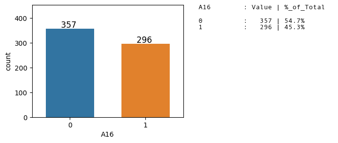

This dataset has been downloaded from  UC Irvine Machine Learning Repository. [Link](https://archive.ics.uci.edu/ml/datasets/Credit+Approval)  

This dataset is regarding credit card applications.  
The target variable/label is whether the application has been granted credit or not.  
All attribute names and values have been changed to meaningless symbols to protect
confidentiality of the data.

**The objective is here to build a model to give binary output based on the input attributes.**

>**Summary of Key information**

    Number of Instances/training examples          : 690  
    Number of Instances with missing attributes    :  37  
    Number of qualified Instances/training examples : 653

    Number of Input Attributes                     : 15
    Number of categorical attributes               :  9
    Number of numerical attributes                 :  6

    Target Attribute Type                          : Binary Class
    Target Class distribution                      : 54%:45%
    Problem Identification                         : Binary Classification with balanced data set


```python
import os
print(os.environ['PATH'])
```

    /usr/local/lib/ruby/gems/3.1.0/bin:/usr/local/opt/ruby/bin:/usr/local/lib/ruby/gems/3.1.0/bin:/usr/local/opt/ruby/bin:/Users/bhaskarroy/opt/anaconda3/bin:/Users/bhaskarroy/opt/anaconda3/condabin:/usr/local/bin:/usr/bin:/bin:/usr/sbin:/sbin:/Library/TeX/texbin:/usr/local/share/dotnet:~/.dotnet/tools:/Library/Frameworks/Mono.framework/Versions/Current/Commands:/usr/local/mysql/bin


```python
from notebook.services.config import ConfigManager
cm = ConfigManager().update('notebook', {'limit_output': 20})
```

# Loading necessary libraries


```python
import numpy as np
import pandas as pd
import time
import seaborn as sns
import matplotlib.pyplot as plt

# Created a custom package named eda and installed it locally
from eda import eda_overview, axes_utils

import category_encoders as ce
from sklearn.preprocessing import LabelEncoder
from sklearn.preprocessing import OrdinalEncoder

from sklearn.model_selection import train_test_split, learning_curve, KFold, cross_val_score
from sklearn.linear_model import LogisticRegression
from sklearn.tree import DecisionTreeClassifier
from sklearn.neighbors import KNeighborsClassifier
from sklearn.naive_bayes import GaussianNB
from sklearn.ensemble import RandomForestClassifier, GradientBoostingClassifier
from sklearn.svm import LinearSVC
from sklearn.discriminant_analysis import LinearDiscriminantAnalysis

from sklearn.metrics import recall_score, precision_score, accuracy_score,confusion_matrix, ConfusionMatrixDisplay, classification_report, f1_score
```


```python
pd.set_option('display.max_rows', 20)
pd.set_option('precision', 4)
```

# Importing the dataset


```python
path = "/Users/bhaskarroy/BHASKAR FILES/BHASKAR CAREER/Data Science/Practise/"  \
       "Python/UCI Machine Learning Repository/Credit Screening/"
```


```python
# Index
# credit.lisp
# credit.names
# crx.data
# crx.names


path1 = path + "crx.data"
path_name = path + "credit.names"
path_crxname = path + "crx.names"
```


```python
datContent = [i.strip().split() for i in open(path1).readlines()]
```


```python
len(datContent)
```


    690


```python
print(dir(type(datContent[0][0])))
```

    ['__add__', '__class__', '__contains__', '__delattr__', '__dir__', '__doc__', '__eq__', '__format__', '__ge__', '__getattribute__', '__getitem__', '__getnewargs__', '__gt__', '__hash__', '__init__', '__init_subclass__', '__iter__', '__le__', '__len__', '__lt__', '__mod__', '__mul__', '__ne__', '__new__', '__reduce__', '__reduce_ex__', '__repr__', '__rmod__', '__rmul__', '__setattr__', '__sizeof__', '__str__', '__subclasshook__', 'capitalize', 'casefold', 'center', 'count', 'encode', 'endswith', 'expandtabs', 'find', 'format', 'format_map', 'index', 'isalnum', 'isalpha', 'isascii', 'isdecimal', 'isdigit', 'isidentifier', 'islower', 'isnumeric', 'isprintable', 'isspace', 'istitle', 'isupper', 'join', 'ljust', 'lower', 'lstrip', 'maketrans', 'partition', 'replace', 'rfind', 'rindex', 'rjust', 'rpartition', 'rsplit', 'rstrip', 'split', 'splitlines', 'startswith', 'strip', 'swapcase', 'title', 'translate', 'upper', 'zfill']


```python
# Inspecting the contents
print(datContent[0][0].split(sep = ","))
```

    ['b', '30.83', '0', 'u', 'g', 'w', 'v', '1.25', 't', 't', '01', 'f', 'g', '00202', '0', '+']


```python
len(datContent[0])
```


    1


# Dataset Information


```python
# Opening the file credit.names for the description of data set
with open(path_name) as f:
    print(f.read())
```

    1. Title: Japanese Credit Screening (examples & domain theory)

    2. Source information:
       -- Creators: Chiharu Sano
       -- Donor: Chiharu Sano
                 csano@bonnie.ICS.UCI.EDU
       -- Date: 3/19/92

    3. Past usage:
       -- None Published

    4. Relevant information:
       --  Examples represent positive and negative instances of people who were and were not
           granted credit.
       --  The theory was generated by talking to the individuals at a Japanese company that grants
           credit.

    5. Number of instances: 125


# Attributes Information


```python
# Opening the file crx.names for the description of data set
with open(path_crxname) as f:
    print(f.read())
```


    1. Title: Credit Approval

    2. Sources:
        (confidential)
        Submitted by quinlan@cs.su.oz.au

    3.  Past Usage:

        See Quinlan,
        * "Simplifying decision trees", Int J Man-Machine Studies 27,
          Dec 1987, pp. 221-234.
        * "C4.5: Programs for Machine Learning", Morgan Kaufmann, Oct 1992

    4.  Relevant Information:

        This file concerns credit card applications.  All attribute names
        and values have been changed to meaningless symbols to protect
        confidentiality of the data.

        This dataset is interesting because there is a good mix of
        attributes -- continuous, nominal with small numbers of
        values, and nominal with larger numbers of values.  There
        are also a few missing values.

    5.  Number of Instances: 690

    6.  Number of Attributes: 15 + class attribute

    7.  Attribute Information:

        A1:	b, a.
        A2:	continuous.
        A3:	continuous.
        A4:	u, y, l, t.
        A5:	g, p, gg.
        A6:	c, d, cc, i, j, k, m, r, q, w, x, e, aa, ff.
        A7:	v, h, bb, j, n, z, dd, ff, o.
        A8:	continuous.
        A9:	t, f.
        A10:	t, f.
        A11:	continuous.
        A12:	t, f.
        A13:	g, p, s.
        A14:	continuous.
        A15:	continuous.
        A16: +,-         (class attribute)

    8.  Missing Attribute Values:
        37 cases (5%) have one or more missing values.  The missing
        values from particular attributes are:

        A1:  12
        A2:  12
        A4:   6
        A5:   6
        A6:   9
        A7:   9
        A14: 13

    9.  Class Distribution

        +: 307 (44.5%)
        -: 383 (55.5%)


```python
with open(path+"Index") as f:
    print(f.read())
```

    Index of credit-screening

    02 Dec 1996      182 Index
    19 Sep 1992    32218 crx.data
    19 Sep 1992     1486 crx.names
    16 Jul 1992    12314 credit.lisp
    16 Jul 1992      522 credit.names


```python
#with open(path+"credit.lisp") as f:
#    print(f.read())
```

# Data preprocessing  

Following actions were undertaken:

- Converting to Dataframe Format
- As attribute names are anonymised, create standard feature name starting with 'A' and suffixed with feature number
- Handling Missing values : 37 rows had missing values and are not being considered for model building
- Converting Class symbols of Target variable to binary values
- Processing Continous Attributes : Based on inspection, continuous attributes have been converted to float type.


## Converting to Dataframe Format


```python
# Inspecting the data
# We find that all the elements in a row is fused as one element.
# We need to use comma for splitting
datContent[0:5]
```


    [['b,30.83,0,u,g,w,v,1.25,t,t,01,f,g,00202,0,+'],
     ['a,58.67,4.46,u,g,q,h,3.04,t,t,06,f,g,00043,560,+'],
     ['a,24.50,0.5,u,g,q,h,1.5,t,f,0,f,g,00280,824,+'],
     ['b,27.83,1.54,u,g,w,v,3.75,t,t,05,t,g,00100,3,+'],
     ['b,20.17,5.625,u,g,w,v,1.71,t,f,0,f,s,00120,0,+']]


```python
# Splitting using comma to get individual elements
print(datContent[0][0].split(sep = ","))
```

    ['b', '30.83', '0', 'u', 'g', 'w', 'v', '1.25', 't', 't', '01', 'f', 'g', '00202', '0', '+']


```python
# The Number of attributes/features is 16
attrCount = len(datContent[0][0].split(sep = ","))
attrCount
```


    16


```python
# As all features names have been changed/anonymised,
# we will create standard feature name starting with 'A' and suffixed with feature number
colNames = ["A"+str(i+1) for i in range(attrCount)]
print(colNames)
```

    ['A1', 'A2', 'A3', 'A4', 'A5', 'A6', 'A7', 'A8', 'A9', 'A10', 'A11', 'A12', 'A13', 'A14', 'A15', 'A16']


```python
# Extracting values/data that will be passed as data to create the Dataframe
rawData = []

for i in datContent:
    for j in i:
        rawData.append(j.split(sep = ","))      
```


```python
# Creating the Dataframe
df = pd.DataFrame(rawData, columns = colNames)

# Inspecting the Dataframe
df.head()
```


<div>
<style scoped>
    .dataframe tbody tr th:only-of-type {
        vertical-align: middle;
    }

    .dataframe tbody tr th {
        vertical-align: top;
    }

    .dataframe thead th {
        text-align: right;
    }
</style>
<table border="1" class="dataframe">
  <thead>
    <tr style="text-align: right;">
      <th></th>
      <th>A1</th>
      <th>A2</th>
      <th>A3</th>
      <th>A4</th>
      <th>A5</th>
      <th>A6</th>
      <th>A7</th>
      <th>A8</th>
      <th>A9</th>
      <th>A10</th>
      <th>A11</th>
      <th>A12</th>
      <th>A13</th>
      <th>A14</th>
      <th>A15</th>
      <th>A16</th>
    </tr>
  </thead>
  <tbody>
    <tr>
      <th>0</th>
      <td>b</td>
      <td>30.83</td>
      <td>0</td>
      <td>u</td>
      <td>g</td>
      <td>w</td>
      <td>v</td>
      <td>1.25</td>
      <td>t</td>
      <td>t</td>
      <td>01</td>
      <td>f</td>
      <td>g</td>
      <td>00202</td>
      <td>0</td>
      <td>+</td>
    </tr>
    <tr>
      <th>1</th>
      <td>a</td>
      <td>58.67</td>
      <td>4.46</td>
      <td>u</td>
      <td>g</td>
      <td>q</td>
      <td>h</td>
      <td>3.04</td>
      <td>t</td>
      <td>t</td>
      <td>06</td>
      <td>f</td>
      <td>g</td>
      <td>00043</td>
      <td>560</td>
      <td>+</td>
    </tr>
    <tr>
      <th>2</th>
      <td>a</td>
      <td>24.50</td>
      <td>0.5</td>
      <td>u</td>
      <td>g</td>
      <td>q</td>
      <td>h</td>
      <td>1.5</td>
      <td>t</td>
      <td>f</td>
      <td>0</td>
      <td>f</td>
      <td>g</td>
      <td>00280</td>
      <td>824</td>
      <td>+</td>
    </tr>
    <tr>
      <th>3</th>
      <td>b</td>
      <td>27.83</td>
      <td>1.54</td>
      <td>u</td>
      <td>g</td>
      <td>w</td>
      <td>v</td>
      <td>3.75</td>
      <td>t</td>
      <td>t</td>
      <td>05</td>
      <td>t</td>
      <td>g</td>
      <td>00100</td>
      <td>3</td>
      <td>+</td>
    </tr>
    <tr>
      <th>4</th>
      <td>b</td>
      <td>20.17</td>
      <td>5.625</td>
      <td>u</td>
      <td>g</td>
      <td>w</td>
      <td>v</td>
      <td>1.71</td>
      <td>t</td>
      <td>f</td>
      <td>0</td>
      <td>f</td>
      <td>s</td>
      <td>00120</td>
      <td>0</td>
      <td>+</td>
    </tr>
  </tbody>
</table>
</div>


```python
# Inspecting the dataframe
# We find that features 'A2','A16' have symbols that would require further preprocessing
df.describe()
```


<div>
<style scoped>
    .dataframe tbody tr th:only-of-type {
        vertical-align: middle;
    }

    .dataframe tbody tr th {
        vertical-align: top;
    }

    .dataframe thead th {
        text-align: right;
    }
</style>
<table border="1" class="dataframe">
  <thead>
    <tr style="text-align: right;">
      <th></th>
      <th>A1</th>
      <th>A2</th>
      <th>A3</th>
      <th>A4</th>
      <th>A5</th>
      <th>A6</th>
      <th>A7</th>
      <th>A8</th>
      <th>A9</th>
      <th>A10</th>
      <th>A11</th>
      <th>A12</th>
      <th>A13</th>
      <th>A14</th>
      <th>A15</th>
      <th>A16</th>
    </tr>
  </thead>
  <tbody>
    <tr>
      <th>count</th>
      <td>690</td>
      <td>690</td>
      <td>690</td>
      <td>690</td>
      <td>690</td>
      <td>690</td>
      <td>690</td>
      <td>690</td>
      <td>690</td>
      <td>690</td>
      <td>690</td>
      <td>690</td>
      <td>690</td>
      <td>690</td>
      <td>690</td>
      <td>690</td>
    </tr>
    <tr>
      <th>unique</th>
      <td>3</td>
      <td>350</td>
      <td>215</td>
      <td>4</td>
      <td>4</td>
      <td>15</td>
      <td>10</td>
      <td>132</td>
      <td>2</td>
      <td>2</td>
      <td>23</td>
      <td>2</td>
      <td>3</td>
      <td>171</td>
      <td>240</td>
      <td>2</td>
    </tr>
    <tr>
      <th>top</th>
      <td>b</td>
      <td>?</td>
      <td>1.5</td>
      <td>u</td>
      <td>g</td>
      <td>c</td>
      <td>v</td>
      <td>0</td>
      <td>t</td>
      <td>f</td>
      <td>0</td>
      <td>f</td>
      <td>g</td>
      <td>00000</td>
      <td>0</td>
      <td>-</td>
    </tr>
    <tr>
      <th>freq</th>
      <td>468</td>
      <td>12</td>
      <td>21</td>
      <td>519</td>
      <td>519</td>
      <td>137</td>
      <td>399</td>
      <td>70</td>
      <td>361</td>
      <td>395</td>
      <td>395</td>
      <td>374</td>
      <td>625</td>
      <td>132</td>
      <td>295</td>
      <td>383</td>
    </tr>
  </tbody>
</table>
</div>


```python
# Checking the datatypes to decide the datatype conversions required feature wise
df.info()
```

    <class 'pandas.core.frame.DataFrame'>
    RangeIndex: 690 entries, 0 to 689
    Data columns (total 16 columns):
     #   Column  Non-Null Count  Dtype
    ---  ------  --------------  -----
     0   A1      690 non-null    object
     1   A2      690 non-null    object
     2   A3      690 non-null    object
     3   A4      690 non-null    object
     4   A5      690 non-null    object
     5   A6      690 non-null    object
     6   A7      690 non-null    object
     7   A8      690 non-null    object
     8   A9      690 non-null    object
     9   A10     690 non-null    object
     10  A11     690 non-null    object
     11  A12     690 non-null    object
     12  A13     690 non-null    object
     13  A14     690 non-null    object
     14  A15     690 non-null    object
     15  A16     690 non-null    object
    dtypes: object(16)
    memory usage: 86.4+ KB


## Handling Missing values


```python
#df['A2'].astype("float")
df1 = df[(df == "?").any(axis = 1)]
```


```python
df1
```


<div>
<style scoped>
    .dataframe tbody tr th:only-of-type {
        vertical-align: middle;
    }

    .dataframe tbody tr th {
        vertical-align: top;
    }

    .dataframe thead th {
        text-align: right;
    }
</style>
<table border="1" class="dataframe">
  <thead>
    <tr style="text-align: right;">
      <th></th>
      <th>A1</th>
      <th>A2</th>
      <th>A3</th>
      <th>A4</th>
      <th>A5</th>
      <th>A6</th>
      <th>A7</th>
      <th>A8</th>
      <th>A9</th>
      <th>A10</th>
      <th>A11</th>
      <th>A12</th>
      <th>A13</th>
      <th>A14</th>
      <th>A15</th>
      <th>A16</th>
    </tr>
  </thead>
  <tbody>
    <tr>
      <th>71</th>
      <td>b</td>
      <td>34.83</td>
      <td>4</td>
      <td>u</td>
      <td>g</td>
      <td>d</td>
      <td>bb</td>
      <td>12.5</td>
      <td>t</td>
      <td>f</td>
      <td>0</td>
      <td>t</td>
      <td>g</td>
      <td>?</td>
      <td>0</td>
      <td>-</td>
    </tr>
    <tr>
      <th>83</th>
      <td>a</td>
      <td>?</td>
      <td>3.5</td>
      <td>u</td>
      <td>g</td>
      <td>d</td>
      <td>v</td>
      <td>3</td>
      <td>t</td>
      <td>f</td>
      <td>0</td>
      <td>t</td>
      <td>g</td>
      <td>00300</td>
      <td>0</td>
      <td>-</td>
    </tr>
    <tr>
      <th>86</th>
      <td>b</td>
      <td>?</td>
      <td>0.375</td>
      <td>u</td>
      <td>g</td>
      <td>d</td>
      <td>v</td>
      <td>0.875</td>
      <td>t</td>
      <td>f</td>
      <td>0</td>
      <td>t</td>
      <td>s</td>
      <td>00928</td>
      <td>0</td>
      <td>-</td>
    </tr>
    <tr>
      <th>92</th>
      <td>b</td>
      <td>?</td>
      <td>5</td>
      <td>y</td>
      <td>p</td>
      <td>aa</td>
      <td>v</td>
      <td>8.5</td>
      <td>t</td>
      <td>f</td>
      <td>0</td>
      <td>f</td>
      <td>g</td>
      <td>00000</td>
      <td>0</td>
      <td>-</td>
    </tr>
    <tr>
      <th>97</th>
      <td>b</td>
      <td>?</td>
      <td>0.5</td>
      <td>u</td>
      <td>g</td>
      <td>c</td>
      <td>bb</td>
      <td>0.835</td>
      <td>t</td>
      <td>f</td>
      <td>0</td>
      <td>t</td>
      <td>s</td>
      <td>00320</td>
      <td>0</td>
      <td>-</td>
    </tr>
    <tr>
      <th>...</th>
      <td>...</td>
      <td>...</td>
      <td>...</td>
      <td>...</td>
      <td>...</td>
      <td>...</td>
      <td>...</td>
      <td>...</td>
      <td>...</td>
      <td>...</td>
      <td>...</td>
      <td>...</td>
      <td>...</td>
      <td>...</td>
      <td>...</td>
      <td>...</td>
    </tr>
    <tr>
      <th>608</th>
      <td>b</td>
      <td>?</td>
      <td>0.04</td>
      <td>y</td>
      <td>p</td>
      <td>d</td>
      <td>v</td>
      <td>4.25</td>
      <td>f</td>
      <td>f</td>
      <td>0</td>
      <td>t</td>
      <td>g</td>
      <td>00460</td>
      <td>0</td>
      <td>-</td>
    </tr>
    <tr>
      <th>622</th>
      <td>a</td>
      <td>25.58</td>
      <td>0</td>
      <td>?</td>
      <td>?</td>
      <td>?</td>
      <td>?</td>
      <td>0</td>
      <td>f</td>
      <td>f</td>
      <td>0</td>
      <td>f</td>
      <td>p</td>
      <td>?</td>
      <td>0</td>
      <td>+</td>
    </tr>
    <tr>
      <th>626</th>
      <td>b</td>
      <td>22.00</td>
      <td>7.835</td>
      <td>y</td>
      <td>p</td>
      <td>i</td>
      <td>bb</td>
      <td>0.165</td>
      <td>f</td>
      <td>f</td>
      <td>0</td>
      <td>t</td>
      <td>g</td>
      <td>?</td>
      <td>0</td>
      <td>-</td>
    </tr>
    <tr>
      <th>641</th>
      <td>?</td>
      <td>33.17</td>
      <td>2.25</td>
      <td>y</td>
      <td>p</td>
      <td>cc</td>
      <td>v</td>
      <td>3.5</td>
      <td>f</td>
      <td>f</td>
      <td>0</td>
      <td>t</td>
      <td>g</td>
      <td>00200</td>
      <td>141</td>
      <td>-</td>
    </tr>
    <tr>
      <th>673</th>
      <td>?</td>
      <td>29.50</td>
      <td>2</td>
      <td>y</td>
      <td>p</td>
      <td>e</td>
      <td>h</td>
      <td>2</td>
      <td>f</td>
      <td>f</td>
      <td>0</td>
      <td>f</td>
      <td>g</td>
      <td>00256</td>
      <td>17</td>
      <td>-</td>
    </tr>
  </tbody>
</table>
<p>37 rows × 16 columns</p>
</div>


```python
# Selecting a subset without any missing values
df2 = df[(df != "?").all(axis = 1)]
df2.shape
```


    (653, 16)


```python
df2.head()
```


<div>
<style scoped>
    .dataframe tbody tr th:only-of-type {
        vertical-align: middle;
    }

    .dataframe tbody tr th {
        vertical-align: top;
    }

    .dataframe thead th {
        text-align: right;
    }
</style>
<table border="1" class="dataframe">
  <thead>
    <tr style="text-align: right;">
      <th></th>
      <th>A1</th>
      <th>A2</th>
      <th>A3</th>
      <th>A4</th>
      <th>A5</th>
      <th>A6</th>
      <th>A7</th>
      <th>A8</th>
      <th>A9</th>
      <th>A10</th>
      <th>A11</th>
      <th>A12</th>
      <th>A13</th>
      <th>A14</th>
      <th>A15</th>
      <th>A16</th>
    </tr>
  </thead>
  <tbody>
    <tr>
      <th>0</th>
      <td>b</td>
      <td>30.83</td>
      <td>0</td>
      <td>u</td>
      <td>g</td>
      <td>w</td>
      <td>v</td>
      <td>1.25</td>
      <td>t</td>
      <td>t</td>
      <td>01</td>
      <td>f</td>
      <td>g</td>
      <td>00202</td>
      <td>0</td>
      <td>+</td>
    </tr>
    <tr>
      <th>1</th>
      <td>a</td>
      <td>58.67</td>
      <td>4.46</td>
      <td>u</td>
      <td>g</td>
      <td>q</td>
      <td>h</td>
      <td>3.04</td>
      <td>t</td>
      <td>t</td>
      <td>06</td>
      <td>f</td>
      <td>g</td>
      <td>00043</td>
      <td>560</td>
      <td>+</td>
    </tr>
    <tr>
      <th>2</th>
      <td>a</td>
      <td>24.50</td>
      <td>0.5</td>
      <td>u</td>
      <td>g</td>
      <td>q</td>
      <td>h</td>
      <td>1.5</td>
      <td>t</td>
      <td>f</td>
      <td>0</td>
      <td>f</td>
      <td>g</td>
      <td>00280</td>
      <td>824</td>
      <td>+</td>
    </tr>
    <tr>
      <th>3</th>
      <td>b</td>
      <td>27.83</td>
      <td>1.54</td>
      <td>u</td>
      <td>g</td>
      <td>w</td>
      <td>v</td>
      <td>3.75</td>
      <td>t</td>
      <td>t</td>
      <td>05</td>
      <td>t</td>
      <td>g</td>
      <td>00100</td>
      <td>3</td>
      <td>+</td>
    </tr>
    <tr>
      <th>4</th>
      <td>b</td>
      <td>20.17</td>
      <td>5.625</td>
      <td>u</td>
      <td>g</td>
      <td>w</td>
      <td>v</td>
      <td>1.71</td>
      <td>t</td>
      <td>f</td>
      <td>0</td>
      <td>f</td>
      <td>s</td>
      <td>00120</td>
      <td>0</td>
      <td>+</td>
    </tr>
  </tbody>
</table>
</div>


## Converting Class symbols of Target variable to binary values


```python
# Below code may return Setting with Copy warning
# Use df._is_view to check if a dataframe is a view or copy
# df2.loc[:, 'A16'] = df2['A16'].map({"-": 0, "+":1}).values

# Use df.assign instead.
# https://stackoverflow.com/questions/36846060/how-to-replace-an-entire-column-on-pandas-dataframe
df2 = df2.assign(A16 = df2['A16'].map({"-": 0, "+":1}))
```


```python
df2
```


<div>
<style scoped>
    .dataframe tbody tr th:only-of-type {
        vertical-align: middle;
    }

    .dataframe tbody tr th {
        vertical-align: top;
    }

    .dataframe thead th {
        text-align: right;
    }
</style>
<table border="1" class="dataframe">
  <thead>
    <tr style="text-align: right;">
      <th></th>
      <th>A1</th>
      <th>A2</th>
      <th>A3</th>
      <th>A4</th>
      <th>A5</th>
      <th>A6</th>
      <th>A7</th>
      <th>A8</th>
      <th>A9</th>
      <th>A10</th>
      <th>A11</th>
      <th>A12</th>
      <th>A13</th>
      <th>A14</th>
      <th>A15</th>
      <th>A16</th>
    </tr>
  </thead>
  <tbody>
    <tr>
      <th>0</th>
      <td>b</td>
      <td>30.83</td>
      <td>0</td>
      <td>u</td>
      <td>g</td>
      <td>w</td>
      <td>v</td>
      <td>1.25</td>
      <td>t</td>
      <td>t</td>
      <td>01</td>
      <td>f</td>
      <td>g</td>
      <td>00202</td>
      <td>0</td>
      <td>1</td>
    </tr>
    <tr>
      <th>1</th>
      <td>a</td>
      <td>58.67</td>
      <td>4.46</td>
      <td>u</td>
      <td>g</td>
      <td>q</td>
      <td>h</td>
      <td>3.04</td>
      <td>t</td>
      <td>t</td>
      <td>06</td>
      <td>f</td>
      <td>g</td>
      <td>00043</td>
      <td>560</td>
      <td>1</td>
    </tr>
    <tr>
      <th>2</th>
      <td>a</td>
      <td>24.50</td>
      <td>0.5</td>
      <td>u</td>
      <td>g</td>
      <td>q</td>
      <td>h</td>
      <td>1.5</td>
      <td>t</td>
      <td>f</td>
      <td>0</td>
      <td>f</td>
      <td>g</td>
      <td>00280</td>
      <td>824</td>
      <td>1</td>
    </tr>
    <tr>
      <th>3</th>
      <td>b</td>
      <td>27.83</td>
      <td>1.54</td>
      <td>u</td>
      <td>g</td>
      <td>w</td>
      <td>v</td>
      <td>3.75</td>
      <td>t</td>
      <td>t</td>
      <td>05</td>
      <td>t</td>
      <td>g</td>
      <td>00100</td>
      <td>3</td>
      <td>1</td>
    </tr>
    <tr>
      <th>4</th>
      <td>b</td>
      <td>20.17</td>
      <td>5.625</td>
      <td>u</td>
      <td>g</td>
      <td>w</td>
      <td>v</td>
      <td>1.71</td>
      <td>t</td>
      <td>f</td>
      <td>0</td>
      <td>f</td>
      <td>s</td>
      <td>00120</td>
      <td>0</td>
      <td>1</td>
    </tr>
    <tr>
      <th>...</th>
      <td>...</td>
      <td>...</td>
      <td>...</td>
      <td>...</td>
      <td>...</td>
      <td>...</td>
      <td>...</td>
      <td>...</td>
      <td>...</td>
      <td>...</td>
      <td>...</td>
      <td>...</td>
      <td>...</td>
      <td>...</td>
      <td>...</td>
      <td>...</td>
    </tr>
    <tr>
      <th>685</th>
      <td>b</td>
      <td>21.08</td>
      <td>10.085</td>
      <td>y</td>
      <td>p</td>
      <td>e</td>
      <td>h</td>
      <td>1.25</td>
      <td>f</td>
      <td>f</td>
      <td>0</td>
      <td>f</td>
      <td>g</td>
      <td>00260</td>
      <td>0</td>
      <td>0</td>
    </tr>
    <tr>
      <th>686</th>
      <td>a</td>
      <td>22.67</td>
      <td>0.75</td>
      <td>u</td>
      <td>g</td>
      <td>c</td>
      <td>v</td>
      <td>2</td>
      <td>f</td>
      <td>t</td>
      <td>02</td>
      <td>t</td>
      <td>g</td>
      <td>00200</td>
      <td>394</td>
      <td>0</td>
    </tr>
    <tr>
      <th>687</th>
      <td>a</td>
      <td>25.25</td>
      <td>13.5</td>
      <td>y</td>
      <td>p</td>
      <td>ff</td>
      <td>ff</td>
      <td>2</td>
      <td>f</td>
      <td>t</td>
      <td>01</td>
      <td>t</td>
      <td>g</td>
      <td>00200</td>
      <td>1</td>
      <td>0</td>
    </tr>
    <tr>
      <th>688</th>
      <td>b</td>
      <td>17.92</td>
      <td>0.205</td>
      <td>u</td>
      <td>g</td>
      <td>aa</td>
      <td>v</td>
      <td>0.04</td>
      <td>f</td>
      <td>f</td>
      <td>0</td>
      <td>f</td>
      <td>g</td>
      <td>00280</td>
      <td>750</td>
      <td>0</td>
    </tr>
    <tr>
      <th>689</th>
      <td>b</td>
      <td>35.00</td>
      <td>3.375</td>
      <td>u</td>
      <td>g</td>
      <td>c</td>
      <td>h</td>
      <td>8.29</td>
      <td>f</td>
      <td>f</td>
      <td>0</td>
      <td>t</td>
      <td>g</td>
      <td>00000</td>
      <td>0</td>
      <td>0</td>
    </tr>
  </tbody>
</table>
<p>653 rows × 16 columns</p>
</div>


```python
df2
```


<div>
<style scoped>
    .dataframe tbody tr th:only-of-type {
        vertical-align: middle;
    }

    .dataframe tbody tr th {
        vertical-align: top;
    }

    .dataframe thead th {
        text-align: right;
    }
</style>
<table border="1" class="dataframe">
  <thead>
    <tr style="text-align: right;">
      <th></th>
      <th>A1</th>
      <th>A2</th>
      <th>A3</th>
      <th>A4</th>
      <th>A5</th>
      <th>A6</th>
      <th>A7</th>
      <th>A8</th>
      <th>A9</th>
      <th>A10</th>
      <th>A11</th>
      <th>A12</th>
      <th>A13</th>
      <th>A14</th>
      <th>A15</th>
      <th>A16</th>
    </tr>
  </thead>
  <tbody>
    <tr>
      <th>0</th>
      <td>b</td>
      <td>30.83</td>
      <td>0</td>
      <td>u</td>
      <td>g</td>
      <td>w</td>
      <td>v</td>
      <td>1.25</td>
      <td>t</td>
      <td>t</td>
      <td>01</td>
      <td>f</td>
      <td>g</td>
      <td>00202</td>
      <td>0</td>
      <td>1</td>
    </tr>
    <tr>
      <th>1</th>
      <td>a</td>
      <td>58.67</td>
      <td>4.46</td>
      <td>u</td>
      <td>g</td>
      <td>q</td>
      <td>h</td>
      <td>3.04</td>
      <td>t</td>
      <td>t</td>
      <td>06</td>
      <td>f</td>
      <td>g</td>
      <td>00043</td>
      <td>560</td>
      <td>1</td>
    </tr>
    <tr>
      <th>2</th>
      <td>a</td>
      <td>24.50</td>
      <td>0.5</td>
      <td>u</td>
      <td>g</td>
      <td>q</td>
      <td>h</td>
      <td>1.5</td>
      <td>t</td>
      <td>f</td>
      <td>0</td>
      <td>f</td>
      <td>g</td>
      <td>00280</td>
      <td>824</td>
      <td>1</td>
    </tr>
    <tr>
      <th>3</th>
      <td>b</td>
      <td>27.83</td>
      <td>1.54</td>
      <td>u</td>
      <td>g</td>
      <td>w</td>
      <td>v</td>
      <td>3.75</td>
      <td>t</td>
      <td>t</td>
      <td>05</td>
      <td>t</td>
      <td>g</td>
      <td>00100</td>
      <td>3</td>
      <td>1</td>
    </tr>
    <tr>
      <th>4</th>
      <td>b</td>
      <td>20.17</td>
      <td>5.625</td>
      <td>u</td>
      <td>g</td>
      <td>w</td>
      <td>v</td>
      <td>1.71</td>
      <td>t</td>
      <td>f</td>
      <td>0</td>
      <td>f</td>
      <td>s</td>
      <td>00120</td>
      <td>0</td>
      <td>1</td>
    </tr>
    <tr>
      <th>...</th>
      <td>...</td>
      <td>...</td>
      <td>...</td>
      <td>...</td>
      <td>...</td>
      <td>...</td>
      <td>...</td>
      <td>...</td>
      <td>...</td>
      <td>...</td>
      <td>...</td>
      <td>...</td>
      <td>...</td>
      <td>...</td>
      <td>...</td>
      <td>...</td>
    </tr>
    <tr>
      <th>685</th>
      <td>b</td>
      <td>21.08</td>
      <td>10.085</td>
      <td>y</td>
      <td>p</td>
      <td>e</td>
      <td>h</td>
      <td>1.25</td>
      <td>f</td>
      <td>f</td>
      <td>0</td>
      <td>f</td>
      <td>g</td>
      <td>00260</td>
      <td>0</td>
      <td>0</td>
    </tr>
    <tr>
      <th>686</th>
      <td>a</td>
      <td>22.67</td>
      <td>0.75</td>
      <td>u</td>
      <td>g</td>
      <td>c</td>
      <td>v</td>
      <td>2</td>
      <td>f</td>
      <td>t</td>
      <td>02</td>
      <td>t</td>
      <td>g</td>
      <td>00200</td>
      <td>394</td>
      <td>0</td>
    </tr>
    <tr>
      <th>687</th>
      <td>a</td>
      <td>25.25</td>
      <td>13.5</td>
      <td>y</td>
      <td>p</td>
      <td>ff</td>
      <td>ff</td>
      <td>2</td>
      <td>f</td>
      <td>t</td>
      <td>01</td>
      <td>t</td>
      <td>g</td>
      <td>00200</td>
      <td>1</td>
      <td>0</td>
    </tr>
    <tr>
      <th>688</th>
      <td>b</td>
      <td>17.92</td>
      <td>0.205</td>
      <td>u</td>
      <td>g</td>
      <td>aa</td>
      <td>v</td>
      <td>0.04</td>
      <td>f</td>
      <td>f</td>
      <td>0</td>
      <td>f</td>
      <td>g</td>
      <td>00280</td>
      <td>750</td>
      <td>0</td>
    </tr>
    <tr>
      <th>689</th>
      <td>b</td>
      <td>35.00</td>
      <td>3.375</td>
      <td>u</td>
      <td>g</td>
      <td>c</td>
      <td>h</td>
      <td>8.29</td>
      <td>f</td>
      <td>f</td>
      <td>0</td>
      <td>t</td>
      <td>g</td>
      <td>00000</td>
      <td>0</td>
      <td>0</td>
    </tr>
  </tbody>
</table>
<p>653 rows × 16 columns</p>
</div>


```python
from eda import datasets
datasets.credit_screening()
```


<div>
<style scoped>
    .dataframe tbody tr th:only-of-type {
        vertical-align: middle;
    }

    .dataframe tbody tr th {
        vertical-align: top;
    }

    .dataframe thead th {
        text-align: right;
    }
</style>
<table border="1" class="dataframe">
  <thead>
    <tr style="text-align: right;">
      <th></th>
      <th>A1</th>
      <th>A2</th>
      <th>A3</th>
      <th>A4</th>
      <th>A5</th>
      <th>A6</th>
      <th>A7</th>
      <th>A8</th>
      <th>A9</th>
      <th>A10</th>
      <th>A11</th>
      <th>A12</th>
      <th>A13</th>
      <th>A14</th>
      <th>A15</th>
      <th>A16</th>
    </tr>
  </thead>
  <tbody>
    <tr>
      <th>0</th>
      <td>b</td>
      <td>30.83</td>
      <td>0.000</td>
      <td>u</td>
      <td>g</td>
      <td>w</td>
      <td>v</td>
      <td>1.25</td>
      <td>t</td>
      <td>t</td>
      <td>1.0</td>
      <td>f</td>
      <td>g</td>
      <td>202.0</td>
      <td>0.0</td>
      <td>1</td>
    </tr>
    <tr>
      <th>1</th>
      <td>a</td>
      <td>58.67</td>
      <td>4.460</td>
      <td>u</td>
      <td>g</td>
      <td>q</td>
      <td>h</td>
      <td>3.04</td>
      <td>t</td>
      <td>t</td>
      <td>6.0</td>
      <td>f</td>
      <td>g</td>
      <td>43.0</td>
      <td>560.0</td>
      <td>1</td>
    </tr>
    <tr>
      <th>2</th>
      <td>a</td>
      <td>24.50</td>
      <td>0.500</td>
      <td>u</td>
      <td>g</td>
      <td>q</td>
      <td>h</td>
      <td>1.50</td>
      <td>t</td>
      <td>f</td>
      <td>0.0</td>
      <td>f</td>
      <td>g</td>
      <td>280.0</td>
      <td>824.0</td>
      <td>1</td>
    </tr>
    <tr>
      <th>3</th>
      <td>b</td>
      <td>27.83</td>
      <td>1.540</td>
      <td>u</td>
      <td>g</td>
      <td>w</td>
      <td>v</td>
      <td>3.75</td>
      <td>t</td>
      <td>t</td>
      <td>5.0</td>
      <td>t</td>
      <td>g</td>
      <td>100.0</td>
      <td>3.0</td>
      <td>1</td>
    </tr>
    <tr>
      <th>4</th>
      <td>b</td>
      <td>20.17</td>
      <td>5.625</td>
      <td>u</td>
      <td>g</td>
      <td>w</td>
      <td>v</td>
      <td>1.71</td>
      <td>t</td>
      <td>f</td>
      <td>0.0</td>
      <td>f</td>
      <td>s</td>
      <td>120.0</td>
      <td>0.0</td>
      <td>1</td>
    </tr>
    <tr>
      <th>...</th>
      <td>...</td>
      <td>...</td>
      <td>...</td>
      <td>...</td>
      <td>...</td>
      <td>...</td>
      <td>...</td>
      <td>...</td>
      <td>...</td>
      <td>...</td>
      <td>...</td>
      <td>...</td>
      <td>...</td>
      <td>...</td>
      <td>...</td>
      <td>...</td>
    </tr>
    <tr>
      <th>685</th>
      <td>b</td>
      <td>21.08</td>
      <td>10.085</td>
      <td>y</td>
      <td>p</td>
      <td>e</td>
      <td>h</td>
      <td>1.25</td>
      <td>f</td>
      <td>f</td>
      <td>0.0</td>
      <td>f</td>
      <td>g</td>
      <td>260.0</td>
      <td>0.0</td>
      <td>0</td>
    </tr>
    <tr>
      <th>686</th>
      <td>a</td>
      <td>22.67</td>
      <td>0.750</td>
      <td>u</td>
      <td>g</td>
      <td>c</td>
      <td>v</td>
      <td>2.00</td>
      <td>f</td>
      <td>t</td>
      <td>2.0</td>
      <td>t</td>
      <td>g</td>
      <td>200.0</td>
      <td>394.0</td>
      <td>0</td>
    </tr>
    <tr>
      <th>687</th>
      <td>a</td>
      <td>25.25</td>
      <td>13.500</td>
      <td>y</td>
      <td>p</td>
      <td>ff</td>
      <td>ff</td>
      <td>2.00</td>
      <td>f</td>
      <td>t</td>
      <td>1.0</td>
      <td>t</td>
      <td>g</td>
      <td>200.0</td>
      <td>1.0</td>
      <td>0</td>
    </tr>
    <tr>
      <th>688</th>
      <td>b</td>
      <td>17.92</td>
      <td>0.205</td>
      <td>u</td>
      <td>g</td>
      <td>aa</td>
      <td>v</td>
      <td>0.04</td>
      <td>f</td>
      <td>f</td>
      <td>0.0</td>
      <td>f</td>
      <td>g</td>
      <td>280.0</td>
      <td>750.0</td>
      <td>0</td>
    </tr>
    <tr>
      <th>689</th>
      <td>b</td>
      <td>35.00</td>
      <td>3.375</td>
      <td>u</td>
      <td>g</td>
      <td>c</td>
      <td>h</td>
      <td>8.29</td>
      <td>f</td>
      <td>f</td>
      <td>0.0</td>
      <td>t</td>
      <td>g</td>
      <td>0.0</td>
      <td>0.0</td>
      <td>0</td>
    </tr>
  </tbody>
</table>
<p>653 rows × 16 columns</p>
</div>


## Processing Continous Attributes


```python
# Continous Variables are A2, A3, A11, A14, A15
contAttr = ['A2', 'A3','A8', 'A11', 'A14', 'A15']
```


```python
for i in contAttr:
    df2.loc[:,i] = df2[i].astype("float")
```


```python
df2
```


<div>
<style scoped>
    .dataframe tbody tr th:only-of-type {
        vertical-align: middle;
    }

    .dataframe tbody tr th {
        vertical-align: top;
    }

    .dataframe thead th {
        text-align: right;
    }
</style>
<table border="1" class="dataframe">
  <thead>
    <tr style="text-align: right;">
      <th></th>
      <th>A1</th>
      <th>A2</th>
      <th>A3</th>
      <th>A4</th>
      <th>A5</th>
      <th>A6</th>
      <th>A7</th>
      <th>A8</th>
      <th>A9</th>
      <th>A10</th>
      <th>A11</th>
      <th>A12</th>
      <th>A13</th>
      <th>A14</th>
      <th>A15</th>
      <th>A16</th>
    </tr>
  </thead>
  <tbody>
    <tr>
      <th>0</th>
      <td>b</td>
      <td>30.83</td>
      <td>0.000</td>
      <td>u</td>
      <td>g</td>
      <td>w</td>
      <td>v</td>
      <td>1.25</td>
      <td>t</td>
      <td>t</td>
      <td>1.0</td>
      <td>f</td>
      <td>g</td>
      <td>202.0</td>
      <td>0.0</td>
      <td>1</td>
    </tr>
    <tr>
      <th>1</th>
      <td>a</td>
      <td>58.67</td>
      <td>4.460</td>
      <td>u</td>
      <td>g</td>
      <td>q</td>
      <td>h</td>
      <td>3.04</td>
      <td>t</td>
      <td>t</td>
      <td>6.0</td>
      <td>f</td>
      <td>g</td>
      <td>43.0</td>
      <td>560.0</td>
      <td>1</td>
    </tr>
    <tr>
      <th>2</th>
      <td>a</td>
      <td>24.50</td>
      <td>0.500</td>
      <td>u</td>
      <td>g</td>
      <td>q</td>
      <td>h</td>
      <td>1.50</td>
      <td>t</td>
      <td>f</td>
      <td>0.0</td>
      <td>f</td>
      <td>g</td>
      <td>280.0</td>
      <td>824.0</td>
      <td>1</td>
    </tr>
    <tr>
      <th>3</th>
      <td>b</td>
      <td>27.83</td>
      <td>1.540</td>
      <td>u</td>
      <td>g</td>
      <td>w</td>
      <td>v</td>
      <td>3.75</td>
      <td>t</td>
      <td>t</td>
      <td>5.0</td>
      <td>t</td>
      <td>g</td>
      <td>100.0</td>
      <td>3.0</td>
      <td>1</td>
    </tr>
    <tr>
      <th>4</th>
      <td>b</td>
      <td>20.17</td>
      <td>5.625</td>
      <td>u</td>
      <td>g</td>
      <td>w</td>
      <td>v</td>
      <td>1.71</td>
      <td>t</td>
      <td>f</td>
      <td>0.0</td>
      <td>f</td>
      <td>s</td>
      <td>120.0</td>
      <td>0.0</td>
      <td>1</td>
    </tr>
    <tr>
      <th>...</th>
      <td>...</td>
      <td>...</td>
      <td>...</td>
      <td>...</td>
      <td>...</td>
      <td>...</td>
      <td>...</td>
      <td>...</td>
      <td>...</td>
      <td>...</td>
      <td>...</td>
      <td>...</td>
      <td>...</td>
      <td>...</td>
      <td>...</td>
      <td>...</td>
    </tr>
    <tr>
      <th>685</th>
      <td>b</td>
      <td>21.08</td>
      <td>10.085</td>
      <td>y</td>
      <td>p</td>
      <td>e</td>
      <td>h</td>
      <td>1.25</td>
      <td>f</td>
      <td>f</td>
      <td>0.0</td>
      <td>f</td>
      <td>g</td>
      <td>260.0</td>
      <td>0.0</td>
      <td>0</td>
    </tr>
    <tr>
      <th>686</th>
      <td>a</td>
      <td>22.67</td>
      <td>0.750</td>
      <td>u</td>
      <td>g</td>
      <td>c</td>
      <td>v</td>
      <td>2.00</td>
      <td>f</td>
      <td>t</td>
      <td>2.0</td>
      <td>t</td>
      <td>g</td>
      <td>200.0</td>
      <td>394.0</td>
      <td>0</td>
    </tr>
    <tr>
      <th>687</th>
      <td>a</td>
      <td>25.25</td>
      <td>13.500</td>
      <td>y</td>
      <td>p</td>
      <td>ff</td>
      <td>ff</td>
      <td>2.00</td>
      <td>f</td>
      <td>t</td>
      <td>1.0</td>
      <td>t</td>
      <td>g</td>
      <td>200.0</td>
      <td>1.0</td>
      <td>0</td>
    </tr>
    <tr>
      <th>688</th>
      <td>b</td>
      <td>17.92</td>
      <td>0.205</td>
      <td>u</td>
      <td>g</td>
      <td>aa</td>
      <td>v</td>
      <td>0.04</td>
      <td>f</td>
      <td>f</td>
      <td>0.0</td>
      <td>f</td>
      <td>g</td>
      <td>280.0</td>
      <td>750.0</td>
      <td>0</td>
    </tr>
    <tr>
      <th>689</th>
      <td>b</td>
      <td>35.00</td>
      <td>3.375</td>
      <td>u</td>
      <td>g</td>
      <td>c</td>
      <td>h</td>
      <td>8.29</td>
      <td>f</td>
      <td>f</td>
      <td>0.0</td>
      <td>t</td>
      <td>g</td>
      <td>0.0</td>
      <td>0.0</td>
      <td>0</td>
    </tr>
  </tbody>
</table>
<p>653 rows × 16 columns</p>
</div>


# Univariate Analysis - Continous Variables  


Findings from the distribution of numeric variables at overall level and considering the application status are as below:  
- The dispersion/standard deviation of numeric variables for the applications granted credit extends over a wide range.
- The shape of distribution is similar in both groups for the variables 'A2', 'A3' and 'A14'.
- In particular, Numeric variables **'A11' and 'A15'** is concentrated to a **very narrow range** for the applications not granted credit.


```python
eda_overview.UVA_numeric(data = df2, var_group = contAttr)
```


```python
# Apply the default theme
sns.set_theme()
t = eda_overview.UVA_numeric_classwise(df2, 'A16', ['A16'],
                                       colcount = 3, colwidth = 3,
                                       rowheight = 3,
                                       plot_type = 'histogram', element = 'step')

plt.gcf().savefig(path+'Numeric_interaction_class.png', dpi = 150)
```


```python
t = eda_overview.distribution_comparison(df2, 'A16',['A16'])[0]
t
```


<div>
<style scoped>
    .dataframe tbody tr th:only-of-type {
        vertical-align: middle;
    }

    .dataframe tbody tr th {
        vertical-align: top;
    }

    .dataframe thead tr th {
        text-align: left;
    }

    .dataframe thead tr:last-of-type th {
        text-align: right;
    }
</style>
<table border="1" class="dataframe">
  <thead>
    <tr>
      <th>Value</th>
      <th colspan="2" halign="left">Maximum</th>
      <th colspan="2" halign="left">Minimum</th>
      <th colspan="2" halign="left">Range</th>
      <th colspan="2" halign="left">Standard Deviation</th>
      <th colspan="2" halign="left">Unique Value count</th>
    </tr>
    <tr>
      <th>A16 category</th>
      <th>0</th>
      <th>1</th>
      <th>0</th>
      <th>1</th>
      <th>0</th>
      <th>1</th>
      <th>0</th>
      <th>1</th>
      <th>0</th>
      <th>1</th>
    </tr>
    <tr>
      <th>Continous Attributes</th>
      <th></th>
      <th></th>
      <th></th>
      <th></th>
      <th></th>
      <th></th>
      <th></th>
      <th></th>
      <th></th>
      <th></th>
    </tr>
  </thead>
  <tbody>
    <tr>
      <th>A2</th>
      <td>74.830</td>
      <td>76.75</td>
      <td>15.17</td>
      <td>13.75</td>
      <td>59.660</td>
      <td>63.0</td>
      <td>10.7192</td>
      <td>12.6894</td>
      <td>222</td>
      <td>219</td>
    </tr>
    <tr>
      <th>A3</th>
      <td>26.335</td>
      <td>28.00</td>
      <td>0.00</td>
      <td>0.00</td>
      <td>26.335</td>
      <td>28.0</td>
      <td>4.3931</td>
      <td>5.4927</td>
      <td>146</td>
      <td>146</td>
    </tr>
    <tr>
      <th>A8</th>
      <td>13.875</td>
      <td>28.50</td>
      <td>0.00</td>
      <td>0.00</td>
      <td>13.875</td>
      <td>28.5</td>
      <td>2.0293</td>
      <td>4.1674</td>
      <td>67</td>
      <td>117</td>
    </tr>
    <tr>
      <th>A11</th>
      <td>20.000</td>
      <td>67.00</td>
      <td>0.00</td>
      <td>0.00</td>
      <td>20.000</td>
      <td>67.0</td>
      <td>1.9584</td>
      <td>6.3981</td>
      <td>12</td>
      <td>23</td>
    </tr>
    <tr>
      <th>A14</th>
      <td>2000.000</td>
      <td>840.00</td>
      <td>0.00</td>
      <td>0.00</td>
      <td>2000.000</td>
      <td>840.0</td>
      <td>172.0580</td>
      <td>162.5435</td>
      <td>100</td>
      <td>108</td>
    </tr>
    <tr>
      <th>A15</th>
      <td>5552.000</td>
      <td>100000.00</td>
      <td>0.00</td>
      <td>0.00</td>
      <td>5552.000</td>
      <td>100000.0</td>
      <td>632.7817</td>
      <td>7660.9492</td>
      <td>110</td>
      <td>145</td>
    </tr>
  </tbody>
</table>
</div>


```python
t.to_csv(path +'NumericDistributionComparison.csv')
```


```python
# Inspecting number of unique values
df2[contAttr].nunique()
```


    A2     340
    A3     213
    A8     131
    A11     23
    A14    164
    A15    229
    dtype: int64


# Bivariate Analysis - Continous Variables  

Findings from the correlation plot are as below :  
- No significant correlation between any pair of the features
- No significant correlation between any pair of feature and target  


```python
# Continous Variables are A2, A3, A11, A14, A15
contAttr = ['A2', 'A3','A8', 'A11', 'A14', 'A15']

# Target Variable is A16
targetAttr = ['A16']
```


```python
df2[contAttr+targetAttr]
```


<div>
<style scoped>
    .dataframe tbody tr th:only-of-type {
        vertical-align: middle;
    }

    .dataframe tbody tr th {
        vertical-align: top;
    }

    .dataframe thead th {
        text-align: right;
    }
</style>
<table border="1" class="dataframe">
  <thead>
    <tr style="text-align: right;">
      <th></th>
      <th>A2</th>
      <th>A3</th>
      <th>A8</th>
      <th>A11</th>
      <th>A14</th>
      <th>A15</th>
      <th>A16</th>
    </tr>
  </thead>
  <tbody>
    <tr>
      <th>0</th>
      <td>30.83</td>
      <td>0.000</td>
      <td>1.25</td>
      <td>1.0</td>
      <td>202.0</td>
      <td>0.0</td>
      <td>1</td>
    </tr>
    <tr>
      <th>1</th>
      <td>58.67</td>
      <td>4.460</td>
      <td>3.04</td>
      <td>6.0</td>
      <td>43.0</td>
      <td>560.0</td>
      <td>1</td>
    </tr>
    <tr>
      <th>2</th>
      <td>24.50</td>
      <td>0.500</td>
      <td>1.50</td>
      <td>0.0</td>
      <td>280.0</td>
      <td>824.0</td>
      <td>1</td>
    </tr>
    <tr>
      <th>3</th>
      <td>27.83</td>
      <td>1.540</td>
      <td>3.75</td>
      <td>5.0</td>
      <td>100.0</td>
      <td>3.0</td>
      <td>1</td>
    </tr>
    <tr>
      <th>4</th>
      <td>20.17</td>
      <td>5.625</td>
      <td>1.71</td>
      <td>0.0</td>
      <td>120.0</td>
      <td>0.0</td>
      <td>1</td>
    </tr>
    <tr>
      <th>...</th>
      <td>...</td>
      <td>...</td>
      <td>...</td>
      <td>...</td>
      <td>...</td>
      <td>...</td>
      <td>...</td>
    </tr>
    <tr>
      <th>685</th>
      <td>21.08</td>
      <td>10.085</td>
      <td>1.25</td>
      <td>0.0</td>
      <td>260.0</td>
      <td>0.0</td>
      <td>0</td>
    </tr>
    <tr>
      <th>686</th>
      <td>22.67</td>
      <td>0.750</td>
      <td>2.00</td>
      <td>2.0</td>
      <td>200.0</td>
      <td>394.0</td>
      <td>0</td>
    </tr>
    <tr>
      <th>687</th>
      <td>25.25</td>
      <td>13.500</td>
      <td>2.00</td>
      <td>1.0</td>
      <td>200.0</td>
      <td>1.0</td>
      <td>0</td>
    </tr>
    <tr>
      <th>688</th>
      <td>17.92</td>
      <td>0.205</td>
      <td>0.04</td>
      <td>0.0</td>
      <td>280.0</td>
      <td>750.0</td>
      <td>0</td>
    </tr>
    <tr>
      <th>689</th>
      <td>35.00</td>
      <td>3.375</td>
      <td>8.29</td>
      <td>0.0</td>
      <td>0.0</td>
      <td>0.0</td>
      <td>0</td>
    </tr>
  </tbody>
</table>
<p>653 rows × 7 columns</p>
</div>


```python
# Bivariate analysis at overall level

plt.rcdefaults()
#sns.set('notebook')
#sns.set_theme(style = 'whitegrid')
sns.set_context(font_scale = 0.6)
from pandas.plotting import scatter_matrix
scatter_matrix(df2[contAttr+targetAttr], figsize = (12,8));
```


```python
# Bivariate analysis taking into account the target categories

#sns.set('notebook')
sns.set_theme(style="darkgrid")
sns.pairplot(df2[contAttr+targetAttr],hue= 'A16',height = 1.5)
```


    <seaborn.axisgrid.PairGrid at 0x7fc08ae9e790>


```python
df2[contAttr+targetAttr].dtypes
```


    A2     float64
    A3     float64
    A8     float64
    A11    float64
    A14    float64
    A15    float64
    A16      int64
    dtype: object


```python
# Correlation table
df2[contAttr].corr()
```


<div>
<style scoped>
    .dataframe tbody tr th:only-of-type {
        vertical-align: middle;
    }

    .dataframe tbody tr th {
        vertical-align: top;
    }

    .dataframe thead th {
        text-align: right;
    }
</style>
<table border="1" class="dataframe">
  <thead>
    <tr style="text-align: right;">
      <th></th>
      <th>A2</th>
      <th>A3</th>
      <th>A8</th>
      <th>A11</th>
      <th>A14</th>
      <th>A15</th>
    </tr>
  </thead>
  <tbody>
    <tr>
      <th>A2</th>
      <td>1.0000</td>
      <td>0.2177</td>
      <td>0.4176</td>
      <td>0.1982</td>
      <td>-0.0846</td>
      <td>0.0291</td>
    </tr>
    <tr>
      <th>A3</th>
      <td>0.2177</td>
      <td>1.0000</td>
      <td>0.3006</td>
      <td>0.2698</td>
      <td>-0.2171</td>
      <td>0.1198</td>
    </tr>
    <tr>
      <th>A8</th>
      <td>0.4176</td>
      <td>0.3006</td>
      <td>1.0000</td>
      <td>0.3273</td>
      <td>-0.0648</td>
      <td>0.0522</td>
    </tr>
    <tr>
      <th>A11</th>
      <td>0.1982</td>
      <td>0.2698</td>
      <td>0.3273</td>
      <td>1.0000</td>
      <td>-0.1161</td>
      <td>0.0584</td>
    </tr>
    <tr>
      <th>A14</th>
      <td>-0.0846</td>
      <td>-0.2171</td>
      <td>-0.0648</td>
      <td>-0.1161</td>
      <td>1.0000</td>
      <td>0.0734</td>
    </tr>
    <tr>
      <th>A15</th>
      <td>0.0291</td>
      <td>0.1198</td>
      <td>0.0522</td>
      <td>0.0584</td>
      <td>0.0734</td>
      <td>1.0000</td>
    </tr>
  </tbody>
</table>
</div>


```python
# Heatmap for correlation of numeric attributes
fig, ax = plt.subplots(figsize=(5,4))
sns.heatmap(df2[contAttr].corr(), annot = True, ax = ax, annot_kws={"fontsize":10});
```


```python
# Correlation matrix for customers not granted credit
fig, ax = plt.subplots(figsize=(5,4))
sns.heatmap(df2[df2['A16'] == 0][contAttr].corr(), ax = ax, annot_kws={"fontsize":10}, annot = True);
```


```python
# Correlation matrix for customers granted credit
fig, ax = plt.subplots(figsize=(5,4))
sns.heatmap(df2[df2['A16'] == 1][contAttr].corr(),ax = ax,
            annot_kws={"fontsize":10}, annot = True);
```


# Univariate Analysis - Categorical Variables


```python
# Continous Variables are A2, A3, A8, A11, A14, A15
# Categorical Input Variables are A1, A4, A5, A6, A7, A9, A10, A12, A13
# Target Variable is A16 and is categorical.

catAttr = ["A1","A4", "A5", "A6", "A7", "A9", "A10", "A12", "A13"]
```


```python
eda_overview.UVA_category(df2, var_group = catAttr + targetAttr,
                          colwidth = 3,
                          rowheight = 2,
                          colcount = 2,
                          spine_linewidth = 0.2,
                          nspaces = 4, ncountspaces = 3,
                          axlabel_fntsize = 7,
                          ax_xticklabel_fntsize = 7,
                          ax_yticklabel_fntsize = 7,
                          change_ratio = 0.6,
                          infofntsize = 7)
```


## Distribution of the Target Class  
Dataset is balanced as the ratio of the binary classes is ~55:45.  
We can use **Accuracy as a Evaluation metric** for the classifier model.


```python
plt.figure(figsize = (4,3), dpi = 100)
ax = sns.countplot(x = 'A16', data = df2, )
ax.set_ylim(0, 1.1*ax.get_ylim()[1])

axes_utils.Add_data_labels(ax.patches)
axes_utils.Change_barWidth(ax.patches, 0.8)
axes_utils.Add_valuecountsinfo(ax, 'A16',df2)
```


  

# Continued on
[Next page](Credit Screening_02.md)  
[Classic Jupyter notebook](../Sales_Transactions_Dataset_Weekly_Clustering.html)
