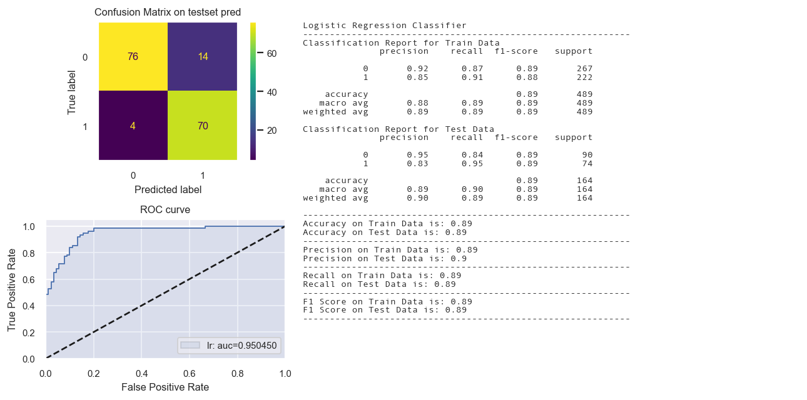
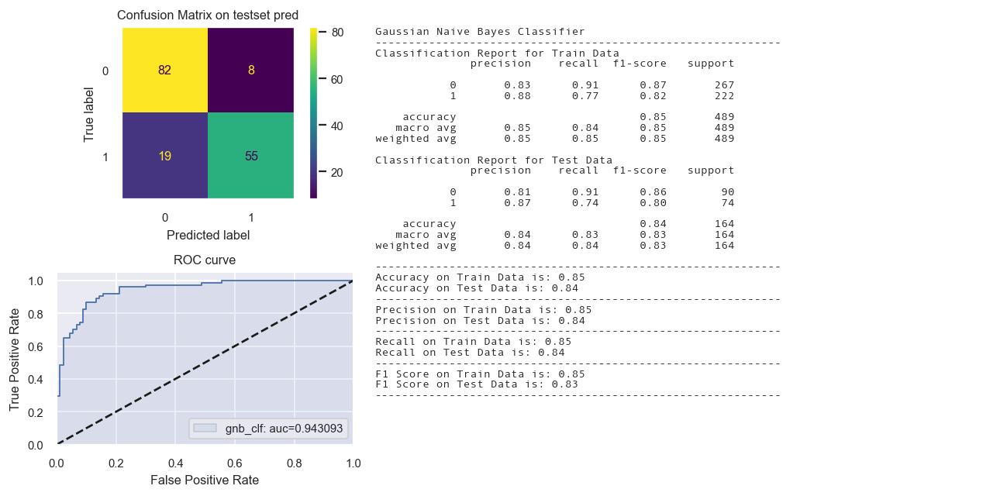
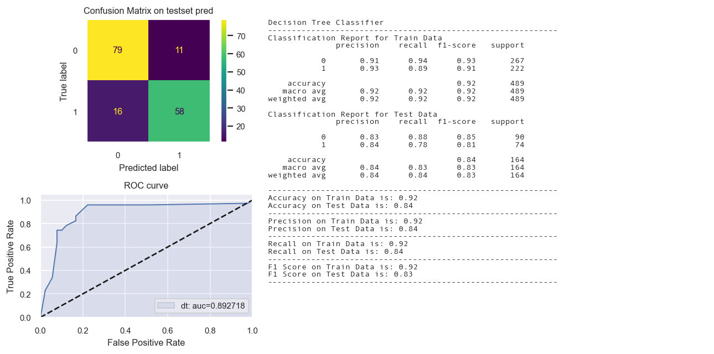
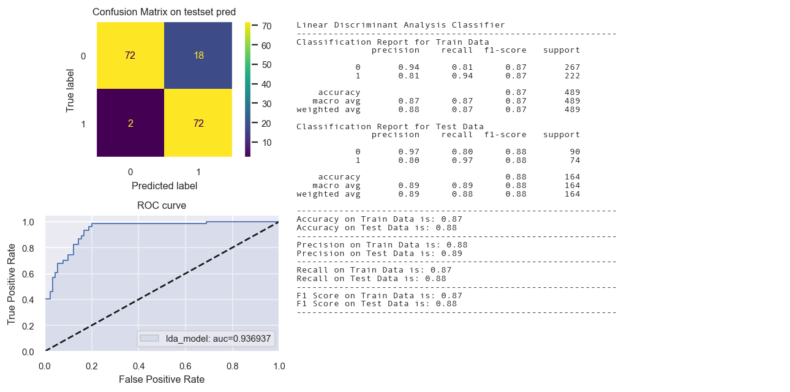

# Previous page  
[Continued from](Credit Screening_01.md)  
[Classic Jupyter notebook](../Sales_Transactions_Dataset_Weekly_Clustering.html)  

# Train Test Split the dataset  

We will spot-check various algorithms using train test validation as well as kfold cross validation.  
We shall first split the entire data as Train and test.

```python
X, y = df2.drop(targetAttr, axis = 1), df2['A16']
```


```python
# Train test split
X_train, X_test, y_train, y_test = train_test_split(X, y, random_state=42, stratify = y)
```


```python
print("X_train shape : {}".format(X_train.shape))
print("X_test shape : {}".format(X_test.shape))
print("y_train shape : {}".format(y_train.shape))
print("y_test shape : {}".format(y_test.shape))
```

    X_train shape : (489, 15)
    X_test shape : (164, 15)
    y_train shape : (489,)
    y_test shape : (164,)


```python
X_train.head()
```


<div>
<style scoped>
    .dataframe tbody tr th:only-of-type {
        vertical-align: middle;
    }

    .dataframe tbody tr th {
        vertical-align: top;
    }

    .dataframe thead th {
        text-align: right;
    }
</style>
<table border="1" class="dataframe">
  <thead>
    <tr style="text-align: right;">
      <th></th>
      <th>A1</th>
      <th>A2</th>
      <th>A3</th>
      <th>A4</th>
      <th>A5</th>
      <th>A6</th>
      <th>A7</th>
      <th>A8</th>
      <th>A9</th>
      <th>A10</th>
      <th>A11</th>
      <th>A12</th>
      <th>A13</th>
      <th>A14</th>
      <th>A15</th>
    </tr>
  </thead>
  <tbody>
    <tr>
      <th>7</th>
      <td>a</td>
      <td>22.92</td>
      <td>11.585</td>
      <td>u</td>
      <td>g</td>
      <td>cc</td>
      <td>v</td>
      <td>0.040</td>
      <td>t</td>
      <td>f</td>
      <td>0.0</td>
      <td>f</td>
      <td>g</td>
      <td>80.0</td>
      <td>1349.0</td>
    </tr>
    <tr>
      <th>64</th>
      <td>b</td>
      <td>26.67</td>
      <td>4.250</td>
      <td>u</td>
      <td>g</td>
      <td>cc</td>
      <td>v</td>
      <td>4.290</td>
      <td>t</td>
      <td>t</td>
      <td>1.0</td>
      <td>t</td>
      <td>g</td>
      <td>120.0</td>
      <td>0.0</td>
    </tr>
    <tr>
      <th>320</th>
      <td>b</td>
      <td>21.25</td>
      <td>1.500</td>
      <td>u</td>
      <td>g</td>
      <td>w</td>
      <td>v</td>
      <td>1.500</td>
      <td>f</td>
      <td>f</td>
      <td>0.0</td>
      <td>f</td>
      <td>g</td>
      <td>150.0</td>
      <td>8.0</td>
    </tr>
    <tr>
      <th>358</th>
      <td>b</td>
      <td>32.42</td>
      <td>3.000</td>
      <td>u</td>
      <td>g</td>
      <td>d</td>
      <td>v</td>
      <td>0.165</td>
      <td>f</td>
      <td>f</td>
      <td>0.0</td>
      <td>t</td>
      <td>g</td>
      <td>120.0</td>
      <td>0.0</td>
    </tr>
    <tr>
      <th>628</th>
      <td>b</td>
      <td>29.25</td>
      <td>13.000</td>
      <td>u</td>
      <td>g</td>
      <td>d</td>
      <td>h</td>
      <td>0.500</td>
      <td>f</td>
      <td>f</td>
      <td>0.0</td>
      <td>f</td>
      <td>g</td>
      <td>228.0</td>
      <td>0.0</td>
    </tr>
  </tbody>
</table>
</div>


## Transformation Pipelines

We will create list of pipelines for Simple hold out validation. This list of pipelines will contain composite estimators/classifiers.  

We will be iterating through the **individual pipelines** within the **pipeline list** specifically for simple holdout validation.
In each iteration :
- the results on train and test set will be displayed in the form of **classification report**.
- the confusion matrix for prediction on test data will be displayed.
- The measures 'Accuracy', 'F1 score', 'precision' and 'recall' will be extracted and stored in a dictionary.
Note that the average parameter chosen is **'weighted'** for the three measures - accuracy, precision and recall.  
- A **confusion matrix** for performance of the model on test set will be displayed.  
- An **ROC curve** with AUC scores will be plotted that will aid us in assessing the model's capability in distinguishing between classes.


Once an entire loop of **training and testing** of each model within the pipeline list is completed, the dictionary will be converted into a dataframe and a plot shall be drawn to compare the results from the different classifier models.  

```python
# Creating numeric Pipeline for standard scaling of numeric features

from sklearn.pipeline import Pipeline
from sklearn.preprocessing import StandardScaler

num_pipeline = Pipeline([
    ('std_scaler', StandardScaler())])
```


```python
df2_num_tr = num_pipeline.fit_transform(df2[contAttr])
pd.DataFrame(df2_num_tr)
```


<div>
<style scoped>
    .dataframe tbody tr th:only-of-type {
        vertical-align: middle;
    }

    .dataframe tbody tr th {
        vertical-align: top;
    }

    .dataframe thead th {
        text-align: right;
    }
</style>
<table border="1" class="dataframe">
  <thead>
    <tr style="text-align: right;">
      <th></th>
      <th>0</th>
      <th>1</th>
      <th>2</th>
      <th>3</th>
      <th>4</th>
      <th>5</th>
    </tr>
  </thead>
  <tbody>
    <tr>
      <th>0</th>
      <td>-0.0570</td>
      <td>-0.9614</td>
      <td>-0.2952</td>
      <td>-0.3026</td>
      <td>0.1287</td>
      <td>-0.1931</td>
    </tr>
    <tr>
      <th>1</th>
      <td>2.2965</td>
      <td>-0.0736</td>
      <td>0.2362</td>
      <td>0.7045</td>
      <td>-0.8168</td>
      <td>-0.0864</td>
    </tr>
    <tr>
      <th>2</th>
      <td>-0.5921</td>
      <td>-0.8619</td>
      <td>-0.2210</td>
      <td>-0.5040</td>
      <td>0.5925</td>
      <td>-0.0362</td>
    </tr>
    <tr>
      <th>3</th>
      <td>-0.3106</td>
      <td>-0.6549</td>
      <td>0.4470</td>
      <td>0.5031</td>
      <td>-0.4779</td>
      <td>-0.1926</td>
    </tr>
    <tr>
      <th>4</th>
      <td>-0.9581</td>
      <td>0.1584</td>
      <td>-0.1586</td>
      <td>-0.5040</td>
      <td>-0.3589</td>
      <td>-0.1931</td>
    </tr>
    <tr>
      <th>...</th>
      <td>...</td>
      <td>...</td>
      <td>...</td>
      <td>...</td>
      <td>...</td>
      <td>...</td>
    </tr>
    <tr>
      <th>648</th>
      <td>-0.8812</td>
      <td>1.0462</td>
      <td>-0.2952</td>
      <td>-0.5040</td>
      <td>0.4736</td>
      <td>-0.1931</td>
    </tr>
    <tr>
      <th>649</th>
      <td>-0.7468</td>
      <td>-0.8121</td>
      <td>-0.0725</td>
      <td>-0.1012</td>
      <td>0.1168</td>
      <td>-0.1181</td>
    </tr>
    <tr>
      <th>650</th>
      <td>-0.5287</td>
      <td>1.7261</td>
      <td>-0.0725</td>
      <td>-0.3026</td>
      <td>0.1168</td>
      <td>-0.1929</td>
    </tr>
    <tr>
      <th>651</th>
      <td>-1.1483</td>
      <td>-0.9206</td>
      <td>-0.6544</td>
      <td>-0.5040</td>
      <td>0.5925</td>
      <td>-0.0502</td>
    </tr>
    <tr>
      <th>652</th>
      <td>0.2956</td>
      <td>-0.2896</td>
      <td>1.7948</td>
      <td>-0.5040</td>
      <td>-1.0725</td>
      <td>-0.1931</td>
    </tr>
  </tbody>
</table>
<p>653 rows × 6 columns</p>
</div>


## Transforming the X_train and X_test


```python
from sklearn.compose import ColumnTransformer
from sklearn.preprocessing import OneHotEncoder

# Segregating the numeric and categorical features
num_attribs = ['A2', 'A3','A8', 'A11', 'A14', 'A15']
cat_attribs = ["A1","A4", "A5", "A6", "A7", "A9", "A10", "A12", "A13"]

# Creating Column Transformer for selectively applying tranformations
# both standard scaling and one hot encoding
full_pipeline = ColumnTransformer([
    ("num", num_pipeline, num_attribs),
    ("cat", OneHotEncoder(handle_unknown='ignore'), cat_attribs)])

# Creating Column Transformer for selectively applying tranformations
# only one hot encoding and no standard scaling
categorical_pipeline = ColumnTransformer([
    ("num_selector", "passthrough", num_attribs),
    ("cat", OneHotEncoder(handle_unknown='ignore'), cat_attribs)])
```


```python
# Learning the parameters for transforming from train set using full_pipeline
# Transforming both train and test set
X_train_tr1 = full_pipeline.fit_transform(X_train)
X_test_tr1 = full_pipeline.transform(X_test)
```


```python
# Learning the parameters for transforming from train set using categorical pipeline
# Transforming both train and test set
X_train_tr2 = categorical_pipeline.fit_transform(X_train)
X_test_tr2 = categorical_pipeline.transform(X_test)
```


## Transforming the target variable


```python
from sklearn.preprocessing import LabelEncoder

# prepare input data
def prepare_targets(y_train, y_test):
    le = LabelEncoder()
    le.fit(np.ravel(y_train))
    y_train_enc = le.transform(np.ravel(y_train))
    y_test_enc = le.transform(np.ravel(y_test))

    return y_train_enc, y_test_enc
```


```python
y_train_tr, y_test_tr = prepare_targets(y_train, y_test)
```

# Training and Testing Models

As discussed in the [transformation pipelines section](#transformation-pipelines), an entire loop of **training and testing** of each model within the pipeline list will be done. The scores from each iteration will be extracted and stored in a dictionary. After complete run, the dictionary will be converted into a dataframe and comparison plot drawn to evaluate the different classifier models.

```python
# Function for returning a string containing
# Classification report and the accuracy, precision, recall and F1 measures on train and test data
# The average parameter for the measures is 'weighted' as the dataset is balanced.

from sklearn.metrics import recall_score, precision_score, accuracy_score, \
    confusion_matrix, ConfusionMatrixDisplay, classification_report, f1_score, \
    roc_curve, auc

def evaluation_parametrics(y_train,yp_train,y_test,yp_test,average_param = 'weighted'):
    '''
    average_param : values can be 'weighted', 'micro', 'macro'.
    Check link:
    https://scikit-learn.org/stable/modules/model_evaluation.html#scoring-parameter
    https://scikit-learn.org/stable/modules/classes.html#module-sklearn.metrics
    https://scikit-learn.org/stable/modules/generated/sklearn.metrics.precision_score.html#sklearn.metrics.precision_score
    '''
    d = 2
    txt = "-"*60 \
    + "\nClassification Report for Train Data\n" \
    + classification_report(y_train, yp_train) \
    + "\nClassification Report for Test Data\n" \
    + classification_report(y_test, yp_test) \
    + "\n" + "-"*60 + "\n" \
    + "Accuracy on Train Data is: {}".format(round(accuracy_score(y_train,yp_train),d)) \
    + '\n' \
    + "Accuracy on Test Data is: {}".format(round(accuracy_score(y_test,yp_test),d)) \
    + "\n" + "-"*60 + "\n" \
    + "Precision on Train Data is: {}".format(round(precision_score(y_train,yp_train,average = average_param),d)) \
    + "\n" \
    + "Precision on Test Data is: {}".format(round(precision_score(y_test,yp_test,average = average_param),d)) \
    + "\n" + "-"*60 + "\n" \
    + "Recall on Train Data is: {}".format(round(recall_score(y_train,yp_train,average = average_param),d)) \
    + "\n" \
    + 'Recall on Test Data is: {}'.format(round(recall_score(y_test,yp_test,average = average_param),d)) \
    + "\n" + "-"*60 + "\n" \
    + "F1 Score on Train Data is: {}".format(round(f1_score(y_train,yp_train,average = average_param),d)) \
    + "\n" \
    + "F1 Score on Test Data is: {}".format(round(f1_score(y_test,yp_test,average = average_param),d)) \
    + "\n" + "-"*60 + "\n"
    return txt
```


```python
def Confusion_matrix_ROC_AUC(name, alias, pipeline,
                             X_train_tr, y_train_tr,
                             X_test_tr,y_test_tr):
    '''
    This function reurns three plots :
        - Confusion matrix on testset predictions
        - Classification report for performance on train and test set
        - roc and auc curve for test set predictions

    The arguments are :
        name : short/terse name for the composite estimator
        alias : descriptive name for the composite estimator
        pipeline : Composite estimator
        X_train_tr, y_train_tr : train set feature matrix, train set target
        X_test_tr,y_test_tr : test set feature matrix, test set target

    For reference, below is a list containing the tuple of (name, alias, pipeline)
          [('SGD', 'Stochastic Gradient Classifier',SGDClassifier(random_state=42)),
          ('LR','Logistic Regression Classifier', LogisticRegression(max_iter = 1000,random_state = 48)),
          ('RF','Random Forest Classifier', RandomForestClassifier(max_depth=2, random_state=42)),
          ('KNN','KNN Classifier',KNeighborsClassifier(n_neighbors = 7)),
          ('NB','Naive Bayes Classifier', GaussianNB()),
          ('SVC','Support Vector Classifier',
          `LinearSVC(class_weight='balanced', verbose=False, max_iter=10000, tol=1e-4, C=0.1)),
          ('CART', 'CART', DecisionTreeClassifier(max_depth = 7,random_state = 48)),
          ('GBM','Gradient Boosting Classifier',
           GradientBoostingClassifier(n_estimators=50, max_depth=10)),
          ('LDA', 'LDA Classifier', LinearDiscriminantAnalysis())]

    For instance, if the classifier is an SGDClassifier, the suggested name and alias are :
    'SGD'/'sgdclf', 'Stochastic Gradient Classifier'.

    It is recommended to adhere to name and alias conventions,
        - as the name argument is used to for checking whether calibrated Classifier CV is required or not.
        - as the alias argument will be used as title in the Classification report plot.

    Call the functions : evaluation_parametrics
    Check the links :
        https://peps.python.org/pep-0008/#maximum-line-length
        https://scikit-learn.org/stable/glossary.html#term-predict_proba

    Example :
        >> Confusion_matrix_ROC_AUC('sgd_clf','Stochastic Gradient Classifier',sgd_clf,
                                    X_train_tr, y_train_tr, X_test_tr,y_test_tr)

    '''
    from sklearn.metrics import recall_score, precision_score, accuracy_score, \
    confusion_matrix, ConfusionMatrixDisplay, classification_report, f1_score, \
    roc_curve, auc

    from sklearn.calibration import CalibratedClassifierCV

    fig = plt.figure(figsize=(10,5), dpi = 130)
    gridsize = (2, 3)
    ax1 = plt.subplot2grid(gridsize, (0, 0), colspan=1, rowspan=1)
    ax2 = plt.subplot2grid(gridsize, (0, 1), colspan = 2, rowspan = 2)
    ax3 = plt.subplot2grid(gridsize, (1, 0), colspan = 1)

    sns.set(font_scale=0.75) # Adjust to fit
    #---------------------------------------------------------------------------------
    # Displaying the confusion Matrix

    #ax1 = fig.add_subplot(1,3,2)

    # Fitting the model
    model = pipeline
    model.fit(X_train_tr, y_train_tr)

    # Predictions on train and test set
    yp_train_tr = model.predict(X_train_tr)
    yp_test_tr = model.predict(X_test_tr)

    # Creating the confusion matrix for test set results
    cm = confusion_matrix(y_test_tr, yp_test_tr, labels= pipeline.classes_)
    disp = ConfusionMatrixDisplay(confusion_matrix=cm, display_labels= pipeline.classes_)

    ax1.grid(False)
    disp.plot(ax = ax1)
    ax1.set_title('Confusion Matrix on testset pred')


    #---------------------------------------------------------------------------------
    # Displaying the evaluation results that include the classification report
    #ax2 = fig.add_subplot(1,3,2)

    eval_results = (str(alias) \
                    +'\n' \
                    + evaluation_parametrics(y_train_tr,yp_train_tr,
                                             y_test_tr,yp_test_tr))

    ax2.annotate(xy = (0,1), text = eval_results, size = 8,
                 ha = 'left', va = 'top', font = 'Andale Mono')
    ax2.patch.set(visible = False)
    ax2.tick_params(top=False, bottom=False, left=False, right=False,
                    labelleft=False, labelbottom=False)
    #ax2.ticks.off

    #---------------------------------------------------------------------------------
    # Displaying the ROC AUC curve
    import re
    pattern = re.compile('(sgd|SGD|SVC)')
    if re.search(pattern, name) :
        print('Calibrated Classifier CV needed.')
        #base_model = SGDClassifier()
        model = CalibratedClassifierCV(pipeline)
    else :
        print('Calibrated Classifier CV not needed.')
        model = pipeline

    # Fitting the model
    model.fit(X_train_tr, y_train_tr)

    #https://scikit-learn.org/stable/glossary.html#term-predict_proba
    preds = model.predict_proba(X_test_tr)
    pred = pd.Series(preds[:,1])

    fpr, tpr, thresholds = roc_curve(y_test_tr, pred)
    auc_score = auc(fpr, tpr)
    label='%s: auc=%f' % (name, auc_score)

    ax3.plot(fpr, tpr, linewidth=1)
    ax3.fill_between(fpr, tpr,  label = label, linewidth=1, alpha = 0.1, ec = 'black')
    ax3.plot([0, 1], [0, 1], 'k--') #x=y line.
    ax3.set_xlim([0.0, 1.0])
    ax3.set_ylim([0.0, 1.05])
    ax3.set_xlabel('False Positive Rate')
    ax3.set_ylabel('True Positive Rate')
    ax3.set_title('ROC curve')
    ax3.legend(loc = 'lower right')

    fig.tight_layout()
    plt.show()
    return fig
```


```python
# Creating a dictionary to store the performace measures on train and test data
# Note the precion, recall and F1 score measures are weighted averages taking into consideration the class sizes

def create_dict(model, modelname, y_train, yp_train, y_test, yp_test, average_param = 'weighted'):
    '''
    average_param : values can be 'weighted', 'micro', 'macro'.
    Check link:
            https://scikit-learn.org/stable/modules/model_evaluation.html#scoring-parameter
            https://scikit-learn.org/stable/modules/classes.html#module-sklearn.metrics
            https://scikit-learn.org/stable/modules/generated/sklearn.metrics.precision_score.html
            #sklearn.metrics.precision_score

    '''
    d = 4
    dict1 = {modelname :  {"Accuracy":{"Train": float(np.round(accuracy_score(y_train,yp_train), d)),
                                       "Test": float(np.round(accuracy_score(y_test,yp_test),d))},
                           "F1" : {"Train":
                                   float(np.round(f1_score(y_train,yp_train,average = average_param),d)),
                                  "Test":
                                   float(np.round(f1_score(y_test,yp_test,average = average_param),d))},
                           "Recall": {"Train":
                                      float(np.round(recall_score(y_train,yp_train,average = average_param),d)),
                                      "Test":
                                      float(np.round(recall_score(y_test,yp_test,average = average_param),d))},
                           "Precision" :{"Train":
                                         float(np.round(precision_score(y_train,yp_train,average = average_param),d)),
                                         "Test":
                                         float(np.round(precision_score(y_test,yp_test,average = average_param),d))
                                       }}
            }
    return dict1

dict_perf = {}
```


```python
# Display the performance measure outputs for all the classifiers
# unpacking the dictionary to dataframe

def display_results(dict_perf):
    pd.set_option('precision', 4)
    user_ids = []
    frames = []
    for user_id, d in dict_perf.items():
        user_ids.append(user_id)
        frames.append(pd.DataFrame.from_dict(d, orient='columns'))

    df = pd.concat(frames, keys=user_ids)
    df = df.unstack(level = -1)
    return df
```

##  Stochastic Gradient Descent Classifier


```python
from sklearn.linear_model import SGDClassifier
from sklearn.calibration import CalibratedClassifierCV

name = 'sgdclf'
sgd_clf = SGDClassifier(random_state=42)

st_time = time.time()
sgd_clf.fit(X_train_tr1, y_train_tr)

yp_train_tr = sgd_clf.predict(X_train_tr1)
yp_test_tr = sgd_clf.predict(X_test_tr1)

en_time = time.time()
print('Total time: {:.2f}s'.format(en_time-st_time))

#print(evaluation_parametrics(y_train_tr,yp_train_tr,y_test_tr,yp_test_tr,average_param = 'weighted'))

dict1 = create_dict(sgd_clf, "SGD Classifier",
                    y_train_tr, yp_train_tr, y_test_tr, yp_test_tr)
dict_perf.update(dict1)

sns.set(font_scale=0.75)
fig = Confusion_matrix_ROC_AUC('sgd_clf','Stochastic Gradient Classifier',
                         sgd_clf, X_train_tr1, y_train_tr,X_test_tr1,y_test_tr)

fig.savefig(path+'StochasticGradientClassifier.png', dpi = 150)
```

    Total time: 0.01s
    Calibrated Classifier CV needed.


## Logistic Regression Classifier


```python
lr = LogisticRegression(max_iter = 1000,random_state = 48)

st_time = time.time()
lr.fit(X_train_tr1, y_train_tr)

yp_train_tr = lr.predict(X_train_tr1)
yp_test_tr = lr.predict(X_test_tr1)

en_time = time.time()
print('Total time: {:.2f}s'.format(en_time-st_time))

#print(evaluation_parametrics(y_train_tr,yp_train_tr,y_test_tr,yp_test_tr))

dict1 = create_dict(lr, "Logistic Regression Classifier", y_train_tr, yp_train_tr, y_test_tr, yp_test_tr)
dict_perf.update(dict1)

fig = Confusion_matrix_ROC_AUC('lr','Logistic Regression Classifier',lr, X_train_tr1, y_train_tr,X_test_tr1,y_test_tr)
```

    Total time: 0.02s
    Calibrated Classifier CV not needed.





## Random Forest Classifier


```python
rf_clf = RandomForestClassifier(max_depth=5, random_state=42)

st_time = time.time()
rf_clf.fit(X_train_tr2, y_train_tr)

yp_train_tr = rf_clf.predict(X_train_tr2)
yp_test_tr = rf_clf.predict(X_test_tr2)

en_time = time.time()
print('Total time: {:.2f}s'.format(en_time-st_time))

#print(evaluation_parametrics(y_train_tr,yp_train_tr,y_test_tr,yp_test_tr))

dict1 = create_dict(rf_clf, "Random Forest Classifier",
                    y_train_tr, yp_train_tr, y_test_tr, yp_test_tr)
dict_perf.update(dict1)

fig = Confusion_matrix_ROC_AUC('rf_clf','Random Forest Classifier',rf_clf,
                         X_train_tr2, y_train_tr,X_test_tr2,y_test_tr)
```

    Total time: 0.15s
    Calibrated Classifier CV not needed.


## KNN Classifier


```python
# training a KNN classifier
knn_clf = KNeighborsClassifier(n_neighbors = 7)

st_time = time.time()
knn_clf.fit(X_train_tr1, y_train_tr)

yp_train_tr = knn_clf.predict(X_train_tr1)
yp_test_tr = knn_clf.predict(X_test_tr1)

en_time = time.time()
print('Total time: {:.2f}s'.format(en_time-st_time))

#print(evaluation_parametrics(y_train_tr,yp_train_tr,y_test_tr,yp_test_tr))

dict1 = create_dict(knn_clf, "k-Nearest Neighbor Classifier", y_train_tr, yp_train_tr, y_test_tr, yp_test_tr)
dict_perf.update(dict1)

fig = Confusion_matrix_ROC_AUC('knn_clf', "k-Nearest Neighbor Classifier",knn_clf,
                         X_train_tr1, y_train_tr,X_test_tr1,y_test_tr)
```

    Total time: 0.03s
    Calibrated Classifier CV not needed.


## Naive Bayes Classifier


```python
# training a Naive Bayes classifier
from sklearn.naive_bayes import GaussianNB
gnb_clf = GaussianNB()

st_time = time.time()
gnb_clf.fit(X_train_tr2, y_train_tr)

yp_train_tr = gnb_clf.predict(X_train_tr2)
yp_test_tr = gnb_clf.predict(X_test_tr2)

en_time = time.time()
print('Total time: {:.2f}s'.format(en_time-st_time))

#print(evaluation_parametrics(y_train_tr,yp_train_tr,y_test_tr,yp_test_tr))

dict1 = create_dict(gnb_clf, "Gaussian Naive Bayes Classifier", y_train_tr, yp_train_tr, y_test_tr, yp_test_tr)
dict_perf.update(dict1)

fig = Confusion_matrix_ROC_AUC('gnb_clf', "Gaussian Naive Bayes Classifier",gnb_clf,
                         X_train_tr2, y_train_tr,X_test_tr2,y_test_tr)
```

    Total time: 0.00s
    Calibrated Classifier CV not needed.





## Linear Support Vector Classifier


```python
svm = LinearSVC(class_weight='balanced', verbose=False, max_iter=10000, tol=1e-4, C=0.1)

st_time = time.time()
svm.fit(X_train_tr1,y_train_tr)

yp_train_tr = svm.predict(X_train_tr1)
yp_test_tr = svm.predict(X_test_tr1)

en_time = time.time()
print('Total time: {:.2f}s'.format(en_time-st_time))

#print(evaluation_parametrics(y_train_tr,yp_train_tr,y_test_tr,yp_test_tr))

dict1 = create_dict(svm, "Support Vector Classifier", y_train_tr, yp_train_tr, y_test_tr, yp_test_tr)
dict_perf.update(dict1)

fig = Confusion_matrix_ROC_AUC('LinearSVC', "Support Vector Classifier",svm,
                         X_train_tr1, y_train_tr,X_test_tr1,y_test_tr)
```

    Total time: 0.01s
    Calibrated Classifier CV needed.


## Decision Tree Classifier


```python
dt = DecisionTreeClassifier(max_depth = 5,random_state = 48)
# Keeping max_depth = 7 to avoid overfitting
dt.fit(X_train_tr2,y_train_tr)

yp_train_tr = dt.predict(X_train_tr2)
yp_test_tr = dt.predict(X_test_tr2)

en_time = time.time()
print('Total time: {:.2f}s'.format(en_time-st_time))

#print(evaluation_parametrics(y_train_tr,yp_train_tr,y_test_tr,yp_test_tr))

dict1 = create_dict(dt, "Decision Tree Classifier", y_train_tr, yp_train_tr, y_test_tr, yp_test_tr)
dict_perf.update(dict1)

fig = Confusion_matrix_ROC_AUC('dt', "Decision Tree Classifier", dt,
                         X_train_tr2, y_train_tr,X_test_tr2,y_test_tr)

```

    Total time: 0.53s
    Calibrated Classifier CV not needed.





## Gradient Boosting Model


```python
gb_model = GradientBoostingClassifier(n_estimators=50, max_depth=5)

st_time = time.time()
gb_model.fit(X_train_tr2,y_train_tr)

yp_train_tr = gb_model.predict(X_train_tr2)
yp_test_tr = gb_model.predict(X_test_tr2)

en_time = time.time()
print('Total time: {:.2f}s'.format(en_time-st_time))

#print(evaluation_parametrics(y_train_tr,yp_train_tr,y_test_tr,yp_test_tr))

dict1 = create_dict(gb_model, "Gradient Boosting Classifier", y_train_tr, yp_train_tr, y_test_tr, yp_test_tr)
dict_perf.update(dict1)


fig = Confusion_matrix_ROC_AUC('gb_model', "Gradient Boosting Classifier", gb_model,
                         X_train_tr2, y_train_tr,X_test_tr2,y_test_tr)

```

    Total time: 0.11s
    Calibrated Classifier CV not needed.


## Linear Discriminant Analysis Model


```python
lda_model = LinearDiscriminantAnalysis()

st_time = time.time()
lda_model.fit(X_train_tr1,y_train_tr)

yp_train_tr = lda_model.predict(X_train_tr1)
yp_test_tr = lda_model.predict(X_test_tr1)

en_time = time.time()
#print('Total time: {:.2f}s'.format(en_time-st_time))

evaluation_parametrics(y_train_tr,yp_train_tr,y_test_tr,yp_test_tr)

dict1 = create_dict(lda_model, "Linear Discriminant Analysis Classifier",
                    y_train_tr, yp_train_tr, y_test_tr, yp_test_tr)
dict_perf.update(dict1)

fig = Confusion_matrix_ROC_AUC('lda_model', "Linear Discriminant Analysis Classifier", lda_model,
                         X_train_tr1, y_train_tr,X_test_tr1,y_test_tr)
```

    Calibrated Classifier CV not needed.





We also do a quick comparison of ROC curves with AUC scores as below.


```python
from matplotlib import pyplot as plt
import sklearn
from sklearn.metrics import roc_curve, auc
#from sklearn.cross_validation import train_test_split
from sklearn.linear_model import LogisticRegression
from sklearn.tree import DecisionTreeClassifier
from sklearn.ensemble import RandomForestClassifier
from sklearn.naive_bayes import GaussianNB

# name -> (line format, classifier)
CLASS_MAP = {
    'LogisticRegression':('-', LogisticRegression()),
    'Naive Bayes': ('--', GaussianNB()),
    'Decision Tree':('.-', DecisionTreeClassifier(max_depth=5)),
    'Random Forest':(':', RandomForestClassifier( max_depth=5, n_estimators=10, max_features=1)),
}

# Divide cols by independent/dependent, rows by test/ train
#X, Y = df[df.columns[:3]], (df['species']=='virginica') X_train, X_test, Y_train, Y_test = \
#train_test_split(X, Y, test_size=.8)

#X_train_tr, y_train_tr,X_test_tr,y_test_tr

for name, (line_fmt, model) in CLASS_MAP.items():
    model.fit(X_train_tr1, y_train_tr)
    # array w one col per label
    preds = model.predict_proba(X_test_tr1)
    pred = pd.Series(preds[:,1])
    fpr, tpr, thresholds = roc_curve(y_test_tr, pred)
    auc_score = auc(fpr, tpr)
    label='%s: auc=%f' % (name, auc_score)
    plt.plot(fpr, tpr, line_fmt,
             linewidth=1, label=label)
    plt.legend(loc="lower right")
    plt.title('Comparing Classifiers')
```


  


## Listing the performance from all the models  


```python
display_results(dict_perf).style.background_gradient(cmap='Blues')
```


<style  type="text/css" >
#T_35579_row0_col0,#T_35579_row0_col4{
            background-color:  #f2f7fd;
            color:  #000000;
        }#T_35579_row0_col1,#T_35579_row0_col3,#T_35579_row0_col5,#T_35579_row0_col7,#T_35579_row4_col0,#T_35579_row4_col2,#T_35579_row4_col4,#T_35579_row4_col6{
            background-color:  #f7fbff;
            color:  #000000;
        }#T_35579_row0_col2{
            background-color:  #f0f6fd;
            color:  #000000;
        }#T_35579_row0_col6{
            background-color:  #eff6fc;
            color:  #000000;
        }#T_35579_row1_col0,#T_35579_row1_col4{
            background-color:  #c6dbef;
            color:  #000000;
        }#T_35579_row1_col1,#T_35579_row1_col3,#T_35579_row1_col5,#T_35579_row2_col1,#T_35579_row2_col3,#T_35579_row2_col5,#T_35579_row5_col7,#T_35579_row7_col0,#T_35579_row7_col2,#T_35579_row7_col4,#T_35579_row7_col6{
            background-color:  #08306b;
            color:  #f1f1f1;
        }#T_35579_row1_col2{
            background-color:  #c3daee;
            color:  #000000;
        }#T_35579_row1_col6{
            background-color:  #c4daee;
            color:  #000000;
        }#T_35579_row1_col7{
            background-color:  #083573;
            color:  #f1f1f1;
        }#T_35579_row2_col0,#T_35579_row2_col4{
            background-color:  #7fb9da;
            color:  #000000;
        }#T_35579_row2_col2{
            background-color:  #7db8da;
            color:  #000000;
        }#T_35579_row2_col6{
            background-color:  #82bbdb;
            color:  #000000;
        }#T_35579_row2_col7{
            background-color:  #08468b;
            color:  #f1f1f1;
        }#T_35579_row3_col0,#T_35579_row3_col4{
            background-color:  #d9e7f5;
            color:  #000000;
        }#T_35579_row3_col1,#T_35579_row3_col5{
            background-color:  #1967ad;
            color:  #f1f1f1;
        }#T_35579_row3_col2,#T_35579_row5_col6{
            background-color:  #d8e7f5;
            color:  #000000;
        }#T_35579_row3_col3{
            background-color:  #1b69af;
            color:  #f1f1f1;
        }#T_35579_row3_col6{
            background-color:  #dae8f6;
            color:  #000000;
        }#T_35579_row3_col7{
            background-color:  #3181bd;
            color:  #000000;
        }#T_35579_row4_col1,#T_35579_row4_col5,#T_35579_row6_col1,#T_35579_row6_col5{
            background-color:  #a4cce3;
            color:  #000000;
        }#T_35579_row4_col3{
            background-color:  #add0e6;
            color:  #000000;
        }#T_35579_row4_col7{
            background-color:  #b0d2e7;
            color:  #000000;
        }#T_35579_row5_col0,#T_35579_row5_col4{
            background-color:  #e1edf8;
            color:  #000000;
        }#T_35579_row5_col1,#T_35579_row5_col3,#T_35579_row5_col5{
            background-color:  #084387;
            color:  #f1f1f1;
        }#T_35579_row5_col2{
            background-color:  #dfecf7;
            color:  #000000;
        }#T_35579_row6_col0,#T_35579_row6_col4{
            background-color:  #74b3d8;
            color:  #000000;
        }#T_35579_row6_col2{
            background-color:  #72b2d8;
            color:  #000000;
        }#T_35579_row6_col3{
            background-color:  #a8cee4;
            color:  #000000;
        }#T_35579_row6_col6{
            background-color:  #77b5d9;
            color:  #000000;
        }#T_35579_row6_col7{
            background-color:  #bfd8ed;
            color:  #000000;
        }#T_35579_row7_col1,#T_35579_row7_col3,#T_35579_row7_col5,#T_35579_row8_col1,#T_35579_row8_col5{
            background-color:  #0b559f;
            color:  #f1f1f1;
        }#T_35579_row7_col7{
            background-color:  #1c6ab0;
            color:  #f1f1f1;
        }#T_35579_row8_col0,#T_35579_row8_col4{
            background-color:  #dce9f6;
            color:  #000000;
        }#T_35579_row8_col2{
            background-color:  #d9e8f5;
            color:  #000000;
        }#T_35579_row8_col3{
            background-color:  #0c56a0;
            color:  #f1f1f1;
        }#T_35579_row8_col6{
            background-color:  #d1e2f3;
            color:  #000000;
        }#T_35579_row8_col7{
            background-color:  #083c7d;
            color:  #f1f1f1;
        }</style><table id="T_35579_" ><thead>    <tr>        <th class="blank level0" ></th>        <th class="col_heading level0 col0" colspan="2">Accuracy</th>        <th class="col_heading level0 col2" colspan="2">F1</th>        <th class="col_heading level0 col4" colspan="2">Recall</th>        <th class="col_heading level0 col6" colspan="2">Precision</th>    </tr>    <tr>        <th class="blank level1" ></th>        <th class="col_heading level1 col0" >Train</th>        <th class="col_heading level1 col1" >Test</th>        <th class="col_heading level1 col2" >Train</th>        <th class="col_heading level1 col3" >Test</th>        <th class="col_heading level1 col4" >Train</th>        <th class="col_heading level1 col5" >Test</th>        <th class="col_heading level1 col6" >Train</th>        <th class="col_heading level1 col7" >Test</th>    </tr></thead><tbody>
                <tr>
                        <th id="T_35579_level0_row0" class="row_heading level0 row0" >SGD Classifier</th>
                        <td id="T_35579_row0_col0" class="data row0 col0" >0.8528</td>
                        <td id="T_35579_row0_col1" class="data row0 col1" >0.8049</td>
                        <td id="T_35579_row0_col2" class="data row0 col2" >0.8531</td>
                        <td id="T_35579_row0_col3" class="data row0 col3" >0.8053</td>
                        <td id="T_35579_row0_col4" class="data row0 col4" >0.8528</td>
                        <td id="T_35579_row0_col5" class="data row0 col5" >0.8049</td>
                        <td id="T_35579_row0_col6" class="data row0 col6" >0.8568</td>
                        <td id="T_35579_row0_col7" class="data row0 col7" >0.8117</td>
            </tr>
            <tr>
                        <th id="T_35579_level0_row1" class="row_heading level0 row1" >Logistic Regression Classifier</th>
                        <td id="T_35579_row1_col0" class="data row1 col0" >0.8855</td>
                        <td id="T_35579_row1_col1" class="data row1 col1" >0.8902</td>
                        <td id="T_35579_row1_col2" class="data row1 col2" >0.8857</td>
                        <td id="T_35579_row1_col3" class="data row1 col3" >0.8905</td>
                        <td id="T_35579_row1_col4" class="data row1 col4" >0.8855</td>
                        <td id="T_35579_row1_col5" class="data row1 col5" >0.8902</td>
                        <td id="T_35579_row1_col6" class="data row1 col6" >0.8878</td>
                        <td id="T_35579_row1_col7" class="data row1 col7" >0.8974</td>
            </tr>
            <tr>
                        <th id="T_35579_level0_row2" class="row_heading level0 row2" >Random Forest Classifier</th>
                        <td id="T_35579_row2_col0" class="data row2 col0" >0.9141</td>
                        <td id="T_35579_row2_col1" class="data row2 col1" >0.8902</td>
                        <td id="T_35579_row2_col2" class="data row2 col2" >0.9142</td>
                        <td id="T_35579_row2_col3" class="data row2 col3" >0.8904</td>
                        <td id="T_35579_row2_col4" class="data row2 col4" >0.9141</td>
                        <td id="T_35579_row2_col5" class="data row2 col5" >0.8902</td>
                        <td id="T_35579_row2_col6" class="data row2 col6" >0.9144</td>
                        <td id="T_35579_row2_col7" class="data row2 col7" >0.8917</td>
            </tr>
            <tr>
                        <th id="T_35579_level0_row3" class="row_heading level0 row3" >k-Nearest Neighbor Classifier</th>
                        <td id="T_35579_row3_col0" class="data row3 col0" >0.8712</td>
                        <td id="T_35579_row3_col1" class="data row3 col1" >0.8720</td>
                        <td id="T_35579_row3_col2" class="data row3 col2" >0.8707</td>
                        <td id="T_35579_row3_col3" class="data row3 col3" >0.8717</td>
                        <td id="T_35579_row3_col4" class="data row3 col4" >0.8712</td>
                        <td id="T_35579_row3_col5" class="data row3 col5" >0.8720</td>
                        <td id="T_35579_row3_col6" class="data row3 col6" >0.8719</td>
                        <td id="T_35579_row3_col7" class="data row3 col7" >0.8720</td>
            </tr>
            <tr>
                        <th id="T_35579_level0_row4" class="row_heading level0 row4" >Gaussian Naive Bayes Classifier</th>
                        <td id="T_35579_row4_col0" class="data row4 col0" >0.8487</td>
                        <td id="T_35579_row4_col1" class="data row4 col1" >0.8354</td>
                        <td id="T_35579_row4_col2" class="data row4 col2" >0.8475</td>
                        <td id="T_35579_row4_col3" class="data row4 col3" >0.8335</td>
                        <td id="T_35579_row4_col4" class="data row4 col4" >0.8487</td>
                        <td id="T_35579_row4_col5" class="data row4 col5" >0.8354</td>
                        <td id="T_35579_row4_col6" class="data row4 col6" >0.8512</td>
                        <td id="T_35579_row4_col7" class="data row4 col7" >0.8395</td>
            </tr>
            <tr>
                        <th id="T_35579_level0_row5" class="row_heading level0 row5" >Support Vector Classifier</th>
                        <td id="T_35579_row5_col0" class="data row5 col0" >0.8650</td>
                        <td id="T_35579_row5_col1" class="data row5 col1" >0.8841</td>
                        <td id="T_35579_row5_col2" class="data row5 col2" >0.8652</td>
                        <td id="T_35579_row5_col3" class="data row5 col3" >0.8842</td>
                        <td id="T_35579_row5_col4" class="data row5 col4" >0.8650</td>
                        <td id="T_35579_row5_col5" class="data row5 col5" >0.8841</td>
                        <td id="T_35579_row5_col6" class="data row5 col6" >0.8738</td>
                        <td id="T_35579_row5_col7" class="data row5 col7" >0.8992</td>
            </tr>
            <tr>
                        <th id="T_35579_level0_row6" class="row_heading level0 row6" >Decision Tree Classifier</th>
                        <td id="T_35579_row6_col0" class="data row6 col0" >0.9182</td>
                        <td id="T_35579_row6_col1" class="data row6 col1" >0.8354</td>
                        <td id="T_35579_row6_col2" class="data row6 col2" >0.9181</td>
                        <td id="T_35579_row6_col3" class="data row6 col3" >0.8347</td>
                        <td id="T_35579_row6_col4" class="data row6 col4" >0.9182</td>
                        <td id="T_35579_row6_col5" class="data row6 col5" >0.8354</td>
                        <td id="T_35579_row6_col6" class="data row6 col6" >0.9184</td>
                        <td id="T_35579_row6_col7" class="data row6 col7" >0.8356</td>
            </tr>
            <tr>
                        <th id="T_35579_level0_row7" class="row_heading level0 row7" >Gradient Boosting Classifier</th>
                        <td id="T_35579_row7_col0" class="data row7 col0" >0.9939</td>
                        <td id="T_35579_row7_col1" class="data row7 col1" >0.8780</td>
                        <td id="T_35579_row7_col2" class="data row7 col2" >0.9939</td>
                        <td id="T_35579_row7_col3" class="data row7 col3" >0.8783</td>
                        <td id="T_35579_row7_col4" class="data row7 col4" >0.9939</td>
                        <td id="T_35579_row7_col5" class="data row7 col5" >0.8780</td>
                        <td id="T_35579_row7_col6" class="data row7 col6" >0.9939</td>
                        <td id="T_35579_row7_col7" class="data row7 col7" >0.8795</td>
            </tr>
            <tr>
                        <th id="T_35579_level0_row8" class="row_heading level0 row8" >Linear Discriminant Analysis Classifier</th>
                        <td id="T_35579_row8_col0" class="data row8 col0" >0.8691</td>
                        <td id="T_35579_row8_col1" class="data row8 col1" >0.8780</td>
                        <td id="T_35579_row8_col2" class="data row8 col2" >0.8693</td>
                        <td id="T_35579_row8_col3" class="data row8 col3" >0.8780</td>
                        <td id="T_35579_row8_col4" class="data row8 col4" >0.8691</td>
                        <td id="T_35579_row8_col5" class="data row8 col5" >0.8780</td>
                        <td id="T_35579_row8_col6" class="data row8 col6" >0.8789</td>
                        <td id="T_35579_row8_col7" class="data row8 col7" >0.8949</td>
            </tr>
    </tbody></table>  


# Model Validation using K-Fold CrossValidation  


We will be iterating through the **individual pipelines** within the **pipeline list** specifically for k-fold cross-validation.  
In each iteration :  
- We will doing [**10 fold stratified CV**](https://scikit-learn.org/stable/modules/cross_validation.html#cross-validation) on Train data using [**cross_val_score**](https://scikit-learn.org/stable/modules/generated/sklearn.model_selection.cross_val_score.html?highlight=cross_val_score#sklearn.model_selection.cross_val_score) and specifying the composite model/estimator.
The scoring used in cross_val_score is 'accuracy'.  
- The scores will be extracted and stored in a dictionary. Once an entire loop of **training and testing** of each model within the pipeline list is completed, the dictionary will be converted into a dataframe and a plot to compare the results from the different classifier models.  

```python
# Test options and evaluation metric
num_folds = 10
seed = 7
scoring = 'accuracy'
```


```python
# Creating ColumnTransformer for preprocessing the training data folds and testing data fold within the k-fold
# Note that training data folds will be fitted and transformed
# The test data folds will be transformed

from sklearn.compose import ColumnTransformer
from sklearn.preprocessing import OneHotEncoder

num_attribs = ['A2', 'A3','A8', 'A11', 'A14', 'A15']
cat_attribs = ["A1","A4", "A5", "A6", "A7", "A9", "A10", "A12", "A13"]

preprocessor1 = ColumnTransformer([
    ("num", num_pipeline, num_attribs),
    ("cat", OneHotEncoder(handle_unknown='ignore'), cat_attribs)])

preprocessor2 = ColumnTransformer([("cat", OneHotEncoder(handle_unknown='ignore'), cat_attribs)],
                                  remainder = 'passthrough')

```


```python
# Creating list of classifier models
models = [('SGD',SGDClassifier(random_state=42)),
          ('LR',LogisticRegression(max_iter = 1000,random_state = 48)),
          ('RF',RandomForestClassifier(max_depth=2, random_state=42)),
          ('KNN',KNeighborsClassifier(n_neighbors = 7)),
          ('NB',GaussianNB()),
          ('SVC',LinearSVC(class_weight='balanced', verbose=False, max_iter=10000, tol=1e-4, C=0.1)),
          ('CART',DecisionTreeClassifier(max_depth = 7,random_state = 48)),
          ('GBM',GradientBoostingClassifier(n_estimators=50, max_depth=10)),
          ('LDA',LinearDiscriminantAnalysis())
         ]
```


```python
# Creating the pipeline of model and the preprocessor for feeding into the k-fold crossvalidation
pipelines_list = []
for i in models:
    if i[0] not in ['RF','CART', 'GBM']:
        pipelines_list.append(('Scaled'+str(i[0]), Pipeline([('Preprocessor1', preprocessor1),i])))
    else:
        pipelines_list.append((str(i[0]), Pipeline([('Preprocessor2', preprocessor2),i])))
```


```python
# Checking the pipeline
pipelines_list
```


    [('ScaledSGD',
      Pipeline(steps=[('Preprocessor1',
                       ColumnTransformer(transformers=[('num',
                                                        Pipeline(steps=[('std_scaler',
                                                                         StandardScaler())]),
                                                        ['A2', 'A3', 'A8', 'A11',
                                                         'A14', 'A15']),
                                                       ('cat',
                                                        OneHotEncoder(handle_unknown='ignore'),
                                                        ['A1', 'A4', 'A5', 'A6', 'A7',
                                                         'A9', 'A10', 'A12',
                                                         'A13'])])),
                      ('SGD', SGDClassifier(random_state=42))])),
     ('ScaledLR',
      Pipeline(steps=[('Preprocessor1',
                       ColumnTransformer(transformers=[('num',
                                                        Pipeline(steps=[('std_scaler',
                                                                         StandardScaler())]),
                                                        ['A2', 'A3', 'A8', 'A11',
                                                         'A14', 'A15']),
                                                       ('cat',
                                                        OneHotEncoder(handle_unknown='ignore'),
                                                        ['A1', 'A4', 'A5', 'A6', 'A7',
                                                         'A9', 'A10', 'A12',
                                                         'A13'])])),
                      ('LR', LogisticRegression(max_iter=1000, random_state=48))])),
     ('RF',
      Pipeline(steps=[('Preprocessor2',
                       ColumnTransformer(remainder='passthrough',
                                         transformers=[('cat',
                                                        OneHotEncoder(handle_unknown='ignore'),
                                                        ['A1', 'A4', 'A5', 'A6', 'A7',
                                                         'A9', 'A10', 'A12',
                                                         'A13'])])),
                      ('RF', RandomForestClassifier(max_depth=2, random_state=42))])),
     ('ScaledKNN',
      Pipeline(steps=[('Preprocessor1',
                       ColumnTransformer(transformers=[('num',
                                                        Pipeline(steps=[('std_scaler',
                                                                         StandardScaler())]),
                                                        ['A2', 'A3', 'A8', 'A11',
                                                         'A14', 'A15']),
                                                       ('cat',
                                                        OneHotEncoder(handle_unknown='ignore'),
                                                        ['A1', 'A4', 'A5', 'A6', 'A7',
                                                         'A9', 'A10', 'A12',
                                                         'A13'])])),
                      ('KNN', KNeighborsClassifier(n_neighbors=7))])),
     ('ScaledNB',
      Pipeline(steps=[('Preprocessor1',
                       ColumnTransformer(transformers=[('num',
                                                        Pipeline(steps=[('std_scaler',
                                                                         StandardScaler())]),
                                                        ['A2', 'A3', 'A8', 'A11',
                                                         'A14', 'A15']),
                                                       ('cat',
                                                        OneHotEncoder(handle_unknown='ignore'),
                                                        ['A1', 'A4', 'A5', 'A6', 'A7',
                                                         'A9', 'A10', 'A12',
                                                         'A13'])])),
                      ('NB', GaussianNB())])),
     ('ScaledSVC',
      Pipeline(steps=[('Preprocessor1',
                       ColumnTransformer(transformers=[('num',
                                                        Pipeline(steps=[('std_scaler',
                                                                         StandardScaler())]),
                                                        ['A2', 'A3', 'A8', 'A11',
                                                         'A14', 'A15']),
                                                       ('cat',
                                                        OneHotEncoder(handle_unknown='ignore'),
                                                        ['A1', 'A4', 'A5', 'A6', 'A7',
                                                         'A9', 'A10', 'A12',
                                                         'A13'])])),
                      ('SVC',
                       LinearSVC(C=0.1, class_weight='balanced', max_iter=10000,
                                 verbose=False))])),
     ('CART',
      Pipeline(steps=[('Preprocessor2',
                       ColumnTransformer(remainder='passthrough',
                                         transformers=[('cat',
                                                        OneHotEncoder(handle_unknown='ignore'),
                                                        ['A1', 'A4', 'A5', 'A6', 'A7',
                                                         'A9', 'A10', 'A12',
                                                         'A13'])])),
                      ('CART', DecisionTreeClassifier(max_depth=7, random_state=48))])),
     ('GBM',
      Pipeline(steps=[('Preprocessor2',
                       ColumnTransformer(remainder='passthrough',
                                         transformers=[('cat',
                                                        OneHotEncoder(handle_unknown='ignore'),
                                                        ['A1', 'A4', 'A5', 'A6', 'A7',
                                                         'A9', 'A10', 'A12',
                                                         'A13'])])),
                      ('GBM',
                       GradientBoostingClassifier(max_depth=10, n_estimators=50))])),
     ('ScaledLDA',
      Pipeline(steps=[('Preprocessor1',
                       ColumnTransformer(transformers=[('num',
                                                        Pipeline(steps=[('std_scaler',
                                                                         StandardScaler())]),
                                                        ['A2', 'A3', 'A8', 'A11',
                                                         'A14', 'A15']),
                                                       ('cat',
                                                        OneHotEncoder(handle_unknown='ignore'),
                                                        ['A1', 'A4', 'A5', 'A6', 'A7',
                                                         'A9', 'A10', 'A12',
                                                         'A13'])])),
                      ('LDA', LinearDiscriminantAnalysis())]))]


```python
# Evaluating the Algorithms
results = []
names = []

st_time = time.time()
for name, pipeline in pipelines_list:
    kfold = KFold(n_splits=num_folds, random_state=seed, shuffle = True)
    cv_results = cross_val_score(pipeline, X_train, y_train, cv=kfold, scoring=scoring)
    print(type(pipeline))
    results.append(cv_results)
    names.append(name)
    msg = "{:<10}: {:<6} ({:^6})".format(name, cv_results.mean().round(4), cv_results.std().round(4))
    print(msg)
    print(X_train)

en_time = time.time()
print('Total time: {:.4f}s'.format(en_time-st_time))
```

    <class 'sklearn.pipeline.Pipeline'>
    ScaledSGD : 0.8119 (0.0897)
        A1     A2      A3 A4 A5  A6  A7     A8 A9 A10  A11 A12 A13    A14     A15
    7    a  22.92  11.585  u  g  cc   v  0.040  t   f  0.0   f   g   80.0  1349.0
    64   b  26.67   4.250  u  g  cc   v  4.290  t   t  1.0   t   g  120.0     0.0
    320  b  21.25   1.500  u  g   w   v  1.500  f   f  0.0   f   g  150.0     8.0
    358  b  32.42   3.000  u  g   d   v  0.165  f   f  0.0   t   g  120.0     0.0
    628  b  29.25  13.000  u  g   d   h  0.500  f   f  0.0   f   g  228.0     0.0
    ..  ..    ...     ... .. ..  ..  ..    ... ..  ..  ...  ..  ..    ...     ...
    621  b  22.67   0.165  u  g   c   j  2.250  f   f  0.0   t   s    0.0     0.0
    521  a  30.00   5.290  u  g   e  dd  2.250  t   t  5.0   t   g   99.0   500.0
    156  a  28.50   3.040  y  p   x   h  2.540  t   t  1.0   f   g   70.0     0.0
    509  b  21.00   4.790  y  p   w   v  2.250  t   t  1.0   t   g   80.0   300.0
    119  a  20.75  10.335  u  g  cc   h  0.335  t   t  1.0   t   g   80.0    50.0

    [489 rows x 15 columns]
    <class 'sklearn.pipeline.Pipeline'>
    ScaledLR  : 0.8569 (0.0481)
        A1     A2      A3 A4 A5  A6  A7     A8 A9 A10  A11 A12 A13    A14     A15
    7    a  22.92  11.585  u  g  cc   v  0.040  t   f  0.0   f   g   80.0  1349.0
    64   b  26.67   4.250  u  g  cc   v  4.290  t   t  1.0   t   g  120.0     0.0
    320  b  21.25   1.500  u  g   w   v  1.500  f   f  0.0   f   g  150.0     8.0
    358  b  32.42   3.000  u  g   d   v  0.165  f   f  0.0   t   g  120.0     0.0
    628  b  29.25  13.000  u  g   d   h  0.500  f   f  0.0   f   g  228.0     0.0
    ..  ..    ...     ... .. ..  ..  ..    ... ..  ..  ...  ..  ..    ...     ...
    621  b  22.67   0.165  u  g   c   j  2.250  f   f  0.0   t   s    0.0     0.0
    521  a  30.00   5.290  u  g   e  dd  2.250  t   t  5.0   t   g   99.0   500.0
    156  a  28.50   3.040  y  p   x   h  2.540  t   t  1.0   f   g   70.0     0.0
    509  b  21.00   4.790  y  p   w   v  2.250  t   t  1.0   t   g   80.0   300.0
    119  a  20.75  10.335  u  g  cc   h  0.335  t   t  1.0   t   g   80.0    50.0

    [489 rows x 15 columns]
    <class 'sklearn.pipeline.Pipeline'>
    RF        : 0.8589 (0.0494)
        A1     A2      A3 A4 A5  A6  A7     A8 A9 A10  A11 A12 A13    A14     A15
    7    a  22.92  11.585  u  g  cc   v  0.040  t   f  0.0   f   g   80.0  1349.0
    64   b  26.67   4.250  u  g  cc   v  4.290  t   t  1.0   t   g  120.0     0.0
    320  b  21.25   1.500  u  g   w   v  1.500  f   f  0.0   f   g  150.0     8.0
    358  b  32.42   3.000  u  g   d   v  0.165  f   f  0.0   t   g  120.0     0.0
    628  b  29.25  13.000  u  g   d   h  0.500  f   f  0.0   f   g  228.0     0.0
    ..  ..    ...     ... .. ..  ..  ..    ... ..  ..  ...  ..  ..    ...     ...
    621  b  22.67   0.165  u  g   c   j  2.250  f   f  0.0   t   s    0.0     0.0
    521  a  30.00   5.290  u  g   e  dd  2.250  t   t  5.0   t   g   99.0   500.0
    156  a  28.50   3.040  y  p   x   h  2.540  t   t  1.0   f   g   70.0     0.0
    509  b  21.00   4.790  y  p   w   v  2.250  t   t  1.0   t   g   80.0   300.0
    119  a  20.75  10.335  u  g  cc   h  0.335  t   t  1.0   t   g   80.0    50.0

    [489 rows x 15 columns]
    <class 'sklearn.pipeline.Pipeline'>
    ScaledKNN : 0.8406 (0.0622)
        A1     A2      A3 A4 A5  A6  A7     A8 A9 A10  A11 A12 A13    A14     A15
    7    a  22.92  11.585  u  g  cc   v  0.040  t   f  0.0   f   g   80.0  1349.0
    64   b  26.67   4.250  u  g  cc   v  4.290  t   t  1.0   t   g  120.0     0.0
    320  b  21.25   1.500  u  g   w   v  1.500  f   f  0.0   f   g  150.0     8.0
    358  b  32.42   3.000  u  g   d   v  0.165  f   f  0.0   t   g  120.0     0.0
    628  b  29.25  13.000  u  g   d   h  0.500  f   f  0.0   f   g  228.0     0.0
    ..  ..    ...     ... .. ..  ..  ..    ... ..  ..  ...  ..  ..    ...     ...
    621  b  22.67   0.165  u  g   c   j  2.250  f   f  0.0   t   s    0.0     0.0
    521  a  30.00   5.290  u  g   e  dd  2.250  t   t  5.0   t   g   99.0   500.0
    156  a  28.50   3.040  y  p   x   h  2.540  t   t  1.0   f   g   70.0     0.0
    509  b  21.00   4.790  y  p   w   v  2.250  t   t  1.0   t   g   80.0   300.0
    119  a  20.75  10.335  u  g  cc   h  0.335  t   t  1.0   t   g   80.0    50.0

    [489 rows x 15 columns]
    <class 'sklearn.pipeline.Pipeline'>
    ScaledNB  : 0.6685 (0.0645)
        A1     A2      A3 A4 A5  A6  A7     A8 A9 A10  A11 A12 A13    A14     A15
    7    a  22.92  11.585  u  g  cc   v  0.040  t   f  0.0   f   g   80.0  1349.0
    64   b  26.67   4.250  u  g  cc   v  4.290  t   t  1.0   t   g  120.0     0.0
    320  b  21.25   1.500  u  g   w   v  1.500  f   f  0.0   f   g  150.0     8.0
    358  b  32.42   3.000  u  g   d   v  0.165  f   f  0.0   t   g  120.0     0.0
    628  b  29.25  13.000  u  g   d   h  0.500  f   f  0.0   f   g  228.0     0.0
    ..  ..    ...     ... .. ..  ..  ..    ... ..  ..  ...  ..  ..    ...     ...
    621  b  22.67   0.165  u  g   c   j  2.250  f   f  0.0   t   s    0.0     0.0
    521  a  30.00   5.290  u  g   e  dd  2.250  t   t  5.0   t   g   99.0   500.0
    156  a  28.50   3.040  y  p   x   h  2.540  t   t  1.0   f   g   70.0     0.0
    509  b  21.00   4.790  y  p   w   v  2.250  t   t  1.0   t   g   80.0   300.0
    119  a  20.75  10.335  u  g  cc   h  0.335  t   t  1.0   t   g   80.0    50.0

    [489 rows x 15 columns]
    <class 'sklearn.pipeline.Pipeline'>
    ScaledSVC : 0.8529 (0.0424)
        A1     A2      A3 A4 A5  A6  A7     A8 A9 A10  A11 A12 A13    A14     A15
    7    a  22.92  11.585  u  g  cc   v  0.040  t   f  0.0   f   g   80.0  1349.0
    64   b  26.67   4.250  u  g  cc   v  4.290  t   t  1.0   t   g  120.0     0.0
    320  b  21.25   1.500  u  g   w   v  1.500  f   f  0.0   f   g  150.0     8.0
    358  b  32.42   3.000  u  g   d   v  0.165  f   f  0.0   t   g  120.0     0.0
    628  b  29.25  13.000  u  g   d   h  0.500  f   f  0.0   f   g  228.0     0.0
    ..  ..    ...     ... .. ..  ..  ..    ... ..  ..  ...  ..  ..    ...     ...
    621  b  22.67   0.165  u  g   c   j  2.250  f   f  0.0   t   s    0.0     0.0
    521  a  30.00   5.290  u  g   e  dd  2.250  t   t  5.0   t   g   99.0   500.0
    156  a  28.50   3.040  y  p   x   h  2.540  t   t  1.0   f   g   70.0     0.0
    509  b  21.00   4.790  y  p   w   v  2.250  t   t  1.0   t   g   80.0   300.0
    119  a  20.75  10.335  u  g  cc   h  0.335  t   t  1.0   t   g   80.0    50.0

    [489 rows x 15 columns]
    <class 'sklearn.pipeline.Pipeline'>
    CART      : 0.8283 (0.0387)
        A1     A2      A3 A4 A5  A6  A7     A8 A9 A10  A11 A12 A13    A14     A15
    7    a  22.92  11.585  u  g  cc   v  0.040  t   f  0.0   f   g   80.0  1349.0
    64   b  26.67   4.250  u  g  cc   v  4.290  t   t  1.0   t   g  120.0     0.0
    320  b  21.25   1.500  u  g   w   v  1.500  f   f  0.0   f   g  150.0     8.0
    358  b  32.42   3.000  u  g   d   v  0.165  f   f  0.0   t   g  120.0     0.0
    628  b  29.25  13.000  u  g   d   h  0.500  f   f  0.0   f   g  228.0     0.0
    ..  ..    ...     ... .. ..  ..  ..    ... ..  ..  ...  ..  ..    ...     ...
    621  b  22.67   0.165  u  g   c   j  2.250  f   f  0.0   t   s    0.0     0.0
    521  a  30.00   5.290  u  g   e  dd  2.250  t   t  5.0   t   g   99.0   500.0
    156  a  28.50   3.040  y  p   x   h  2.540  t   t  1.0   f   g   70.0     0.0
    509  b  21.00   4.790  y  p   w   v  2.250  t   t  1.0   t   g   80.0   300.0
    119  a  20.75  10.335  u  g  cc   h  0.335  t   t  1.0   t   g   80.0    50.0

    [489 rows x 15 columns]
    <class 'sklearn.pipeline.Pipeline'>
    GBM       : 0.8017 (0.0538)
        A1     A2      A3 A4 A5  A6  A7     A8 A9 A10  A11 A12 A13    A14     A15
    7    a  22.92  11.585  u  g  cc   v  0.040  t   f  0.0   f   g   80.0  1349.0
    64   b  26.67   4.250  u  g  cc   v  4.290  t   t  1.0   t   g  120.0     0.0
    320  b  21.25   1.500  u  g   w   v  1.500  f   f  0.0   f   g  150.0     8.0
    358  b  32.42   3.000  u  g   d   v  0.165  f   f  0.0   t   g  120.0     0.0
    628  b  29.25  13.000  u  g   d   h  0.500  f   f  0.0   f   g  228.0     0.0
    ..  ..    ...     ... .. ..  ..  ..    ... ..  ..  ...  ..  ..    ...     ...
    621  b  22.67   0.165  u  g   c   j  2.250  f   f  0.0   t   s    0.0     0.0
    521  a  30.00   5.290  u  g   e  dd  2.250  t   t  5.0   t   g   99.0   500.0
    156  a  28.50   3.040  y  p   x   h  2.540  t   t  1.0   f   g   70.0     0.0
    509  b  21.00   4.790  y  p   w   v  2.250  t   t  1.0   t   g   80.0   300.0
    119  a  20.75  10.335  u  g  cc   h  0.335  t   t  1.0   t   g   80.0    50.0

    [489 rows x 15 columns]
    <class 'sklearn.pipeline.Pipeline'>
    ScaledLDA : 0.8529 (0.0433)
        A1     A2      A3 A4 A5  A6  A7     A8 A9 A10  A11 A12 A13    A14     A15
    7    a  22.92  11.585  u  g  cc   v  0.040  t   f  0.0   f   g   80.0  1349.0
    64   b  26.67   4.250  u  g  cc   v  4.290  t   t  1.0   t   g  120.0     0.0
    320  b  21.25   1.500  u  g   w   v  1.500  f   f  0.0   f   g  150.0     8.0
    358  b  32.42   3.000  u  g   d   v  0.165  f   f  0.0   t   g  120.0     0.0
    628  b  29.25  13.000  u  g   d   h  0.500  f   f  0.0   f   g  228.0     0.0
    ..  ..    ...     ... .. ..  ..  ..    ... ..  ..  ...  ..  ..    ...     ...
    621  b  22.67   0.165  u  g   c   j  2.250  f   f  0.0   t   s    0.0     0.0
    521  a  30.00   5.290  u  g   e  dd  2.250  t   t  5.0   t   g   99.0   500.0
    156  a  28.50   3.040  y  p   x   h  2.540  t   t  1.0   f   g   70.0     0.0
    509  b  21.00   4.790  y  p   w   v  2.250  t   t  1.0   t   g   80.0   300.0
    119  a  20.75  10.335  u  g  cc   h  0.335  t   t  1.0   t   g   80.0    50.0

    [489 rows x 15 columns]
    Total time: 4.1834s


```python
tmp = pd.DataFrame(results).transpose()
tmp.columns = names
tmp
```


<div>
<style scoped>
    .dataframe tbody tr th:only-of-type {
        vertical-align: middle;
    }

    .dataframe tbody tr th {
        vertical-align: top;
    }

    .dataframe thead th {
        text-align: right;
    }
</style>
<table border="1" class="dataframe">
  <thead>
    <tr style="text-align: right;">
      <th></th>
      <th>ScaledSGD</th>
      <th>ScaledLR</th>
      <th>RF</th>
      <th>ScaledKNN</th>
      <th>ScaledNB</th>
      <th>ScaledSVC</th>
      <th>CART</th>
      <th>GBM</th>
      <th>ScaledLDA</th>
    </tr>
  </thead>
  <tbody>
    <tr>
      <th>0</th>
      <td>0.8571</td>
      <td>0.9184</td>
      <td>0.9388</td>
      <td>0.9184</td>
      <td>0.6735</td>
      <td>0.9184</td>
      <td>0.7959</td>
      <td>0.8980</td>
      <td>0.9184</td>
    </tr>
    <tr>
      <th>1</th>
      <td>0.6735</td>
      <td>0.8367</td>
      <td>0.7755</td>
      <td>0.7143</td>
      <td>0.6122</td>
      <td>0.7959</td>
      <td>0.8163</td>
      <td>0.7959</td>
      <td>0.8163</td>
    </tr>
    <tr>
      <th>2</th>
      <td>0.8367</td>
      <td>0.7959</td>
      <td>0.8163</td>
      <td>0.8163</td>
      <td>0.7347</td>
      <td>0.8163</td>
      <td>0.7347</td>
      <td>0.6939</td>
      <td>0.8367</td>
    </tr>
    <tr>
      <th>3</th>
      <td>0.8980</td>
      <td>0.8980</td>
      <td>0.9184</td>
      <td>0.9184</td>
      <td>0.6327</td>
      <td>0.8776</td>
      <td>0.8367</td>
      <td>0.8163</td>
      <td>0.8776</td>
    </tr>
    <tr>
      <th>4</th>
      <td>0.9184</td>
      <td>0.8776</td>
      <td>0.8980</td>
      <td>0.8367</td>
      <td>0.7959</td>
      <td>0.8571</td>
      <td>0.8571</td>
      <td>0.7755</td>
      <td>0.8571</td>
    </tr>
    <tr>
      <th>5</th>
      <td>0.8776</td>
      <td>0.8367</td>
      <td>0.8163</td>
      <td>0.8367</td>
      <td>0.7143</td>
      <td>0.8367</td>
      <td>0.8571</td>
      <td>0.8367</td>
      <td>0.8163</td>
    </tr>
    <tr>
      <th>6</th>
      <td>0.6327</td>
      <td>0.7959</td>
      <td>0.8163</td>
      <td>0.7959</td>
      <td>0.6122</td>
      <td>0.8367</td>
      <td>0.8776</td>
      <td>0.8163</td>
      <td>0.8367</td>
    </tr>
    <tr>
      <th>7</th>
      <td>0.7755</td>
      <td>0.9184</td>
      <td>0.8776</td>
      <td>0.8571</td>
      <td>0.6735</td>
      <td>0.8776</td>
      <td>0.8163</td>
      <td>0.8163</td>
      <td>0.8776</td>
    </tr>
    <tr>
      <th>8</th>
      <td>0.7959</td>
      <td>0.7959</td>
      <td>0.8571</td>
      <td>0.7959</td>
      <td>0.6735</td>
      <td>0.7959</td>
      <td>0.8367</td>
      <td>0.7347</td>
      <td>0.7755</td>
    </tr>
    <tr>
      <th>9</th>
      <td>0.8542</td>
      <td>0.8958</td>
      <td>0.8750</td>
      <td>0.9167</td>
      <td>0.5625</td>
      <td>0.9167</td>
      <td>0.8542</td>
      <td>0.8333</td>
      <td>0.9167</td>
    </tr>
  </tbody>
</table>
</div>


```python
tmp.mean()
```


    ScaledSGD    0.8119
    ScaledLR     0.8569
    RF           0.8589
    ScaledKNN    0.8406
    ScaledNB     0.6685
    ScaledSVC    0.8529
    CART         0.8283
    GBM          0.8017
    ScaledLDA    0.8529
    dtype: float64


```python
print('The top 4 algorithms based on cross-validation performance are :')

for alg, value in tmp.mean().sort_values(ascending = False)[0:4].iteritems():
    print('{: <20} : {: 1.4f}'.format(alg, value))
```

    The top 4 algorithms based on crossvalidation performance are :
    RF                   :  0.8589
    ScaledLR             :  0.8569
    ScaledSVC            :  0.8529
    ScaledLDA            :  0.8529


## Comparing the mean and standard deviation of performance measures


```python
# from cross validation using various classifier models
tmp1 = pd.concat([tmp.mean(), tmp.std()], axis = 1, keys = ['mean','std_dev'])
tmp1.style.background_gradient(cmap = 'Blues')
```


<style  type="text/css" >
#T_6dc6d_row0_col0{
            background-color:  #2070b4;
            color:  #f1f1f1;
        }#T_6dc6d_row0_col1,#T_6dc6d_row2_col0{
            background-color:  #08306b;
            color:  #f1f1f1;
        }#T_6dc6d_row1_col0{
            background-color:  #08326e;
            color:  #f1f1f1;
        }#T_6dc6d_row1_col1{
            background-color:  #d3e3f3;
            color:  #000000;
        }#T_6dc6d_row2_col1{
            background-color:  #cee0f2;
            color:  #000000;
        }#T_6dc6d_row3_col0{
            background-color:  #084990;
            color:  #f1f1f1;
        }#T_6dc6d_row3_col1{
            background-color:  #7ab6d9;
            color:  #000000;
        }#T_6dc6d_row4_col0,#T_6dc6d_row6_col1{
            background-color:  #f7fbff;
            color:  #000000;
        }#T_6dc6d_row4_col1{
            background-color:  #69add5;
            color:  #000000;
        }#T_6dc6d_row5_col0,#T_6dc6d_row8_col0{
            background-color:  #083877;
            color:  #f1f1f1;
        }#T_6dc6d_row5_col1{
            background-color:  #e9f2fa;
            color:  #000000;
        }#T_6dc6d_row6_col0{
            background-color:  #0f5aa3;
            color:  #f1f1f1;
        }#T_6dc6d_row7_col0{
            background-color:  #2e7ebc;
            color:  #000000;
        }#T_6dc6d_row7_col1{
            background-color:  #b8d5ea;
            color:  #000000;
        }#T_6dc6d_row8_col1{
            background-color:  #e5eff9;
            color:  #000000;
        }</style><table id="T_6dc6d_" ><thead>    <tr>        <th class="blank level0" ></th>        <th class="col_heading level0 col0" >mean</th>        <th class="col_heading level0 col1" >std_dev</th>    </tr></thead><tbody>
                <tr>
                        <th id="T_6dc6d_level0_row0" class="row_heading level0 row0" >ScaledSGD</th>
                        <td id="T_6dc6d_row0_col0" class="data row0 col0" >0.8119</td>
                        <td id="T_6dc6d_row0_col1" class="data row0 col1" >0.0945</td>
            </tr>
            <tr>
                        <th id="T_6dc6d_level0_row1" class="row_heading level0 row1" >ScaledLR</th>
                        <td id="T_6dc6d_row1_col0" class="data row1 col0" >0.8569</td>
                        <td id="T_6dc6d_row1_col1" class="data row1 col1" >0.0507</td>
            </tr>
            <tr>
                        <th id="T_6dc6d_level0_row2" class="row_heading level0 row2" >RF</th>
                        <td id="T_6dc6d_row2_col0" class="data row2 col0" >0.8589</td>
                        <td id="T_6dc6d_row2_col1" class="data row2 col1" >0.0521</td>
            </tr>
            <tr>
                        <th id="T_6dc6d_level0_row3" class="row_heading level0 row3" >ScaledKNN</th>
                        <td id="T_6dc6d_row3_col0" class="data row3 col0" >0.8406</td>
                        <td id="T_6dc6d_row3_col1" class="data row3 col1" >0.0656</td>
            </tr>
            <tr>
                        <th id="T_6dc6d_level0_row4" class="row_heading level0 row4" >ScaledNB</th>
                        <td id="T_6dc6d_row4_col0" class="data row4 col0" >0.6685</td>
                        <td id="T_6dc6d_row4_col1" class="data row4 col1" >0.0680</td>
            </tr>
            <tr>
                        <th id="T_6dc6d_level0_row5" class="row_heading level0 row5" >ScaledSVC</th>
                        <td id="T_6dc6d_row5_col0" class="data row5 col0" >0.8529</td>
                        <td id="T_6dc6d_row5_col1" class="data row5 col1" >0.0446</td>
            </tr>
            <tr>
                        <th id="T_6dc6d_level0_row6" class="row_heading level0 row6" >CART</th>
                        <td id="T_6dc6d_row6_col0" class="data row6 col0" >0.8283</td>
                        <td id="T_6dc6d_row6_col1" class="data row6 col1" >0.0408</td>
            </tr>
            <tr>
                        <th id="T_6dc6d_level0_row7" class="row_heading level0 row7" >GBM</th>
                        <td id="T_6dc6d_row7_col0" class="data row7 col0" >0.8017</td>
                        <td id="T_6dc6d_row7_col1" class="data row7 col1" >0.0567</td>
            </tr>
            <tr>
                        <th id="T_6dc6d_level0_row8" class="row_heading level0 row8" >ScaledLDA</th>
                        <td id="T_6dc6d_row8_col0" class="data row8 col0" >0.8529</td>
                        <td id="T_6dc6d_row8_col1" class="data row8 col1" >0.0457</td>
            </tr>
    </tbody></table>


```python
tmp1['mean'].idxmax(axis = 'columns')
```


    'RF'


```python
np.argsort(tmp1['mean'])
```


    ScaledSGD    4
    ScaledLR     7
    RF           0
    ScaledKNN    6
    ScaledNB     3
    ScaledSVC    8
    CART         5
    GBM          1
    ScaledLDA    2
    Name: mean, dtype: int64


```python
# Understanding of np.argsort or df['col'].argsort()
n = 2
algorithm_index = tmp1['mean'].index.to_list()
top_n_idx = tmp1['mean'].argsort()[::-1][:n].values

top2_algorithms = [algorithm_index[i] for i in top_n_idx]
top2_algorithms
```


    ['RF', 'ScaledLR']


```python
top_n_idx
```


    array([2, 1])


```python
n = 2
tmp1['mean'].argsort()[::-1][n]
```


    5


```python
n = 2
avgDists = np.array([1, 8, 6, 9, 4])
ids = avgDists.argsort()
ids
```


    array([0, 4, 2, 1, 3])


```python
type(tmp1['mean'].argsort()[0])
```


    numpy.int64


```python
# Compare Algorithms
plt.rcdefaults()
fig = plt.figure(figsize = (6,3))
ax = fig.add_subplot(111)
sns.boxplot(data = tmp, color = 'lightgrey', linewidth = 1, width = 0.5, orient = 'h')

# Coloring box-plots of top 2 mean values
n = 2
algorithm_index = tmp1['mean'].index.to_list()
top_2_idx = tmp1['mean'].argsort()[::-1][:n].values

for i in top_2_idx :
    # Select which box you want to change    
    mybox = ax.patches[i]

    # Change the appearance of that box
    mybox.set_facecolor('salmon')
    mybox.set_alpha(0.8)
    # mybox.set_edgecolor('black')
    # mybox.set_linewidth(3)

# Coloring box-plots of 3rd and 4th mean values
top_3_4_idx = tmp1['mean'].argsort()[::-1][2:4].values
for i in top_3_4_idx :
    # Select which box you want to change    
    mybox = ax.patches[i]

    # Change the appearance of that box
    mybox.set_facecolor('mediumturquoise')
    mybox.set_alpha(0.7)
    # mybox.set_edgecolor('black')
    # mybox.set_linewidth(3)

ax.grid(True, alpha = 0.4, ls = '--')
ax.set_axisbelow(True)
[labels.set(rotation = 20, ha = 'right') for labels in ax.get_xticklabels()]
[labels.set(size = 8) for labels in ax.get_yticklabels()]

for key, _  in ax.spines._dict.items():
    ax.spines._dict[key].set_linewidth(.5)

ax.set_title('Algorithm Comparison using 10-fold CV scores', ha = 'center' )
ax.set_xlabel('CV score')
#ax.set_ylim(0.6,1)
plt.show()
fig.savefig(path+'spotchecking algorithms using 10 fold CV.png', dpi = 175)
```


## Results from simple Train Test split


```python
display_results(dict_perf).style.background_gradient(cmap='Blues')
```


<style  type="text/css" >
#T_6b90d_row0_col0,#T_6b90d_row0_col4{
            background-color:  #f2f7fd;
            color:  #000000;
        }#T_6b90d_row0_col1,#T_6b90d_row0_col3,#T_6b90d_row0_col5,#T_6b90d_row0_col7,#T_6b90d_row4_col0,#T_6b90d_row4_col2,#T_6b90d_row4_col4,#T_6b90d_row4_col6{
            background-color:  #f7fbff;
            color:  #000000;
        }#T_6b90d_row0_col2{
            background-color:  #f0f6fd;
            color:  #000000;
        }#T_6b90d_row0_col6{
            background-color:  #eff6fc;
            color:  #000000;
        }#T_6b90d_row1_col0,#T_6b90d_row1_col4{
            background-color:  #c6dbef;
            color:  #000000;
        }#T_6b90d_row1_col1,#T_6b90d_row1_col3,#T_6b90d_row1_col5,#T_6b90d_row2_col1,#T_6b90d_row2_col3,#T_6b90d_row2_col5,#T_6b90d_row5_col7,#T_6b90d_row7_col0,#T_6b90d_row7_col2,#T_6b90d_row7_col4,#T_6b90d_row7_col6{
            background-color:  #08306b;
            color:  #f1f1f1;
        }#T_6b90d_row1_col2{
            background-color:  #c3daee;
            color:  #000000;
        }#T_6b90d_row1_col6{
            background-color:  #c4daee;
            color:  #000000;
        }#T_6b90d_row1_col7{
            background-color:  #083573;
            color:  #f1f1f1;
        }#T_6b90d_row2_col0,#T_6b90d_row2_col4{
            background-color:  #7fb9da;
            color:  #000000;
        }#T_6b90d_row2_col2{
            background-color:  #7db8da;
            color:  #000000;
        }#T_6b90d_row2_col6{
            background-color:  #82bbdb;
            color:  #000000;
        }#T_6b90d_row2_col7{
            background-color:  #08468b;
            color:  #f1f1f1;
        }#T_6b90d_row3_col0,#T_6b90d_row3_col4{
            background-color:  #d9e7f5;
            color:  #000000;
        }#T_6b90d_row3_col1,#T_6b90d_row3_col5{
            background-color:  #1967ad;
            color:  #f1f1f1;
        }#T_6b90d_row3_col2,#T_6b90d_row5_col6{
            background-color:  #d8e7f5;
            color:  #000000;
        }#T_6b90d_row3_col3{
            background-color:  #1b69af;
            color:  #f1f1f1;
        }#T_6b90d_row3_col6{
            background-color:  #dae8f6;
            color:  #000000;
        }#T_6b90d_row3_col7{
            background-color:  #3181bd;
            color:  #000000;
        }#T_6b90d_row4_col1,#T_6b90d_row4_col5,#T_6b90d_row6_col1,#T_6b90d_row6_col5{
            background-color:  #a4cce3;
            color:  #000000;
        }#T_6b90d_row4_col3{
            background-color:  #add0e6;
            color:  #000000;
        }#T_6b90d_row4_col7{
            background-color:  #b0d2e7;
            color:  #000000;
        }#T_6b90d_row5_col0,#T_6b90d_row5_col4{
            background-color:  #e1edf8;
            color:  #000000;
        }#T_6b90d_row5_col1,#T_6b90d_row5_col3,#T_6b90d_row5_col5{
            background-color:  #084387;
            color:  #f1f1f1;
        }#T_6b90d_row5_col2{
            background-color:  #dfecf7;
            color:  #000000;
        }#T_6b90d_row6_col0,#T_6b90d_row6_col4{
            background-color:  #74b3d8;
            color:  #000000;
        }#T_6b90d_row6_col2{
            background-color:  #72b2d8;
            color:  #000000;
        }#T_6b90d_row6_col3{
            background-color:  #a8cee4;
            color:  #000000;
        }#T_6b90d_row6_col6{
            background-color:  #77b5d9;
            color:  #000000;
        }#T_6b90d_row6_col7{
            background-color:  #bfd8ed;
            color:  #000000;
        }#T_6b90d_row7_col1,#T_6b90d_row7_col3,#T_6b90d_row7_col5,#T_6b90d_row8_col1,#T_6b90d_row8_col5{
            background-color:  #0b559f;
            color:  #f1f1f1;
        }#T_6b90d_row7_col7{
            background-color:  #1c6ab0;
            color:  #f1f1f1;
        }#T_6b90d_row8_col0,#T_6b90d_row8_col4{
            background-color:  #dce9f6;
            color:  #000000;
        }#T_6b90d_row8_col2{
            background-color:  #d9e8f5;
            color:  #000000;
        }#T_6b90d_row8_col3{
            background-color:  #0c56a0;
            color:  #f1f1f1;
        }#T_6b90d_row8_col6{
            background-color:  #d1e2f3;
            color:  #000000;
        }#T_6b90d_row8_col7{
            background-color:  #083c7d;
            color:  #f1f1f1;
        }</style><table id="T_6b90d_" ><thead>    <tr>        <th class="blank level0" ></th>        <th class="col_heading level0 col0" colspan="2">Accuracy</th>        <th class="col_heading level0 col2" colspan="2">F1</th>        <th class="col_heading level0 col4" colspan="2">Recall</th>        <th class="col_heading level0 col6" colspan="2">Precision</th>    </tr>    <tr>        <th class="blank level1" ></th>        <th class="col_heading level1 col0" >Train</th>        <th class="col_heading level1 col1" >Test</th>        <th class="col_heading level1 col2" >Train</th>        <th class="col_heading level1 col3" >Test</th>        <th class="col_heading level1 col4" >Train</th>        <th class="col_heading level1 col5" >Test</th>        <th class="col_heading level1 col6" >Train</th>        <th class="col_heading level1 col7" >Test</th>    </tr></thead><tbody>
                <tr>
                        <th id="T_6b90d_level0_row0" class="row_heading level0 row0" >SGD Classifier</th>
                        <td id="T_6b90d_row0_col0" class="data row0 col0" >0.8528</td>
                        <td id="T_6b90d_row0_col1" class="data row0 col1" >0.8049</td>
                        <td id="T_6b90d_row0_col2" class="data row0 col2" >0.8531</td>
                        <td id="T_6b90d_row0_col3" class="data row0 col3" >0.8053</td>
                        <td id="T_6b90d_row0_col4" class="data row0 col4" >0.8528</td>
                        <td id="T_6b90d_row0_col5" class="data row0 col5" >0.8049</td>
                        <td id="T_6b90d_row0_col6" class="data row0 col6" >0.8568</td>
                        <td id="T_6b90d_row0_col7" class="data row0 col7" >0.8117</td>
            </tr>
            <tr>
                        <th id="T_6b90d_level0_row1" class="row_heading level0 row1" >Logistic Regression Classifier</th>
                        <td id="T_6b90d_row1_col0" class="data row1 col0" >0.8855</td>
                        <td id="T_6b90d_row1_col1" class="data row1 col1" >0.8902</td>
                        <td id="T_6b90d_row1_col2" class="data row1 col2" >0.8857</td>
                        <td id="T_6b90d_row1_col3" class="data row1 col3" >0.8905</td>
                        <td id="T_6b90d_row1_col4" class="data row1 col4" >0.8855</td>
                        <td id="T_6b90d_row1_col5" class="data row1 col5" >0.8902</td>
                        <td id="T_6b90d_row1_col6" class="data row1 col6" >0.8878</td>
                        <td id="T_6b90d_row1_col7" class="data row1 col7" >0.8974</td>
            </tr>
            <tr>
                        <th id="T_6b90d_level0_row2" class="row_heading level0 row2" >Random Forest Classifier</th>
                        <td id="T_6b90d_row2_col0" class="data row2 col0" >0.9141</td>
                        <td id="T_6b90d_row2_col1" class="data row2 col1" >0.8902</td>
                        <td id="T_6b90d_row2_col2" class="data row2 col2" >0.9142</td>
                        <td id="T_6b90d_row2_col3" class="data row2 col3" >0.8904</td>
                        <td id="T_6b90d_row2_col4" class="data row2 col4" >0.9141</td>
                        <td id="T_6b90d_row2_col5" class="data row2 col5" >0.8902</td>
                        <td id="T_6b90d_row2_col6" class="data row2 col6" >0.9144</td>
                        <td id="T_6b90d_row2_col7" class="data row2 col7" >0.8917</td>
            </tr>
            <tr>
                        <th id="T_6b90d_level0_row3" class="row_heading level0 row3" >k-Nearest Neighbor Classifier</th>
                        <td id="T_6b90d_row3_col0" class="data row3 col0" >0.8712</td>
                        <td id="T_6b90d_row3_col1" class="data row3 col1" >0.8720</td>
                        <td id="T_6b90d_row3_col2" class="data row3 col2" >0.8707</td>
                        <td id="T_6b90d_row3_col3" class="data row3 col3" >0.8717</td>
                        <td id="T_6b90d_row3_col4" class="data row3 col4" >0.8712</td>
                        <td id="T_6b90d_row3_col5" class="data row3 col5" >0.8720</td>
                        <td id="T_6b90d_row3_col6" class="data row3 col6" >0.8719</td>
                        <td id="T_6b90d_row3_col7" class="data row3 col7" >0.8720</td>
            </tr>
            <tr>
                        <th id="T_6b90d_level0_row4" class="row_heading level0 row4" >Gaussian Naive Bayes Classifier</th>
                        <td id="T_6b90d_row4_col0" class="data row4 col0" >0.8487</td>
                        <td id="T_6b90d_row4_col1" class="data row4 col1" >0.8354</td>
                        <td id="T_6b90d_row4_col2" class="data row4 col2" >0.8475</td>
                        <td id="T_6b90d_row4_col3" class="data row4 col3" >0.8335</td>
                        <td id="T_6b90d_row4_col4" class="data row4 col4" >0.8487</td>
                        <td id="T_6b90d_row4_col5" class="data row4 col5" >0.8354</td>
                        <td id="T_6b90d_row4_col6" class="data row4 col6" >0.8512</td>
                        <td id="T_6b90d_row4_col7" class="data row4 col7" >0.8395</td>
            </tr>
            <tr>
                        <th id="T_6b90d_level0_row5" class="row_heading level0 row5" >Support Vector Classifier</th>
                        <td id="T_6b90d_row5_col0" class="data row5 col0" >0.8650</td>
                        <td id="T_6b90d_row5_col1" class="data row5 col1" >0.8841</td>
                        <td id="T_6b90d_row5_col2" class="data row5 col2" >0.8652</td>
                        <td id="T_6b90d_row5_col3" class="data row5 col3" >0.8842</td>
                        <td id="T_6b90d_row5_col4" class="data row5 col4" >0.8650</td>
                        <td id="T_6b90d_row5_col5" class="data row5 col5" >0.8841</td>
                        <td id="T_6b90d_row5_col6" class="data row5 col6" >0.8738</td>
                        <td id="T_6b90d_row5_col7" class="data row5 col7" >0.8992</td>
            </tr>
            <tr>
                        <th id="T_6b90d_level0_row6" class="row_heading level0 row6" >Decision Tree Classifier</th>
                        <td id="T_6b90d_row6_col0" class="data row6 col0" >0.9182</td>
                        <td id="T_6b90d_row6_col1" class="data row6 col1" >0.8354</td>
                        <td id="T_6b90d_row6_col2" class="data row6 col2" >0.9181</td>
                        <td id="T_6b90d_row6_col3" class="data row6 col3" >0.8347</td>
                        <td id="T_6b90d_row6_col4" class="data row6 col4" >0.9182</td>
                        <td id="T_6b90d_row6_col5" class="data row6 col5" >0.8354</td>
                        <td id="T_6b90d_row6_col6" class="data row6 col6" >0.9184</td>
                        <td id="T_6b90d_row6_col7" class="data row6 col7" >0.8356</td>
            </tr>
            <tr>
                        <th id="T_6b90d_level0_row7" class="row_heading level0 row7" >Gradient Boosting Classifier</th>
                        <td id="T_6b90d_row7_col0" class="data row7 col0" >0.9939</td>
                        <td id="T_6b90d_row7_col1" class="data row7 col1" >0.8780</td>
                        <td id="T_6b90d_row7_col2" class="data row7 col2" >0.9939</td>
                        <td id="T_6b90d_row7_col3" class="data row7 col3" >0.8783</td>
                        <td id="T_6b90d_row7_col4" class="data row7 col4" >0.9939</td>
                        <td id="T_6b90d_row7_col5" class="data row7 col5" >0.8780</td>
                        <td id="T_6b90d_row7_col6" class="data row7 col6" >0.9939</td>
                        <td id="T_6b90d_row7_col7" class="data row7 col7" >0.8795</td>
            </tr>
            <tr>
                        <th id="T_6b90d_level0_row8" class="row_heading level0 row8" >Linear Discriminant Analysis Classifier</th>
                        <td id="T_6b90d_row8_col0" class="data row8 col0" >0.8691</td>
                        <td id="T_6b90d_row8_col1" class="data row8 col1" >0.8780</td>
                        <td id="T_6b90d_row8_col2" class="data row8 col2" >0.8693</td>
                        <td id="T_6b90d_row8_col3" class="data row8 col3" >0.8780</td>
                        <td id="T_6b90d_row8_col4" class="data row8 col4" >0.8691</td>
                        <td id="T_6b90d_row8_col5" class="data row8 col5" >0.8780</td>
                        <td id="T_6b90d_row8_col6" class="data row8 col6" >0.8789</td>
                        <td id="T_6b90d_row8_col7" class="data row8 col7" >0.8949</td>
            </tr>
    </tbody></table>


## Selecting the Algorithms from train-test split and  K-Fold CV

From both simple train/test/split and cross validation methods, we have shortlisted the below two classifiers with the highest accuracy measures :  
-- [Logistic Regression Classifier](#logistic-regression-classifier) and   
-- [Random Forest Classifier](#random-forest-classifier)

# Tuning the Selected Algorithm  


We will use [GridsearchCV](https://scikit-learn.org/stable/modules/grid_search.html#exhaustive-grid-search) from scikitlearn to tune the shortlisted algorithms and find the best hyperparameter combinations for each. We will evaluate the tuned models and choose one for final deployment.  

## Tuning Logistic Regression Classifier


A grid search is performed for the Logistic Regression Classifier by varying the **solver**, and **regularization strength** controlled by C in sklearn. Check this useful [link](https://machinelearningmastery.com/hyperparameters-for-classification-machine-learning-algorithms/).  


Also, the solvers do not support all the penalties. Check [sklearn link](https://scikit-learn.org/stable/modules/linear_model.html#logistic-regression)  


```python
# https://stackoverflow.com/questions/62331674/sklearn-combine-gridsearchcv-with-column-transform-and-pipeline?noredirect=1&lq=1

from sklearn.preprocessing import StandardScaler, OneHotEncoder
from sklearn.compose import make_column_transformer
from sklearn.compose import make_column_selector
import pandas as pd  # doctest: +SKIP

# define dataset
X, y = X_train, y_train

from sklearn.compose import make_column_selector
from sklearn.pipeline import make_pipeline, Pipeline
from sklearn.model_selection import GridSearchCV
from sklearn.impute import KNNImputer
from sklearn.linear_model import LinearRegression
from sklearn.model_selection import cross_val_score, KFold, RepeatedStratifiedKFold
from sklearn.impute import SimpleImputer
from sklearn.preprocessing import OneHotEncoder


#numerical_features=make_column_selector(dtype_include=np.number)
#cat_features=make_column_selector(dtype_exclude=np.number)

num_attribs = ['A2', 'A3','A8', 'A11', 'A14', 'A15']
cat_attribs = ["A1","A4", "A5", "A6", "A7", "A9", "A10", "A12", "A13"]

# Setting the pipeline for preprocessing numeric and categorical variables
preprocessor = ColumnTransformer([
    ("num", num_pipeline, num_attribs),
    ("cat", OneHotEncoder(handle_unknown='ignore'), cat_attribs)])

# Creating a composite estimator by appending classifier estimator to preprocessor pipeline
model_lr = make_pipeline(preprocessor,
                         LogisticRegression(random_state = 48, max_iter = 1000) )

# define models and parameters
#model = LogisticRegression()
solvers = ['newton-cg', 'lbfgs', 'liblinear']
penalty = ['l2']
c_values = [100, 10, 1.0, 0.1, 0.01]

# define grid search
grid_lr = dict(logisticregression__solver=solvers,
            logisticregression__penalty=penalty,
            logisticregression__C=c_values)

cv = RepeatedStratifiedKFold(n_splits=10, n_repeats=3, random_state=1)

# Instantiating GridSearchCV object with composite estimator, parameter grid, CV(crossvalidation generator)
grid_search_lr = GridSearchCV(estimator=model_lr, param_grid=grid_lr,
                              n_jobs=-1, cv=cv, scoring='accuracy',error_score=0)

grid_result_lr = grid_search_lr.fit(X, y)

# summarize results
print("Best: %f using %s" % (grid_result_lr.best_score_, grid_result_lr.best_params_))
means = grid_result_lr.cv_results_['mean_test_score']
stds = grid_result_lr.cv_results_['std_test_score']
params = grid_result_lr.cv_results_['params']
for mean, stdev, param in zip(means, stds, params):
    print("%f (%f) with: %r" % (mean, stdev, param))
```

    Best: 0.860913 using {'logisticregression__C': 0.1, 'logisticregression__penalty': 'l2', 'logisticregression__solver': 'liblinear'}
    0.847917 (0.054990) with: {'logisticregression__C': 100, 'logisticregression__penalty': 'l2', 'logisticregression__solver': 'newton-cg'}
    0.847917 (0.054990) with: {'logisticregression__C': 100, 'logisticregression__penalty': 'l2', 'logisticregression__solver': 'lbfgs'}
    0.847917 (0.054990) with: {'logisticregression__C': 100, 'logisticregression__penalty': 'l2', 'logisticregression__solver': 'liblinear'}
    0.853387 (0.049407) with: {'logisticregression__C': 10, 'logisticregression__penalty': 'l2', 'logisticregression__solver': 'newton-cg'}
    0.854082 (0.049850) with: {'logisticregression__C': 10, 'logisticregression__penalty': 'l2', 'logisticregression__solver': 'lbfgs'}
    0.853387 (0.049407) with: {'logisticregression__C': 10, 'logisticregression__penalty': 'l2', 'logisticregression__solver': 'liblinear'}
    0.852693 (0.046922) with: {'logisticregression__C': 1.0, 'logisticregression__penalty': 'l2', 'logisticregression__solver': 'newton-cg'}
    0.852693 (0.046922) with: {'logisticregression__C': 1.0, 'logisticregression__penalty': 'l2', 'logisticregression__solver': 'lbfgs'}
    0.852693 (0.046922) with: {'logisticregression__C': 1.0, 'logisticregression__penalty': 'l2', 'logisticregression__solver': 'liblinear'}
    0.858844 (0.047125) with: {'logisticregression__C': 0.1, 'logisticregression__penalty': 'l2', 'logisticregression__solver': 'newton-cg'}
    0.858844 (0.047125) with: {'logisticregression__C': 0.1, 'logisticregression__penalty': 'l2', 'logisticregression__solver': 'lbfgs'}
    0.860913 (0.047333) with: {'logisticregression__C': 0.1, 'logisticregression__penalty': 'l2', 'logisticregression__solver': 'liblinear'}
    0.837032 (0.054992) with: {'logisticregression__C': 0.01, 'logisticregression__penalty': 'l2', 'logisticregression__solver': 'newton-cg'}
    0.837032 (0.054992) with: {'logisticregression__C': 0.01, 'logisticregression__penalty': 'l2', 'logisticregression__solver': 'lbfgs'}
    0.840434 (0.051608) with: {'logisticregression__C': 0.01, 'logisticregression__penalty': 'l2', 'logisticregression__solver': 'liblinear'}


```python
set_config(display='text')
grid_result_lr.best_estimator_
```


    Pipeline(steps=[('columntransformer',
                     ColumnTransformer(transformers=[('num',
                                                      Pipeline(steps=[('std_scaler',
                                                                       StandardScaler())]),
                                                      ['A2', 'A3', 'A8', 'A11',
                                                       'A14', 'A15']),
                                                     ('cat',
                                                      OneHotEncoder(handle_unknown='ignore'),
                                                      ['A1', 'A4', 'A5', 'A6', 'A7',
                                                       'A9', 'A10', 'A12',
                                                       'A13'])])),
                    ('logisticregression',
                     LogisticRegression(C=0.1, max_iter=1000, random_state=48,
                                        solver='liblinear'))])


## Tuning RandomForest Classifier  


A grid search is performed for the random forest model by varying the **number of estimators** and maximum number of **features**.
These are the main parameters to adjust for ensemble methods. Check [sklearn link.](https://scikit-learn.org/stable/modules/ensemble.html#random-forest-parameters)  


```python
# https://stackoverflow.com/questions/62331674/sklearn-combine-gridsearchcv-with-column-transform-and-pipeline?noredirect=1&lq=1

from sklearn.preprocessing import StandardScaler, OneHotEncoder
from sklearn.compose import make_column_transformer
from sklearn.compose import make_column_selector
import pandas as pd  # doctest: +SKIP

# define dataset
X, y = X_train, y_train

from sklearn.compose import make_column_selector
from sklearn.pipeline import make_pipeline, Pipeline
from sklearn.model_selection import GridSearchCV
from sklearn.impute import KNNImputer
from sklearn.linear_model import LinearRegression
from sklearn.model_selection import cross_val_score, KFold
from sklearn.impute import SimpleImputer
from sklearn.preprocessing import OneHotEncoder


#numerical_features=make_column_selector(dtype_include=np.number)
#cat_features=make_column_selector(dtype_exclude=np.number)

num_attribs = ['A2', 'A3','A8', 'A11', 'A14', 'A15']
cat_attribs = ["A1","A4", "A5", "A6", "A7", "A9", "A10", "A12", "A13"]

preprocessor = ColumnTransformer([
    ("num", num_pipeline, num_attribs),
    ("cat", OneHotEncoder(handle_unknown='ignore'), cat_attribs)])

model_rf = make_pipeline(preprocessor, RandomForestClassifier())

# define model parameters
n_estimators = [10, 100, 1000]
max_features = ['sqrt', 'log2']

# define grid search
grid_rf = dict(randomforestclassifier__n_estimators=n_estimators,
            randomforestclassifier__max_features=max_features
           )

cv = RepeatedStratifiedKFold(n_splits=10, n_repeats=3, random_state=1)
grid_search_rf = GridSearchCV(estimator=model_rf, param_grid=grid_rf, n_jobs=-1, cv=cv, scoring='accuracy',error_score=0)
grid_result_rf = grid_search_rf.fit(X, y)

# summarize results
print("Best: %f using %s" % (grid_result_rf.best_score_, grid_result_rf.best_params_))
```

    Best: 0.872562 using {'randomforestclassifier__max_features': 'sqrt', 'randomforestclassifier__n_estimators': 100}


```python
means = grid_result_rf.cv_results_['mean_test_score']
stds = grid_result_rf.cv_results_['std_test_score']
params = grid_result_rf.cv_results_['params']
for mean, stdev, param in zip(means, stds, params):
    print("%f (%f) with: %r" % (mean, stdev, param))
```

    0.858149 (0.058613) with: {'randomforestclassifier__max_features': 'sqrt', 'randomforestclassifier__n_estimators': 10}
    0.872562 (0.044866) with: {'randomforestclassifier__max_features': 'sqrt', 'randomforestclassifier__n_estimators': 100}
    0.871840 (0.045962) with: {'randomforestclassifier__max_features': 'sqrt', 'randomforestclassifier__n_estimators': 1000}
    0.850680 (0.045532) with: {'randomforestclassifier__max_features': 'log2', 'randomforestclassifier__n_estimators': 10}
    0.869813 (0.046994) with: {'randomforestclassifier__max_features': 'log2', 'randomforestclassifier__n_estimators': 100}
    0.871173 (0.043511) with: {'randomforestclassifier__max_features': 'log2', 'randomforestclassifier__n_estimators': 1000}


# Training the final Model on full training set  

The CV performance of the tuned models for both logistic regression and random forest classifier are close. We are choosing to go ahead with Logistic regression classifier as it is a simpler model and there is not a significant upside if we use the random forest classifier instead.  

Since, **refit = True** in grid_search_lr (The GridSearchCV for logistic Regression), the best estimator - **grid_result_lr.best_estimator_** is the final model that is trained on the entire model.  
We will use the trained model to make predictions and assess performance on both training and test sets.


```python
# Inspecting the hyperparameters of the tuned estimator
```


```python
set_config(display='text')
grid_result_lr.best_estimator_
```


    Pipeline(steps=[('columntransformer',
                     ColumnTransformer(transformers=[('num',
                                                      Pipeline(steps=[('std_scaler',
                                                                       StandardScaler())]),
                                                      ['A2', 'A3', 'A8', 'A11',
                                                       'A14', 'A15']),
                                                     ('cat',
                                                      OneHotEncoder(handle_unknown='ignore'),
                                                      ['A1', 'A4', 'A5', 'A6', 'A7',
                                                       'A9', 'A10', 'A12',
                                                       'A13'])])),
                    ('logisticregression',
                     LogisticRegression(C=0.1, max_iter=1000, random_state=48,
                                        solver='liblinear'))])


```python
final_estimator = grid_result_lr.best_estimator_.named_steps['logisticregression']
print(final_estimator)
print('\n')
print('Coefficients of Logistic Regression Model : \n {}'.format(final_estimator.coef_))
```

    LogisticRegression(C=0.1, max_iter=1000, random_state=48, solver='liblinear')


    Coefficients of Logistic Regression Model :
     [[-6.58541123e-03 -3.51822076e-03  3.09711492e-01  4.70027755e-01
      -1.13323153e-01  4.35822579e-01  1.68285927e-02 -8.75341871e-02
       7.47808800e-02  7.28776727e-02 -2.18364147e-01  7.28776727e-02
       7.47808800e-02 -2.18364147e-01 -1.39144167e-01  4.01314072e-02
       4.11012844e-01  8.55332882e-03 -2.12058549e-02 -3.27693790e-01
      -1.76320240e-01 -2.68447620e-02 -2.30368098e-01 -2.52030447e-02
       4.08624678e-02  5.64167500e-03 -3.60899378e-02  4.05962577e-01
       6.25902716e-02  3.63074013e-02 -2.61934006e-01  1.02733304e-01
       5.97703732e-02  8.88998116e-02  8.68297921e-04 -7.75378510e-02
      -8.24031970e-02 -1.21443647e+00  1.14373088e+00 -3.02496249e-01
       2.31790655e-01  1.00373967e-02 -8.07429912e-02 -1.80524180e-02
      -1.20565649e-02 -4.05966115e-02]]


## Testing the model on entire train set


```python
final_model = grid_result_lr.best_estimator_

X_train_prepared = final_model['columntransformer'].transform(X_train)
train_predictions = final_model.named_steps['logisticregression'].predict(X_train_prepared)
```


```python
# Testing the final model on test set
X_test, y_test = X_test, y_test
X_test_prepared = final_model['columntransformer'].transform(X_test)
final_predictions = final_model['logisticregression'].predict(X_test_prepared)

evaluation_parametrics(y_train,train_predictions,y_test,final_predictions)

cm = confusion_matrix(y_test,final_predictions, labels= final_model['logisticregression'].classes_)
disp = ConfusionMatrixDisplay(confusion_matrix=cm,
                              display_labels= final_model['logisticregression'].classes_)

sns.set(font_scale=1.5) # Adjust to fit
disp.plot()
plt.gca().grid(False)
plt.show()

```


```python
# Inspecting the pipeline objects
final_model.steps
```


    [('columntransformer',
      ColumnTransformer(transformers=[('num',
                                       Pipeline(steps=[('std_scaler',
                                                        StandardScaler())]),
                                       ['A2', 'A3', 'A8', 'A11', 'A14', 'A15']),
                                      ('cat', OneHotEncoder(handle_unknown='ignore'),
                                       ['A1', 'A4', 'A5', 'A6', 'A7', 'A9', 'A10',
                                        'A12', 'A13'])])),
     ('logisticregression',
      LogisticRegression(C=0.1, max_iter=1000, random_state=48, solver='liblinear'))]


```python
final_model['columntransformer'].named_transformers_['num'].get_params()
#https://stackoverflow.com/questions/67374844/how-to-find-out-standardscaling-parameters-mean-and-scale-when-using-column
```


    {'memory': None,
     'steps': [('std_scaler', StandardScaler())],
     'verbose': False,
     'std_scaler': StandardScaler(),
     'std_scaler__copy': True,
     'std_scaler__with_mean': True,
     'std_scaler__with_std': True}


```python
final_model['columntransformer'].named_transformers_['num'].named_steps['std_scaler'].__getstate__()
```


    {'with_mean': True,
     'with_std': True,
     'copy': True,
     'feature_names_in_': array(['A2', 'A3', 'A8', 'A11', 'A14', 'A15'], dtype=object),
     'n_features_in_': 6,
     'n_samples_seen_': 489,
     'mean_': array([  31.64194274,    4.80782209,    2.16182004,    2.62167689,
             176.64212679, 1061.93251534]),
     'var_': array([1.44527358e+02, 2.44550009e+01, 1.08188797e+01, 2.72208798e+01,
            2.82397022e+04, 3.48843393e+07]),
     'scale_': array([1.20219532e+01, 4.94519979e+00, 3.28920655e+00, 5.21736330e+00,
            1.68046726e+02, 5.90629658e+03]),
     '_sklearn_version': '1.0.2'}


# Save model for later use  


Using pickle operations, trained model is saved in the serialized format to a file. Later, this serialized file can be loaded to deserialize the model for its usage.  


```python
import joblib
joblib.dump(final_model, 'credit-screening-lr.pkl')
```


    ['credit-screening-lr.pkl']


```python
clf = joblib.load('credit-screening-lr.pkl')
clf
```


    Pipeline(steps=[('columntransformer',
                     ColumnTransformer(transformers=[('num',
                                                      Pipeline(steps=[('std_scaler',
                                                                       StandardScaler())]),
                                                      ['A2', 'A3', 'A8', 'A11',
                                                       'A14', 'A15']),
                                                     ('cat',
                                                      OneHotEncoder(handle_unknown='ignore'),
                                                      ['A1', 'A4', 'A5', 'A6', 'A7',
                                                       'A9', 'A10', 'A12',
                                                       'A13'])])),
                    ('logisticregression',
                     LogisticRegression(C=0.1, max_iter=1000, random_state=48,
                                        solver='liblinear'))])


```python
print(list(dir(clf.named_steps['logisticregression'])))
```

    ['C', '__class__', '__delattr__', '__dict__', '__dir__', '__doc__', '__eq__', '__format__', '__ge__', '__getattribute__', '__getstate__', '__gt__', '__hash__', '__init__', '__init_subclass__', '__le__', '__lt__', '__module__', '__ne__', '__new__', '__reduce__', '__reduce_ex__', '__repr__', '__setattr__', '__setstate__', '__sizeof__', '__str__', '__subclasshook__', '__weakref__', '_check_feature_names', '_check_n_features', '_estimator_type', '_get_param_names', '_get_tags', '_more_tags', '_predict_proba_lr', '_repr_html_', '_repr_html_inner', '_repr_mimebundle_', '_validate_data', 'class_weight', 'classes_', 'coef_', 'decision_function', 'densify', 'dual', 'fit', 'fit_intercept', 'get_params', 'intercept_', 'intercept_scaling', 'l1_ratio', 'max_iter', 'multi_class', 'n_features_in_', 'n_iter_', 'n_jobs', 'penalty', 'predict', 'predict_log_proba', 'predict_proba', 'random_state', 'score', 'set_params', 'solver', 'sparsify', 'tol', 'verbose', 'warm_start']


```python
clf.named_steps['logisticregression'].coef_
```


    array([[-6.58541123e-03, -3.51822076e-03,  3.09711492e-01,
             4.70027755e-01, -1.13323153e-01,  4.35822579e-01,
             1.68285927e-02, -8.75341871e-02,  7.47808800e-02,
             7.28776727e-02, -2.18364147e-01,  7.28776727e-02,
             7.47808800e-02, -2.18364147e-01, -1.39144167e-01,
             4.01314072e-02,  4.11012844e-01,  8.55332882e-03,
            -2.12058549e-02, -3.27693790e-01, -1.76320240e-01,
            -2.68447620e-02, -2.30368098e-01, -2.52030447e-02,
             4.08624678e-02,  5.64167500e-03, -3.60899378e-02,
             4.05962577e-01,  6.25902716e-02,  3.63074013e-02,
            -2.61934006e-01,  1.02733304e-01,  5.97703732e-02,
             8.88998116e-02,  8.68297921e-04, -7.75378510e-02,
            -8.24031970e-02, -1.21443647e+00,  1.14373088e+00,
            -3.02496249e-01,  2.31790655e-01,  1.00373967e-02,
            -8.07429912e-02, -1.80524180e-02, -1.20565649e-02,
            -4.05966115e-02]])  


# Useful Resources  
- Data Mining for Business Analytics - Concepts, Techniques, and Applications in Python by  Galit Shmueli, Nitin R. Patel, and Peter C. Bruce, Chapter 09
- Machine Learning and Data Science Blueprints for Finance by Brad Lookabaugh, Hariom Tatsat, and Sahil Puri
