# Sales Transactions Dataset Weekly
{:.no_toc}  


The dataset contains weekly purchased quantities of 811 products over 52 weeks.  
Normalised values are also provided.  
Click for [classic jupyter version](../Sales_Transactions_Dataset_Weekly_Clustering.html)

**The objective is here to build a clustering model to identify natural grouping of the product based on purchase patterns.**

>**Summary of Key information**

    Number of Products                          : 811
    Number of Products with missing attributes  : None  
    Number of qualified Products                : 811

    Number of Input Attributes                  : 53
    Number of categorical attributes            : 01(Product code)
    Number of numerical attributes              : 52(Sales qty for 52 weeeks)

    Problem Identification                      : Unsupervised Learning (Clustering)  

Links of datasets : [Link1](https://archive.ics.uci.edu/ml/machine-learning-databases/00396/) [Link2](https://archive.ics.uci.edu/ml/datasets/Sales_Transactions_Dataset_Weekly)  
{:toc}

# Loading necessary libraries


```python
import numpy as np
import pandas as pd
import time
import seaborn as sns
import matplotlib.pyplot as plt
import matplotlib.cm as cm

from sklearn.preprocessing import StandardScaler, MinMaxScaler
```


```python
from urllib.request import urlopen

url = "https://archive.ics.uci.edu/ml/datasets/Sales_Transactions_Dataset_Weekly"
page = urlopen(url)
html = page.read().decode("utf-8")
start_index = html.find("<title>") + len("<title>")
end_index = html.find("</title>")

title = html[start_index:end_index]
title
```


    'UCI Machine Learning Repository: Sales_Transactions_Dataset_Weekly Data Set'


```python
#print(html)
```

# Importing the dataset


```python
path = "/Users/bhaskarroy/BHASKAR FILES/BHASKAR CAREER/Data Science/" \
       "Practise/Python/UCI Machine Learning Repository/" \
       "Sales_Transaction_Weekly_Dataset/"
path1 = path + "Sales_Transactions_Dataset_Weekly.csv"
```


```python
df = pd.read_csv(path1)
```


```python
# Inspecting the data
df.head()
```


<div>
<style scoped>
    .dataframe tbody tr th:only-of-type {
        vertical-align: middle;
    }

    .dataframe tbody tr th {
        vertical-align: top;
    }

    .dataframe thead th {
        text-align: right;
    }
</style>
<table border="1" class="dataframe">
  <thead>
    <tr style="text-align: right;">
      <th></th>
      <th>Product_Code</th>
      <th>W0</th>
      <th>W1</th>
      <th>W2</th>
      <th>W3</th>
      <th>W4</th>
      <th>W5</th>
      <th>W6</th>
      <th>W7</th>
      <th>W8</th>
      <th>...</th>
      <th>Normalized 42</th>
      <th>Normalized 43</th>
      <th>Normalized 44</th>
      <th>Normalized 45</th>
      <th>Normalized 46</th>
      <th>Normalized 47</th>
      <th>Normalized 48</th>
      <th>Normalized 49</th>
      <th>Normalized 50</th>
      <th>Normalized 51</th>
    </tr>
  </thead>
  <tbody>
    <tr>
      <th>0</th>
      <td>P1</td>
      <td>11</td>
      <td>12</td>
      <td>10</td>
      <td>8</td>
      <td>13</td>
      <td>12</td>
      <td>14</td>
      <td>21</td>
      <td>6</td>
      <td>...</td>
      <td>0.06</td>
      <td>0.22</td>
      <td>0.28</td>
      <td>0.39</td>
      <td>0.50</td>
      <td>0.00</td>
      <td>0.22</td>
      <td>0.17</td>
      <td>0.11</td>
      <td>0.39</td>
    </tr>
    <tr>
      <th>1</th>
      <td>P2</td>
      <td>7</td>
      <td>6</td>
      <td>3</td>
      <td>2</td>
      <td>7</td>
      <td>1</td>
      <td>6</td>
      <td>3</td>
      <td>3</td>
      <td>...</td>
      <td>0.20</td>
      <td>0.40</td>
      <td>0.50</td>
      <td>0.10</td>
      <td>0.10</td>
      <td>0.40</td>
      <td>0.50</td>
      <td>0.10</td>
      <td>0.60</td>
      <td>0.00</td>
    </tr>
    <tr>
      <th>2</th>
      <td>P3</td>
      <td>7</td>
      <td>11</td>
      <td>8</td>
      <td>9</td>
      <td>10</td>
      <td>8</td>
      <td>7</td>
      <td>13</td>
      <td>12</td>
      <td>...</td>
      <td>0.27</td>
      <td>1.00</td>
      <td>0.18</td>
      <td>0.18</td>
      <td>0.36</td>
      <td>0.45</td>
      <td>1.00</td>
      <td>0.45</td>
      <td>0.45</td>
      <td>0.36</td>
    </tr>
    <tr>
      <th>3</th>
      <td>P4</td>
      <td>12</td>
      <td>8</td>
      <td>13</td>
      <td>5</td>
      <td>9</td>
      <td>6</td>
      <td>9</td>
      <td>13</td>
      <td>13</td>
      <td>...</td>
      <td>0.41</td>
      <td>0.47</td>
      <td>0.06</td>
      <td>0.12</td>
      <td>0.24</td>
      <td>0.35</td>
      <td>0.71</td>
      <td>0.35</td>
      <td>0.29</td>
      <td>0.35</td>
    </tr>
    <tr>
      <th>4</th>
      <td>P5</td>
      <td>8</td>
      <td>5</td>
      <td>13</td>
      <td>11</td>
      <td>6</td>
      <td>7</td>
      <td>9</td>
      <td>14</td>
      <td>9</td>
      <td>...</td>
      <td>0.27</td>
      <td>0.53</td>
      <td>0.27</td>
      <td>0.60</td>
      <td>0.20</td>
      <td>0.20</td>
      <td>0.13</td>
      <td>0.53</td>
      <td>0.33</td>
      <td>0.40</td>
    </tr>
  </tbody>
</table>
<p>5 rows × 107 columns</p>
</div>


```python
df.describe()
```


<div>
<style scoped>
    .dataframe tbody tr th:only-of-type {
        vertical-align: middle;
    }

    .dataframe tbody tr th {
        vertical-align: top;
    }

    .dataframe thead th {
        text-align: right;
    }
</style>
<table border="1" class="dataframe">
  <thead>
    <tr style="text-align: right;">
      <th></th>
      <th>W0</th>
      <th>W1</th>
      <th>W2</th>
      <th>W3</th>
      <th>W4</th>
      <th>W5</th>
      <th>W6</th>
      <th>W7</th>
      <th>W8</th>
      <th>W9</th>
      <th>...</th>
      <th>Normalized 42</th>
      <th>Normalized 43</th>
      <th>Normalized 44</th>
      <th>Normalized 45</th>
      <th>Normalized 46</th>
      <th>Normalized 47</th>
      <th>Normalized 48</th>
      <th>Normalized 49</th>
      <th>Normalized 50</th>
      <th>Normalized 51</th>
    </tr>
  </thead>
  <tbody>
    <tr>
      <th>count</th>
      <td>811.000000</td>
      <td>811.000000</td>
      <td>811.000000</td>
      <td>811.000000</td>
      <td>811.000000</td>
      <td>811.000000</td>
      <td>811.000000</td>
      <td>811.000000</td>
      <td>811.000000</td>
      <td>811.000000</td>
      <td>...</td>
      <td>811.000000</td>
      <td>811.000000</td>
      <td>811.000000</td>
      <td>811.000000</td>
      <td>811.000000</td>
      <td>811.000000</td>
      <td>811.00000</td>
      <td>811.000000</td>
      <td>811.000000</td>
      <td>811.000000</td>
    </tr>
    <tr>
      <th>mean</th>
      <td>8.902589</td>
      <td>9.129470</td>
      <td>9.389642</td>
      <td>9.717633</td>
      <td>9.574599</td>
      <td>9.466091</td>
      <td>9.720099</td>
      <td>9.585697</td>
      <td>9.784217</td>
      <td>9.681874</td>
      <td>...</td>
      <td>0.299149</td>
      <td>0.287571</td>
      <td>0.304846</td>
      <td>0.316017</td>
      <td>0.334760</td>
      <td>0.314636</td>
      <td>0.33815</td>
      <td>0.358903</td>
      <td>0.373009</td>
      <td>0.427941</td>
    </tr>
    <tr>
      <th>std</th>
      <td>12.067163</td>
      <td>12.564766</td>
      <td>13.045073</td>
      <td>13.553294</td>
      <td>13.095765</td>
      <td>12.823195</td>
      <td>13.347375</td>
      <td>13.049138</td>
      <td>13.550237</td>
      <td>13.137916</td>
      <td>...</td>
      <td>0.266993</td>
      <td>0.256630</td>
      <td>0.263396</td>
      <td>0.262226</td>
      <td>0.275203</td>
      <td>0.266029</td>
      <td>0.27569</td>
      <td>0.286665</td>
      <td>0.295197</td>
      <td>0.342360</td>
    </tr>
    <tr>
      <th>min</th>
      <td>0.000000</td>
      <td>0.000000</td>
      <td>0.000000</td>
      <td>0.000000</td>
      <td>0.000000</td>
      <td>0.000000</td>
      <td>0.000000</td>
      <td>0.000000</td>
      <td>0.000000</td>
      <td>0.000000</td>
      <td>...</td>
      <td>0.000000</td>
      <td>0.000000</td>
      <td>0.000000</td>
      <td>0.000000</td>
      <td>0.000000</td>
      <td>0.000000</td>
      <td>0.00000</td>
      <td>0.000000</td>
      <td>0.000000</td>
      <td>0.000000</td>
    </tr>
    <tr>
      <th>25%</th>
      <td>0.000000</td>
      <td>0.000000</td>
      <td>0.000000</td>
      <td>0.000000</td>
      <td>0.000000</td>
      <td>0.000000</td>
      <td>0.000000</td>
      <td>0.000000</td>
      <td>0.000000</td>
      <td>0.000000</td>
      <td>...</td>
      <td>0.000000</td>
      <td>0.000000</td>
      <td>0.000000</td>
      <td>0.020000</td>
      <td>0.085000</td>
      <td>0.000000</td>
      <td>0.10500</td>
      <td>0.100000</td>
      <td>0.110000</td>
      <td>0.090000</td>
    </tr>
    <tr>
      <th>50%</th>
      <td>3.000000</td>
      <td>3.000000</td>
      <td>3.000000</td>
      <td>4.000000</td>
      <td>4.000000</td>
      <td>3.000000</td>
      <td>4.000000</td>
      <td>4.000000</td>
      <td>4.000000</td>
      <td>4.000000</td>
      <td>...</td>
      <td>0.280000</td>
      <td>0.270000</td>
      <td>0.300000</td>
      <td>0.310000</td>
      <td>0.330000</td>
      <td>0.310000</td>
      <td>0.33000</td>
      <td>0.330000</td>
      <td>0.350000</td>
      <td>0.430000</td>
    </tr>
    <tr>
      <th>75%</th>
      <td>12.000000</td>
      <td>12.000000</td>
      <td>12.000000</td>
      <td>13.000000</td>
      <td>13.000000</td>
      <td>12.500000</td>
      <td>13.000000</td>
      <td>12.500000</td>
      <td>13.000000</td>
      <td>13.000000</td>
      <td>...</td>
      <td>0.490000</td>
      <td>0.450000</td>
      <td>0.500000</td>
      <td>0.500000</td>
      <td>0.500000</td>
      <td>0.500000</td>
      <td>0.50000</td>
      <td>0.550000</td>
      <td>0.560000</td>
      <td>0.670000</td>
    </tr>
    <tr>
      <th>max</th>
      <td>54.000000</td>
      <td>53.000000</td>
      <td>56.000000</td>
      <td>59.000000</td>
      <td>61.000000</td>
      <td>52.000000</td>
      <td>56.000000</td>
      <td>62.000000</td>
      <td>63.000000</td>
      <td>52.000000</td>
      <td>...</td>
      <td>1.000000</td>
      <td>1.000000</td>
      <td>1.000000</td>
      <td>1.000000</td>
      <td>1.000000</td>
      <td>1.000000</td>
      <td>1.00000</td>
      <td>1.000000</td>
      <td>1.000000</td>
      <td>1.000000</td>
    </tr>
  </tbody>
</table>
<p>8 rows × 106 columns</p>
</div>


```python
df.info()
```

    <class 'pandas.core.frame.DataFrame'>
    RangeIndex: 811 entries, 0 to 810
    Columns: 107 entries, Product_Code to Normalized 51
    dtypes: float64(52), int64(54), object(1)
    memory usage: 678.1+ KB


```python
df.columns[:55]
```


    Index(['Product_Code', 'W0', 'W1', 'W2', 'W3', 'W4', 'W5', 'W6', 'W7', 'W8',
           'W9', 'W10', 'W11', 'W12', 'W13', 'W14', 'W15', 'W16', 'W17', 'W18',
           'W19', 'W20', 'W21', 'W22', 'W23', 'W24', 'W25', 'W26', 'W27', 'W28',
           'W29', 'W30', 'W31', 'W32', 'W33', 'W34', 'W35', 'W36', 'W37', 'W38',
           'W39', 'W40', 'W41', 'W42', 'W43', 'W44', 'W45', 'W46', 'W47', 'W48',
           'W49', 'W50', 'W51', 'MIN', 'MAX'],
          dtype='object')


```python
df.shape
```


    (811, 107)


```python
# Verifying if normalised values provided are correct
```


```python
df.iloc[0:2, 0:53].set_index('Product_Code')
```


<div>
<style scoped>
    .dataframe tbody tr th:only-of-type {
        vertical-align: middle;
    }

    .dataframe tbody tr th {
        vertical-align: top;
    }

    .dataframe thead th {
        text-align: right;
    }
</style>
<table border="1" class="dataframe">
  <thead>
    <tr style="text-align: right;">
      <th></th>
      <th>W0</th>
      <th>W1</th>
      <th>W2</th>
      <th>W3</th>
      <th>W4</th>
      <th>W5</th>
      <th>W6</th>
      <th>W7</th>
      <th>W8</th>
      <th>W9</th>
      <th>...</th>
      <th>W42</th>
      <th>W43</th>
      <th>W44</th>
      <th>W45</th>
      <th>W46</th>
      <th>W47</th>
      <th>W48</th>
      <th>W49</th>
      <th>W50</th>
      <th>W51</th>
    </tr>
    <tr>
      <th>Product_Code</th>
      <th></th>
      <th></th>
      <th></th>
      <th></th>
      <th></th>
      <th></th>
      <th></th>
      <th></th>
      <th></th>
      <th></th>
      <th></th>
      <th></th>
      <th></th>
      <th></th>
      <th></th>
      <th></th>
      <th></th>
      <th></th>
      <th></th>
      <th></th>
      <th></th>
    </tr>
  </thead>
  <tbody>
    <tr>
      <th>P1</th>
      <td>11</td>
      <td>12</td>
      <td>10</td>
      <td>8</td>
      <td>13</td>
      <td>12</td>
      <td>14</td>
      <td>21</td>
      <td>6</td>
      <td>14</td>
      <td>...</td>
      <td>4</td>
      <td>7</td>
      <td>8</td>
      <td>10</td>
      <td>12</td>
      <td>3</td>
      <td>7</td>
      <td>6</td>
      <td>5</td>
      <td>10</td>
    </tr>
    <tr>
      <th>P2</th>
      <td>7</td>
      <td>6</td>
      <td>3</td>
      <td>2</td>
      <td>7</td>
      <td>1</td>
      <td>6</td>
      <td>3</td>
      <td>3</td>
      <td>3</td>
      <td>...</td>
      <td>2</td>
      <td>4</td>
      <td>5</td>
      <td>1</td>
      <td>1</td>
      <td>4</td>
      <td>5</td>
      <td>1</td>
      <td>6</td>
      <td>0</td>
    </tr>
  </tbody>
</table>
<p>2 rows × 52 columns</p>
</div>


```python
df.iloc[0:2,np.r_[0,-52:-1:1]].set_index('Product_Code')
```


<div>
<style scoped>
    .dataframe tbody tr th:only-of-type {
        vertical-align: middle;
    }

    .dataframe tbody tr th {
        vertical-align: top;
    }

    .dataframe thead th {
        text-align: right;
    }
</style>
<table border="1" class="dataframe">
  <thead>
    <tr style="text-align: right;">
      <th></th>
      <th>Normalized 0</th>
      <th>Normalized 1</th>
      <th>Normalized 2</th>
      <th>Normalized 3</th>
      <th>Normalized 4</th>
      <th>Normalized 5</th>
      <th>Normalized 6</th>
      <th>Normalized 7</th>
      <th>Normalized 8</th>
      <th>Normalized 9</th>
      <th>...</th>
      <th>Normalized 41</th>
      <th>Normalized 42</th>
      <th>Normalized 43</th>
      <th>Normalized 44</th>
      <th>Normalized 45</th>
      <th>Normalized 46</th>
      <th>Normalized 47</th>
      <th>Normalized 48</th>
      <th>Normalized 49</th>
      <th>Normalized 50</th>
    </tr>
    <tr>
      <th>Product_Code</th>
      <th></th>
      <th></th>
      <th></th>
      <th></th>
      <th></th>
      <th></th>
      <th></th>
      <th></th>
      <th></th>
      <th></th>
      <th></th>
      <th></th>
      <th></th>
      <th></th>
      <th></th>
      <th></th>
      <th></th>
      <th></th>
      <th></th>
      <th></th>
      <th></th>
    </tr>
  </thead>
  <tbody>
    <tr>
      <th>P1</th>
      <td>0.44</td>
      <td>0.5</td>
      <td>0.39</td>
      <td>0.28</td>
      <td>0.56</td>
      <td>0.5</td>
      <td>0.61</td>
      <td>1.0</td>
      <td>0.17</td>
      <td>0.61</td>
      <td>...</td>
      <td>0.44</td>
      <td>0.06</td>
      <td>0.22</td>
      <td>0.28</td>
      <td>0.39</td>
      <td>0.5</td>
      <td>0.0</td>
      <td>0.22</td>
      <td>0.17</td>
      <td>0.11</td>
    </tr>
    <tr>
      <th>P2</th>
      <td>0.70</td>
      <td>0.6</td>
      <td>0.30</td>
      <td>0.20</td>
      <td>0.70</td>
      <td>0.1</td>
      <td>0.60</td>
      <td>0.3</td>
      <td>0.30</td>
      <td>0.30</td>
      <td>...</td>
      <td>0.50</td>
      <td>0.20</td>
      <td>0.40</td>
      <td>0.50</td>
      <td>0.10</td>
      <td>0.1</td>
      <td>0.4</td>
      <td>0.50</td>
      <td>0.10</td>
      <td>0.60</td>
    </tr>
  </tbody>
</table>
<p>2 rows × 51 columns</p>
</div>


```python
df.iloc[0:2,0:53].set_index('Product_Code') \
                   .apply(lambda x : (x-x.min())/(x.max()-x.min()), axis = 1)
```


<div>
<style scoped>
    .dataframe tbody tr th:only-of-type {
        vertical-align: middle;
    }

    .dataframe tbody tr th {
        vertical-align: top;
    }

    .dataframe thead th {
        text-align: right;
    }
</style>
<table border="1" class="dataframe">
  <thead>
    <tr style="text-align: right;">
      <th></th>
      <th>W0</th>
      <th>W1</th>
      <th>W2</th>
      <th>W3</th>
      <th>W4</th>
      <th>W5</th>
      <th>W6</th>
      <th>W7</th>
      <th>W8</th>
      <th>W9</th>
      <th>...</th>
      <th>W42</th>
      <th>W43</th>
      <th>W44</th>
      <th>W45</th>
      <th>W46</th>
      <th>W47</th>
      <th>W48</th>
      <th>W49</th>
      <th>W50</th>
      <th>W51</th>
    </tr>
    <tr>
      <th>Product_Code</th>
      <th></th>
      <th></th>
      <th></th>
      <th></th>
      <th></th>
      <th></th>
      <th></th>
      <th></th>
      <th></th>
      <th></th>
      <th></th>
      <th></th>
      <th></th>
      <th></th>
      <th></th>
      <th></th>
      <th></th>
      <th></th>
      <th></th>
      <th></th>
      <th></th>
    </tr>
  </thead>
  <tbody>
    <tr>
      <th>P1</th>
      <td>0.444444</td>
      <td>0.5</td>
      <td>0.388889</td>
      <td>0.277778</td>
      <td>0.555556</td>
      <td>0.5</td>
      <td>0.611111</td>
      <td>1.0</td>
      <td>0.166667</td>
      <td>0.611111</td>
      <td>...</td>
      <td>0.055556</td>
      <td>0.222222</td>
      <td>0.277778</td>
      <td>0.388889</td>
      <td>0.5</td>
      <td>0.0</td>
      <td>0.222222</td>
      <td>0.166667</td>
      <td>0.111111</td>
      <td>0.388889</td>
    </tr>
    <tr>
      <th>P2</th>
      <td>0.700000</td>
      <td>0.6</td>
      <td>0.300000</td>
      <td>0.200000</td>
      <td>0.700000</td>
      <td>0.1</td>
      <td>0.600000</td>
      <td>0.3</td>
      <td>0.300000</td>
      <td>0.300000</td>
      <td>...</td>
      <td>0.200000</td>
      <td>0.400000</td>
      <td>0.500000</td>
      <td>0.100000</td>
      <td>0.1</td>
      <td>0.4</td>
      <td>0.500000</td>
      <td>0.100000</td>
      <td>0.600000</td>
      <td>0.000000</td>
    </tr>
  </tbody>
</table>
<p>2 rows × 52 columns</p>
</div>


# Dataset Info

Abstract:  
Contains weekly purchased quantities of 800 over products over 52 weeks. Normalised values are provided too.  


Attribute Information:  


Product_Code  
52 weeks: W0, W1, ..., W51.  
Normalised values of weekly data: Normalised 0, Normalised 1, ..., Normalised 51

Data Set Characteristics:  
Multivariate, Time-Series  

Number of Instances:  
811  

Area:  
N/A  

Attribute Characteristics:  
Integer, Real  

Number of Attributes:  
53  

Date Donated  
2017-07-16  

Associated Tasks:  
Clustering  

Missing Values?  
N/A  

Number of Web Hits:
92132

# Defining the Problem  

We have the sales quantity of 811 products over a period of 52 weeks. The available information can be used for two kinds of problems.  
- Firstly, we can create a time series forecasting model to predict the sales qty for next week.  
- Secondly, we can build a clustering model to identify natural groupings of the product based on the weekly sales pattern.  

In this notebook, we will **focus on the clustering problem.**  
The forecasting problem will taken up in a separate notebook.


# Finding Product Clusters  
We have chosen k-means clustering as it is one of the most extensively used clustering algorithms. There is no hierarchy in k means clustering which suits our problem. Whereas, Hierarchical clustering creates a tree using either of agglomerative(bottom-up) and divisive(top-down) approaches. For our particular example, we don't require hierarchical tree.  


```python
#import libraries
import pandas as pd
import matplotlib.pyplot as plt
import seaborn as sns
import missingno as msno
import scipy.cluster.hierarchy as sch

from sklearn.preprocessing import MinMaxScaler
from sklearn.cluster import KMeans
from sklearn.cluster import AgglomerativeClustering
```

## Preparing the data


```python
# Extracting the sales qty values as the input data
# The product codes are unique and will be used as index
col_num = [0]
col_num.extend(list(np.arange(1,53)))
X = df.iloc[:,col_num]  \
      .set_index(keys = "Product_Code")
X.head()
```


<div>
<style scoped>
    .dataframe tbody tr th:only-of-type {
        vertical-align: middle;
    }

    .dataframe tbody tr th {
        vertical-align: top;
    }

    .dataframe thead th {
        text-align: right;
    }
</style>
<table border="1" class="dataframe">
  <thead>
    <tr style="text-align: right;">
      <th></th>
      <th>W0</th>
      <th>W1</th>
      <th>W2</th>
      <th>W3</th>
      <th>W4</th>
      <th>W5</th>
      <th>W6</th>
      <th>W7</th>
      <th>W8</th>
      <th>W9</th>
      <th>...</th>
      <th>W42</th>
      <th>W43</th>
      <th>W44</th>
      <th>W45</th>
      <th>W46</th>
      <th>W47</th>
      <th>W48</th>
      <th>W49</th>
      <th>W50</th>
      <th>W51</th>
    </tr>
    <tr>
      <th>Product_Code</th>
      <th></th>
      <th></th>
      <th></th>
      <th></th>
      <th></th>
      <th></th>
      <th></th>
      <th></th>
      <th></th>
      <th></th>
      <th></th>
      <th></th>
      <th></th>
      <th></th>
      <th></th>
      <th></th>
      <th></th>
      <th></th>
      <th></th>
      <th></th>
      <th></th>
    </tr>
  </thead>
  <tbody>
    <tr>
      <th>P1</th>
      <td>11</td>
      <td>12</td>
      <td>10</td>
      <td>8</td>
      <td>13</td>
      <td>12</td>
      <td>14</td>
      <td>21</td>
      <td>6</td>
      <td>14</td>
      <td>...</td>
      <td>4</td>
      <td>7</td>
      <td>8</td>
      <td>10</td>
      <td>12</td>
      <td>3</td>
      <td>7</td>
      <td>6</td>
      <td>5</td>
      <td>10</td>
    </tr>
    <tr>
      <th>P2</th>
      <td>7</td>
      <td>6</td>
      <td>3</td>
      <td>2</td>
      <td>7</td>
      <td>1</td>
      <td>6</td>
      <td>3</td>
      <td>3</td>
      <td>3</td>
      <td>...</td>
      <td>2</td>
      <td>4</td>
      <td>5</td>
      <td>1</td>
      <td>1</td>
      <td>4</td>
      <td>5</td>
      <td>1</td>
      <td>6</td>
      <td>0</td>
    </tr>
    <tr>
      <th>P3</th>
      <td>7</td>
      <td>11</td>
      <td>8</td>
      <td>9</td>
      <td>10</td>
      <td>8</td>
      <td>7</td>
      <td>13</td>
      <td>12</td>
      <td>6</td>
      <td>...</td>
      <td>6</td>
      <td>14</td>
      <td>5</td>
      <td>5</td>
      <td>7</td>
      <td>8</td>
      <td>14</td>
      <td>8</td>
      <td>8</td>
      <td>7</td>
    </tr>
    <tr>
      <th>P4</th>
      <td>12</td>
      <td>8</td>
      <td>13</td>
      <td>5</td>
      <td>9</td>
      <td>6</td>
      <td>9</td>
      <td>13</td>
      <td>13</td>
      <td>11</td>
      <td>...</td>
      <td>9</td>
      <td>10</td>
      <td>3</td>
      <td>4</td>
      <td>6</td>
      <td>8</td>
      <td>14</td>
      <td>8</td>
      <td>7</td>
      <td>8</td>
    </tr>
    <tr>
      <th>P5</th>
      <td>8</td>
      <td>5</td>
      <td>13</td>
      <td>11</td>
      <td>6</td>
      <td>7</td>
      <td>9</td>
      <td>14</td>
      <td>9</td>
      <td>9</td>
      <td>...</td>
      <td>7</td>
      <td>11</td>
      <td>7</td>
      <td>12</td>
      <td>6</td>
      <td>6</td>
      <td>5</td>
      <td>11</td>
      <td>8</td>
      <td>9</td>
    </tr>
  </tbody>
</table>
<p>5 rows × 52 columns</p>
</div>


```python
# creating strandard scaled and min max scaled versions of the input data
# https://scikit-learn.org/stable/modules/classes.html#module-sklearn.preprocessing
from sklearn.preprocessing import StandardScaler, MinMaxScaler
ssc, mmsc = StandardScaler(), MinMaxScaler()
X_ssc = ssc.fit_transform(X)
X_mmsc = mmsc.fit_transform(X)
```


```python
# Inspecting the
#print(list(dir(ssc)))
#print('\n'*2)
#print(ssc.feature_names_in_)
#print('\n'*2)
#print(ssc.__getstate__())
```

## K means clustering  


We will choose the optimal number of clusters (k value) using both the elbow method and Silhouette analysis.

## Choosing optimal number of clusters using Elbow method  

**Observations**  
From elbow method, 3 seems to be the most optimal value.  
However, we cannot rule out 4 and 5. We will proceed with the Silhouette coefficient plot to confirm.

In the below code, we have checked the elbow plots with three forms of input data :  
- Unscaled (which means no feature scaling)  
- Standard scaling  
- Minmax scaling


```python
# Elbow plot for unscaled, standard scaled and minmax scaled data

from sklearn.cluster import KMeans

#plt.style.use('classic')
plt.rcdefaults()
lw = 0.75
marker_size = 3
titlefntsize = 10
labelfntsize = 8
labelalpha = 0.5
ticklabelsize = 8
ticklabelalpha = 0.7
gridalpha = 0.4

fig, axs = plt.subplots(3, figsize = (4,5), dpi = 150)

# Creating a user defined function to return elbow plot
def Elbow_plot(X, ax, ax_title, range_strt, range_end):  
    '''returns a elbow plot for evaluating optimum k value in k-means

    X is the prepared dataframe.
    ax is the axes.
    ax_title is the title.
    range_strt is start value of k for evaluating k means.
    range_end is end value of k for evaluating k means.    
    '''

    sns.set_style('white')
    k_vals = list(range(range_strt, range_end+1))
    WCSSE = []

    for k in k_vals:
        kmeans = KMeans(n_clusters=k, init='k-means++',random_state=0)
        model = kmeans.fit(X)
        WCSSE.append(model.inertia_)

    ax.plot(k_vals, WCSSE, marker='o',
            markersize=marker_size,linewidth = lw)

    ax.set_title(ax_title, fontsize = titlefntsize)
    ax.set_ylabel('Within Cluster SSE',
                  fontsize = labelfntsize,
                  alpha = labelalpha)                
    ax.set_xlabel('k',
                  fontsize = labelfntsize,
                  alpha = labelalpha)

    for labels in ax.get_xticklabels():
        labels.set(fontsize = ticklabelsize, alpha = ticklabelalpha)

    for labels in ax.get_yticklabels():
        labels.set(fontsize = ticklabelsize, alpha = ticklabelalpha)

    ax.yaxis.grid(True, alpha = gridalpha)

    # Adjusting visibility of the spines
    #ax.set_frame_on(True)
    for axspine in ax.spines:
        ax.spines[axspine].set(visible = True, alpha = 0.5)
    #ax.spines['right'].set_visible(False)
    #ax.spines['top'].set_visible(False)
    #ax.spines['left'].set(visible = True, alpha = 0.5)
    #ax.spines['bottom'].set_visible(True)


#List of Data
Data_list = [X, X_ssc, X_mmsc]

#List of titles
Title_list = ['Unscaled', 'Scaled', 'MinMax Scaled']

for i, (data,title) in enumerate(zip(Data_list, Title_list)):
    Elbow_plot(data, ax = axs[i], ax_title = title, range_strt = 2, range_end =20)

plt.tight_layout()
```


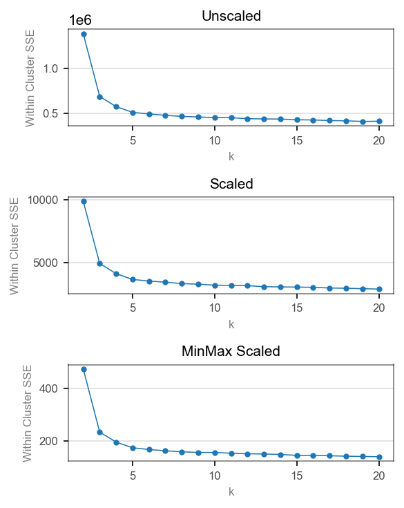


## Silhouette Analysis for k-means clustering  

From Silhouette Analysis, the number of clusters can be **3,4,5** in decreasing order of silhouette scores.  
Cluster counts **10,8,6** are ruled out owing to presence of negative silhouette scores.  

For standard scaled data, the silhouette scores for different k values are :

    For n_clusters = 3,  The average silhouette_score is : 0.609876  
    For n_clusters = 4,  The average silhouette_score is : 0.56319  
    For n_clusters = 5,  The average silhouette_score is : 0.449328  
    For n_clusters = 6,  The average silhouette_score is : 0.3887  
    For n_clusters = 8,  The average silhouette_score is : 0.358646  
    For n_clusters = 10, The average silhouette_score is : 0.290975  

Note : Results for standard-scaled data are similar to the un-scaled and minmax scaled data.


```python
from sklearn.cluster import KMeans
from sklearn.metrics import silhouette_samples, silhouette_score


def cluster_evaluation(X, range_n_clusters, xlowerlim = -0.1, store_values = False):
    '''Returns Silhouette plot for clusterwise samples and a second plot to show  
    distribution of points in the feature space of first two attributes

                   X : a dataframe.
    range_n_clusters : a list of candidate values for the number of clusters.
          xlower_lim : the lower limit of x axis for the silhouette scores plot
          Usually, The silhouette coefficient can range from -1, 1.
        store_values : Bool. False
        If True, function will return a dictionary storing the silhouette scores
        at overall level and individual clusters.

    '''
    # Create a subplot with 1 row and 2 columns
    #rowcount = len(range_n_clusters)
    #fig, axr = plt.subplots(nrows = rowcount, ncols = 2)
    #fig.set_size_inches(18, rowcount*3)

    #Intercluster gap for inserting blank space between silhouette
    #plots of individual clusters, to demarcate them clearly.
    intercluster_gap = 10

    #Initializing a dictionary
    dict_Kcluster = {}

    for i,n_clusters in enumerate(range_n_clusters):
        # Create a subplot with 1 row and 2 columns
        fig, (ax1, ax2) = plt.subplots(1, 2)
        fig.set_size_inches(10, 4)


        # The 1st subplot is the silhouette plot
        # The silhouette coefficient can range from -1, 1 but depending on the
        # observed minimum silhouette coefficient, we will set the lower limit of x.
        ax1.set_xlim([xlowerlim,1])

        # The (n_clusters+1)*10 is for inserting blank space between silhouette
        # plots of individual clusters, to demarcate them clearly.
        ax1.set_ylim([0, len(X) + (n_clusters + 1) * intercluster_gap])

        # Initialize the clusterer with n_clusters value and a random generator
        # seed of 10 for reproducibility.
        clusterer = KMeans(n_clusters=n_clusters, random_state=10)
        cluster_labels = clusterer.fit_predict(X)

        # The silhouette_score gives the average value for all the samples.
        # This gives a perspective into the density and separation of the formed
        # clusters
        silhouette_avg = silhouette_score(X, cluster_labels)

        # Compute the silhouette scores for each sample
        sample_silhouette_values = silhouette_samples(X, cluster_labels)

        # Store values - silhoutte score in dictionary
        if store_values == True:
            dict_Kcluster[n_clusters] = {}
            dict_Kcluster[n_clusters]['silhouette_score'] = {}
            dict_Kcluster[n_clusters]['silhouette_score']['size'] = \
                                        int(sample_silhouette_values.size)
            dict_Kcluster[n_clusters]['silhouette_score']['avg'] = \
                                        silhouette_avg.round(6)
            dict_Kcluster[n_clusters]['silhouette_score']['max'] = \
                                        sample_silhouette_values.max().round(6)
            dict_Kcluster[n_clusters]['silhouette_score']['min'] = \
                                        sample_silhouette_values.max().round(6)
        print("For n_clusters =", n_clusters,
              "The average silhouette_score is :", silhouette_avg.round(6))


        y_lower = intercluster_gap
        for i in range(n_clusters):
            # Aggregate the silhouette scores for samples belonging to
            # cluster i, and sort them
            ith_cluster_silhouette_values = \
                sample_silhouette_values[cluster_labels == i]

            ith_cluster_silhouette_values.sort()

            size_cluster_i = ith_cluster_silhouette_values.shape[0]

            # Store values - cluster sizes in dictionary
            if store_values == True:
                dict_Kcluster[n_clusters]['cluster'+str(i)] = {}
                dict_Kcluster[n_clusters]['cluster'+str(i)]['size'] = \
                                                int(size_cluster_i)
                dict_Kcluster[n_clusters]['cluster'+str(i)]['avg'] = \
                                                        ith_cluster_silhouette_values.mean()
                dict_Kcluster[n_clusters]['cluster'+str(i)]['max'] = \
                                                ith_cluster_silhouette_values.max()
                dict_Kcluster[n_clusters]['cluster'+str(i)]['min'] = \
                                                ith_cluster_silhouette_values.min()

            #print(f'   Cluster {i}: {size_cluster_i}')

            y_upper = y_lower + size_cluster_i

            color = cm.nipy_spectral(float(i) / n_clusters)

            # Plotting silhouette values corresponding to each value in sample
            ax1.fill_betweenx(np.arange(y_lower, y_upper),
                              0, ith_cluster_silhouette_values,
                              facecolor=color, edgecolor=color, alpha=0.7)

            # Label the silhouette plots with their cluster numbers at the middle
            ax1.text(-0.05, y_lower + 0.5 * size_cluster_i, str(i))

            # Compute the new y_lower for next plot
            y_lower = y_upper + 10  # 10 for the 0 samples

        ax1.set_title("The silhouette plot for the various clusters.")
        ax1.set_xlabel("The silhouette coefficient values")
        ax1.set_ylabel("Cluster label")

        # The vertical line for average silhouette score of all the values
        ax1.axvline(x=silhouette_avg, color="red", linestyle="--")

        ax1.set_yticks([])  # Clear the yaxis labels / ticks
        ax1.set_xticks([-0.1, 0, 0.2, 0.4, 0.6, 0.8, 1])

        #---------------------------------------------------------------------------
        # 2nd Plot showing the actual clusters formed
        colors = cm.nipy_spectral(cluster_labels.astype(float) / n_clusters)
        ax2.scatter(X.iloc[:, 0], X.iloc[:, 1], marker='.', s=30, lw=0, alpha=0.7,
                    c=colors, edgecolor='k')

        # Labeling the clusters
        centers = clusterer.cluster_centers_

        # Draw white circles at cluster centers
        ax2.scatter(centers[:, 0], centers[:, 1], marker='o',
                    c="white", alpha=1, s=200, edgecolor='k')

        for i, c in enumerate(centers):
            ax2.scatter(c[0], c[1], marker='$%d$' % i, alpha=1,
                        s=50, edgecolor='k')

        ax2.set_title("The visualization of the clustered data.")
        ax2.set_xlabel("Feature space for the 1st feature")
        ax2.set_ylabel("Feature space for the 2nd feature")

        plt.suptitle(("Silhouette analysis for KMeans clustering on sample data "
                      "with n_clusters = %d" % n_clusters),
                     fontsize=14, fontweight='bold')
        plt.tight_layout()
    plt.show()

    # Return dictionary if store_values is True
    if store_values == True:
        return dict_Kcluster
```

### Unscaled input Data


```python
range_n_clusters = [3,4,5,6,8,10]
Kmeanwise_cluster_info = cluster_evaluation(X,range_n_clusters = range_n_clusters,
                                            xlowerlim = -0.3, store_values= True)
```

    For n_clusters = 3 The average silhouette_score is : 0.615055
    For n_clusters = 4 The average silhouette_score is : 0.568778
    For n_clusters = 5 The average silhouette_score is : 0.456103
    For n_clusters = 6 The average silhouette_score is : 0.39461
    For n_clusters = 8 The average silhouette_score is : 0.364105
    For n_clusters = 10 The average silhouette_score is : 0.310211


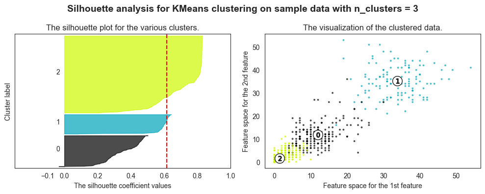


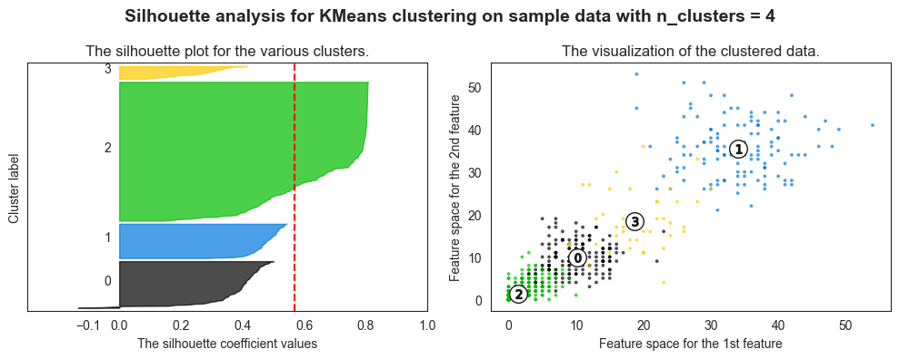


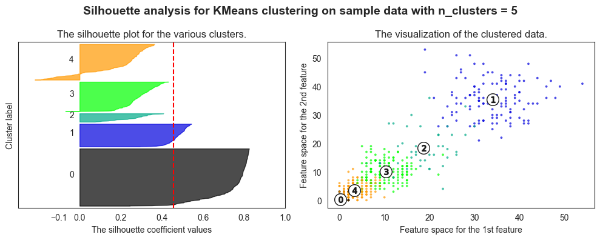


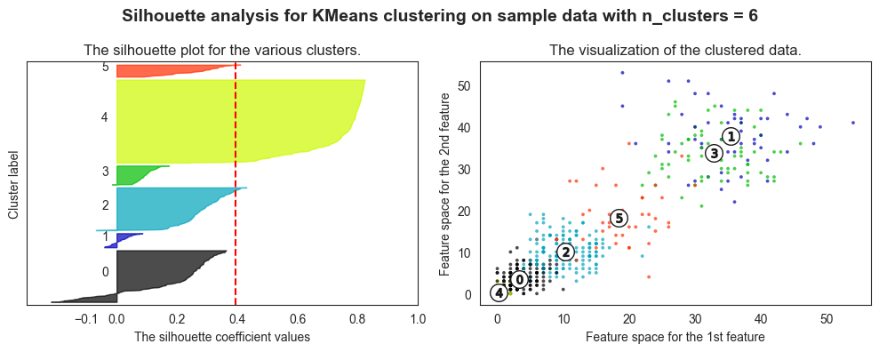


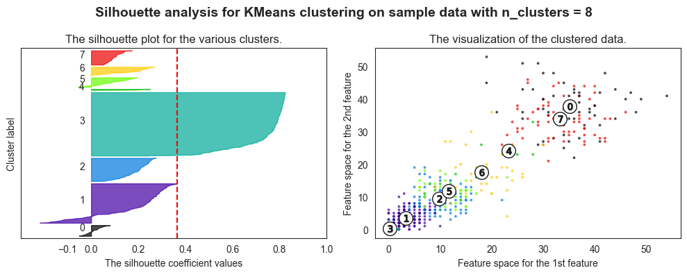


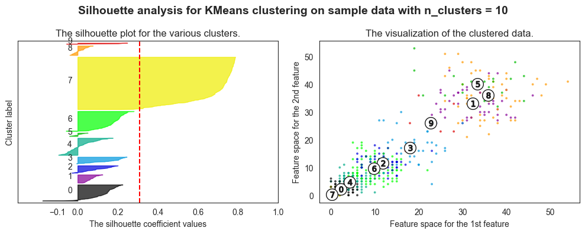


```python
pd.DataFrame(Kmeanwise_cluster_info[3]).T.fillna("")
```


<div>
<style scoped>
    .dataframe tbody tr th:only-of-type {
        vertical-align: middle;
    }

    .dataframe tbody tr th {
        vertical-align: top;
    }

    .dataframe thead th {
        text-align: right;
    }
</style>
<table border="1" class="dataframe">
  <thead>
    <tr style="text-align: right;">
      <th></th>
      <th>size</th>
      <th>avg</th>
      <th>max</th>
      <th>min</th>
    </tr>
  </thead>
  <tbody>
    <tr>
      <th>silhouette_score</th>
      <td>811.0</td>
      <td>0.615055</td>
      <td>0.830150</td>
      <td>0.830150</td>
    </tr>
    <tr>
      <th>cluster0</th>
      <td>197.0</td>
      <td>0.348887</td>
      <td>0.502259</td>
      <td>-0.033548</td>
    </tr>
    <tr>
      <th>cluster1</th>
      <td>124.0</td>
      <td>0.582979</td>
      <td>0.642369</td>
      <td>0.077280</td>
    </tr>
    <tr>
      <th>cluster2</th>
      <td>490.0</td>
      <td>0.730182</td>
      <td>0.830150</td>
      <td>0.208272</td>
    </tr>
  </tbody>
</table>
</div>


```python
user_ids = []
frames = []

for user_id, d in Kmeanwise_cluster_info.items():
    user_ids.append(user_id)
    frames.append(pd.DataFrame.from_dict(d, orient='columns'))

df = pd.concat(frames, keys=user_ids).round(2)
df.fillna("")
```


<div>
<style scoped>
    .dataframe tbody tr th:only-of-type {
        vertical-align: middle;
    }

    .dataframe tbody tr th {
        vertical-align: top;
    }

    .dataframe thead th {
        text-align: right;
    }
</style>
<table border="1" class="dataframe">
  <thead>
    <tr style="text-align: right;">
      <th></th>
      <th></th>
      <th>silhouette_score</th>
      <th>cluster0</th>
      <th>cluster1</th>
      <th>cluster2</th>
      <th>cluster3</th>
      <th>cluster4</th>
      <th>cluster5</th>
      <th>cluster6</th>
      <th>cluster7</th>
      <th>cluster8</th>
      <th>cluster9</th>
    </tr>
  </thead>
  <tbody>
    <tr>
      <th rowspan="4" valign="top">3</th>
      <th>size</th>
      <td>811.00</td>
      <td>197.00</td>
      <td>124.00</td>
      <td>490.00</td>
      <td></td>
      <td></td>
      <td></td>
      <td></td>
      <td></td>
      <td></td>
      <td></td>
    </tr>
    <tr>
      <th>avg</th>
      <td>0.62</td>
      <td>0.35</td>
      <td>0.58</td>
      <td>0.73</td>
      <td></td>
      <td></td>
      <td></td>
      <td></td>
      <td></td>
      <td></td>
      <td></td>
    </tr>
    <tr>
      <th>max</th>
      <td>0.83</td>
      <td>0.50</td>
      <td>0.64</td>
      <td>0.83</td>
      <td></td>
      <td></td>
      <td></td>
      <td></td>
      <td></td>
      <td></td>
      <td></td>
    </tr>
    <tr>
      <th>min</th>
      <td>0.83</td>
      <td>-0.03</td>
      <td>0.08</td>
      <td>0.21</td>
      <td></td>
      <td></td>
      <td></td>
      <td></td>
      <td></td>
      <td></td>
      <td></td>
    </tr>
    <tr>
      <th rowspan="4" valign="top">4</th>
      <th>size</th>
      <td>811.00</td>
      <td>163.00</td>
      <td>120.00</td>
      <td>483.00</td>
      <td>45.0</td>
      <td></td>
      <td></td>
      <td></td>
      <td></td>
      <td></td>
      <td></td>
    </tr>
    <tr>
      <th>avg</th>
      <td>0.57</td>
      <td>0.38</td>
      <td>0.47</td>
      <td>0.69</td>
      <td>0.26</td>
      <td></td>
      <td></td>
      <td></td>
      <td></td>
      <td></td>
      <td></td>
    </tr>
    <tr>
      <th>max</th>
      <td>0.81</td>
      <td>0.50</td>
      <td>0.54</td>
      <td>0.81</td>
      <td>0.41</td>
      <td></td>
      <td></td>
      <td></td>
      <td></td>
      <td></td>
      <td></td>
    </tr>
    <tr>
      <th>min</th>
      <td>0.81</td>
      <td>-0.13</td>
      <td>0.29</td>
      <td>0.14</td>
      <td>0.09</td>
      <td></td>
      <td></td>
      <td></td>
      <td></td>
      <td></td>
      <td></td>
    </tr>
    <tr>
      <th rowspan="4" valign="top">5</th>
      <th>size</th>
      <td>811.00</td>
      <td>302.00</td>
      <td>120.00</td>
      <td>45.00</td>
      <td>156.0</td>
      <td>188.0</td>
      <td></td>
      <td></td>
      <td></td>
      <td></td>
      <td></td>
    </tr>
    <tr>
      <th>avg</th>
      <td>0.46</td>
      <td>0.74</td>
      <td>0.47</td>
      <td>0.25</td>
      <td>0.29</td>
      <td>0.18</td>
      <td></td>
      <td></td>
      <td></td>
      <td></td>
      <td></td>
    </tr>
    <tr>
      <th>max</th>
      <td>0.82</td>
      <td>0.82</td>
      <td>0.54</td>
      <td>0.41</td>
      <td>0.43</td>
      <td>0.36</td>
      <td></td>
      <td></td>
      <td></td>
      <td></td>
      <td></td>
    </tr>
    <tr>
      <th>min</th>
      <td>0.82</td>
      <td>0.24</td>
      <td>0.29</td>
      <td>0.07</td>
      <td>-0.07</td>
      <td>-0.22</td>
      <td></td>
      <td></td>
      <td></td>
      <td></td>
      <td></td>
    </tr>
    <tr>
      <th rowspan="4" valign="top">6</th>
      <th>size</th>
      <td>811.00</td>
      <td>188.00</td>
      <td>52.00</td>
      <td>156.00</td>
      <td>69.0</td>
      <td>302.0</td>
      <td>44.0</td>
      <td></td>
      <td></td>
      <td></td>
      <td></td>
    </tr>
    <tr>
      <th>avg</th>
      <td>0.39</td>
      <td>0.18</td>
      <td>0.01</td>
      <td>0.29</td>
      <td>0.1</td>
      <td>0.74</td>
      <td>0.26</td>
      <td></td>
      <td></td>
      <td></td>
      <td></td>
    </tr>
    <tr>
      <th>max</th>
      <td>0.82</td>
      <td>0.36</td>
      <td>0.09</td>
      <td>0.43</td>
      <td>0.17</td>
      <td>0.82</td>
      <td>0.41</td>
      <td></td>
      <td></td>
      <td></td>
      <td></td>
    </tr>
    <tr>
      <th>min</th>
      <td>0.82</td>
      <td>-0.22</td>
      <td>-0.04</td>
      <td>-0.07</td>
      <td>-0.02</td>
      <td>0.24</td>
      <td>0.09</td>
      <td></td>
      <td></td>
      <td></td>
      <td></td>
    </tr>
    <tr>
      <th rowspan="4" valign="top">8</th>
      <th>size</th>
      <td>811.00</td>
      <td>52.00</td>
      <td>188.00</td>
      <td>111.00</td>
      <td>302.0</td>
      <td>5.0</td>
      <td>45.0</td>
      <td>40.0</td>
      <td>68.0</td>
      <td></td>
      <td></td>
    </tr>
    <tr>
      <th>avg</th>
      <td>0.36</td>
      <td>0.01</td>
      <td>0.17</td>
      <td>0.19</td>
      <td>0.74</td>
      <td>0.18</td>
      <td>0.09</td>
      <td>0.16</td>
      <td>0.1</td>
      <td></td>
      <td></td>
    </tr>
    <tr>
      <th>max</th>
      <td>0.82</td>
      <td>0.08</td>
      <td>0.36</td>
      <td>0.27</td>
      <td>0.82</td>
      <td>0.25</td>
      <td>0.19</td>
      <td>0.27</td>
      <td>0.17</td>
      <td></td>
      <td></td>
    </tr>
    <tr>
      <th>min</th>
      <td>0.82</td>
      <td>-0.05</td>
      <td>-0.22</td>
      <td>0.01</td>
      <td>0.24</td>
      <td>0.02</td>
      <td>-0.06</td>
      <td>-0.01</td>
      <td>0.05</td>
      <td></td>
      <td></td>
    </tr>
    <tr>
      <th rowspan="4" valign="top">10</th>
      <th>size</th>
      <td>811.00</td>
      <td>93.00</td>
      <td>47.00</td>
      <td>42.00</td>
      <td>39.0</td>
      <td>98.0</td>
      <td>19.0</td>
      <td>114.0</td>
      <td>299.0</td>
      <td>54.0</td>
      <td>6.0</td>
    </tr>
    <tr>
      <th>avg</th>
      <td>0.31</td>
      <td>0.12</td>
      <td>0.07</td>
      <td>0.10</td>
      <td>0.15</td>
      <td>0.01</td>
      <td>0.0</td>
      <td>0.17</td>
      <td>0.68</td>
      <td>0.01</td>
      <td>0.15</td>
    </tr>
    <tr>
      <th>max</th>
      <td>0.79</td>
      <td>0.22</td>
      <td>0.12</td>
      <td>0.20</td>
      <td>0.25</td>
      <td>0.18</td>
      <td>0.05</td>
      <td>0.28</td>
      <td>0.79</td>
      <td>0.08</td>
      <td>0.25</td>
    </tr>
    <tr>
      <th>min</th>
      <td>0.79</td>
      <td>-0.18</td>
      <td>0.02</td>
      <td>-0.03</td>
      <td>-0.01</td>
      <td>-0.1</td>
      <td>-0.04</td>
      <td>-0.06</td>
      <td>0.21</td>
      <td>-0.04</td>
      <td>-0.06</td>
    </tr>
  </tbody>
</table>
</div>


```python
Kmeanwise_cluster_info[3]
```


    {'silhouette_score': {'size': 811,
      'avg': 0.615055,
      'max': 0.83015,
      'min': 0.83015},
     'cluster0': {'size': 197,
      'avg': 0.3488867236071804,
      'max': 0.5022589261586605,
      'min': -0.03354812226088503},
     'cluster1': {'size': 124,
      'avg': 0.5829794207392918,
      'max': 0.6423693787539931,
      'min': 0.07728045417198895},
     'cluster2': {'size': 490,
      'avg': 0.7301818227930915,
      'max': 0.8301498162920166,
      'min': 0.20827162594274562}}


### Standard scaled data


```python
range_n_clusters = [3,4,5,6,8,10]
cluster_evaluation(pd.DataFrame(X_ssc, columns = ssc.get_feature_names_out().tolist()),
                   range_n_clusters = range_n_clusters)
```

    For n_clusters = 3 The average silhouette_score is : 0.609876
    For n_clusters = 4 The average silhouette_score is : 0.56319
    For n_clusters = 5 The average silhouette_score is : 0.449328
    For n_clusters = 6 The average silhouette_score is : 0.3887
    For n_clusters = 8 The average silhouette_score is : 0.358646
    For n_clusters = 10 The average silhouette_score is : 0.290975


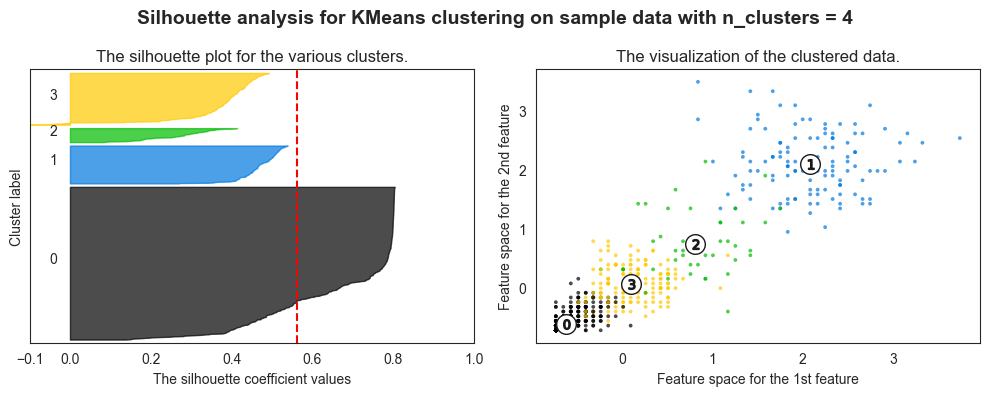


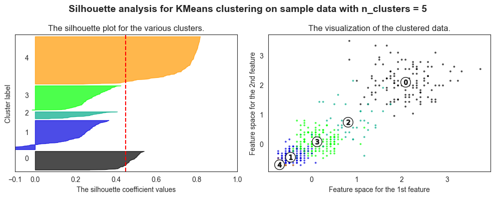


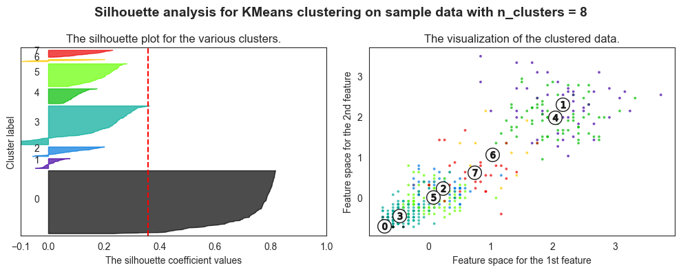


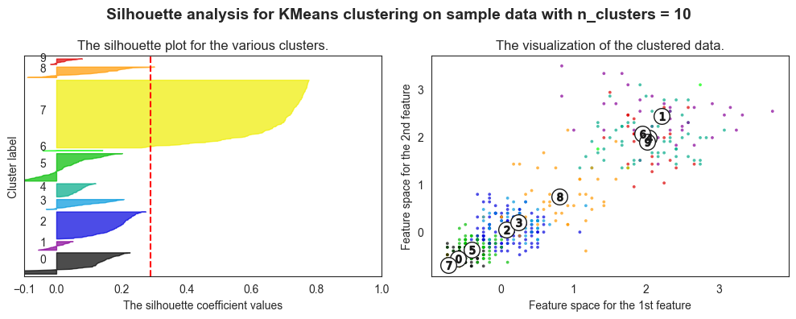


From Silhouette Analysis, the number of clusters can be **3,4,5** in decreasing order of silhouette scores.  
Cluster counts **10,8,6** are ruled out owing to presence of negative silhouette scores.


```python
print(list(dir(ssc)))
```

    ['__class__', '__delattr__', '__dict__', '__dir__', '__doc__', '__eq__', '__format__', '__ge__', '__getattribute__', '__getstate__', '__gt__', '__hash__', '__init__', '__init_subclass__', '__le__', '__lt__', '__module__', '__ne__', '__new__', '__reduce__', '__reduce_ex__', '__repr__', '__setattr__', '__setstate__', '__sizeof__', '__str__', '__subclasshook__', '__weakref__', '_check_feature_names', '_check_n_features', '_get_param_names', '_get_tags', '_more_tags', '_repr_html_', '_repr_html_inner', '_repr_mimebundle_', '_reset', '_validate_data', 'copy', 'feature_names_in_', 'fit', 'fit_transform', 'get_feature_names_out', 'get_params', 'inverse_transform', 'mean_', 'n_features_in_', 'n_samples_seen_', 'partial_fit', 'scale_', 'set_params', 'transform', 'var_', 'with_mean', 'with_std']


### Minmax scaled data


```python
range_n_clusters = [3,4,5,6,8,10]
cluster_evaluation(pd.DataFrame(X_mmsc, columns = mmsc.get_feature_names_out().tolist()),
                   range_n_clusters = range_n_clusters)
```

    For n_clusters = 3 The average silhouette_score is : 0.615093
    For n_clusters = 4 The average silhouette_score is : 0.569098
    For n_clusters = 5 The average silhouette_score is : 0.453778
    For n_clusters = 6 The average silhouette_score is : 0.391998
    For n_clusters = 8 The average silhouette_score is : 0.358751
    For n_clusters = 10 The average silhouette_score is : 0.354226


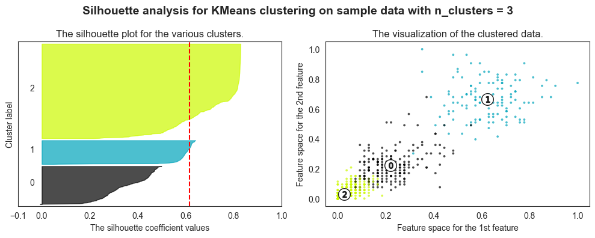


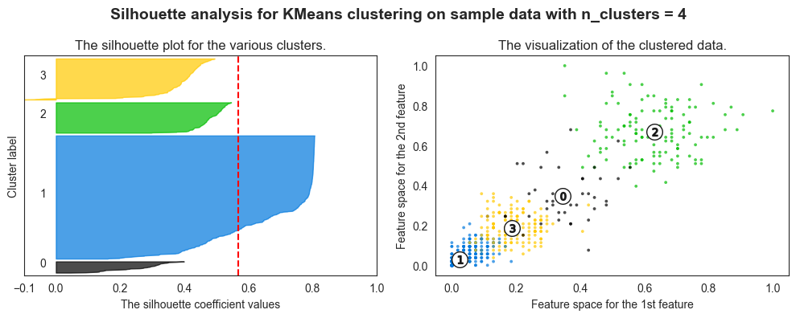


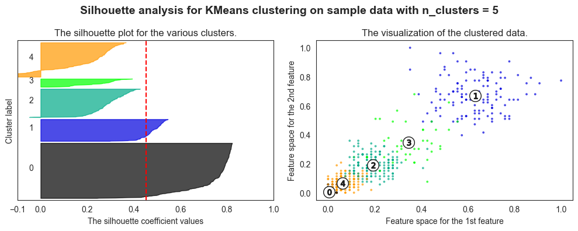


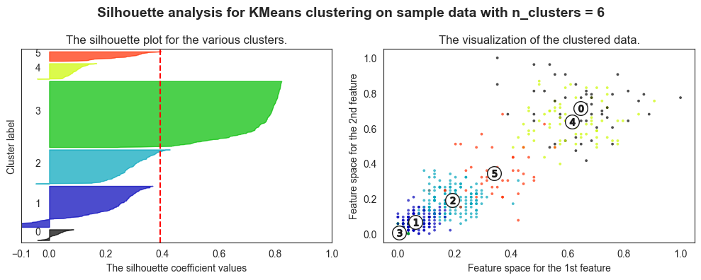


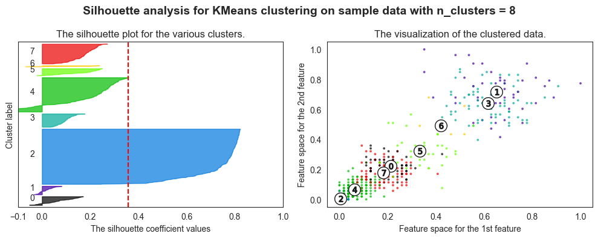


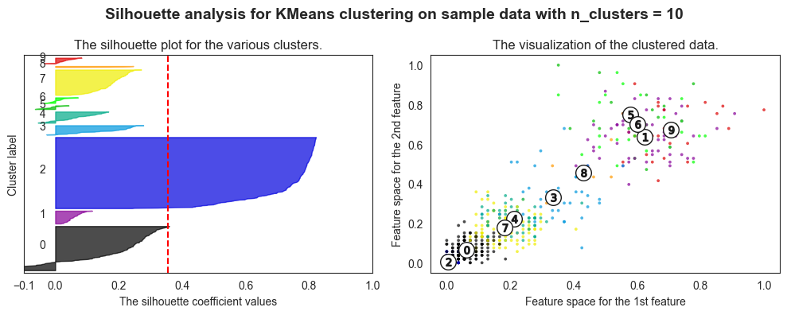


# Visualising the product clusters

## On Raw Data


```python
optimal_k = 3
clusterer = KMeans(n_clusters= optimal_k, random_state=10)
cluster_labels = clusterer.fit_predict(X_ssc)
```


```python
X
```


<div>
<style scoped>
    .dataframe tbody tr th:only-of-type {
        vertical-align: middle;
    }

    .dataframe tbody tr th {
        vertical-align: top;
    }

    .dataframe thead th {
        text-align: right;
    }
</style>
<table border="1" class="dataframe">
  <thead>
    <tr style="text-align: right;">
      <th></th>
      <th>W0</th>
      <th>W1</th>
      <th>W2</th>
      <th>W3</th>
      <th>W4</th>
      <th>W5</th>
      <th>W6</th>
      <th>W7</th>
      <th>W8</th>
      <th>W9</th>
      <th>...</th>
      <th>W42</th>
      <th>W43</th>
      <th>W44</th>
      <th>W45</th>
      <th>W46</th>
      <th>W47</th>
      <th>W48</th>
      <th>W49</th>
      <th>W50</th>
      <th>W51</th>
    </tr>
    <tr>
      <th>Product_Code</th>
      <th></th>
      <th></th>
      <th></th>
      <th></th>
      <th></th>
      <th></th>
      <th></th>
      <th></th>
      <th></th>
      <th></th>
      <th></th>
      <th></th>
      <th></th>
      <th></th>
      <th></th>
      <th></th>
      <th></th>
      <th></th>
      <th></th>
      <th></th>
      <th></th>
    </tr>
  </thead>
  <tbody>
    <tr>
      <th>P1</th>
      <td>11</td>
      <td>12</td>
      <td>10</td>
      <td>8</td>
      <td>13</td>
      <td>12</td>
      <td>14</td>
      <td>21</td>
      <td>6</td>
      <td>14</td>
      <td>...</td>
      <td>4</td>
      <td>7</td>
      <td>8</td>
      <td>10</td>
      <td>12</td>
      <td>3</td>
      <td>7</td>
      <td>6</td>
      <td>5</td>
      <td>10</td>
    </tr>
    <tr>
      <th>P2</th>
      <td>7</td>
      <td>6</td>
      <td>3</td>
      <td>2</td>
      <td>7</td>
      <td>1</td>
      <td>6</td>
      <td>3</td>
      <td>3</td>
      <td>3</td>
      <td>...</td>
      <td>2</td>
      <td>4</td>
      <td>5</td>
      <td>1</td>
      <td>1</td>
      <td>4</td>
      <td>5</td>
      <td>1</td>
      <td>6</td>
      <td>0</td>
    </tr>
    <tr>
      <th>P3</th>
      <td>7</td>
      <td>11</td>
      <td>8</td>
      <td>9</td>
      <td>10</td>
      <td>8</td>
      <td>7</td>
      <td>13</td>
      <td>12</td>
      <td>6</td>
      <td>...</td>
      <td>6</td>
      <td>14</td>
      <td>5</td>
      <td>5</td>
      <td>7</td>
      <td>8</td>
      <td>14</td>
      <td>8</td>
      <td>8</td>
      <td>7</td>
    </tr>
    <tr>
      <th>P4</th>
      <td>12</td>
      <td>8</td>
      <td>13</td>
      <td>5</td>
      <td>9</td>
      <td>6</td>
      <td>9</td>
      <td>13</td>
      <td>13</td>
      <td>11</td>
      <td>...</td>
      <td>9</td>
      <td>10</td>
      <td>3</td>
      <td>4</td>
      <td>6</td>
      <td>8</td>
      <td>14</td>
      <td>8</td>
      <td>7</td>
      <td>8</td>
    </tr>
    <tr>
      <th>P5</th>
      <td>8</td>
      <td>5</td>
      <td>13</td>
      <td>11</td>
      <td>6</td>
      <td>7</td>
      <td>9</td>
      <td>14</td>
      <td>9</td>
      <td>9</td>
      <td>...</td>
      <td>7</td>
      <td>11</td>
      <td>7</td>
      <td>12</td>
      <td>6</td>
      <td>6</td>
      <td>5</td>
      <td>11</td>
      <td>8</td>
      <td>9</td>
    </tr>
    <tr>
      <th>...</th>
      <td>...</td>
      <td>...</td>
      <td>...</td>
      <td>...</td>
      <td>...</td>
      <td>...</td>
      <td>...</td>
      <td>...</td>
      <td>...</td>
      <td>...</td>
      <td>...</td>
      <td>...</td>
      <td>...</td>
      <td>...</td>
      <td>...</td>
      <td>...</td>
      <td>...</td>
      <td>...</td>
      <td>...</td>
      <td>...</td>
      <td>...</td>
    </tr>
    <tr>
      <th>P815</th>
      <td>0</td>
      <td>0</td>
      <td>1</td>
      <td>0</td>
      <td>0</td>
      <td>2</td>
      <td>1</td>
      <td>0</td>
      <td>0</td>
      <td>1</td>
      <td>...</td>
      <td>0</td>
      <td>1</td>
      <td>1</td>
      <td>0</td>
      <td>0</td>
      <td>1</td>
      <td>0</td>
      <td>0</td>
      <td>2</td>
      <td>0</td>
    </tr>
    <tr>
      <th>P816</th>
      <td>0</td>
      <td>1</td>
      <td>0</td>
      <td>0</td>
      <td>1</td>
      <td>2</td>
      <td>2</td>
      <td>6</td>
      <td>0</td>
      <td>1</td>
      <td>...</td>
      <td>3</td>
      <td>3</td>
      <td>4</td>
      <td>2</td>
      <td>4</td>
      <td>5</td>
      <td>5</td>
      <td>5</td>
      <td>6</td>
      <td>5</td>
    </tr>
    <tr>
      <th>P817</th>
      <td>1</td>
      <td>0</td>
      <td>0</td>
      <td>0</td>
      <td>1</td>
      <td>1</td>
      <td>2</td>
      <td>1</td>
      <td>1</td>
      <td>0</td>
      <td>...</td>
      <td>2</td>
      <td>0</td>
      <td>0</td>
      <td>2</td>
      <td>2</td>
      <td>0</td>
      <td>0</td>
      <td>0</td>
      <td>4</td>
      <td>3</td>
    </tr>
    <tr>
      <th>P818</th>
      <td>0</td>
      <td>0</td>
      <td>0</td>
      <td>1</td>
      <td>0</td>
      <td>0</td>
      <td>0</td>
      <td>0</td>
      <td>1</td>
      <td>0</td>
      <td>...</td>
      <td>0</td>
      <td>0</td>
      <td>0</td>
      <td>1</td>
      <td>1</td>
      <td>0</td>
      <td>0</td>
      <td>0</td>
      <td>2</td>
      <td>0</td>
    </tr>
    <tr>
      <th>P819</th>
      <td>0</td>
      <td>1</td>
      <td>0</td>
      <td>0</td>
      <td>0</td>
      <td>0</td>
      <td>0</td>
      <td>0</td>
      <td>0</td>
      <td>0</td>
      <td>...</td>
      <td>0</td>
      <td>0</td>
      <td>0</td>
      <td>0</td>
      <td>0</td>
      <td>0</td>
      <td>0</td>
      <td>0</td>
      <td>0</td>
      <td>1</td>
    </tr>
  </tbody>
</table>
<p>811 rows × 52 columns</p>
</div>


```python
X_clustered = pd.concat([X, \
                         pd.DataFrame(cluster_labels, \
                                      columns = ['cluster_label'], index = X.index)], \
                        axis = 1)
```


```python
sns.scatterplot(x = 'W2', y = 'W3', data = X_clustered, hue = 'cluster_label', palette = 'muted')
```


    <AxesSubplot:xlabel='W2', ylabel='W3'>


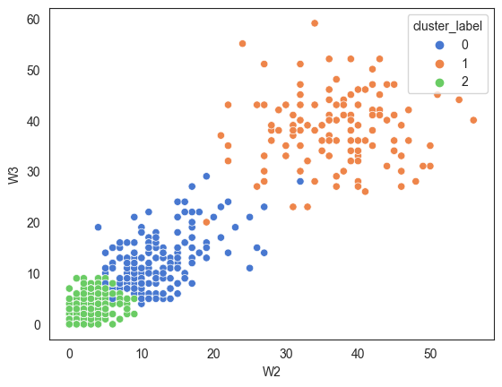


## On PCA Transformed Data


```python
from sklearn.decomposition import PCA

pca = PCA(n_components = 3)
X_pca = pca.fit_transform(X)
X_pca = pd.DataFrame(X_trans, columns = ['PCA1', 'PCA2','PCA3'], index = X.index )

explained_variance =  pca.explained_variance_ratio_
```


```python
X_pca_clustered = pd.concat([X_trans,
                               pd.DataFrame(cluster_labels,
                                            columns = ['cluster_label'],
                                            index = X.index)], axis = 1)
```


```python
X_pca_clustered
```


<div>
<style scoped>
    .dataframe tbody tr th:only-of-type {
        vertical-align: middle;
    }

    .dataframe tbody tr th {
        vertical-align: top;
    }

    .dataframe thead th {
        text-align: right;
    }
</style>
<table border="1" class="dataframe">
  <thead>
    <tr style="text-align: right;">
      <th></th>
      <th>PCA1</th>
      <th>PCA2</th>
      <th>PCA3</th>
      <th>cluster_label</th>
    </tr>
    <tr>
      <th>Product_Code</th>
      <th></th>
      <th></th>
      <th></th>
      <th></th>
    </tr>
  </thead>
  <tbody>
    <tr>
      <th>P1</th>
      <td>5.321035</td>
      <td>-8.330276</td>
      <td>3.213794</td>
      <td>0</td>
    </tr>
    <tr>
      <th>P2</th>
      <td>-35.764069</td>
      <td>-4.442247</td>
      <td>2.845525</td>
      <td>2</td>
    </tr>
    <tr>
      <th>P3</th>
      <td>-1.850250</td>
      <td>-1.926762</td>
      <td>-2.171873</td>
      <td>0</td>
    </tr>
    <tr>
      <th>P4</th>
      <td>-4.691024</td>
      <td>-3.537034</td>
      <td>-1.001507</td>
      <td>0</td>
    </tr>
    <tr>
      <th>P5</th>
      <td>-2.953761</td>
      <td>1.357492</td>
      <td>7.548739</td>
      <td>0</td>
    </tr>
    <tr>
      <th>...</th>
      <td>...</td>
      <td>...</td>
      <td>...</td>
      <td>...</td>
    </tr>
    <tr>
      <th>P815</th>
      <td>-61.135625</td>
      <td>-3.821242</td>
      <td>1.000051</td>
      <td>2</td>
    </tr>
    <tr>
      <th>P816</th>
      <td>-45.655741</td>
      <td>1.682969</td>
      <td>-2.337677</td>
      <td>2</td>
    </tr>
    <tr>
      <th>P817</th>
      <td>-60.929080</td>
      <td>-1.376589</td>
      <td>-0.172900</td>
      <td>2</td>
    </tr>
    <tr>
      <th>P818</th>
      <td>-62.153931</td>
      <td>-2.396644</td>
      <td>-0.810878</td>
      <td>2</td>
    </tr>
    <tr>
      <th>P819</th>
      <td>-62.234971</td>
      <td>-3.776276</td>
      <td>-0.243990</td>
      <td>2</td>
    </tr>
  </tbody>
</table>
<p>811 rows × 4 columns</p>
</div>


```python
explained_variance
```


    array([0.92274682, 0.00833725, 0.00283047])


```python
sns.scatterplot(x = 'PCA1', y = 'PCA2', data = X_pca_clustered, hue = 'cluster_label', palette = 'muted')
```


    <AxesSubplot:xlabel='PCA1', ylabel='PCA2'>


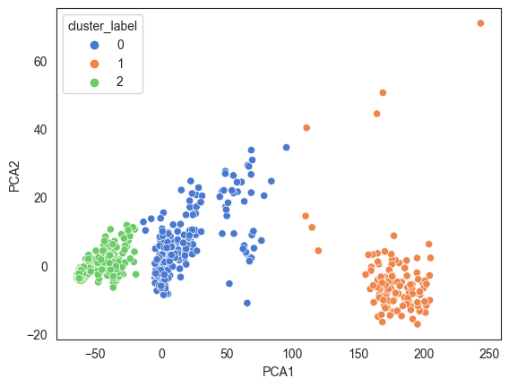


# Summary

We had done below tasks on the data :
- k-means clustering was used to identify natural groupings of products based on Weekly sales quantity pattern.  
- From elbow plot, 3 seemed to be most suited to be the optimal value of k. The other candidate values were 4 and 5.
- From Silhouette analysis, we have confirmed k = 3 with the highest silhouette score.
- For k = 5, 6, 8, 10, there were instances of negative silhouette coefficients.
- For both elbow method and silhouette analysis, We had used unscaled, standard scaled and min max scaled data. Results were similar.  
- We have then proceeded with k = 3 and visualised the clusters successively using both raw and PCA transformed data.


# Useful resources

- Grouping of Retail Items by Using K-Means Clustering Kusrini Kusrini  
The Third Information Systems International Conference - Paper published by Elsevier in 2015
- <https://inseaddataanalytics.github.io/INSEADAnalytics/CourseSessions/Sessions45/ClusterAnalysisReading.html>  
- <https://quantdare.com/hierarchical-clustering/>
- Silhouettes: A graphical aid to the interpretation and validation of cluster analysis  
  <https://www.sciencedirect.com/science/article/pii/0377042787901257>  
- On kmeans and PCA  
  <https://stats.stackexchange.com/questions/92985/when-plotting-clustering-results-in-the-pca-coordinates-does-one-do-pca-or-clus?rq=1>  
- On drawbacks of k means and the no free lunch theorem  
  <https://stats.stackexchange.com/questions/133656/how-to-understand-the-drawbacks-of-k-means>  
- API design for machine learning software: experiences from the scikit-learn project  
  <https://arxiv.org/pdf/1309.0238.pdf>  
- <https://scikit-learn.org/stable/modules/clustering.html#clustering-evaluation>  
- <https://en.wikipedia.org/wiki/Silhouette_(clustering)>
