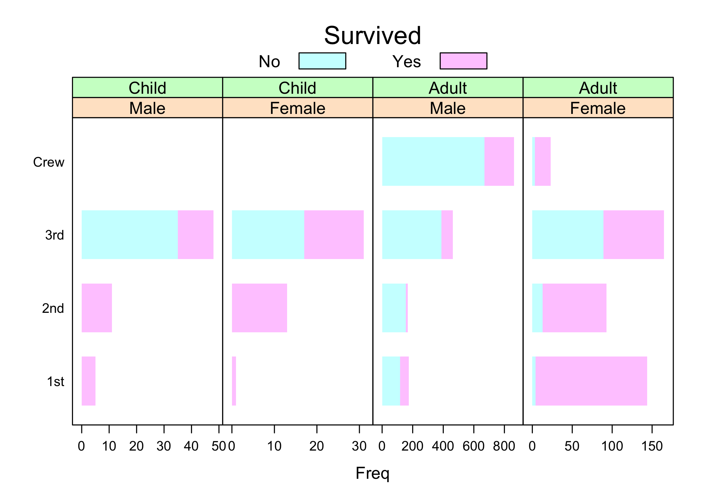

# Lattice Package in R
This post is currently under construction.  
Check out [html version](Lattice.html)  

## Useful Resources

-   Sarkar, D. (2016). lattice: Trellis Graphics for R
-   <https://www.isid.ac.in/~deepayan/R-tutorials/labs/04_lattice_lab.pdf>  
-   <https://cran.r-project.org/web/packages/lattice/lattice.pdf>  
-   <https://ggplot2-book.org/facet.html>  
-   <https://www.neonscience.org/resources/learning-hub/tutorials/dc-time-series-plot-facets-ndvi-r>  
-   <https://socviz.co/groupfacettx.html>  
-   Graphical Data Analysis with R, by Antony Unwin  
-   <http://datavis.ca/papers/2019_asa-Titanic.pdf>  
-   <https://bio304-class.github.io/bio304-fall2017/data-story-titanic.html>

## YAML

for html output, check
[link](https://bookdown.org/yihui/rmarkdown/html-document.html)  
for md output, check [link](https://yihui.org/knitr/options/)

title: “Statistics Using R”  
author: “Bhaskar”  
date: “12/12/2020”  
output:  
 html_document:  
  toc: true  
  toc_depth: 4  
  number_sections: true  
  toc_float:  
   collapsed: false  
   smooth_scroll: false

 md_document:  
  variant: markdown_github

 powerpoint_presentation:  
  reference_doc: template.pptx

## Lattice: Multivariate Data Visualization with R - Figures and Code

[link](http://lmdvr.r-forge.r-project.org/figures/figures.html)
install.packages(“mlmRev”)

### Loading the data

``` r
data(Chem97, package = "mlmRev")
xtabs(~ score, data = Chem97)
```

    ## score
    ##    0    2    4    6    8   10
    ## 3688 3627 4619 5739 6668 6681

``` r
str(Chem97)
```

    ## 'data.frame':    31022 obs. of  8 variables:
    ##  $ lea      : Factor w/ 131 levels "1","2","3","4",..: 1 1 1 1 1 1 1 1 1 1 ...
    ##  $ school   : Factor w/ 2410 levels "1","2","3","4",..: 1 1 1 1 1 1 1 1 1 1 ...
    ##  $ student  : Factor w/ 31022 levels "1","2","3","4",..: 1 2 3 4 5 6 7 8 9 10 ...
    ##  $ score    : num  4 10 10 10 8 10 6 8 4 10 ...
    ##  $ gender   : Factor w/ 2 levels "M","F": 2 2 2 2 2 2 2 2 2 2 ...
    ##  $ age      : num  3 -3 -4 -2 -1 4 1 4 3 0 ...
    ##  $ gcsescore: num  6.62 7.62 7.25 7.5 6.44 ...
    ##  $ gcsecnt  : num  0.339 1.339 0.964 1.214 0.158 ...

### Histogram facet plot

``` r
library("lattice")
histogram(~ gcsescore | factor(score), data = Chem97)
```


### Density plot faceted

``` r
densityplot(~ gcsescore | factor(score), data = Chem97,
            plot.points = FALSE, ref = TRUE)
```


``` r
densityplot(~ gcsescore, groups = score, data = Chem97,
            plot.points = FALSE, ref = TRUE,
            auto.key = list(columns = 3))
```


``` r
tp1 <- histogram(~ gcsescore | factor(score), data = Chem97)
plot(tp1)
```


``` r
class(tp1)
```

    ## [1] "trellis"

``` r
summary(tp1)
```

    ##
    ## Call:
    ## histogram(~gcsescore | factor(score), data = Chem97)
    ##
    ## Number of observations:
    ## factor(score)
    ##    0    2    4    6    8   10
    ## 3688 3627 4619 5739 6668 6681

``` r
tp2 <- densityplot(~ gcsescore, data = Chem97, groups = score,
                   plot.points = FALSE,
                   auto.key = list(space = "right", title = "score"))

print(tp2)
```


``` r
plot(tp1, split = c(1, 1, 1, 2))
```

  

## MEMSS: Data Sets from Mixed-Effects Models in S

install.packages(“MEMSS”)  
[link](https://cran.r-project.org/web/packages/MEMSS/MEMSS.pdf)

``` r
data(Oats, package = "MEMSS")
tp1.oats <-xyplot(yield ~ nitro | Variety + Block, data = Oats, type = 'o')

print(tp1.oats)
```


``` r
#Contingency Tables
xtabs(~Variety + Block, data = Oats)
```

    ##              Block
    ## Variety       I II III IV V VI
    ##   Golden Rain 4  4   4  4 4  4
    ##   Marvellous  4  4   4  4 4  4
    ##   Victory     4  4   4  4 4  4

``` r
summary(tp1.oats)
```

    ##
    ## Call:
    ## xyplot(yield ~ nitro | Variety + Block, data = Oats, type = "o")
    ##
    ## Number of observations:
    ##              Block
    ## Variety       I II III IV V VI
    ##   Golden Rain 4  4   4  4 4  4
    ##   Marvellous  4  4   4  4 4  4
    ##   Victory     4  4   4  4 4  4

``` r
print(tp1.oats[,c(3,1,4)])
```


``` r
# Transpose Trellis object
t(tp1.oats)
```


``` r
update(tp1.oats, aspect="xy", layout = c(0,18),
       between = list(x = c(0, 0, 0.5), y = 0.5))  
```


Fine-tuning the layout: between and skip  
The between argument can be a list, with components x and y (both
usually 0 by default) which are numeric vectors specifying the amount of
blank space between the panels (in units of character heights). x and y
are repeated to account for all panels in a page, and any extra
components are ignored. This is often useful in providing a visual cue
separating panels into blocks.

skip argument is specified as a logical vector (default FALSE),
replicated to be as long as the number of panels. For elements that are
TRUE, the corresponding panel position is skipped; that is, nothing is
plotted in that position. The panel that was sup- posed to be drawn
there is now drawn in the next available panel position, and the
positions of all the subsequent panels are bumped up accordingly.

Note :  
If there is only one conditioning variable with n levels, the default
value of layout is c(0,n), thus taking advantage of this automatic
layout computation. When aspect = “fill” (the default in most cases),
this computation is carried out with an initial aspect ratio of 1, but
in the eventual display the panels are expanded to fill up all the
available space.(Page no.21)

## Grouped displays

A powerful construct that forces direct comparison is superposition,
where data associated with dif- ferent levels of a grouping variable are
rendered together within a panel, but with different graphical
characteristics. For example, different curves could be drawn in
different color or line type, or points could be drawn with different
symbols. **Superposition is usually more effective than multipanel
conditioning when the number of levels of the grouping variable is
small.**

``` r
dotplot(variety ~ yield | site, barley, layout = c(1,6), aspect = c(0.7),
groups = year, auto.key = list(space = "right"))
```


## Titanic Data

``` r
barchart(Class ~ Freq | Sex + Age, data = as.data.frame(Titanic),
         groups = Survived, stack = TRUE, layout = c(4, 1),
         auto.key = list(title = "Survived", columns = 2))
```


``` r
bc.titanic <- barchart(Class ~ Freq | Sex + Age, data = as.data.frame(Titanic),
         groups = Survived, stack = TRUE, layout = c(4, 1),
         auto.key = list(title = "Survived", columns = 2),
         scales = list(x = "free"))
bc.titanic
```


``` r
update(bc.titanic, panel = function(...) {
  panel.grid(h = 0, v = -1)
  panel.barchart(...) })
```


``` r
update(bc.titanic, border = "transparent")
```



``` r
#Page no. 33
```

## Creating a ppt and adding R plots

install.packages(c(“officer”,“rvg”))

library(tidyverse) library(officer) library(rvg) \# [rvg for micrsoft
ppt](https://davidgohel.github.io/rvg/)

``` r
library(tidyverse)
library(officer)
library(rvg)
# Using diamonds dataset which is shipped with R
ggp <- diamonds %>%
  # Let's simplify things by only considering natural number carats
  mutate(carat = floor(carat)) %>%
  group_by(carat, cut, clarity, color) %>%
  summarise(price = mean(price)) %>%
  # Create a plot of price by carat, colour, cut, and clarity
  ggplot(aes(x = carat, y = price, fill = color)) +
  geom_bar(stat = 'identity') +
  facet_grid(cut ~ clarity) +
  # Simplify the plot layout a little
  theme_bw() +
  guides(fill = FALSE) +
  theme(panel.grid.major.x = element_blank(),
        panel.grid.minor.x = element_blank()); ggp
```


my_vec_graph \<- dml(code = ggp)

### Create a new powerpoint document

doc \<- read_pptx()  
doc \<- add_slide(doc, ‘Title and Content’, ‘Office Theme’)

### Add the plot

doc \<- ph_with(doc, dml(code=ggp), location = ph_location_fullsize()
)  
print(doc, target = “my_plot.pptx”)
