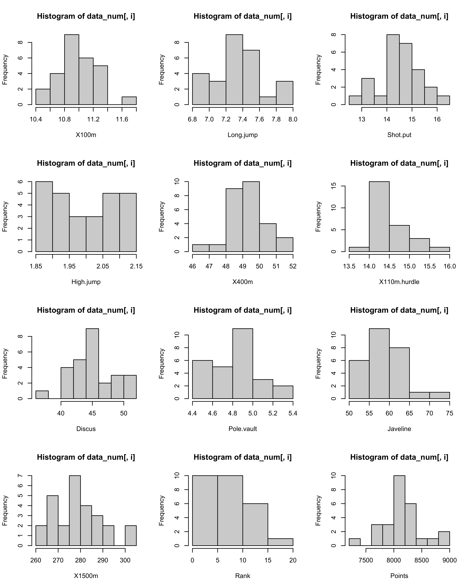
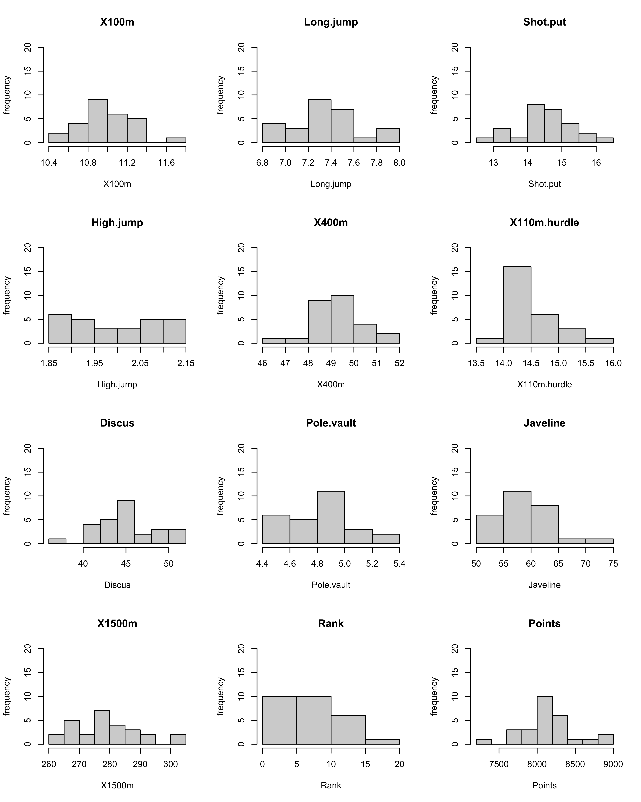
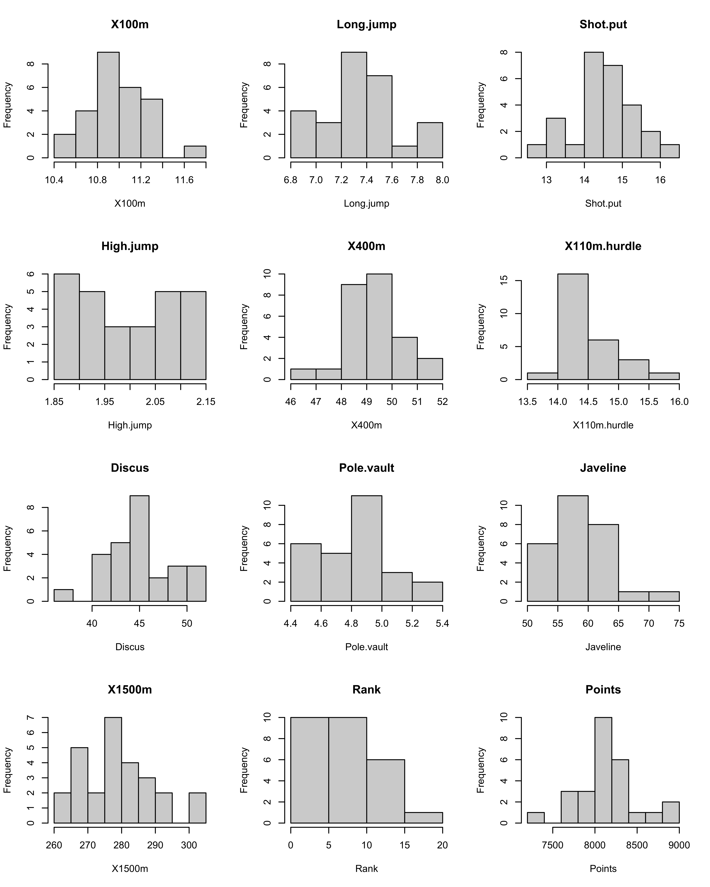
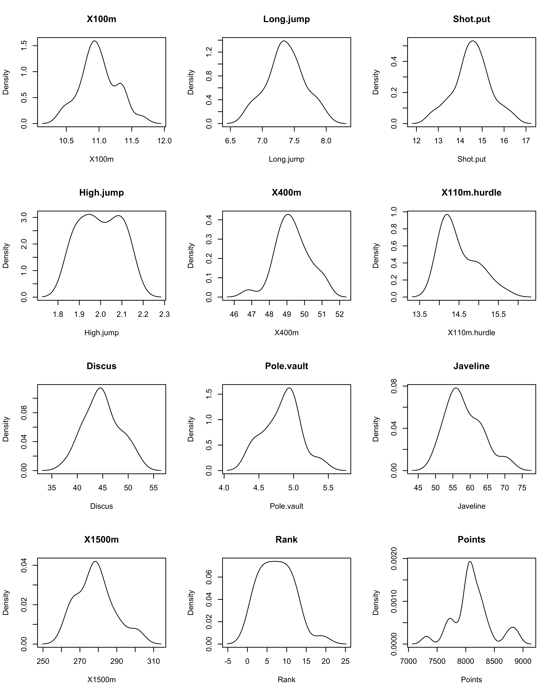
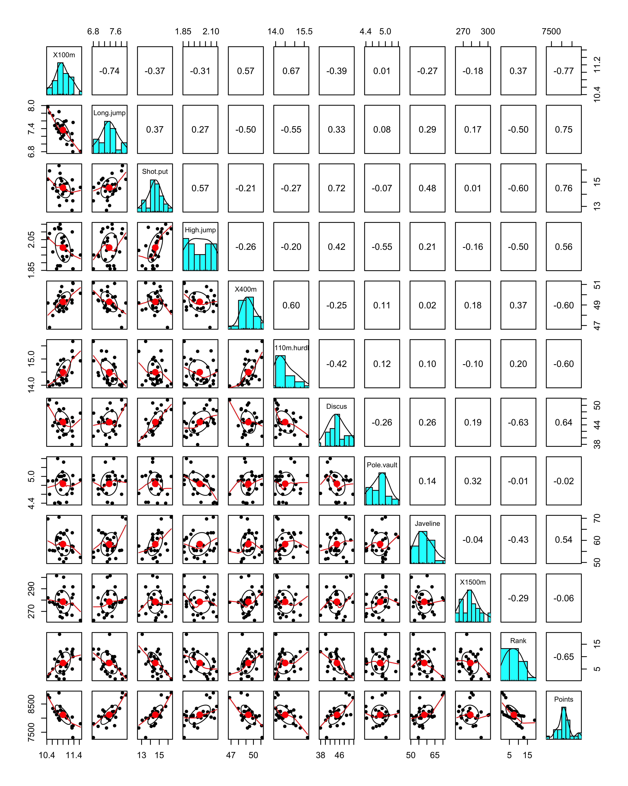
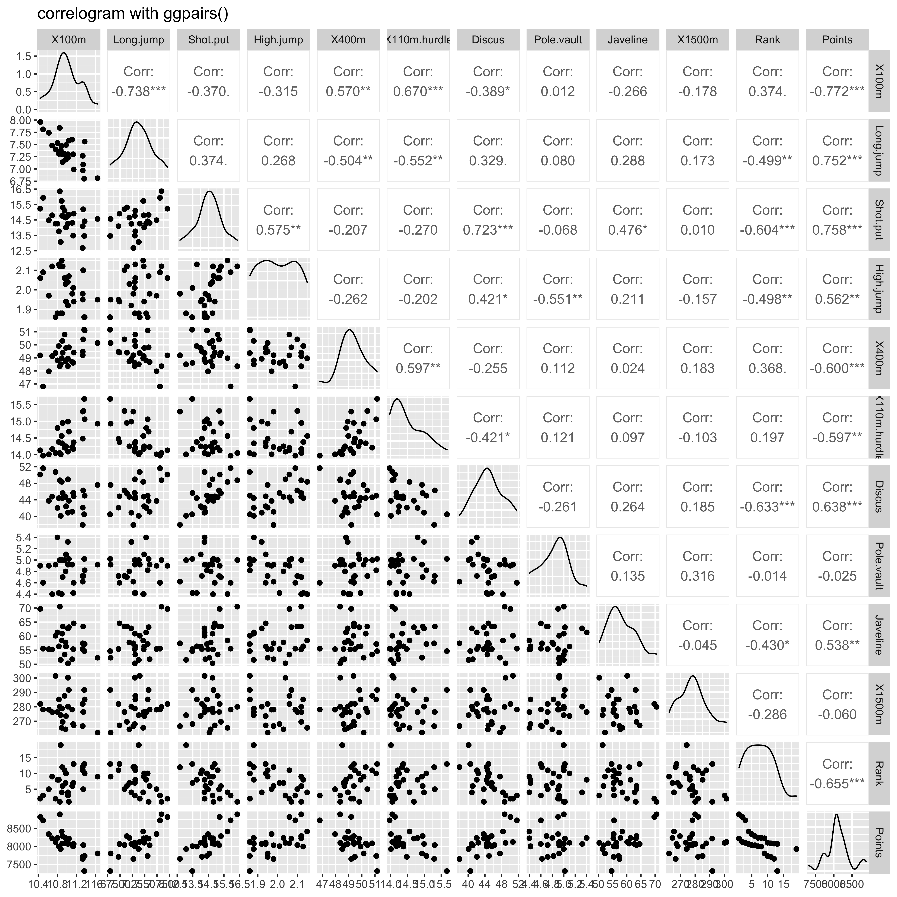
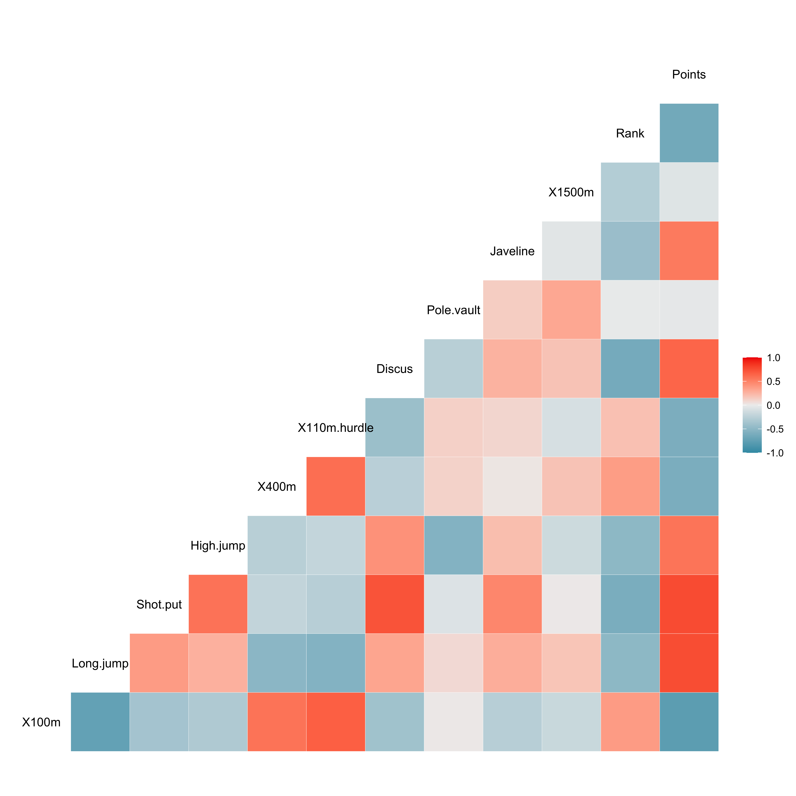
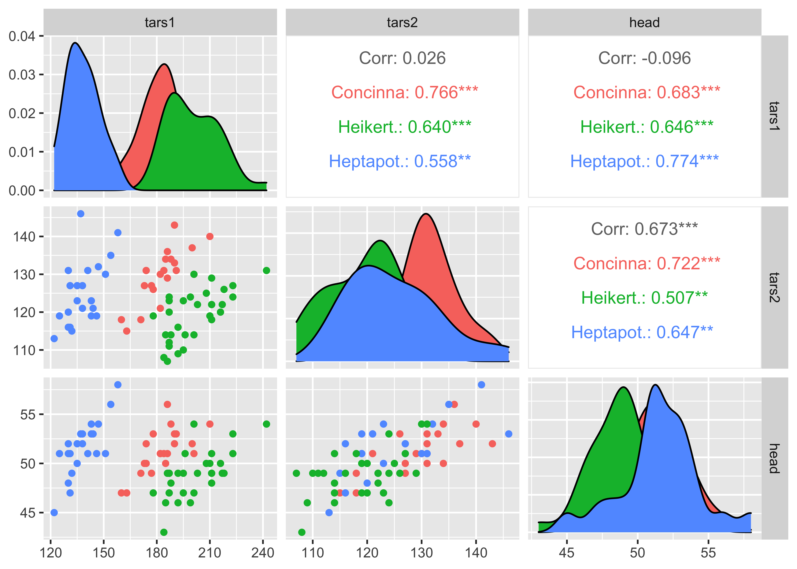

# Numeric univariate and multivariate analysis in R

Check [html version](Numeric-Univariate-Analysis.html)  

## Importing the Data

```r
#install.packages(c("FactoMineR", "factoextra"))

``` r
library("FactoMineR")
library("factoextra")
```

``` r
data(decathlon2)
head(decathlon2)
```

    ##           X100m Long.jump Shot.put High.jump X400m X110m.hurdle Discus
    ## SEBRLE    11.04      7.58    14.83      2.07 49.81        14.69  43.75
    ## CLAY      10.76      7.40    14.26      1.86 49.37        14.05  50.72
    ## BERNARD   11.02      7.23    14.25      1.92 48.93        14.99  40.87
    ## YURKOV    11.34      7.09    15.19      2.10 50.42        15.31  46.26
    ## ZSIVOCZKY 11.13      7.30    13.48      2.01 48.62        14.17  45.67
    ## McMULLEN  10.83      7.31    13.76      2.13 49.91        14.38  44.41
    ##           Pole.vault Javeline X1500m Rank Points Competition
    ## SEBRLE          5.02    63.19  291.7    1   8217    Decastar
    ## CLAY            4.92    60.15  301.5    2   8122    Decastar
    ## BERNARD         5.32    62.77  280.1    4   8067    Decastar
    ## YURKOV          4.72    63.44  276.4    5   8036    Decastar
    ## ZSIVOCZKY       4.42    55.37  268.0    7   8004    Decastar
    ## McMULLEN        4.42    56.37  285.1    8   7995    Decastar

## Inspecting the Data

– Number of rows, Columns  
– Variables - type, Values

``` r
library(tibble)
glimpse(decathlon2)
```

    ## Rows: 27
    ## Columns: 13
    ## $ X100m        <dbl> 11.04, 10.76, 11.02, 11.34, 11.13, 10.83, 11.64, 11.37, 1…
    ## $ Long.jump    <dbl> 7.58, 7.40, 7.23, 7.09, 7.30, 7.31, 6.81, 7.56, 6.97, 7.2…
    ## $ Shot.put     <dbl> 14.83, 14.26, 14.25, 15.19, 13.48, 13.76, 14.57, 14.41, 1…
    ## $ High.jump    <dbl> 2.07, 1.86, 1.92, 2.10, 2.01, 2.13, 1.95, 1.86, 1.95, 1.9…
    ## $ X400m        <dbl> 49.81, 49.37, 48.93, 50.42, 48.62, 49.91, 50.14, 51.10, 4…
    ## $ X110m.hurdle <dbl> 14.69, 14.05, 14.99, 15.31, 14.17, 14.38, 14.93, 15.06, 1…
    ## $ Discus       <dbl> 43.75, 50.72, 40.87, 46.26, 45.67, 44.41, 47.60, 44.99, 4…
    ## $ Pole.vault   <dbl> 5.02, 4.92, 5.32, 4.72, 4.42, 4.42, 4.92, 4.82, 4.72, 4.6…
    ## $ Javeline     <dbl> 63.19, 60.15, 62.77, 63.44, 55.37, 56.37, 52.33, 57.19, 5…
    ## $ X1500m       <dbl> 291.70, 301.50, 280.10, 276.40, 268.00, 285.10, 262.10, 2…
    ## $ Rank         <int> 1, 2, 4, 5, 7, 8, 9, 10, 11, 12, 13, 1, 2, 3, 4, 5, 6, 7,…
    ## $ Points       <int> 8217, 8122, 8067, 8036, 8004, 7995, 7802, 7733, 7708, 765…
    ## $ Competition  <fct> Decastar, Decastar, Decastar, Decastar, Decastar, Decasta…

### Random sample of the dataframe

``` r
sample(decathlon2)
```

    ##             X110m.hurdle X100m Pole.vault Points High.jump Long.jump Shot.put
    ## SEBRLE             14.69 11.04       5.02   8217      2.07      7.58    14.83
    ## CLAY               14.05 10.76       4.92   8122      1.86      7.40    14.26
    ## BERNARD            14.99 11.02       5.32   8067      1.92      7.23    14.25
    ## YURKOV             15.31 11.34       4.72   8036      2.10      7.09    15.19
    ## ZSIVOCZKY          14.17 11.13       4.42   8004      2.01      7.30    13.48
    ## McMULLEN           14.38 10.83       4.42   7995      2.13      7.31    13.76
    ## MARTINEAU          14.93 11.64       4.92   7802      1.95      6.81    14.57
    ## HERNU              15.06 11.37       4.82   7733      1.86      7.56    14.41
    ## BARRAS             14.48 11.33       4.72   7708      1.95      6.97    14.09
    ## NOOL               15.29 11.33       4.62   7651      1.98      7.27    12.68
    ## BOURGUIGNON        15.67 11.36       5.02   7313      1.86      6.80    13.46
    ## Sebrle             14.05 10.85       5.00   8893      2.12      7.84    16.36
    ## Clay               14.13 10.44       4.90   8820      2.06      7.96    15.23
    ## Karpov             13.97 10.50       4.60   8725      2.09      7.81    15.93
    ## Macey              14.56 10.89       4.40   8414      2.15      7.47    15.73
    ## Warners            14.01 10.62       4.90   8343      1.97      7.74    14.48
    ## Zsivoczky          14.95 10.91       4.70   8287      2.12      7.14    15.31
    ## Hernu              14.25 10.97       4.80   8237      2.03      7.19    14.65
    ## Bernard            14.17 10.69       4.40   8225      2.12      7.48    14.80
    ## Schwarzl           14.25 10.98       5.10   8102      1.94      7.49    14.01
    ## Pogorelov          14.21 10.95       5.00   8084      2.06      7.31    15.10
    ## Schoenbeck         14.34 10.90       5.00   8077      1.88      7.30    14.77
    ## Barras             14.37 11.14       4.60   8067      1.94      6.99    14.91
    ## KARPOV             14.09 11.02       4.92   8099      2.04      7.30    14.77
    ## WARNERS            14.23 11.11       4.92   8030      1.98      7.60    14.31
    ## Nool               14.80 10.80       5.40   8235      1.88      7.53    14.26
    ## Drews              14.01 10.87       5.00   7926      1.88      7.38    13.07
    ##             Competition Javeline X1500m X400m Rank Discus
    ## SEBRLE         Decastar    63.19 291.70 49.81    1  43.75
    ## CLAY           Decastar    60.15 301.50 49.37    2  50.72
    ## BERNARD        Decastar    62.77 280.10 48.93    4  40.87
    ## YURKOV         Decastar    63.44 276.40 50.42    5  46.26
    ## ZSIVOCZKY      Decastar    55.37 268.00 48.62    7  45.67
    ## McMULLEN       Decastar    56.37 285.10 49.91    8  44.41
    ## MARTINEAU      Decastar    52.33 262.10 50.14    9  47.60
    ## HERNU          Decastar    57.19 285.10 51.10   10  44.99
    ## BARRAS         Decastar    55.40 282.00 49.48   11  42.10
    ## NOOL           Decastar    57.44 266.60 49.20   12  37.92
    ## BOURGUIGNON    Decastar    54.68 291.70 51.16   13  40.49
    ## Sebrle         OlympicG    70.52 280.01 48.36    1  48.72
    ## Clay           OlympicG    69.71 282.00 49.19    2  50.11
    ## Karpov         OlympicG    55.54 278.11 46.81    3  51.65
    ## Macey          OlympicG    58.46 265.42 48.97    4  48.34
    ## Warners        OlympicG    55.39 278.05 47.97    5  43.73
    ## Zsivoczky      OlympicG    63.45 269.54 49.40    6  45.62
    ## Hernu          OlympicG    57.76 264.35 48.73    7  44.72
    ## Bernard        OlympicG    55.27 276.31 49.13    9  44.75
    ## Schwarzl       OlympicG    56.32 273.56 49.76   10  42.43
    ## Pogorelov      OlympicG    53.45 287.63 50.79   11  44.60
    ## Schoenbeck     OlympicG    60.89 278.82 50.30   12  44.41
    ## Barras         OlympicG    64.55 267.09 49.41   13  44.83
    ## KARPOV         Decastar    50.31 300.20 48.37    3  48.95
    ## WARNERS        Decastar    51.77 278.10 48.68    6  41.10
    ## Nool           OlympicG    61.33 276.33 48.81    8  42.05
    ## Drews          OlympicG    51.53 274.21 48.51   19  40.11

### Summary of all the variables of the dataframe

``` r
summary(decathlon2)
```

    ##      X100m         Long.jump        Shot.put       High.jump    
    ##  Min.   :10.44   Min.   :6.800   Min.   :12.68   Min.   :1.860  
    ##  1st Qu.:10.84   1st Qu.:7.210   1st Qu.:14.17   1st Qu.:1.930  
    ##  Median :10.97   Median :7.310   Median :14.57   Median :1.980  
    ##  Mean   :10.99   Mean   :7.365   Mean   :14.54   Mean   :1.998  
    ##  3rd Qu.:11.13   3rd Qu.:7.545   3rd Qu.:15.01   3rd Qu.:2.080  
    ##  Max.   :11.64   Max.   :7.960   Max.   :16.36   Max.   :2.150  
    ##      X400m        X110m.hurdle       Discus        Pole.vault   
    ##  Min.   :46.81   Min.   :13.97   Min.   :37.92   Min.   :4.400  
    ##  1st Qu.:48.70   1st Qu.:14.15   1st Qu.:42.27   1st Qu.:4.660  
    ##  Median :49.20   Median :14.34   Median :44.72   Median :4.900  
    ##  Mean   :49.31   Mean   :14.50   Mean   :44.85   Mean   :4.836  
    ##  3rd Qu.:49.86   3rd Qu.:14.87   3rd Qu.:46.93   3rd Qu.:5.000  
    ##  Max.   :51.16   Max.   :15.67   Max.   :51.65   Max.   :5.400  
    ##     Javeline         X1500m           Rank            Points       Competition
    ##  Min.   :50.31   Min.   :262.1   Min.   : 1.000   Min.   :7313   Decastar:13  
    ##  1st Qu.:55.32   1st Qu.:271.6   1st Qu.: 4.000   1st Qu.:8000   OlympicG:14  
    ##  Median :57.19   Median :278.1   Median : 7.000   Median :8084                
    ##  Mean   :58.32   Mean   :278.5   Mean   : 7.444   Mean   :8119                
    ##  3rd Qu.:62.05   3rd Qu.:283.6   3rd Qu.:10.500   3rd Qu.:8236                
    ##  Max.   :70.52   Max.   :301.5   Max.   :19.000   Max.   :8893

``` r
#https://stackoverflow.com/questions/50848273/call-many-variables-in-a-for-loop-with-dplyr-ggplot-function
plotUniCat <- function(df, x) {
  x <- sym(x)
  df %>%
    filter(!is.na(!!x)) %>%
    count(!!x) %>%
    mutate(prop = prop.table(n)) %>%
    ggplot(aes(y=prop, x=!!x)) +
    geom_bar(stat = "identity")
}
```

### Checking the column names of the dataframe

``` r
colnames(decathlon2)
```

    ##  [1] "X100m"        "Long.jump"    "Shot.put"     "High.jump"    "X400m"       
    ##  [6] "X110m.hurdle" "Discus"       "Pole.vault"   "Javeline"     "X1500m"      
    ## [11] "Rank"         "Points"       "Competition"

### Inspecting the structure of the dataframe

``` r
str(decathlon2)
```

    ## 'data.frame':    27 obs. of  13 variables:
    ##  $ X100m       : num  11 10.8 11 11.3 11.1 ...
    ##  $ Long.jump   : num  7.58 7.4 7.23 7.09 7.3 7.31 6.81 7.56 6.97 7.27 ...
    ##  $ Shot.put    : num  14.8 14.3 14.2 15.2 13.5 ...
    ##  $ High.jump   : num  2.07 1.86 1.92 2.1 2.01 2.13 1.95 1.86 1.95 1.98 ...
    ##  $ X400m       : num  49.8 49.4 48.9 50.4 48.6 ...
    ##  $ X110m.hurdle: num  14.7 14.1 15 15.3 14.2 ...
    ##  $ Discus      : num  43.8 50.7 40.9 46.3 45.7 ...
    ##  $ Pole.vault  : num  5.02 4.92 5.32 4.72 4.42 4.42 4.92 4.82 4.72 4.62 ...
    ##  $ Javeline    : num  63.2 60.1 62.8 63.4 55.4 ...
    ##  $ X1500m      : num  292 302 280 276 268 ...
    ##  $ Rank        : int  1 2 4 5 7 8 9 10 11 12 ...
    ##  $ Points      : int  8217 8122 8067 8036 8004 7995 7802 7733 7708 7651 ...
    ##  $ Competition : Factor w/ 2 levels "Decastar","OlympicG": 1 1 1 1 1 1 1 1 1 1 ...

### Readying the Data for univariate distributions plotting of numeric variables

``` r
library(dplyr)
data_num <- decathlon2 %>% select_if(is.numeric)
```

``` r
str(data_num)
```

    ## 'data.frame':    27 obs. of  12 variables:
    ##  $ X100m       : num  11 10.8 11 11.3 11.1 ...
    ##  $ Long.jump   : num  7.58 7.4 7.23 7.09 7.3 7.31 6.81 7.56 6.97 7.27 ...
    ##  $ Shot.put    : num  14.8 14.3 14.2 15.2 13.5 ...
    ##  $ High.jump   : num  2.07 1.86 1.92 2.1 2.01 2.13 1.95 1.86 1.95 1.98 ...
    ##  $ X400m       : num  49.8 49.4 48.9 50.4 48.6 ...
    ##  $ X110m.hurdle: num  14.7 14.1 15 15.3 14.2 ...
    ##  $ Discus      : num  43.8 50.7 40.9 46.3 45.7 ...
    ##  $ Pole.vault  : num  5.02 4.92 5.32 4.72 4.42 4.42 4.92 4.82 4.72 4.62 ...
    ##  $ Javeline    : num  63.2 60.1 62.8 63.4 55.4 ...
    ##  $ X1500m      : num  292 302 280 276 268 ...
    ##  $ Rank        : int  1 2 4 5 7 8 9 10 11 12 ...
    ##  $ Points      : int  8217 8122 8067 8036 8004 7995 7802 7733 7708 7651 ...

``` r
variables <- colnames(data_num)
```

``` r
out <- lapply(variables, function(i) plotUniCat(decathlon2,i))
```

## Creating histograms for the columns in the dataframe  

[hist function](https://www.rdocumentation.org/packages/graphics/versions/3.6.2/topics/hist)  
The main argument is for the main title of the plot.

``` r
#https://stackoverflow.com/questions/17963962/plot-size-and-resolution-with-r-markdown-knitr-pandoc-beamer
par(mfrow=c(4, 3))
for (i in names(data_num)){
  hist(data_num[, i],xlab = (i))}  
# main title not specified
```



### Creating histogram (frequency) for all the columns in the dataframe

``` r
par(mfrow=c(4, 3))
for (i in names(data_num)){
hist(data_num[, i], main = paste0(i), freq=TRUE,
     xlab= paste0(i), ylim = c(0,20),ylab = "frequency")}  
# main title not specified
```



### Creating histogram (frequency) for all the columns in the dataframe

``` r
par(mfrow=c(4, 3))
for (i in names(data_num)){
hist(data_num[, i], main = paste0(i), freq=TRUE, xlab= paste0(i))}  

# main title is specified
```



## Creating density plot for all the columns in the dataframe

``` r
par(mfrow=c(4, 3))
for (i in names(data_num)){
plot(density(data_num[, i]), main = paste0(i), xlab= paste0(i))
}
```



## Bivariate Relationships and Correlation plots

``` r
library(psych)
pairs.panels(data_num, col="red")
```



``` r
#methods(class = class(decathlon2[,'Competition']))
methods(class = 'factor')
```

    ##  [1] [             [[            [[<-          [<-           all.equal    
    ##  [6] as.character  as.data.frame as.Date       as.list       as.logical   
    ## [11] as.POSIXlt    as.vector     c             coerce        droplevels   
    ## [16] format        initialize    is.na<-       length<-      levels<-     
    ## [21] Math          Ops           plot          print         recode       
    ## [26] relevel       relist        rep           scale_type    show         
    ## [31] slotsFromS3   summary       Summary       type_sum      xtfrm        
    ## see '?methods' for accessing help and source code

``` r
levels(decathlon2[,'Competition'])
```

    ## [1] "Decastar" "OlympicG"

``` r
nlevels(decathlon2[,'Competition'])
```

    ## [1] 2

``` r
summary(decathlon2[,'Competition'])
```

    ## Decastar OlympicG
    ##       13       14

### Correlation Matrix with GGally

``` r
library(GGally)
# Check correlations (as scatterplots), distribution and print corrleation coefficient
ggpairs(data_num, title="correlogram with ggpairs()")
```



``` r
library(GGally)
# Nice visualization of correlations
ggcorr(data_num, method = c("everything", "pearson"))  
```



``` r
# https://www.r-graph-gallery.com/199-correlation-matrix-with-ggally.html
# Quick display of two cabapilities of GGally, to assess the distribution and correlation of variables
library(GGally)

# From the help page:
data(flea)
head(flea)
```

    ##    species tars1 tars2 head aede1 aede2 aede3
    ## 1 Concinna   191   131   53   150    15   104
    ## 2 Concinna   185   134   50   147    13   105
    ## 3 Concinna   200   137   52   144    14   102
    ## 4 Concinna   173   127   50   144    16    97
    ## 5 Concinna   171   118   49   153    13   106
    ## 6 Concinna   160   118   47   140    15    99

``` r
ggpairs(flea, columns = 2:4, ggplot2::aes(colour=species))
```



``` r
ggpairs(decathlon2, columns = 1:12, ggplot2::aes(colour=Competition))
```


