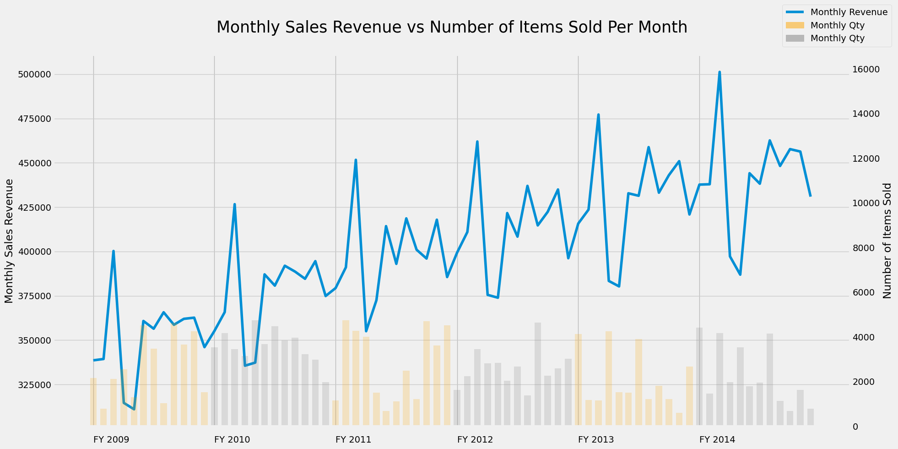
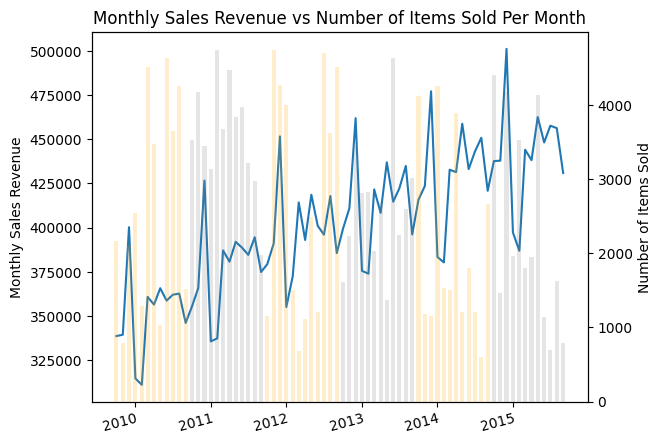
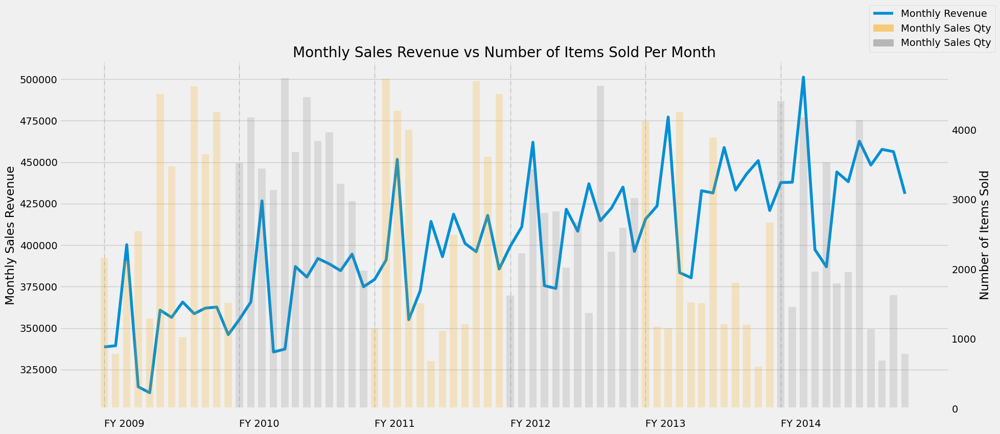
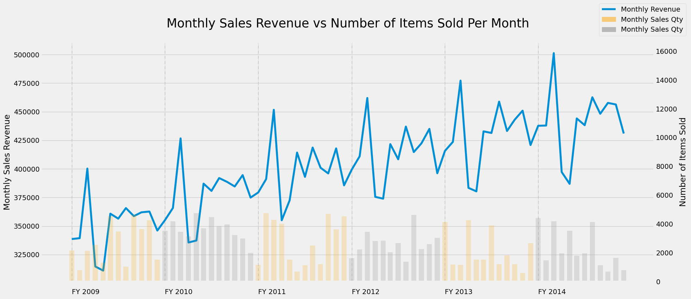
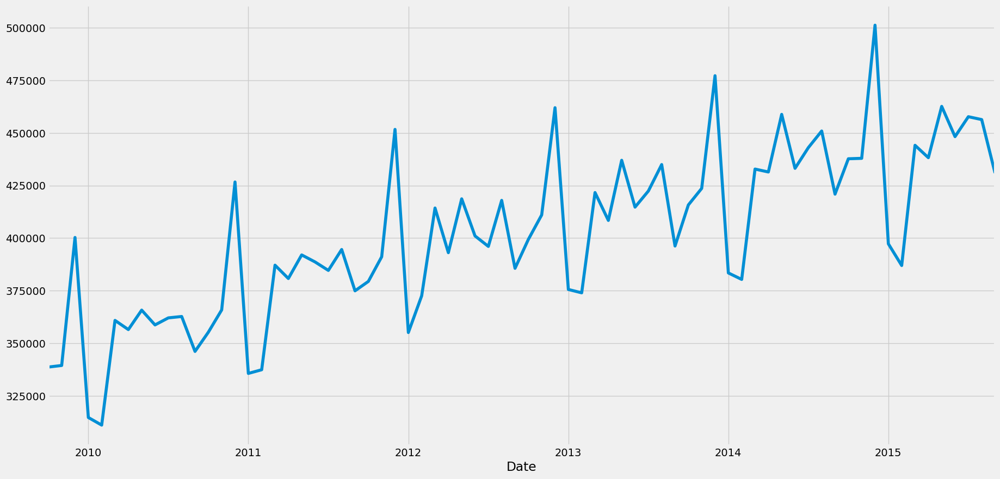

# Combo Charts (Overlaying charts)  

The plot and data is inspired from the below link :  
[https://pythondata.com/visualizing-data-overlaying-charts/](https://pythondata.com/visualizing-data-overlaying-charts/)  

  

The data preparation steps and comments of original link has been retained as it is very informative. However, there are below **major changes** with regard to creation of the visualisation :  
- Locator/formatter pairs created for placement of x-axis tick labels  
- For loop to create the bar plots iteratively  
- Cycler object with islice from itertools to assign colors to bars  
- Addition of legend by mix of automatic detection and proxy artists  

Voila, those are some heavy sounding keywords and may seem a bit overwhelming. But hold on, they are more easier to understand in action.  

I will be showcasing two versions of the plot :  
- a [basic barebones plot](#Basic Plot) of overlaying charts without any frills  
- a [Refined version](#Refined Plot) of the plot  

Check [Jupyter notebook version](Overlaying Charts_Matplotlib_jupyter.html)

# <a name="Basic Plot"></a>Basic Plot

## Preparing the data


```python
import numpy as np
import pandas as pd
import matplotlib.pyplot as plt
import matplotlib.dates as mdates

#%matplotlib inline # needed for jupyter notebooks

plt.rcParams['figure.figsize']=(20,10) # set the figure size
plt.rcdefaults()

path1 = "https://raw.githubusercontent.com/Bhaskar-JR/Matplotlib_Overlaying_Charts/main/Sales_Data.csv"
#path = '/Users/bhaskarroy/Files/Data Science/PYTHON/Visualisation/Matplotlib/Overlaying charts/sales.csv'

sales = pd.read_csv(path1) # Read the data in
sales.Date = pd.to_datetime(sales.Date,format='%Y-%m-%d') #set the date column to datetime
sales.set_index('Date', inplace=True) #set the index to the date column


# now the hack for the multi-colored bar chart:
# create fiscal year dataframes covering the timeframes you are looking for. In this case,
# the fiscal year covered October - September.
# --------------------------------------------------------------------------------
# Note: This should be set up as a function, but for this small amount of data,
# I just manually built each fiscal year. This is not very pythonic and would
# suck to do if you have many years of data, but it isn't bad for a few years of data.
# --------------------------------------------------------------------------------

fy10_all = sales[(sales.index >= '2009-10-01') & (sales.index < '2010-10-01')]
fy11_all = sales[(sales.index >= '2010-10-01') & (sales.index < '2011-10-01')]
fy12_all = sales[(sales.index >= '2011-10-01') & (sales.index < '2012-10-01')]
fy13_all = sales[(sales.index >= '2012-10-01') & (sales.index < '2013-10-01')]
fy14_all = sales[(sales.index >= '2013-10-01') & (sales.index < '2014-10-01')]
fy15_all = sales[(sales.index >= '2014-10-01') & (sales.index < '2015-10-01')]

```


```python
sales.index
```


    DatetimeIndex(['2009-10-01', '2009-11-01', '2009-12-01', '2010-01-01',
                   '2010-02-01', '2010-03-01', '2010-04-01', '2010-05-01',
                   '2010-06-01', '2010-07-01', '2010-08-01', '2010-09-01',
                   '2010-10-01', '2010-11-01', '2010-12-01', '2011-01-01',
                   '2011-02-01', '2011-03-01', '2011-04-01', '2011-05-01',
                   '2011-06-01', '2011-07-01', '2011-08-01', '2011-09-01',
                   '2011-10-01', '2011-11-01', '2011-12-01', '2012-01-01',
                   '2012-02-01', '2012-03-01', '2012-04-01', '2012-05-01',
                   '2012-06-01', '2012-07-01', '2012-08-01', '2012-09-01',
                   '2012-10-01', '2012-11-01', '2012-12-01', '2013-01-01',
                   '2013-02-01', '2013-03-01', '2013-04-01', '2013-05-01',
                   '2013-06-01', '2013-07-01', '2013-08-01', '2013-09-01',
                   '2013-10-01', '2013-11-01', '2013-12-01', '2014-01-01',
                   '2014-02-01', '2014-03-01', '2014-04-01', '2014-05-01',
                   '2014-06-01', '2014-07-01', '2014-08-01', '2014-09-01',
                   '2014-10-01', '2014-11-01', '2014-12-01', '2015-01-01',
                   '2015-02-01', '2015-03-01', '2015-04-01', '2015-05-01',
                   '2015-06-01', '2015-07-01', '2015-08-01', '2015-09-01'],
                  dtype='datetime64[ns]', name='Date', freq=None)


```python
sales.describe()
```


<div>
<style scoped>
    .dataframe tbody tr th:only-of-type {
        vertical-align: middle;
    }

    .dataframe tbody tr th {
        vertical-align: top;
    }

    .dataframe thead th {
        text-align: right;
    }
</style>
<table border="1" class="dataframe">
  <thead>
    <tr style="text-align: right;">
      <th></th>
      <th>Sales_Dollars</th>
      <th>Quantity</th>
    </tr>
  </thead>
  <tbody>
    <tr>
      <th>count</th>
      <td>72.000000</td>
      <td>72.000000</td>
    </tr>
    <tr>
      <th>mean</th>
      <td>401710.138889</td>
      <td>2687.180556</td>
    </tr>
    <tr>
      <th>std</th>
      <td>39999.439045</td>
      <td>1300.652884</td>
    </tr>
    <tr>
      <th>min</th>
      <td>311022.000000</td>
      <td>601.000000</td>
    </tr>
    <tr>
      <th>25%</th>
      <td>374655.750000</td>
      <td>1509.000000</td>
    </tr>
    <tr>
      <th>50%</th>
      <td>398296.500000</td>
      <td>2634.000000</td>
    </tr>
    <tr>
      <th>75%</th>
      <td>432892.500000</td>
      <td>3912.000000</td>
    </tr>
    <tr>
      <th>max</th>
      <td>501232.000000</td>
      <td>4747.000000</td>
    </tr>
  </tbody>
</table>
</div>


```python
sales.dtypes
```


    Sales_Dollars    int64
    Quantity         int64
    dtype: object


```python
sales.columns
```


    Index(['Sales_Dollars', 'Quantity'], dtype='object')


## Color List  

**Objective** : We want the color of the bars alternate across fiscal years. If the color of a bars of a fiscal year is orange, we want the next fiscal year to be grey followed by orange again for the subsequent year.

**Actionable**  
We shall be using [cycle object](https://docs.python.org/3/library/itertools.html#itertools.cycle) along with [islice from itertools](https://docs.python.org/3/library/itertools.html#itertools.islice) module in Python.  
islice allows us to always start cycling from a particular index position.

https://stackoverflow.com/questions/8940737/cycle-through-list-starting-at-a-certain-element/8940984#8940984  
https://docs.python.org/3/library/itertools.html


```python
from itertools import cycle, islice
from datetime import datetime
import matplotlib.patches as mpatches

color_list = islice(cycle(['orange','grey']), 0, None)
```

## Building basic plot  

We shall be using for-loop to plot the fiscal year data sequentially as bar plots.  
The color shall be assigned from cycler object.


```python
# Let's build our plot
plt.rcdefaults()
fig, ax1 = plt.subplots()

# set up the 2nd axis/secondary axis
ax2 = ax1.twinx()  

# making a copy of original dataframe
df1 = sales.copy()
ax1.plot(df1.Sales_Dollars) #plot the Revenue on axis #1

#incase we want the lower limit of yaxis to be zero
#ax1.set_ylim(0, ax1.get_ylim()[1])

# Using for loop to plot the fiscal year data sequentially as bar plots
# Assign color from cycler object

kwargs = dict(width=20, alpha=0.2) #dict object to be unpacked as ax.bar arguments

for fy in [fy10_all, fy11_all, fy12_all, fy13_all, fy14_all, fy15_all]:
    fyr = fy.copy()
    fyr.index = mdates.date2num(fyr.index)
    print(type(fyr.index))
    ax2.bar(fyr.index, fyr.Quantity, **kwargs, color = next(color_list))

ax2.grid(visible=False) # turn off grid #2

ax1.set_title('Monthly Sales Revenue vs Number of Items Sold Per Month')
ax1.set_ylabel('Monthly Sales Revenue')
ax2.set_ylabel('Number of Items Sold')

[tkl.set(ha = 'right',rotation = 15, rotation_mode = "anchor")
 for tkl in ax1.xaxis.get_ticklabels()]
plt.show()
```

    <class 'pandas.core.indexes.numeric.Float64Index'>
    <class 'pandas.core.indexes.numeric.Float64Index'>
    <class 'pandas.core.indexes.numeric.Float64Index'>
    <class 'pandas.core.indexes.numeric.Float64Index'>
    <class 'pandas.core.indexes.numeric.Float64Index'>
    <class 'pandas.core.indexes.numeric.Float64Index'>





```python
# Inspecting data frame
df1.head()
```


<div>
<style scoped>
    .dataframe tbody tr th:only-of-type {
        vertical-align: middle;
    }

    .dataframe tbody tr th {
        vertical-align: top;
    }

    .dataframe thead th {
        text-align: right;
    }
</style>
<table border="1" class="dataframe">
  <thead>
    <tr style="text-align: right;">
      <th></th>
      <th>Sales_Dollars</th>
      <th>Quantity</th>
    </tr>
    <tr>
      <th>Date</th>
      <th></th>
      <th></th>
    </tr>
  </thead>
  <tbody>
    <tr>
      <th>2009-10-01</th>
      <td>338630</td>
      <td>2160</td>
    </tr>
    <tr>
      <th>2009-11-01</th>
      <td>339386</td>
      <td>785</td>
    </tr>
    <tr>
      <th>2009-12-01</th>
      <td>400264</td>
      <td>2118</td>
    </tr>
    <tr>
      <th>2010-01-01</th>
      <td>314640</td>
      <td>2544</td>
    </tr>
    <tr>
      <th>2010-02-01</th>
      <td>311022</td>
      <td>1288</td>
    </tr>
  </tbody>
</table>
</div>


```python
# Loading from locally stored file
pd.read_csv(path1)
```


<div>
<style scoped>
    .dataframe tbody tr th:only-of-type {
        vertical-align: middle;
    }

    .dataframe tbody tr th {
        vertical-align: top;
    }

    .dataframe thead th {
        text-align: right;
    }
</style>
<table border="1" class="dataframe">
  <thead>
    <tr style="text-align: right;">
      <th></th>
      <th>Date</th>
      <th>Sales_Dollars</th>
      <th>Quantity</th>
    </tr>
  </thead>
  <tbody>
    <tr>
      <th>0</th>
      <td>2009-10-01</td>
      <td>338630</td>
      <td>2160</td>
    </tr>
    <tr>
      <th>1</th>
      <td>2009-11-01</td>
      <td>339386</td>
      <td>785</td>
    </tr>
    <tr>
      <th>2</th>
      <td>2009-12-01</td>
      <td>400264</td>
      <td>2118</td>
    </tr>
    <tr>
      <th>3</th>
      <td>2010-01-01</td>
      <td>314640</td>
      <td>2544</td>
    </tr>
    <tr>
      <th>4</th>
      <td>2010-02-01</td>
      <td>311022</td>
      <td>1288</td>
    </tr>
    <tr>
      <th>...</th>
      <td>...</td>
      <td>...</td>
      <td>...</td>
    </tr>
    <tr>
      <th>67</th>
      <td>2015-05-01</td>
      <td>462615</td>
      <td>4140</td>
    </tr>
    <tr>
      <th>68</th>
      <td>2015-06-01</td>
      <td>448229</td>
      <td>1135</td>
    </tr>
    <tr>
      <th>69</th>
      <td>2015-07-01</td>
      <td>457710</td>
      <td>690</td>
    </tr>
    <tr>
      <th>70</th>
      <td>2015-08-01</td>
      <td>456340</td>
      <td>1630</td>
    </tr>
    <tr>
      <th>71</th>
      <td>2015-09-01</td>
      <td>430917</td>
      <td>789</td>
    </tr>
  </tbody>
</table>
<p>72 rows × 3 columns</p>
</div>


```python
# Preprocessing the data for visualisation
dfx = pd.read_csv(path1) # Read the data in
dfx.Date = pd.to_datetime(dfx.Date) #set the date column to datetime
dfx.set_index('Date', inplace=True) #set the index to the date column
dfx
```


<div>
<style scoped>
    .dataframe tbody tr th:only-of-type {
        vertical-align: middle;
    }

    .dataframe tbody tr th {
        vertical-align: top;
    }

    .dataframe thead th {
        text-align: right;
    }
</style>
<table border="1" class="dataframe">
  <thead>
    <tr style="text-align: right;">
      <th></th>
      <th>Sales_Dollars</th>
      <th>Quantity</th>
    </tr>
    <tr>
      <th>Date</th>
      <th></th>
      <th></th>
    </tr>
  </thead>
  <tbody>
    <tr>
      <th>2009-10-01</th>
      <td>338630</td>
      <td>2160</td>
    </tr>
    <tr>
      <th>2009-11-01</th>
      <td>339386</td>
      <td>785</td>
    </tr>
    <tr>
      <th>2009-12-01</th>
      <td>400264</td>
      <td>2118</td>
    </tr>
    <tr>
      <th>2010-01-01</th>
      <td>314640</td>
      <td>2544</td>
    </tr>
    <tr>
      <th>2010-02-01</th>
      <td>311022</td>
      <td>1288</td>
    </tr>
    <tr>
      <th>...</th>
      <td>...</td>
      <td>...</td>
    </tr>
    <tr>
      <th>2015-05-01</th>
      <td>462615</td>
      <td>4140</td>
    </tr>
    <tr>
      <th>2015-06-01</th>
      <td>448229</td>
      <td>1135</td>
    </tr>
    <tr>
      <th>2015-07-01</th>
      <td>457710</td>
      <td>690</td>
    </tr>
    <tr>
      <th>2015-08-01</th>
      <td>456340</td>
      <td>1630</td>
    </tr>
    <tr>
      <th>2015-09-01</th>
      <td>430917</td>
      <td>789</td>
    </tr>
  </tbody>
</table>
<p>72 rows × 2 columns</p>
</div>


```python
# We will be however working with the df1 copy
df1.index
```


    DatetimeIndex(['2009-10-01', '2009-11-01', '2009-12-01', '2010-01-01',
                   '2010-02-01', '2010-03-01', '2010-04-01', '2010-05-01',
                   '2010-06-01', '2010-07-01', '2010-08-01', '2010-09-01',
                   '2010-10-01', '2010-11-01', '2010-12-01', '2011-01-01',
                   '2011-02-01', '2011-03-01', '2011-04-01', '2011-05-01',
                   '2011-06-01', '2011-07-01', '2011-08-01', '2011-09-01',
                   '2011-10-01', '2011-11-01', '2011-12-01', '2012-01-01',
                   '2012-02-01', '2012-03-01', '2012-04-01', '2012-05-01',
                   '2012-06-01', '2012-07-01', '2012-08-01', '2012-09-01',
                   '2012-10-01', '2012-11-01', '2012-12-01', '2013-01-01',
                   '2013-02-01', '2013-03-01', '2013-04-01', '2013-05-01',
                   '2013-06-01', '2013-07-01', '2013-08-01', '2013-09-01',
                   '2013-10-01', '2013-11-01', '2013-12-01', '2014-01-01',
                   '2014-02-01', '2014-03-01', '2014-04-01', '2014-05-01',
                   '2014-06-01', '2014-07-01', '2014-08-01', '2014-09-01',
                   '2014-10-01', '2014-11-01', '2014-12-01', '2015-01-01',
                   '2015-02-01', '2015-03-01', '2015-04-01', '2015-05-01',
                   '2015-06-01', '2015-07-01', '2015-08-01', '2015-09-01'],
                  dtype='datetime64[ns]', name='Date', freq=None)


# <a name="Refined Plot"></a>Refined Plot  

While previous plot was basic, we will refine it further with below changes :  
- Adding a background color  
- Adding vertical dashed lines to separate the fiscal years  
- Positioning the legend appropriately  
- Adding horizontal grid lines  
- Formatting the x-axis tick labels  


## Preparing the data


```python
import numpy as np
import pandas as pd
import matplotlib.pyplot as plt

#%matplotlib inline # needed for jupyter notebooks

plt.rcParams['figure.figsize']=(20,10) # set the figure size
plt.style.use('fivethirtyeight') # using the fivethirtyeight matplotlib theme

path1 = "https://raw.githubusercontent.com/Bhaskar-JR/Matplotlib_Overlaying_Charts/main/Sales_Data.csv"
#path = '/Users/bhaskarroy/Files/Data Science/PYTHON/Visualisation/Matplotlib/Overlaying charts/sales.csv'

sales = pd.read_csv(path1) # Read the data in
sales.Date = pd.to_datetime(sales.Date, format = '%Y-%m-%d') #set the date column to datetime
sales.set_index('Date', inplace=True) #set the index to the date column


# now the hack for the multi-colored bar chart:
# create fiscal year dataframes covering the timeframes you are looking for. In this case,
# the fiscal year covered October - September.
# --------------------------------------------------------------------------------
# Note: This should be set up as a function, but for this small amount of data,
# I just manually built each fiscal year. This is not very pythonic and would
# suck to do if you have many years of data, but it isn't bad for a few years of data.
# --------------------------------------------------------------------------------

fy10_all = sales[(sales.index >= '2009-10-01') & (sales.index < '2010-10-01')]
fy11_all = sales[(sales.index >= '2010-10-01') & (sales.index < '2011-10-01')]
fy12_all = sales[(sales.index >= '2011-10-01') & (sales.index < '2012-10-01')]
fy13_all = sales[(sales.index >= '2012-10-01') & (sales.index < '2013-10-01')]
fy14_all = sales[(sales.index >= '2013-10-01') & (sales.index < '2014-10-01')]
fy15_all = sales[(sales.index >= '2014-10-01') & (sales.index < '2015-10-01')]
```

## Color List  

**Objective** : We want the color of the bars alternate across fiscal years. If the color of a bars of a fiscal year is orange, we want the next fiscal year to be grey followed by orange again for the subsequent year.

**Actionable**  
We shall be using [cycle object](https://docs.python.org/3/library/itertools.html#itertools.cycle) along with [islice from itertools](https://docs.python.org/3/library/itertools.html#itertools.islice) module in Python.  
islice allows us to always start cycling from a particular index position.

Few useful links on cycle objects and iter tools :  
- [https://stackoverflow.com/questions/8940737/cycle-through-list-starting-at-a-certain-element/8940984#8940984](https://stackoverflow.com/questions/8940737/cycle-through-list-starting-at-a-certain-element/8940984#8940984)  
- [https://docs.python.org/3/library/itertools.html](https://docs.python.org/3/library/itertools.html)  


```python
from itertools import cycle, islice
from datetime import datetime
import matplotlib.patches as mpatches

color_list = islice(cycle(['orange','grey']), 0, None)
```

## Creating locator formatter pairs  

We shall now create the labels corresponding to the start of the financial years in the format : 'FY 2009'  

We will use [**tick locator/formatter pairs**](https://matplotlib.org/stable/api/ticker_api.html?highlight=locator%20formatter) for **controlling tick position and string representation**.  

Some useful links in parsing strings to datetime are :  
- [https://quantdare.com/how-to-create-calendars-in-finance/](https://quantdare.com/how-to-create-calendars-in-finance/)  
- [What-is-the-standard-python-docstring-format](https://stackoverflow.com/questions/3898572/what-is-the-standard-python-docstring-format)  
- [https://stackoverflow.com/questions/14822184/is-there-a-ceiling-equivalent-of-operator-in-python](https://stackoverflow.com/questions/14822184/is-there-a-ceiling-equivalent-of-operator-in-python)
- [https://dateutil.readthedocs.io/en/stable/rrule.html](https://dateutil.readthedocs.io/en/stable/rrule.html)


```python
#Using rrule from dateutil to get list of dates corresponding to start of financial years
from dateutil.rrule import rrule, MONTHLY,YEARLY
from datetime import datetime, timedelta
start_date = datetime(2009,10,1)

#Let's do ceiling division to get the relevant number of financial years
count = -(-(sales.index[-1]-start_date)//timedelta(days = 365.25))  
date_list = list(rrule(freq=YEARLY, count=count, dtstart=start_date))
date_list
```


    [datetime.datetime(2009, 10, 1, 0, 0),
     datetime.datetime(2010, 10, 1, 0, 0),
     datetime.datetime(2011, 10, 1, 0, 0),
     datetime.datetime(2012, 10, 1, 0, 0),
     datetime.datetime(2013, 10, 1, 0, 0),
     datetime.datetime(2014, 10, 1, 0, 0)]


```python
#Converting datetime object to matplotlibdates
import matplotlib.dates as mdates

date_list1 = mdates.date2num(date_list)
date_list1
```


    array([14518., 14883., 15248., 15614., 15979., 16344.])


```python
#We shall now create the labels corresponding to the start of the financial years
#Using strftime to format a datetime object to string format.
#strftime means string formatter

import matplotlib.ticker as ticker
import matplotlib.dates as mdates

locator = ticker.FixedLocator(date_list1)
date_labels = [datetime.strftime(x, "FY %Y") for x in mdates.num2date(date_list1)]
formatter = ticker.FixedFormatter(date_labels)
date_labels
```


    ['FY 2009', 'FY 2010', 'FY 2011', 'FY 2012', 'FY 2013', 'FY 2014']


## Building Refined Plot without rescaling


```python
# Let's build our plot

# using the fivethirtyeight matplotlib theme
plt.style.use('fivethirtyeight')
fig, ax1 = plt.subplots()

# set up the 2nd axis/secondary axis
ax2 = ax1.twinx()  

df2 = sales.copy()
df2.index = mdates.date2num(df2.index)

#plot the Revenue on axis #1
ax1.plot(df2.Sales_Dollars, label = 'Monthly Revenue')


# Using for loop to plot the fiscal year data sequentially as bar plots
# Assign color from cycler object

#dict object to be unpacked as ax.bar arguments
kwargs = dict(width=20, alpha=0.2)

for fy in [fy10_all, fy11_all, fy12_all, fy13_all, fy14_all, fy15_all]:
    fyr = fy.copy()
    fyr.index = mdates.date2num(fyr.index)
    ax2.bar(fyr.index, fyr.Quantity, **kwargs, color = next(color_list))

# turn off grid #2
ax2.grid(visible =False)

# Setting the title and axis labels
ax1.set_title('Monthly Sales Revenue vs Number of Items Sold Per Month')
ax1.set_ylabel('Monthly Sales Revenue')
ax2.set_ylabel('Number of Items Sold')

[tkl.set(ha = 'right',rotation = 15, rotation_mode = "anchor")
 for tkl in ax1.xaxis.get_ticklabels()]

# Locator formatter pairs
ax1.xaxis.set_major_locator(locator)
ax1.xaxis.set_major_formatter(formatter)


ax1.xaxis.grid(visible = True, color = 'grey', lw = 1,ls = 'dashdot' ,alpha = 0.5)
ax1.xaxis.set_tick_params(pad = 15)
[tkl.set(ha = 'left',rotation = 0, rotation_mode = "anchor")  \
 for tkl in ax1.xaxis.get_ticklabels()]

bboxargs = dict(alpha=0.9, ec = None,
                lw = 0, boxstyle = 'rarrow', pad = 0.8)

# Generating the Legend
handle, label = ax1.get_legend_handles_labels()

## Creating patches to pass in legend function
patch1 = mpatches.Patch(color='orange',alpha = 0.5,
                        label='Monthly Sales Qty',zorder = 100)
patch2 = mpatches.Patch(color='grey',alpha = 0.5,
                        label='Monthly Sales Qty', zorder = 100)
handle.extend([patch1, patch2])

ax1.legend(handles = handle,bbox_to_anchor = (1,1),
           loc = 'upper right', bbox_transform = fig.transFigure)

plt.subplots_adjust(bottom = 0.2)

```





## Building Refined Plot with rescaling  

**Objective** : Currently the bars are directly below the line plot. We want to achieve clarity in the graph by rescaling the height of the bars. In essence, the peak of the bars will lie much below the line plot.


```python
# Let's build our plot

fig, ax1 = plt.subplots()

# set up the 2nd axis/secondary axis
ax2 = ax1.twinx()  

df3 = sales.copy()
df3.index = mdates.date2num(df3.index)

#plot the Revenue on axis #1
ax1.plot(df3.Sales_Dollars, label = 'Monthly Revenue')


# Using for loop to plot the fiscal year data sequentially as bar plots
# Assign color from cycler object

kwargs = dict(width=20, alpha=0.2)
for fy in [fy10_all, fy11_all, fy12_all, fy13_all, fy14_all, fy15_all]:
    fyr = fy.copy()
    fyr.index = mdates.date2num(fyr.index)
    ax2.bar(fyr.index, fyr.Quantity, **kwargs, color = next(color_list))

ax2.grid(visible = False) # turn off grid #2

# Monthly Sales Revenue in form of line plot
ax1.set_title('Monthly Sales Revenue vs Number of Items Sold Per Month',
              fontsize = 25, y = 1.05)
ax1.set_ylabel('Monthly Sales Revenue')
ax2.set_ylabel('Number of Items Sold')

# Locator formatter pairs
ax1.xaxis.set_major_locator(locator)
ax1.xaxis.set_major_formatter(formatter)

ax1.xaxis.grid(visible = True, color = 'grey',
               lw = 1,ls = 'dashdot', alpha = 0.5)

ax1.xaxis.set_tick_params(pad = 15)
[tkl.set(ha = 'left',rotation = 0, rotation_mode = "anchor")
 for tkl in ax1.xaxis.get_ticklabels()]

# Generating the Legend
handle, label = ax1.get_legend_handles_labels()

## Creating patches to pass in legend function
patch1 = mpatches.Patch(color='orange',alpha = 0.5,
                        label='Monthly Sales Qty',zorder = 100)

patch2 = mpatches.Patch(color='grey',alpha = 0.5,
                        label='Monthly Sales Qty', zorder = 100)

handle.extend([patch1, patch2])
ax1.legend(handles = handle,bbox_to_anchor = (1,1),
           loc = 'upper right', bbox_transform = fig.transFigure)

# Resetting the
ax2.set_ylim(0,ax2.get_ylim()[1]*10//3)


plt.subplots_adjust(bottom = 0.2)
plt.show()
#fig.savefig('Timeseries_overlaying charts.png', dpi = 300, pad_inches = 1)
```





```python
# inspecting the dataframe
fy10_all
```


<div>
<style scoped>
    .dataframe tbody tr th:only-of-type {
        vertical-align: middle;
    }

    .dataframe tbody tr th {
        vertical-align: top;
    }

    .dataframe thead th {
        text-align: right;
    }
</style>
<table border="1" class="dataframe">
  <thead>
    <tr style="text-align: right;">
      <th></th>
      <th>Sales_Dollars</th>
      <th>Quantity</th>
    </tr>
    <tr>
      <th>Date</th>
      <th></th>
      <th></th>
    </tr>
  </thead>
  <tbody>
    <tr>
      <th>2009-10-01</th>
      <td>338630</td>
      <td>2160</td>
    </tr>
    <tr>
      <th>2009-11-01</th>
      <td>339386</td>
      <td>785</td>
    </tr>
    <tr>
      <th>2009-12-01</th>
      <td>400264</td>
      <td>2118</td>
    </tr>
    <tr>
      <th>2010-01-01</th>
      <td>314640</td>
      <td>2544</td>
    </tr>
    <tr>
      <th>2010-02-01</th>
      <td>311022</td>
      <td>1288</td>
    </tr>
    <tr>
      <th>2010-03-01</th>
      <td>360819</td>
      <td>4518</td>
    </tr>
    <tr>
      <th>2010-04-01</th>
      <td>356460</td>
      <td>3478</td>
    </tr>
    <tr>
      <th>2010-05-01</th>
      <td>365713</td>
      <td>1031</td>
    </tr>
    <tr>
      <th>2010-06-01</th>
      <td>358675</td>
      <td>4628</td>
    </tr>
    <tr>
      <th>2010-07-01</th>
      <td>362027</td>
      <td>3651</td>
    </tr>
    <tr>
      <th>2010-08-01</th>
      <td>362682</td>
      <td>4257</td>
    </tr>
    <tr>
      <th>2010-09-01</th>
      <td>346069</td>
      <td>1519</td>
    </tr>
  </tbody>
</table>
</div>


```python
# checking the plot of monthly revenue sales
sales['Sales_Dollars'].plot();
```





# Complete Code to make Refined plot


```python
plt.rcParams['figure.figsize']=(20,10) # set the figure size
plt.style.use('fivethirtyeight') # using the fivethirtyeight matplotlib theme

path1 = "https://raw.githubusercontent.com/Bhaskar-JR/Matplotlib_Overlaying_Charts/main/Sales_Data.csv"
#path = '/Users/bhaskarroy/Files/Data Science/PYTHON/Visualisation/Matplotlib/Overlaying charts/sales.csv'

sales = pd.read_csv(path1) # Read the data in
sales.Date = pd.to_datetime(sales.Date) #set the date column to datetime
sales.set_index('Date', inplace=True) #set the index to the date column


# now the hack for the multi-colored bar chart:
# create fiscal year dataframes covering the timeframes you are looking for. In this case,
# the fiscal year covered October - September.
# --------------------------------------------------------------------------------
# Note: This should be set up as a function, but for this small amount of data,
# I just manually built each fiscal year. This is not very pythonic and would
# suck to do if you have many years of data, but it isn't bad for a few years of data.
# --------------------------------------------------------------------------------

fy10_all = sales[(sales.index >= '2009-10-01') & (sales.index < '2010-10-01')]
fy11_all = sales[(sales.index >= '2010-10-01') & (sales.index < '2011-10-01')]
fy12_all = sales[(sales.index >= '2011-10-01') & (sales.index < '2012-10-01')]
fy13_all = sales[(sales.index >= '2012-10-01') & (sales.index < '2013-10-01')]
fy14_all = sales[(sales.index >= '2013-10-01') & (sales.index < '2014-10-01')]
fy15_all = sales[(sales.index >= '2014-10-01') & (sales.index < '2015-10-01')]

# Let's build our plot

fig, ax1 = plt.subplots()  

# set up the 2nd axis/secondary axis
ax2 = ax1.twinx()  

df = sales.copy()
df.index = mdates.date2num(df.index)
ax1.plot(df.Sales_Dollars, label = 'Monthly Revenue') #plot the Revenue on axis #1

# Creating cycler object with islice to set bar plot colors to grey, orange alternately
from itertools import cycle, islice
from datetime import datetime
import matplotlib.patches as mpatches
color_list = islice(cycle(['orange','grey']), 0, None)

# Using for loop to plot the fiscal year data sequentially as bar plots
# Assign color from cycler object
kwargs = dict(width=20, alpha=0.2) #kwargs dictionary for bar plot arguments
for fy in [fy10_all, fy11_all, fy12_all, fy13_all, fy14_all, fy15_all]:
    fyr = fy.copy()
    fyr.index = mdates.date2num(fyr.index)
    ax2.bar(fyr.index, fyr.Quantity, **kwargs, color = next(color_list), label = 'Monthly Quantity')

ax2.grid(visible =False) # turn off grid #2
ax1.set_title('Monthly Sales Revenue vs Number of Items Sold Per Month', fontsize = 25, y = 1.05)
ax1.set_ylabel('Monthly Sales Revenue')
ax2.set_ylabel('Number of Items Sold')


#Creating locator/formatter
from dateutil.rrule import rrule, MONTHLY,YEARLY
from datetime import datetime, timedelta
start_date = datetime(2009,10,1)
import matplotlib.dates as mdates


#Let's do ceiling division to get the relevant number of financial years
count = -(-(sales.index[-1]-start_date)//timedelta(days = 365.25))  
date_list = list(rrule(freq=YEARLY, count=count, dtstart=start_date))
date_list = mdates.date2num(date_list)

import matplotlib.ticker as ticker
import matplotlib.dates as mdates

locator = ticker.FixedLocator(date_list)
date_labels = [datetime.strftime(x, "FY %Y") for x in mdates.num2date(date_list)]
formatter = ticker.FixedFormatter(date_labels)

# Set the x-axis labels to be more meaningful than just some random dates.
ax1.xaxis.set_major_locator(locator)
ax1.xaxis.set_major_formatter(formatter)

ax1.xaxis.grid(visible = True, color = 'grey', lw = 1,alpha = 0.5)
ax1.xaxis.set_tick_params(pad = 15)

# Tweak the x-axis tick labels setting
for tkl in ax1.xaxis.get_ticklabels():
    tkl.set(ha = 'left',rotation = 0, rotation_mode = "anchor")

# Creating the legend
handle, label = ax1.get_legend_handles_labels()
patch1 = mpatches.Patch(color='orange',alpha = 0.5, label='Monthly Qty',zorder = 100)
patch2 = mpatches.Patch(color='grey',alpha = 0.5, label='Monthly Qty', zorder = 100)
handle.extend([patch1, patch2])

ax1.legend(handles = handle,bbox_to_anchor = (1,1),
           loc = 'upper right', bbox_transform = fig.transFigure)

# Rescaling the secondary axis to reduce the bar heights
ax2.set_ylim(0,ax2.get_ylim()[1]*10//3)

plt.show()
```


  

# Summary
We have created a combo chart with monthly sales revenue plotted as line plot overalying over monthly quantity sold as bar plots. To achieve that, we have utilised number of features available in matplotlib.

# Download link  

[Jupyter notebook](Overlaying Charts_Matplotlib.ipynb)
