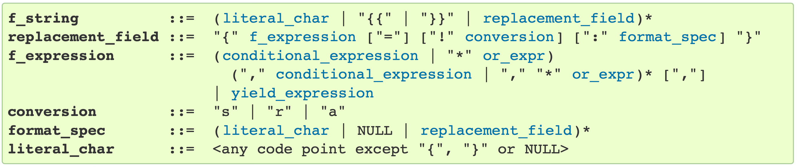
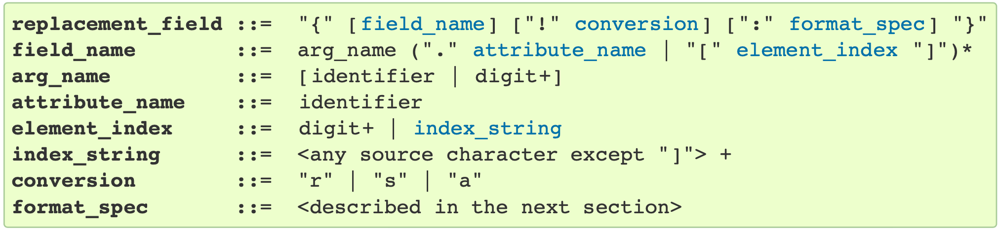
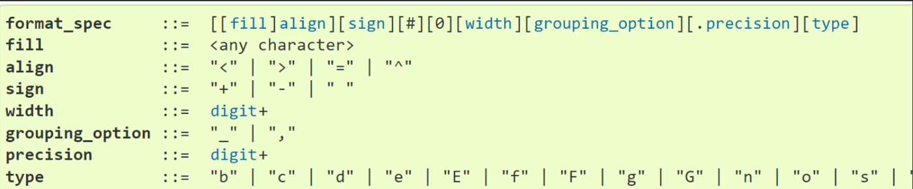

## Introduction  

In this post, we will explore string objects and the formatting syntax. There will be ample use of practical examples. Useful links will be shared.  

The topic progression shall be :  
- We start with string and check all the methods and attributes.
- We then check the [**str.format()**](https://docs.python.org/3/library/stdtypes.html#str.format) method.
- The string on which this method is called can contain literal text or [**replacement fields**](https://docs.python.org/3/library/string.html#format-string-syntax) delimited by braces {}. Each replacement field contains either the numeric index of a positional argument, or the name of a keyword argument.
- [**“Format specifications”**](https://docs.python.org/3/library/string.html#format-specification-mini-language) are used within replacement fields contained within a format string to define
how individual values are presented.  

**Usecase**   


This post can be referred for string formatting in python.

## Python String methods  
- Formatting :  
  <https://pyformat.info/#number>


```python
print(list(dir('abcdef')))
```

    ['__add__', '__class__', '__contains__', '__delattr__', '__dir__', '__doc__', '__eq__', '__format__', '__ge__', '__getattribute__', '__getitem__', '__getnewargs__', '__gt__', '__hash__', '__init__', '__init_subclass__', '__iter__', '__le__', '__len__', '__lt__', '__mod__', '__mul__', '__ne__', '__new__', '__reduce__', '__reduce_ex__', '__repr__', '__rmod__', '__rmul__', '__setattr__', '__sizeof__', '__str__', '__subclasshook__', 'capitalize', 'casefold', 'center', 'count', 'encode', 'endswith', 'expandtabs', 'find', 'format', 'format_map', 'index', 'isalnum', 'isalpha', 'isascii', 'isdecimal', 'isdigit', 'isidentifier', 'islower', 'isnumeric', 'isprintable', 'isspace', 'istitle', 'isupper', 'join', 'ljust', 'lower', 'lstrip', 'maketrans', 'partition', 'replace', 'rfind', 'rindex', 'rjust', 'rpartition', 'rsplit', 'rstrip', 'split', 'splitlines', 'startswith', 'strip', 'swapcase', 'title', 'translate', 'upper', 'zfill']


## Number formatting for string display  

-  Format Specification for mini language  
    <https://docs.python.org/3/library/string.html#formatspec>  
- <https://pyformat.info/#number>
- <https://mkaz.blog/code/python-string-format-cookbook/#f-strings>  
- <https://python-reference.readthedocs.io/en/latest/docs/str/formatting.html>  
- <https://www.w3resource.com/python-exercises/string/python-data-type-string-exercise-37.php>
- <https://stackoverflow.com/questions/3228865/>

## Decoding string content  

The [grammar for the contents of the string](https://docs.python.org/3/reference/lexical_analysis.html#f-strings) is :  

<!---  
-->

<blockquote class = "green">
<div>
<pre><strong id="grammar-token-python-grammar-f_string"><span id="grammar-token-f-string"></span>f_string         </strong> ::=  (<a class="reference internal" href="#grammar-token-python-grammar-literal_char"><code class="xref docutils literal notranslate"><span class="pre">literal_char</span></code></a> | "{{" | "}}" | <a class="reference internal" href="#grammar-token-python-grammar-replacement_field"><code class="xref docutils literal notranslate"><span class="pre">replacement_field</span></code></a>)*
<strong id="grammar-token-python-grammar-replacement_field"><span id="grammar-token-replacement-field"></span>replacement_field</strong> ::=  "{" <a class="reference internal" href="#grammar-token-python-grammar-f_expression"><code class="xref docutils literal notranslate"><span class="pre">f_expression</span></code></a> ["="] ["!" <a class="reference internal" href="#grammar-token-python-grammar-conversion"><code class="xref docutils literal notranslate"><span class="pre">conversion</span></code></a>] [":" <a class="reference internal" href="#grammar-token-python-grammar-format_spec"><code class="xref docutils literal notranslate"><span class="pre">format_spec</span></code></a>] "}"
<strong id="grammar-token-python-grammar-f_expression"><span id="grammar-token-f-expression"></span>f_expression     </strong> ::=  (<a class="reference internal" href="https://docs.python.org/3/reference/expressions.html#grammar-token-python-grammar-conditional_expression"><code class="xref docutils literal notranslate"><span class="pre">conditional_expression</span></code></a> | "*" <a class="reference internal" href="https://docs.python.org/3/reference/expressions.html#grammar-token-python-grammar-or_expr"><code class="xref docutils literal notranslate"><span class="pre">or_expr</span></code></a>)
                         ("," <a class="reference internal" href="https://docs.python.org/3/reference/expressions.html#grammar-token-python-grammar-conditional_expression"><code class="xref docutils literal notranslate"><span class="pre">conditional_expression</span></code></a> | "," "*" <a class="reference internal" href="https://docs.python.org/3/reference/expressions.html#grammar-token-python-grammar-conditional_expression"><code class="xref docutils literal notranslate"><span class="pre">or_expr</span></code></a>)* [","]
                       | <a class="reference internal" href="https://docs.python.org/3/reference/expressions.html#grammar-token-python-grammar-yield_expression"><code class="xref docutils literal notranslate"><span class="pre">yield_expression</span></code></a>
<strong id="grammar-token-python-grammar-conversion"><span id="grammar-token-conversion"></span>conversion       </strong> ::=  "s" | "r" | "a"
<strong id="grammar-token-python-grammar-format_spec"><span id="grammar-token-format-spec"></span>format_spec      </strong> ::=  (<a class="reference internal" href="#grammar-token-python-grammar-literal_char"><code class="xref docutils literal notranslate"><span class="pre">literal_char</span></code></a> | NULL | <a class="reference internal" href="#grammar-token-python-grammar-replacement_field"><code class="xref docutils literal notranslate"><span class="pre">replacement_field</span></code></a>)*
<strong id="grammar-token-python-grammar-literal_char"><span id="grammar-token-literal-char"></span>literal_char     </strong> ::=  &lt;any code point except "{", "}" or NULL&gt;
</pre>
</div></blockquote>


## Replacement field  

The [grammar for a replacement field](https://docs.python.org/3/library/string.html#format-string-syntax) is as follows:

<!---  
<p style="text-align:justify: font-size: 18px;">Blah, blah, blah</p>
-->  


<blockquote class = "green">
<div><pre><strong id="grammar-token-format-string-replacement_field"><span id="grammar-token-replacement-field"></span>replacement_field</strong> ::=  "{" [<a class="reference internal" href="#grammar-token-format-string-field_name"><code class="xref docutils literal notranslate"><span class="pre">field_name</span></code></a>] ["!" <a class="reference internal" href="#grammar-token-format-string-conversion"><code class="xref docutils literal notranslate"><span class="pre">conversion</span></code></a>] [":" <a class="reference internal" href="#grammar-token-format-string-format_spec"><code class="xref docutils literal notranslate"><span class="pre">format_spec</span></code></a>] "}"
<strong id="grammar-token-format-string-field_name"><span id="grammar-token-field-name"></span>field_name       </strong> ::=  arg_name ("." <a class="reference internal" href="#grammar-token-format-string-attribute_name"><code class="xref docutils literal notranslate"><span class="pre">attribute_name</span></code></a> | "[" <a class="reference internal" href="#grammar-token-format-string-element_index"><code class="xref docutils literal notranslate"><span class="pre">element_index</span></code></a> "]")*
<strong id="grammar-token-format-string-arg_name"><span id="grammar-token-arg-name"></span>arg_name         </strong> ::=  [<code class="xref docutils literal notranslate"><span class="pre">identifier</span></code> | <code class="xref docutils literal notranslate"><span class="pre">digit</span></code>+]
<strong id="grammar-token-format-string-attribute_name"><span id="grammar-token-attribute-name"></span>attribute_name   </strong> ::=  <code class="xref docutils literal notranslate"><span class="pre">identifier</span></code>
<strong id="grammar-token-format-string-element_index"><span id="grammar-token-element-index"></span>element_index    </strong> ::=  <code class="xref docutils literal notranslate"><span class="pre">digit</span></code>+ | <a class="reference internal" href="#grammar-token-format-string-index_string"><code class="xref docutils literal notranslate"><span class="pre">index_string</span></code></a>
<strong id="grammar-token-format-string-index_string"><span id="grammar-token-index-string"></span>index_string     </strong> ::=  &lt;any source character except "]"&gt; +
<strong id="grammar-token-format-string-conversion"><span id="grammar-token-conversion"></span>conversion       </strong> ::=  "r" | "s" | "a"
<strong id="grammar-token-format-string-format_spec"><span id="grammar-token-format-spec"></span>format_spec      </strong> ::=  &lt;described in the next section&gt;
</pre>
</div></blockquote>


## Format Specification for mini language   
The general form of a [standard format specifier](https://docs.python.org/3/library/string.html#format-specification-mini-language) is:  


<blockquote class = "green">
<div><pre><strong id="grammar-token-format-spec-format_spec">format_spec    </strong> ::=  [[<a class="reference internal" href="#grammar-token-format-spec-fill"><code class="xref docutils literal notranslate"><span class="pre">fill</span></code></a>]<a class="reference internal" href="#grammar-token-format-spec-align"><code class="xref docutils literal notranslate"><span class="pre">align</span></code></a>][<a class="reference internal" href="#grammar-token-format-spec-sign"><code class="xref docutils literal notranslate"><span class="pre">sign</span></code></a>][#][0][<a class="reference internal" href="#grammar-token-format-spec-width"><code class="xref docutils literal notranslate"><span class="pre">width</span></code></a>][<a class="reference internal" href="#grammar-token-format-spec-grouping_option"><code class="xref docutils literal notranslate"><span class="pre">grouping_option</span></code></a>][.<a class="reference internal" href="#grammar-token-format-spec-precision"><code class="xref docutils literal notranslate"><span class="pre">precision</span></code></a>][<a class="reference internal" href="#grammar-token-format-spec-type"><code class="xref docutils literal notranslate"><span class="pre">type</span></code></a>]
<strong id="grammar-token-format-spec-fill"><span id="grammar-token-fill"></span>fill           </strong> ::=  &lt;any character&gt;
<strong id="grammar-token-format-spec-align"><span id="grammar-token-align"></span>align          </strong> ::=  "&lt;" | "&gt;" | "=" | "^"
<strong id="grammar-token-format-spec-sign"><span id="grammar-token-sign"></span>sign           </strong> ::=  "+" | "-" | " "
<strong id="grammar-token-format-spec-width"><span id="grammar-token-width"></span>width          </strong> ::=  <code class="xref docutils literal notranslate"><span class="pre">digit</span></code>+
<strong id="grammar-token-format-spec-grouping_option"><span id="grammar-token-grouping-option"></span>grouping_option</strong> ::=  "_" | ","
<strong id="grammar-token-format-spec-precision"><span id="grammar-token-precision"></span>precision      </strong> ::=  <code class="xref docutils literal notranslate"><span class="pre">digit</span></code>+
<strong id="grammar-token-format-spec-type"><span id="grammar-token-type"></span>type           </strong> ::=  "b" | "c" | "d" | "e" | "E" | "f" | "F" | "g" | "G" | "n" | "o" | "s" | "x" | "X" | "%"
</pre>
</div></blockquote>

<!---
  
-->


## Examples  

Also check the [link.](https://docs.python.org/3/library/string.html#format-examples)  


```python
'{: 6.2f}'.format(3.141592653589793)
```


    '  3.14'


```python
'{:06.2f}'.format(3.141592653589793)
```


    '003.14'


```python
'{:06.2f}%'.format(3.141592653589793)
```


    '003.14%'


```python
# https://python-reference.readthedocs.io/en/latest/docs/str/formatting.html
# https://www.w3resource.com/python-exercises/string/python-data-type-string-exercise-37.php

print('|{:<6.0f}|'.format(314.0))
print('|{: 6.0f}|'.format(314.0))
print('|{:^6.0f}|'.format(314.0))
```

    |314   |
    |   314|
    | 314  |


```python
print('|{:<6.1f}|'.format(314.23))
print('|{: 6.1f}|'.format(314.23))
print('|{:^6.1f}|'.format(314.23))
```

    |314.2 |
    | 314.2|
    |314.2 |


```python
print('|{:<6.1f}|'.format(314.23))
print('|{:>06.1f}|'.format(314.23))
print('|{:06.1f}|'.format(314.23))
print('|{:^6.1f}|'.format(314.23))
```

    |314.2 |
    |0314.2|
    |0314.2|
    |314.2 |


###  Using variable as Padding width input


```python
width = 20
py, vg = "Python", "Very Good"
print(f"{py:>{width}s} : {vg:>{width}s}")
```

                  Python :            Very Good


```python
# https://stackoverflow.com/questions/3228865/how-do-i-format-a-number-with-a-variable-number-of-digits-in-python
'{num:0{width}}'.format(num=123, width=6)
```


    '000123'


```python
# https://stackoverflow.com/questions/3228865/how-do-i-format-a-number-with-a-variable-number-of-digits-in-python
# Use of f literals
num=123
fill='0'
width=6
f'{num:{fill}{width}}'
```


    '000123'


### Example of left and right alignment


```python
health_data = {'George': {'McDonalds': {'Food': 'burger', 'Healthy':False},
                          'KFC':       {'Food': 'chicken', 'Healthy':False}},
               'John':   {'Wendys':    {'Food': 'burger', 'Healthy':False},
                          'McDonalds': {'Food': 'salad', 'Healthy': True}}}
```


```python
for i in health_data.keys():
    for j in health_data[i].keys():
        for k in health_data[i][j].keys():
            print("{:<10} : {:>10} - {:>10} - {:>10}".format(i, j,k, health_data[i][j][k]))
```

    George     :  McDonalds -       Food -     burger
    George     :  McDonalds -    Healthy -          0
    George     :        KFC -       Food -    chicken
    George     :        KFC -    Healthy -          0
    John       :     Wendys -       Food -     burger
    John       :     Wendys -    Healthy -          0
    John       :  McDonalds -       Food -      salad
    John       :  McDonalds -    Healthy -          1


## Coloured Text output
<https://www.delftstack.com/howto/python/python-bold-text/>


```python
class bold_color:
   PURPLE = '\033[95m'
   CYAN = '\033[96m'
   DARKCYAN = '\033[36m'
   BLUE = '\033[94m'
   GREEN = '\033[92m'
   YELLOW = '\033[93m'
   RED = '\033[91m'
   BOLD = '\033[1m'
   UNDERLINE = '\033[4m'
   END = '\033[0m'

print("The output is:" + bold_color.BOLD + 'Python Programming !' + bold_color.END+"Check")
print("The output is:" + bold_color.PURPLE + 'Python Programming !' + bold_color.END+"Check")
print("The output is:" + bold_color.RED + 'Python Programming !' + bold_color.END+"Check")
print("The output is:" + bold_color.CYAN + 'Python Programming !' + bold_color.END+"Check")
print("The output is:" + bold_color.GREEN + 'Python Programming !' + bold_color.END+"Check")
print("The output is:" + bold_color.GREEN + bold_color.UNDERLINE + 'Python Programming !' + bold_color.END+"Check")

```

    The output is:Python Programming !Check
    The output is:Python Programming !Check
    The output is:Python Programming !Check
    The output is:Python Programming !Check
    The output is:Python Programming !Check
    The output is:Python Programming !Check
