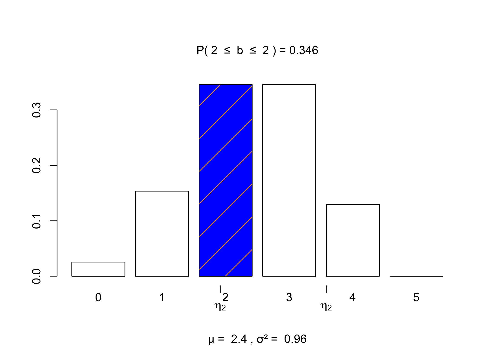
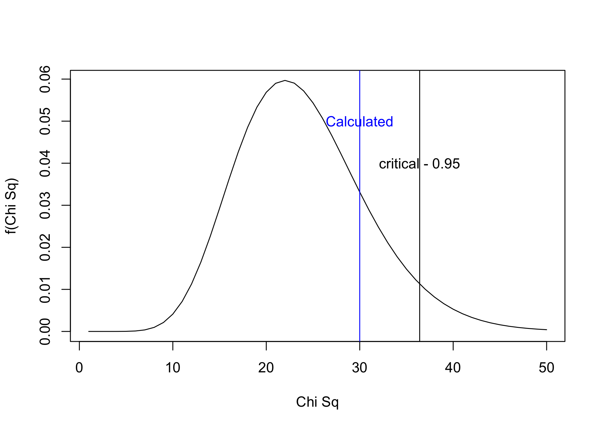
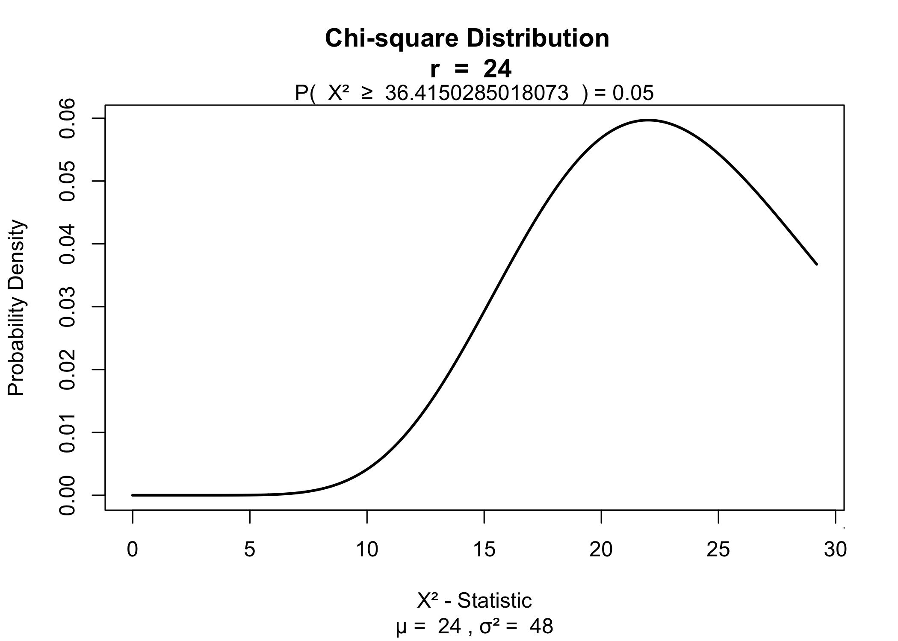

This post is currently under construction.  
<!---
https://stackoverflow.com/questions/32530722/how-can-i-set-the-font-family-font-size-inside-of-a-div
-->
<blockquote class = "green">
<style>
      .my_text
            {
                font-family:    Arial, Helvetica, sans-serif;
                font-size:      16px;
                font-weight:    regular;
            }
        </style>
<div class="my_text">  
title: 'Statistics Using R'  
author: 'Bhaskar'  
date: '12/12/2020'

output:   
&emsp;md_document:  
&emsp;&emsp;variant: markdown_github  
</div>
</blockquote>

<blockquote class = "green">
<style>
      .my_text
            {
                font-family:    Arial, Helvetica, sans-serif;
                font-size:      16px;
                font-weight:    regular;
            }
        </style>
<div class="my_text">  
knitr::opts_chunk$set(echo = TRUE)  
knitr::opts_chunk$set(message = FALSE, warning = FALSE)  
knitr::opts_chunk$set(cache=TRUE)  
knitr::opts_chunk$set(dpi=300,fig.width=7)
</div>
</blockquote>

## Central Limit Theorem

Example taken from 'A First Course in Statistical Inference' by Jonathan Gillard  

<blockquote class = "blue">  
The duration of a pregnancy is known to have mean 266 days and standard
deviation 16 days. In a particular hospital, a random sample of 25
pregnant women was studied. What is the probability that the mean
duration of the pregnancy of these 25 women is less than 270 days?
</blockquote>

``` r
pop_mean = 266
pop_deviation = 16

samplesize = 25
z_value = (270-pop_mean)/(pop_deviation/sqrt(samplesize))
z_value
```

    ## [1] 1.25

``` r
pnorm(q = z_value, lower.tail = TRUE)
```

    ## [1] 0.8943502

``` r
library(visualize)
visualize.norm(stat = 270, mu = 266, sd = 16/5, section = "lower")
```


## Uniform Distribution

``` r
r <- runif(1000)
hist(r)
```


``` r
meanr <- mean(r)
sdr <- sd(r)
```

``` r
cl4 <- mean(sample(r,4))
for (i in 1:1000){
  cl4 <- c(cl4,mean(sample(r,4)))
  }
hist(cl4)
```


``` r
meancl4 <- mean(cl4)
sdcl4 <- sd(cl4)
```

``` r
cl9 <- mean(sample(r,9))
for (i in 1:1000){
  cl9 <- c(cl9,mean(sample(r,9)))
}
hist(cl9)
```


``` r
meancl9 <- mean(cl9)
sdcl9 <- sd(cl9)
```

``` r
cl150 <- mean(sample(r,150))
for (i in 1:1000){
  cl150 <- c(cl150,mean(sample(r,150)))
}
meancl150 <- mean(cl150)
sdcl150 <- sd(cl150)
hist(cl150)
```


``` r
par(mfrow = c(2,2))
hist(r, main = "1 Sample")
mtext(sdr, side = 3)
mtext(meanr, side = 4)

hist(cl4, main = "4 Samples")
mtext(sdcl4, side = 3)
mtext(meancl4, side = 4)

hist(cl9, main = "9 Samples")
mtext(sdcl9, side = 3)
mtext(meancl9, side = 4)

hist(cl150, main = "150 Samples")
mtext(sdcl150, side = 3)
mtext(meancl150, side = 4)
```

  


The Central Limit Theorem states that the distribution of the sample
mean will tend toward a Normal distribution as the sample size gets
larger. In other words, the Normal approximation to the histogram will
get better as the number of the rolls of the die increases.  

Roughly, the **central limit theorem** says that under random sampling,
as the sample size gets large, the sampling distribution of the sample
mean approaches a normal distribution with mean μ and variance σ2/n. Put
another way, if the sample size is sufficiently large, we can assume
that the sample mean has a normal distribution. This means that with a
‘sufficiently large’ sample size, it can be assumed that

Z = $\frac{X-\mu}{\frac{σ}{\sqrt{n}}}$ has a standard normal
distribution.

We will consider an example to illustrate the Central Limit Theorem.
Suppose we roll a twice dice 10000 times and plot a histogram of the
average score of the five, ten and twenty rolls.

``` r
RollTwo <- c()
RollFive <- c()
RollTen <- c()
RollTwenty <- c()
for (i in 1:10000){
  RollTwo[i] = mean(sample(1:6,2,replace = TRUE))
  RollFive[i] = mean(sample(1:6, 5, replace = TRUE))
  RollTen[i] = mean(sample(1:6, 10, replace = TRUE))
  RollTwenty[i] = mean(sample(1:6, 20, replace = TRUE))
}
par(mfrow=c(1,4))
hist(RollTwo, col ="green",main="Rolls = 2",
                     prob=TRUE, ylim=c(0,1), xlab="Outcome")
curve(dnorm(x, mean(RollTwo), sd(RollTwo)), col="blue",
                     lwd=2, add=TRUE)
hist(RollFive, col ="green",main="Rolls = 5",
                     prob=TRUE, ylim=c(0,1), xlab="Outcome")
curve(dnorm(x, mean(RollFive), sd(RollFive)), col="blue",
                     lwd=2, add=TRUE)
hist(RollTen, col ="light blue", main="Rolls = 10",
                     prob=TRUE, ylim=c(0,1),  xlab="Outcome")
curve(dnorm(x, mean(RollTen), sd(RollTen)), col="blue",
                     lwd=2, add=TRUE)
hist(RollTwenty, col ="orange",main="Rolls = 20",
                     prob=TRUE, ylim=c(0,1), xlab="Outcome")
curve(dnorm(x, mean(RollTwenty), sd(RollTwenty)), col="blue",
                     lwd=2, add=TRUE)
```


## Using rnorm for creating random probability distribution

``` r
rnorm(10)
```

    ##  [1]  0.68523596  0.02200587 -1.12434780  0.05573605 -1.66448009 -0.81237416
    ##  [7]  0.59086114 -0.01979490 -1.69191722 -1.51137180

``` r
pnorm(-1.96)  
```

    ## [1] 0.0249979

``` r
qnorm(0.05)  
```

    ## [1] -1.644854

``` r
dnorm(0)
```

    ## [1] 0.3989423

## Using base package to display a normal distribution

``` r
zvalue <- seq(-4,4,by = .1)
plot(zvalue, dnorm(zvalue), type = "l")
```


``` r
#install.packages("visualize")
```

## Using visualize package for displaying Normal probability distribution

``` r
library(visualize)
visualize.norm(-2)
```


``` r
visualize.norm(-2, section = "upper")
```


``` r
visualize.norm(c(-3,1), section = "bounded")
```


``` r
visualize.norm(c(-3,1), mu = 75, sd = 1, section = "tails")
```

  


Example  
<blockquote class = "blue">
The weights of sacks of potatoes are Normally distributed with
mean 25 kg and standard deviation 1 kg. Find  
(i) the probability that the mean weight of a random sample of four
sacks is greater than 26 kg;  
(ii) the sample size n necessary for the sample mean to be within 0.25
kg of the true mean 25 kg at least 95% of the time.
</blockquote>

``` r
visualize.norm(26,25,sd = 1)
```


## Discrete Probability Distributions

– Binomial Distributions  
– Poissons Distribution

## Binomial Distributions

The general naming structure of the relevant R functions is:  
• dname calculates density (pdf) at input x.  
• pname calculates distribution (cdf) at input x.  
• qname calculates the quantile at an input probability.  
• rname generates a random draw from a particular distribution.  
name represents the name of the given distribution amongst  
{Applied Statistics with R - Stat420/ Chapter 5/ Probability and
Statistics in R}

<http://www1.maths.leeds.ac.uk/LaTeX/TableHelp1.pdf>  
Mean of Binomial Probability Distribution = np  
Variance of BPD = npq

#Applied Statistics with R  
Two parameters for Binomial distribution :  
– p = probability of success in each trial  
– n = no. of fixed trials

Using rbinom for random number generation following a binomial
distribution

``` r
rbinom(10, 1, 0.5)
```

    ##  [1] 0 0 0 1 1 0 1 1 1 0

``` r
pbinom(5,size = 10,prob = 0.5 )-pbinom(4,10,0.5)
```

    ## [1] 0.2460937

``` r
# Use dbinom to find the probability for a particular number of succeses
dbinom(5,10,0.5)
```

    ## [1] 0.2460938

``` r
qbinom(0.5, 10, 0.5)
```

    ## [1] 5

``` r
xvalue <- seq(0,10, by =1) #creating a vector
n <- c(0:10)
dbinom(n,10,0.5)
```

    ##  [1] 0.0009765625 0.0097656250 0.0439453125 0.1171875000 0.2050781250
    ##  [6] 0.2460937500 0.2050781250 0.1171875000 0.0439453125 0.0097656250
    ## [11] 0.0009765625

``` r
barplot(dbinom(n,10,0.5)) #barchart for charting probability of each number of successes
```


``` r
library(visualize) # for visualizing in pleasing way
visualize.binom(stat = 5, size = 10, prob = 0.5)
```


``` r
visualize.binom(stat = 5, size = 10, prob = 0.5, section = "upper", strict = TRUE)
```


``` r
visualize.binom(stat = 5, size = 10, prob = 0.5, section = "lower", strict = TRUE)
```


``` r
visualize.binom(stat = 5, size = 10, prob = 0.5, section = "upper", strict = TRUE)
```


``` r
visualize.binom(stat = c(5,6), size = 10, prob = 0.5, section = "bounded", strict = c(FALSE,TRUE))
```


Exercise 5.4. Jaggia and Kelly. Page no.172  

<blockquote class = "blue">
Q42. The percentage of Americans who have confidence in U.S. banks
dropped to 23% in June 2010, which is far below the pre-recession level
of 41% reported in June 2007 (gallup.com).  
a. What is the probability that fewer than half of 10 Americans in 2010
have confidence in U.S. banks?  
b. What would have been the corresponding probability in 2007?
</blockquote>

``` r
#Year 2010
# p = 23%
# n = 10
# x = 5
visualize.binom(stat = 5,size = 10,prob = .23, section = "lower", strict = 1 )
```


``` r
pbinom(q = 5,10,.23)-dbinom(5,10,.23)
```

    ## [1] 0.9430804

Probability that fewer than half of 10 Americans in 2010 have confidence
in U.S. banks is 94.31%.

``` r
#Year 2007
# p = 41%
# n = 10
# x = 5
visualize.binom(stat = 5,size = 10,prob = .41, section = "lower", strict = 1)
```


``` r
pbinom(q = 5,10,.41)-dbinom(5,10,.41)
```

    ## [1] 0.6078272

Probability that fewer than half of 10 Americans in 2007 have confidence
in U.S. banks would have been 61%.

Exercise 5.4/Jaggia and Kelly  

<blockquote class = "blue">
47. Sixty percent of a firm’s employees are men. Suppose four of the
firm’s employees are randomly selected.  
a. What is more likely, finding three men and one woman or two men and
two women?  
b. Do you obtain the same answer as in part a if 70% of the firm’s
employees had been men?
</blockquote>  

``` r
#Part a
#Defining the Outcomes :
#Men = Success
#Women = Failure
#Probability of success = 60%
#No. of trials = 4

library(visualize)
#Probability of Three men and one woman
visualize.binom(stat = c(3,3),size = 4,prob = .6,section = "bounded")
```

    ## Supplied strict length < 2, setting inequalities to  equal to  inequality.


``` r
print(paste("Probability of Three men and one woman:", dbinom(3,4,0.6)))
```

    ## [1] "Probability of Three men and one woman: 0.3456"

``` r
#Probability of Three men and one woman
visualize.binom(stat = c(2,2),size = 4,prob = .6,section = "bounded")
```

    ## Supplied strict length < 2, setting inequalities to  equal to  inequality.



``` r
print(paste("Probability of Two men and Two women:", dbinom(2,4,0.6)))
```

    ## [1] "Probability of Two men and Two women: 0.3456"

``` r
#Part b
#Defining the Outcomes :
#Men = Success
#Women = Failure
#Probability of success = 70%
#No. of trials = 4

library(visualize)
#Probability of Three men and one woman
visualize.binom(stat = c(3,3),size = 4,prob = .7,section = "bounded")
```

    ## Supplied strict length < 2, setting inequalities to  equal to  inequality.


``` r
print(paste("Probability of Three men and one woman:", dbinom(3,4,0.7)))
```

    ## [1] "Probability of Three men and one woman: 0.4116"

``` r
#Probability of Three men and one woman
visualize.binom(stat = c(2,2),size = 4,prob = .7,section = "bounded")
```

    ## Supplied strict length < 2, setting inequalities to  equal to  inequality.


``` r
print(paste("Probability of Two men and Two women:", dbinom(2,4,0.7)))
```

    ## [1] "Probability of Two men and Two women: 0.2646"  


<blockquote class = "blue">
When 70% of firm employees are men, the probability of three men in a
random selection of four is higher than the probability of two men in
the random selection of four.

1.  The principal of an architecture firm tells her client that there is
    at least a 50% chance of having an acceptable design by the end of
    the week. She knows that there is only a 25% chance that any one
    designer would be able to do so by the end of the week.  

<!-- -->

1.  Would she be correct in her statement to the client if she asks two
    of her designers to work on the design, independently?

</blockquote>  

``` r
visualize.binom(c(1,1), size = 2, prob = .50, section = "bounded")
```

    ## Supplied strict length < 2, setting inequalities to  equal to  inequality.


``` r
#The principal would be correct in stating 50% chance of having acceptable design by end of week.
```

## Poisson Distribution

– Outcomes are Success or Failure  
– Average number of successes (mu) in the specific region(time or
location) are known.  
– Outcomes are random. Occurrence of one outcome does not affect the
outcome of other  
– Outcomes are rare compared to possible outcomes  
– P(x, mu)

– Mean = lambda  
– Variance = lambda

``` r
rpois(100,3.6)
```

    ##   [1]  5  1  1  7  1  2  5  3  5  5  2  2  3  4  2  6  5  3  3  2  2  3  2  4  3
    ##  [26]  7  2  5  5  3  5  2  3  1  2  1  6  4  3  3  5  5  2  4  3  4  0  4  7  7
    ##  [51]  2  4  2  6  4  1  4  3  6  3  6  3  3  2  0  4  4  3  2  4  4  4  3  2  3
    ##  [76]  6  3  2  1  5  2  4  2  2  1  4  5  4  4  4 11  5  6  2  8  3  6  5  1  3

``` r
qpois(p = 0.5,lambda = 3.6)
```

    ## [1] 3

``` r
# returns probability of particular value of random variable x (x number of successes)
dpois(x = 4, lambda = 3.6)
```

    ## [1] 0.1912223

``` r
#The distribution (cdf) at a particular value.
ppois(3,lambda = 3.6)
```

    ## [1] 0.5152161

### Creating barplot of Poisson Distribution using base R functions

``` r
n <- c(1:20)
barplot(dpois(n,lambda = 3.6))
```


### Using Visualize for Poisson Distribution  

<blockquote class = "blue">
we have a booking counter and on the average, we get 3.6 people coming
every 10 minutes on the weekend. What is the probability of getting
seven people in 10 minutes ?  

</blockquote>

``` r
visualize.pois(5, lambda = 3.6, section = "lower")
```


``` r
visualize.pois(7, lambda = 3.6, section = "upper")
```


``` r
visualize.pois(c(7,8), lambda = 3.6, section = "bounded", strict = c(0,1))
```


``` r
visualize.pois(c(7,7), lambda = 3.6, section = "bounded")
```

    ## Supplied strict length < 2, setting inequalities to  equal to  inequality.


### A First Course in Statistical Inference – By Jonathan Gillard

The Poisson distribution is very similar to the binomial distribution.
We are examining the number of times an event happens. The difference is
subtle. Whereas the binomial distribution looks at how many times we
register a success over a fixed total number of trials, the Poisson
distribution measures how many times a discrete event occurs, over a
period of continuous space or time. There is no “total” value n, and the
Poisson distribution is defined by a single parameter.

The following questions can be answered with the Poisson distribution:  
• How many pennies will I encounter on my walk home?  
• How many children will be delivered at the hospital today?  
• How many products will I sell after airing a new television
commercial?  
• How many mosquito bites did you get today after having sprayed with
insecticide?  
• How many defects will there be per 100 m of rope sold?

Instead of having a parameter p that represents a component probability
as in the binomial distribution, this time we have the parameter
“lambda” or 􏰄 which represents the “average or expected” number of
events to happen within our experiment.

### An Introduction to Statistics with Python : With Applications in the Life Sciences

``` r
visualize.pois(2, lambda = 1,section = "upper")
```


<blockquote class = "blue">
Q47.A textile manufacturing process finds that on average, two flaws
occur per every 50 yards of material produced.  
a. What is the probability of exactly two flaws in a 50-yard piece of
material?  
b. What is the probability of no more than two flaws in a 50-yard piece
of material?  
c. What is the probability of no flaws in a 25-yard pieceof material?

lambda for 50 yard material = 2  
– Probability of exactly 2 flaws  
– Probability of no more than two flaws  
– Probability of no flaws  
</blockquote>

``` r
#Probability of exactly 2 flaws
dpois(2,1)
```

    ## [1] 0.1839397

``` r
visualize.pois(c(2,2),lambda = 2, section = "bounded")
```

    ## Supplied strict length < 2, setting inequalities to  equal to  inequality.


Probability of exactly 2 flaws = 27.1 %

``` r
#Probability of no more than two flaws
ppois(2,lambda = 2)
```

    ## [1] 0.6766764

``` r
visualize.pois(2,2,section = "lower")
```


Probability of no more than two flaws = 67.66%

[linked
phrase](https://stats.libretexts.org/Bookshelves/Introductory_Statistics/Book%3A_Introductory_Statistics_(OpenStax)/04%3A_Discrete_Random_Variables/4.07%3A_Poisson_Distribution)

1.  

``` r
# Time interval/length of interest is 25 yards.
# Mean number of flaws in 25 yards = 2*25/50 = 1
# Probability of no flaws in 25 yard material :
dpois(0,1)
```

    ## [1] 0.3678794

``` r
visualize.pois(c(0,0),1,section = "bounded")
```

    ## Supplied strict length < 2, setting inequalities to  equal to  inequality.

  


[Solved Examples link](https://shiny.rit.albany.edu/stat/betaprob/)

Exercise 5.5/Jaggia and Kelly  

<blockquote class = "blue">
64. On average, 400 people a year are struck by lightning
in the United States (The Boston Globe, July 21, 2008).  
a. What is the probability that at most 425 people are struck by
lightning in a year?  
b. What is the probability that at least 375 people are struck by
lightning in a year?  
</blockquote>

``` r
#lambda = 400
#TIme interval of interest = 1 year

#Probability of

visualize.pois(425,400, section = "lower")
```


``` r
visualize.pois(375, 400, section = "upper")
```


``` r
visualize.pois(100, 400, section = "lower")
```


``` r
visualize.pois(35,50)
```


``` r
dnorm(x = -2, mean =0, sd =1 )
```

    ## [1] 0.05399097

``` r
visualize.norm(-1.96)
```


``` r
filepath <- "/Users/bhaskarroy/BHASKAR FILES/BHASKAR CAREER/Courses/UDEMY Course"  \
"/Statistics Using R/Perfume+Volumes.csv"


library(readr)
Perfume_Volumes <- read.csv(filepath)  
head(Perfume_Volumes, 10)
```

    ##     Machine.1
    ## 1         148
    ## 2         148
    ## 3         149
    ## 4         154
    ## 5         156
    ## 6         155
    ## 7         151
    ## 8         154
    ## 9         152
    ## 10        156
    ## 100       152

``` r
#View(Perfume_Volumes)
mean(Perfume_Volumes$Machine.1)
```

    ## [1] 152

``` r
dim(Perfume_Volumes)
```

    ## [1] 100   1

Key terms : variable, population, sample, population parameter, random
sample, sample values, and statistic.

A variable is a rule that associates a value with each member of the
population. A population is the collection of all values of the variable
under study.  
A sample is any sub collection of the population. A population parameter
is some (often unknown) numerical measure associated with the population
as a whole.

Let X denote a random variable. A random sample from X is a set of
independent random variables
*X*<sub>1</sub>, *X*<sub>2</sub>, ..., *X*<sub>*n*</sub>, each with the
same distribution as X. An alternative statement of this is to say
*X*<sub>1</sub>, *X*<sub>2</sub>, ..., *X*<sub>*n*</sub> are i.i.d.
(independent and identically distributed) random variables from (the
distribution of) X.

The values taken by
*X*<sub>1</sub>, *X*<sub>2</sub>, ..., *X*<sub>*n*</sub> in an observed
sample are denoted by
*x*<sub>1</sub>, *x*<sub>2</sub>, ..., *x*<sub>*n*</sub> and are called
the sample values.

population standard deviation  
sample standard deviation (formula n vs n-1)

standard error of estimate  
sample statistics Sampling distribution

parametric and non parametric methods Bootstrap sampling

p-value significance level

## Type I Error

## Type II Error

## Inferential Statistics : Hypothesis Testing

{Hypothesis Testing - AN INTUITIVE GUIDE FOR MAKING DATA DRIVEN
DECISIONS}

Inferential statistics takes data from a sample and makes inferences
about the larger population from which the sample was drawn.
Consequently, we need to have confidence that our sample accurately
reflects the population. This requirement affects our process. At a
broad level, we must do the following:  
1. Define the population we are studying.  
2. Draw a representative sample from that population.  
3. Use analyses that incorporate the sampling error.

A statistic is a characteristic of a sample. If you collect a sample and
calculate the mean and standard deviation, these are **sample
statistics**.

**Inferential statistics** allow you to use sample statistics (mean and
standard deviation of collected sample) to make **conclusions about a
population**.

A hypothesis test is a statistical procedure that allows you to use a
sample to draw conclusions about an entire population. More
specifically, a hypothesis test evaluates two mutually exclusive
statements about the population and determines which statement the
sample data support. These two statements are the hypotheses that the
procedure tests. Statisticians call these theories the null hypothesis
and the alternative hypothesis.

When you can **reject the null hypothesis**, the results are
**statistically significant**, and your data support the theory that an
**effect exists** at the **population level**.

Null Hypothesis In hypothesis testing, the null hypothesis is one of two
mutually ex- clusive theories about the population’s properties.
Typically, the null hypothesis states there is no effect (i.e., the
effect size equals zero). *H*<sub>0</sub> often signifies the null.

## p Values

> Key Point: How probable are your sample data if the null hypothesis is
> correct? That’s the only question that p-values answer.

### P-values Are NOT an Error Rate

First, p-value calculations assume that the null hypothesis is correct.
Thus, from the p-value’s point of view, the null hypothesis is 100%
true. Remember, p-values assume that the null is true, and sampling
error caused the observed sample effect.

Second, p-values tell you how consistent your sample data are with a
true null hypothesis. However, when your data are very inconsistent with
the null hypothesis, p-values can’t determine which of the fol- lowing
two possibilities is more probable:  
• The null hypothesis is true, but your sample is unusual due to random
sampling error.  
• The null hypothesis is false.

## Effect

The effect is the difference between the population value and the null
hypothesis value. The effect is also known as population effect or the
difference. For example, the mean difference between the health outcome
for a treatment group and a control group is the effect.

In statistics, the significance level is the evidentiary standard. For
researchers to successfully make the case that the effect exists in the
population, the sample must contain sufficient evidence.

In court cases, you have evidentiary standards because you don’t want to
convict innocent people.

In hypothesis tests, we have the significance level because we don’t
want to claim that an effect or relationship exists when it does not
exist.

Example 9.7/Jaggia & Kelly

<blockquote class = "blue">
A research analyst disputes a trade group’s prediction that
back-to-school spending will average $606.40 per family this year. She
believes that average back-to-school spending will significantly differ
from this amount. She decides to conduct a test on the basis of a random
sample of 30 households with school-age children. She calculates the
sample mean as $622.85. She also believes that back-to-school spending
is normally distributed with a population standard deviation of $65. She
wants to conduct the test at the 5% significance level.  
a. Specify the competing hypotheses in order to test the research
analyst’s claim.  
b. In this hypothesis test, what is the allowed probability of a Type I
error?  
c. Calculate the value of the test statistic and the p-value.  
d. At the 5% significance level, does average back-to-school spending
differ from $606.40?  
</blockquote>

### One Sample z Test using R

``` r
#Population standard deviation is known, so we will do z test.
sigma = 65
samplemean = 622.85
samplesize = 30
mu = 606.4
alpha = 0.05
# Alternate Hypothesis : mu is not equal to 606.4

library(BSDA)
zsum.test(mean.x = 622.85, n.x = 30, sigma.x = 65, mu = 606.4, conf.level = 0.95, alternative = "two.sided")
```

    ##
    ##  One-sample z-Test
    ##
    ## data:  Summarized x
    ## z = 1.3862, p-value = 0.1657
    ## alternative hypothesis: true mean is not equal to 606.4
    ## 95 percent confidence interval:
    ##  599.5905 646.1095
    ## sample estimates:
    ## mean of x
    ##    622.85

Since, the p-value of 16.57% is greater than the significance level
alpha of 5%, we shall fail to reject the null.

Alternately, the summarized z test returns the confidence interval as an
alternative method for conducting the two-tailed test.

We use n = 30, x\_ = 622.85, and σ = 65, along with α = 0.05, to
determine the 95% confidence interval of \[599.59, 646.11\]. Since the
hypothesized value of the population mean mu_0 = 606.40 falls within the
95% confidence interval, we do not reject H0. Thus, we arrive at the
same conclusion as with the p-value and the critical value approaches;
that is, the sample data do not support the research analyst’s claim
that average back-to-school spending differs from $606.40 per family
this year. {Page No. 316, Jaggia & Kelly}

``` r
library(visualize)
visualize.norm(stat = samplemean, mu = mu,section = "upper",sd = sigma/(sqrt(samplesize)))
```

  

The p value will be \~16% i.e. twice of the blue shaded area. This is
greater than the significance level of 5%. Hence, we shall fail to
reject the null.

### One Sample z Test using BSDA package

## Students T Distribution and T test

EXAMPLE 9.11  
<blockquote class = "blue">
In the introductory case to this chapter, the dean at a large university
in California wonders if students at her university study less than the
1961 national average of 24 hours per week. She randomly selects 35
students and asks their average study time per week (in hours). From
their responses (see Table 9.1), she calculates a sample mean of 16.37
hours and a sample standard deviation of 7.22 hours.  
a. Specify the competing hypotheses to test the dean’s concern.  
b. At the 5% significance level, specify the critical value.  
</blockquote>

``` r
mu = 14
n = 35
xmean = 16.37
s = 7.22
tcal <- (xmean-mu)/(s/n^(0.5))
tcal
```

    ## [1] 1.941982

``` r
q <- seq(-4,4,0.1)
dt(q,19)
```

    ##  [1] 0.0008750923 0.0010995211 0.0013806119 0.0017321484 0.0021710339
    ##  [6] 0.0027179038 0.0033978234 0.0042410672 0.0052839734 0.0065698541
    ## [11] 0.0081499321 0.0100842580 0.0124425441 0.0153048276 0.0187618525
    ## [16] 0.0229150326 0.0278758360 0.0337644093 0.0407072527 0.0488337603
    ## [21] 0.0582714659 0.0691398894 0.0815429605 0.0955601204 0.1112363522
    ## [26] 0.1285715738 0.1475100196 0.1679304289 0.1896380099 0.2123592431
    ## [31] 0.2357405797 0.2593519683 0.2826958736 0.3052220554 0.3263478637
    ## [36] 0.3454832253 0.3620589240 0.3755562725 0.3855359344 0.3916635312
    ## [41] 0.3937298073 0.3916635312 0.3855359344 0.3755562725 0.3620589240
    ## [46] 0.3454832253 0.3263478637 0.3052220554 0.2826958736 0.2593519683
    ## [51] 0.2357405797 0.2123592431 0.1896380099 0.1679304289 0.1475100196
    ## [56] 0.1285715738 0.1112363522 0.0955601204 0.0815429605 0.0691398894
    ## [61] 0.0582714659 0.0488337603 0.0407072527 0.0337644093 0.0278758360
    ## [66] 0.0229150326 0.0187618525 0.0153048276 0.0124425441 0.0100842580
    ## [71] 0.0081499321 0.0065698541 0.0052839734 0.0042410672 0.0033978234
    ## [76] 0.0027179038 0.0021710339 0.0017321484 0.0013806119 0.0010995211
    ## [81] 0.0008750923

``` r
plot(q,dt(q,19), type = "l", lty = "solid", xlab ="t", ylab ="f(t)")
lines(q,dt(q,9), type = "l", lty = "dashed")
lines(q,dt(q,4), type = "l", lty = "dotted")
```


``` r
vol <- c(151,153,152,152)
t.test(vol,mu = 150,conf.level = 0.95)
```

    ##
    ##  One Sample t-test
    ##
    ## data:  vol
    ## t = 4.899, df = 3, p-value = 0.01628
    ## alternative hypothesis: true mean is not equal to 150
    ## 95 percent confidence interval:
    ##  150.7008 153.2992
    ## sample estimates:
    ## mean of x
    ##       152

``` r
visualize.t(c(4.899,-4.899),df = 3, section = "tails")
```


``` r
#pvalue for tow tailed test
#pvalue for left tailed test
#pvalue for right tailed test
```

## Statistical Inference Concerning Variance

### One Sample Variance test Using EnvStats Package  
install.packages(“EnvStats”)

``` r
library(readr)
filepath <- paste0("/Users/bhaskarroy/BHASKAR FILES/BHASKAR CAREER/Courses/UDEMY Course/Statistics Using R/Datasets/VolumeVar.csv")

Volumevar <- read.csv(filepath)
```

``` r
var(Volumevar$Volumes)
```

    ## [1] 5

``` r
library(EnvStats)
varTest(x = Volumevar$Volumes, alternative = "greater", sigma.squared = 4)
```

    ##
    ##  Chi-Squared Test on Variance
    ##
    ## data:  Volumevar$Volumes
    ## Chi-Squared = 30, df = 24, p-value = 0.1848
    ## alternative hypothesis: true variance is greater than 4
    ## 95 percent confidence interval:
    ##  3.295343      Inf
    ## sample estimates:
    ## variance
    ##        5

### Using basic R functions - rchisq, pchisq, qchisq, dchisq for Chi-Square test

``` r
sample_size = NROW(Volumevar$Volumes) #Use NROW, NCOL for vectors
Sample_Variance = var(Volumevar$Volumes)
Pop_Var = 4
calc = Sample_Variance/(Pop_Var/(sample_size - 1)) #chi_square_calculated
calc
```

    ## [1] 30

``` r
# Use qchisq to find the critical value for 0.05 propability on right tail(95% confidence interval)

crit <- qchisq(p = 0.05, df = (sample_size-1), lower.tail = F )
crit
```

    ## [1] 36.41503

``` r
# Plotting Chisquare distribution using dchisq for given df

x<- seq(1,50, by =1)
y <- dchisq(x,df = 24)
plot(y,type = "l", xlab = "Chi Sq", ylab = "f(Chi Sq)")
abline(v = calc, col = "blue")
text(calc, 0.05, "Calculated", col = "blue")

abline(v = crit)
text(crit, 0.04, "critical - 0.95")
```



``` r
# Use qchisq to find the critical value for 0.05 propability on right tail(95% confidence interval)
library(visualize)
crit <- qchisq(p = 0.05, df = (sample_size-1), lower.tail = F )
crit
```

    ## [1] 36.41503

``` r
visualize.chisq(30, df = sample_size -1, section = "upper")
```


``` r
visualize.chisq(crit, df = sample_size -1, section = "upper")
```



## Two sample z test

From the Datacamp course : Correlation and Regression in R

``` r
head(anscombe)
```

    ##   x1 x2 x3 x4   y1   y2    y3   y4
    ## 1 10 10 10  8 8.04 9.14  7.46 6.58
    ## 2  8  8  8  8 6.95 8.14  6.77 5.76
    ## 3 13 13 13  8 7.58 8.74 12.74 7.71
    ## 4  9  9  9  8 8.81 8.77  7.11 8.84
    ## 5 11 11 11  8 8.33 9.26  7.81 8.47
    ## 6 14 14 14  8 9.96 8.10  8.84 7.04

``` r
str(anscombe)
```

    ## 'data.frame':    11 obs. of  8 variables:
    ##  $ x1: num  10 8 13 9 11 14 6 4 12 7 ...
    ##  $ x2: num  10 8 13 9 11 14 6 4 12 7 ...
    ##  $ x3: num  10 8 13 9 11 14 6 4 12 7 ...
    ##  $ x4: num  8 8 8 8 8 8 8 19 8 8 ...
    ##  $ y1: num  8.04 6.95 7.58 8.81 8.33 ...
    ##  $ y2: num  9.14 8.14 8.74 8.77 9.26 8.1 6.13 3.1 9.13 7.26 ...
    ##  $ y3: num  7.46 6.77 12.74 7.11 7.81 ...
    ##  $ y4: num  6.58 5.76 7.71 8.84 8.47 7.04 5.25 12.5 5.56 7.91 ...

``` r
tibble::glimpse(anscombe)
```

    ## Rows: 11
    ## Columns: 8
    ## $ x1 <dbl> 10, 8, 13, 9, 11, 14, 6, 4, 12, 7, 5
    ## $ x2 <dbl> 10, 8, 13, 9, 11, 14, 6, 4, 12, 7, 5
    ## $ x3 <dbl> 10, 8, 13, 9, 11, 14, 6, 4, 12, 7, 5
    ## $ x4 <dbl> 8, 8, 8, 8, 8, 8, 8, 19, 8, 8, 8
    ## $ y1 <dbl> 8.04, 6.95, 7.58, 8.81, 8.33, 9.96, 7.24, 4.26, 10.84, 4.82, 5.68
    ## $ y2 <dbl> 9.14, 8.14, 8.74, 8.77, 9.26, 8.10, 6.13, 3.10, 9.13, 7.26, 4.74
    ## $ y3 <dbl> 7.46, 6.77, 12.74, 7.11, 7.81, 8.84, 6.08, 5.39, 8.15, 6.42, 5.73
    ## $ y4 <dbl> 6.58, 5.76, 7.71, 8.84, 8.47, 7.04, 5.25, 12.50, 5.56, 7.91, 6.89

``` r
library(ggplot2)
p1 <- ggplot(anscombe, aes(x1,y1))+geom_point()+ ylim(c(4,13))  
p2 <- ggplot(anscombe, aes(x2,y2))+geom_point()+ ylim(c(4,13))
p3 <- ggplot(anscombe, aes(x3,y3))+geom_point()+ ylim(c(4,13))
p4 <- ggplot(anscombe, aes(x4,y4))+geom_point()+ ylim(c(4,13))

library(patchwork)
p1+p2+p3+p4
```


## Comparing the Means of Two Independent Samples

{Introduction to Statistics and Data Analysis by Christian Heumann, Page
no. 221}

In a two-sample problem, we may be interested in comparing the means of
two independent samples. Assume that we have two samples of two normally
distributed variables X ∼
N(*μ*<sub>*X*</sub>, *σ*<sub>*X*</sub><sup>2</sup>) and Y ∼
N(*μ*<sub>*Y*</sub>, *σ*<sub>*Y*</sub><sup>2</sup>) of size
*n*<sub>1</sub> and *n*<sub>2</sub>,
i.e. *X*<sub>1</sub>, *X*<sub>2</sub>, ..., *X*<sub>*n*<sub>1</sub></sub>
are i.i.d.with the same distribution as X and
*Y*<sub>1</sub>, *Y*<sub>2</sub>, ..., *Y*<sub>*n*<sub>2</sub></sub> are
i.i.d. with the same distribution as Y.

We can specify the following hypotheses:

We distinguish another three cases:  
1. *σ*<sub>*X*</sub><sup>2</sup> and *σ*<sub>*Y*</sub><sup>2</sup> are
known.  
2. *σ*<sub>*X*</sub> and *σ*<sub>*Y*</sub> are unknown, but they are
assumed to be equal, i.e. *σ*<sub>*X*</sub> = *σ*<sub>*Y*</sub>.  
3. Both *σ*<sub>*X*</sub><sup>2</sup> and *σ*<sub>*Y*</sub><sup>2</sup>
are unknown and unequal
(*σ*<sub>*X*</sub><sup>2</sup> ≠ *σ*<sub>*Y*</sub><sup>2</sup> ).

Independent random samples are samples that are completely unrelated to
one another.

> Two (or more) random samples are considered independent if the process
> that generates one sample is completely separate from the process that
> generates the other sample. The samples are clearly delineated.

We generally assume that the two sample means are derived from two
independent, normally distributed populations because a linear
combination of normally distributed random variables is also normally
distributed. If the underlying populations cannot be assumed to be
normal, then by the central limit theorem, the sampling distribution of
*X*<sub>1</sub>–*X*<sub>2</sub> is approximately normal only if both
sample sizes are sufficiently large; that is, *n*<sub>1</sub> ≥ 30 and
*n*<sub>2</sub> ≥ 30.

Case 1: The variances are known (two-sample Gauss test).  
If the null hypothesis
*H*<sub>0</sub> : *μ*<sub>*X*</sub> = *μ*<sub>*Y*</sub> is true,
then,using the usual rules for the normal distribution and the
independence of the samples,  
$$\overline{X} \sim N\left(\mu_X,\frac{\sigma^2_X}{n_1}\right)$$

$$\overline{Y} \sim N\left(\mu_Y,\frac{\sigma^2_Y}{n_2}\right)$$
and  
$$\left(\overline{X}-\overline{Y}\right) \sim N\left(\mu_X-\mu_Y, \frac{\sigma^2_X}{n_1} + \frac{\sigma^2_X}{n_1}\right)$$
It follows the test statistic  
$$T(X,Y) = \frac{\overline{X}-\overline{Y}}{\sqrt{\frac{\sigma^2_X}{n_1} + \frac{\sigma^2_X}{n_1}}}$$

-   Use t.test from stats package.  
-   Alternately, Use t_test from infer package. Pass the applicable
    values to the arguments
    *v**a**r*.*e**q**u**a**l*, *p**a**i**r**e**d*, *c**o**n**f*.*l**e**v**e**l*
    depending in the particular scenario.

Please note that infer package uses action verbs to perform statistical
inference using sampling, confidence intervals and hypothesis tests.

install.packages(“htmlTable”)

### Two Sample t test for comparison of means when population Variances are unknown and cannot be assumed equal

``` r
filepath <- "/Users/bhaskarroy/BHASKAR FILES/BHASKAR CAREER/Courses/UDEMY Course/Statistics Using R/Marin Stats Lectures/LungCapData.txt"

library(readr)
LungCapData <- read.delim(filepath, sep = "\t" )
str(LungCapData)
```

    ## 'data.frame':    725 obs. of  6 variables:
    ##  $ LungCap  : num  6.47 10.12 9.55 11.12 4.8 ...
    ##  $ Age      : int  6 18 16 14 5 11 8 11 15 11 ...
    ##  $ Height   : num  62.1 74.7 69.7 71 56.9 58.7 63.3 70.4 70.5 59.2 ...
    ##  $ Smoke    : chr  "no" "yes" "no" "no" ...
    ##  $ Gender   : chr  "male" "female" "female" "male" ...
    ##  $ Caesarean: chr  "no" "no" "yes" "no" ...

``` r
mean(LungCapData$LungCap)
```

    ## [1] 7.863148

``` r
dim(LungCapData)
```

    ## [1] 725   6

``` r
boxplot(LungCap ~ Smoke, data = LungCapData)
```


``` r
#Check if variances are equal - multiple ways
## One way is doing visual comparison of the variance in box plot
## F test to check if variances are equal (However, this test works only for normal populations)
## Bartlett test or Levene's test to check if the variances are equal (are robust to violations of normality)

library(stats)
var.test(LungCap ~ Smoke, data = LungCapData)
```

    ##
    ##  F test to compare two variances
    ##
    ## data:  LungCap by Smoke
    ## F = 2.0962, num df = 647, denom df = 76, p-value = 0.0001084
    ## alternative hypothesis: true ratio of variances is not equal to 1
    ## 95 percent confidence interval:
    ##  1.461124 2.873469
    ## sample estimates:
    ## ratio of variances
    ##           2.096215

From the F test, it is clear that variances are not equal.

install.packages(“car”)

``` r
library(car)
leveneTest(LungCap ~ Smoke, data = LungCapData)
```

    ## Levene's Test for Homogeneity of Variance (center = median)
    ##        Df F value    Pr(>F)    
    ## group   1  12.955 0.0003408 ***
    ##       723                      
    ## ---
    ## Signif. codes:  0 '\*\*\*'' 0.001 '**' 0.01 '*' 0.05 '.' 0.1 ' ' 1

The p value is small. Hence we have evidence to believe that population
variances are not equal. We shall proceed with the two sample t test for
independent groups with unequal variances.

``` r
t.test(LungCap~Smoke, data = LungCapData, var.equal = FALSE)
```

    ##
    ##  Welch Two Sample t-test
    ##
    ## data:  LungCap by Smoke
    ## t = -3.6498, df = 117.72, p-value = 0.0003927
    ## alternative hypothesis: true difference in means between group no and group yes is not equal to 0
    ## 95 percent confidence interval:
    ##  -1.3501778 -0.4003548
    ## sample estimates:
    ##  mean in group no mean in group yes
    ##          7.770188          8.645455

``` r
# Please note : By default var.equal is set to FALSE, paired to FALSE. Change these values if not not applicable.
```

The p-value is sufficiently small (e.g., 5% or less), hence the results
are not easily explained by chance alone, and the data is deemed
inconsistent with the null hypothesis; in this case, the null hypothesis
of chance alone as an explanation of the data is rejected in favor of a
more systematic explanation.

There is difference in the means of lung capacity of smokers and non
smokers.

An Introduction to Mathematical statistics and its applications by
Richard Larsen  
{Chapter 9 Two-Sample Inferences} Page No.459  
**CASE STUDY 9.2.3**  
<blockquote class = "blue">  
While a successful company’s large number of sales should mean bigger
profits, does it yield greater profitability? Forbes magazine
periodically rates the top two hundred small companies (57), and for
each gives the profitability as measured by thefive-year percentage
return on equity. Using data from the Forbes article, Table 9.2.4 gives
the return on equity for the twelve companies with the largest number of
sales (ranging from $679 million to $738 million) and for the twelve
companies with the smallest number of sales (ranging from $25 million to
$66 million). Based on these data, can we say that the return on equity
differs between the two types of companies?
</blockquote>
``` r
top_company <- c(21,23,13,22,7,17, 19, 11, 2,30,15,43)
bottom_company <- c(21,21,14,31,19,19,11,29,20 ,27,27,24)
```

boxplot()  
### Preparing tidy data

``` r
company_roe <- rbind(data.frame(group = "top", value = top_company),
                     data.frame(group = "bottom", value = bottom_company))
head(company_roe)
```

    ##   group value
    ## 1   top    21
    ## 2   top    23
    ## 3   top    13
    ## 4   top    22
    ## 5   top     7
    ## 6   top    17

``` r
library(ggplot2)
ggplot(company_roe)+
  geom_boxplot(aes(x= group, y = value))
```


``` r
leveneTest(value ~ group, data = company_roe)
```

    ## Levene's Test for Homogeneity of Variance (center = median)
    ##       Df F value Pr(>F)
    ## group  1  1.8613 0.1863
    ##       22

As p-value is not statistically significant, we shall fail to reject the
null. There is not evidence to suggest that population variances for
these two groups are different.

``` r
t.test(top_company,bottom_company, alternative = "two.sided", var.equal = TRUE)
```

    ##
    ##  Two Sample t-test
    ##
    ## data:  top_company and bottom_company
    ## t = -0.93719, df = 22, p-value = 0.3588
    ## alternative hypothesis: true difference in means is not equal to 0
    ## 95 percent confidence interval:
    ##  -10.709518   4.042851
    ## sample estimates:
    ## mean of x mean of y
    ##  18.58333  21.91667

> As p value of 36.16% is high and thus the difference between the means
> of ROE of the top and bottom companies is **statistically not
> significant, we shall fail to reject the null hypothesis.**

<blockquote class = "blue">
9.2.1. Some states that operate restricting the use of lottery profits
to supporting education makes the lottery more profitable. Other states
permit general use of the lottery income. The profitability of the
lottery for a group of states in each category is given below.  
</blockquote>

``` r
filepath <- "/Users/bhaskarroy/BHASKAR FILES/BHASKAR CAREER/Courses/UDEMY Course/Introduction to Mathematical Statistics/Excel_datatsets/9_2_1.xlsx"

library(readxl)
StateLottery <- read_excel(filepath)
str(StateLottery)
```

    ## tibble [12 × 4] (S3: tbl_df/tbl/data.frame)
    ##  $ Education   : chr [1:12] "New Mexico" "Idaho" "Kentucky" "S. Carolina" ...
    ##  $ % Profit...2: num [1:12] 24 25 28 28 28 29 29 31 31 35 ...
    ##  $ General     : chr [1:12] "Mass" "Maine" "Iowa" "Colorado" ...
    ##  $ % Profit...4: num [1:12] 21 22 24 27 27 28 29 32 32 NA ...

``` r
head(StateLottery,10)
```

    ## # A tibble: 10 × 4
    ##    Education   `% Profit...2` General       `% Profit...4`
    ##    <chr>                <dbl> <chr>                  <dbl>
    ##  1 New Mexico              24 Mass                      21
    ##  2 Idaho                   25 Maine                     22
    ##  3 Kentucky                28 Iowa                      24
    ##  4 S. Carolina             28 Colorado                  27
    ##  5 Georgia                 28 Indiana                   27
    ##  6 Missouri                29 Dist Columbia             28
    ##  7 Ohio                    29 Conn                      29
    ##  8 Tennessee               31 Penn                      32
    ##  9 Florida                 31 Maryland                  32
    ## 10 California              35 <NA>                      NA

Test at the α = 0.01 level whether the mean profit of states using the
lottery for education is higher than that of states permitting general
use. Assume that the variances of the two random variables are equal.

### Preparing tidy data

``` r
library(tidyr)
library(dplyr)
StateLottery %>%
  rename('Profit%Edu' = '% Profit...2',
         'Profit%Gen' = '% Profit...4')%>%
  gather(key = "FundUse", value = "State", na.rm = TRUE, c(Education, General))
```

    ## # A tibble: 21 × 4
    ##    `Profit%Edu` `Profit%Gen` FundUse   State      
    ##           <dbl>        <dbl> <chr>     <chr>      
    ##  1           24           21 Education New Mexico
    ##  2           25           22 Education Idaho      
    ##  3           28           24 Education Kentucky   
    ##  4           28           27 Education S. Carolina
    ##  5           28           27 Education Georgia    
    ##  6           29           28 Education Missouri   
    ##  7           29           29 Education Ohio       
    ##  8           31           32 Education Tennessee  
    ##  9           31           32 Education Florida    
    ## 10           35           NA Education California
    ## # … with 11 more rows

``` r
library(tidyr)
StateLottery1 <- StateLottery %>%
  rename('ProfitEdu' = '% Profit...2',
         'ProfitGen' = '% Profit...4')%>%
  gather(key = "FundUse", value = "State", na.rm = TRUE, c(Education, General))%>%
  mutate(Profit = case_when(FundUse == "Education" ~ ProfitEdu,
                            FundUse == "General" ~ ProfitGen)) %>%
  select(-c("ProfitEdu",'ProfitGen'))

tibble::glimpse(StateLottery1)
```

    ## Rows: 21
    ## Columns: 3
    ## $ FundUse <chr> "Education", "Education", "Education", "Education", "Education…
    ## $ State   <chr> "New Mexico", "Idaho", "Kentucky", "S. Carolina", "Georgia", "…
    ## $ Profit  <dbl> 24, 25, 28, 28, 28, 29, 29, 31, 31, 35, 35, 35, 21, 22, 24, 27…

``` r
print(StateLottery1)
```

    ##      FundUse         State Profit
    ## 1  Education    New Mexico     24
    ## 2  Education         Idaho     25
    ## 3  Education      Kentucky     28
    ## 4  Education   S. Carolina     28
    ## 5  Education       Georgia     28
    ## 6  Education      Missouri     29
    ## 7  Education          Ohio     29
    ## 8  Education     Tennessee     31
    ## 9  Education       Florida     31
    ## 10 Education    California     35
    ## 11 Education   N. Carolina     35
    ## 12 Education    New Jersey     35
    ## 13   General          Mass     21
    ## 14   General         Maine     22
    ## 15   General          Iowa     24
    ## 16   General      Colorado     27
    ## 17   General       Indiana     27
    ## 18   General Dist Columbia     28
    ## 19   General          Conn     29
    ## 20   General          Penn     32
    ## 21   General      Maryland     32

``` r
library(ggplot2)
ggplot(StateLottery1, aes(x = FundUse, y = Profit))+ geom_boxplot()
```


``` r
ggplot(StateLottery1, aes(x = FundUse, y = Profit))+
geom_jitter(width = 0.02, alpha = 0.45)
```


``` r
(df <- StateLottery1 %>%
  group_by(FundUse) %>%
  summarise(counts = n(),
            mean = mean(Profit),
            max = max(Profit),
            min = min(Profit)))
```

    ## # A tibble: 2 × 5
    ##   FundUse   counts  mean   max   min
    ##   <chr>      <int> <dbl> <dbl> <dbl>
    ## 1 Education     12  29.8    35    24
    ## 2 General        9  26.9    32    21

``` r
ggplot(df, aes(x = FundUse, y = counts))+
  geom_bar(stat = "identity")+
  geom_text(aes(label = counts), vjust = -0.3)
```


``` r
summary(StateLottery1)
```

    ##    FundUse             State               Profit     
    ##  Length:21          Length:21          Min.   :21.00  
    ##  Class :character   Class :character   1st Qu.:27.00  
    ##  Mode  :character   Mode  :character   Median :28.00  
    ##                                        Mean   :28.57  
    ##                                        3rd Qu.:31.00  
    ##                                        Max.   :35.00

``` r
var.test(Profit ~ FundUse, data = StateLottery1)
```

    ##
    ##  F test to compare two variances
    ##
    ## data:  Profit by FundUse
    ## F = 0.88321, num df = 11, denom df = 8, p-value = 0.8261
    ## alternative hypothesis: true ratio of variances is not equal to 1
    ## 95 percent confidence interval:
    ##  0.2081366 3.2359191
    ## sample estimates:
    ## ratio of variances
    ##          0.8832093

``` r
leveneTest(Profit ~ FundUse, data = StateLottery1)
```

    ## Levene's Test for Homogeneity of Variance (center = median)
    ##       Df F value Pr(>F)
    ## group  1  0.0252 0.8755
    ##       19

As p value is not statitically significant, the variances for two groups
are equal.

## Infer package
install.packages(“infer”)  
The infer package provides functions with intuitive verb-like names to
perform statistical inference.  

Three chief benefits to the infer workflow as opposed to the dplyr
workflow.  
1. First, the infer verb names better align with the overall resampling
framework you need to understand to construct confidence intervals and
to conduct hypothesis tests.  
2. Second, you can jump back and forth seamlessly between confidence
intervals and hypothesis testing with minimal changes to your code. This
will become apparent in Subsection 9.3.2 when we’ll compare the infer
code for both of these inferential methods.  
3. Third, the infer workflow is much simpler for conducting inference
when you have more than one variable.  

1.  Calculate the test statistic(t value) using infer package verb
    actions :
    -   specify
    -   calculate

\#<https://cran.r-project.org/web/packages/infer/vignettes/t_test.html>

``` r
library(infer)
observed_statistic <- StateLottery1 %>%
  specify(Profit ~ FundUse) %>%
  calculate(stat = "t", order = c("Education","General"))

observed_statistic
```

    ## Response: Profit (numeric)
    ## Explanatory: FundUse (factor)
    ## # A tibble: 1 × 1
    ##    stat
    ##   <dbl>
    ## 1  1.73

``` r
# generate the null distribution with randomization
null_distribution_2_sample_permute <- StateLottery1 %>%
  specify(Profit ~ FundUse) %>%
  hypothesize(null = "independence") %>%
  generate(reps = 1000, type = "permute") %>%
  calculate(stat = "t", order = c("Education", "General"))
```

``` r
# generate the null distribution with the theoretical t
null_distribution_2_sample_theoretical <- StateLottery1 %>%
  specify(Profit ~ FundUse) %>%
  hypothesize(null = "independence") %>%
  # generate() isn't used for the theoretical version!
  calculate(stat = "t", order = c("Education", "General"))
```

``` r
# visualize the randomization-based null distribution and test statistic!
null_distribution_2_sample_permute %>%
  visualize() +
  shade_p_value(observed_statistic,
                direction = "two-sided")
```


``` r
# visualize the theoretical null distribution and test statistic!
null_distribution_2_sample_theoretical %>%
  visualize(method = "theoretical") +
  shade_p_value(observed_statistic,
                direction = "two-sided")
```


``` r
null_distribution_2_sample_permute
```

    ## Response: Profit (numeric)
    ## Explanatory: FundUse (factor)
    ## Null Hypothesis: independence
    ## # A tibble: 1,000 × 2
    ##    replicate    stat
    ##        <int>   <dbl>
    ##  1         1 -1.98  
    ##  2         2 -0.450
    ##  3         3  1.28  
    ##  4         4 -0.445
    ##  5         5  0.344
    ##  6         6  0.321
    ##  7         7 -0.677
    ##  8         8  0.239
    ##  9         9 -0.0893
    ## 10        10  0.997
    ## # … with 990 more rows

``` r
percentile_ci <- null_distribution_2_sample_permute %>% get_confidence_interval(level = 0.99, type = "percentile")
percentile_ci
```

    ## # A tibble: 1 × 2
    ##   lower_ci upper_ci
    ##      <dbl>    <dbl>
    ## 1    -2.93     2.51

``` r
# visualize both null distributions and test statistic!

null_distribution_2_sample_permute %>%
  visualize(method = "both") +
  shade_p_value(observed_statistic,
                direction = "two-sided")+
  shade_confidence_interval(endpoints = percentile_ci, alpha = 0.25)
```


``` r
t_test(x = StateLottery1,
       formula = Profit ~ FundUse,
       order = c("Education", "General"),
       alternative = "two-sided",
       conf_level = 0.99,
       var.equal = TRUE)
```

    ## # A tibble: 1 × 7
    ##   statistic  t_df p_value alternative estimate lower_ci upper_ci
    ##       <dbl> <dbl>   <dbl> <chr>          <dbl>    <dbl>    <dbl>
    ## 1      1.75    19  0.0962 two.sided       2.94    -1.87     7.76

``` r
stats::t.test(x = StateLottery$`% Profit...2`,
              y = StateLottery$`% Profit...4`,
              alternative = "two.sided",
              conf.level = 0.99,
              var.equal = TRUE)
```

    ##
    ##  Two Sample t-test
    ##
    ## data:  StateLottery$`% Profit...2` and StateLottery$`% Profit...4`
    ## t = 1.7502, df = 19, p-value = 0.09621
    ## alternative hypothesis: true difference in means is not equal to 0
    ## 99 percent confidence interval:
    ##  -1.868602  7.757491
    ## sample estimates:
    ## mean of x mean of y
    ##  29.83333  26.88889

> The p value of 9%(0.096) is not statistically significant. So, we
> shall fail to reject the null. The mean profit of states using lottery
> to support education is not different from that of states using
> lottery to support general uses.

### Inference concerning mean differences when summarised values for the two samples provided, poplation variances assumed equal

{AN INTRODUCTION TO MATHEMATICAL STATISTICS AND ITS APPLICATIONS Sixth
Edition Richard J. Larsen}

<blockquote class = "blue">
9.2.3. A medical researcher believes that women typically have lower
serum cholesterol than men. To test this hypothesis, he took a sample of
four hundred seventy-six men between the ages of nineteen and forty-four
and found their mean serum cholesterol to be 189.0 mg/dl with a sample
standard deviation of 34.2. A group of five hundred ninety-two women in
the same age range averaged 177.2 mg/dl and had a sample standard
deviation of 33.3.Is the lower average for the women statistically
significant? Set α = 0.05. Assume the variances are equal.  
</blockquote>

``` r
BSDA::tsum.test(mean.x = 189, s.x = 34.2, n.x = 476,
          mean.y = 177.2, s.y = 33.3, n.y = 592,
          conf.level = 0.95,
          alternative = "greater",
          var.equal = TRUE)
```

    ##
    ##  Standard Two-Sample t-Test
    ##
    ## data:  Summarized x and y
    ## t = 5.6869, df = 1066, p-value = 8.346e-09
    ## alternative hypothesis: true difference in means is greater than 0
    ## 95 percent confidence interval:
    ##  8.384081       NA
    ## sample estimates:
    ## mean of x mean of y
    ##     189.0     177.2

> The low P value lesser than chosen significance level indicates that
> the difference is statistically significant. The difference is not
> owing to chance. Thus, we shall reject the null. The average serum
> cholesterol is lower in women than men.

<blockquote class = "blue">
9.2.5. The University of Missouri–St. Louis gave a validation test to
entering students who had taken calculus in high school. The group of
ninety-three students receiving no college credit had a mean score of
4.17 on the validation test with a sample standard deviation of 3.70.
For the twenty-eight students who received credit from a high school
dual-enrollment class, the mean score was 4.61 with a sample standard
deviation of 4.28. Is there a significant difference in these means at
the α = 0.01 level? Assume the variances are equal.  
</blockquote>


``` r
BSDA::tsum.test(mean.x = 4.17, s.x = 3.7, n.x = 93,
                mean.y = 4.61, s.y = 4.28, n.y = 28,
                conf.level = 0.99,
                alternative = "two.sided",
                var.equal = TRUE)
```

    ##
    ##  Standard Two-Sample t-Test
    ##
    ## data:  Summarized x and y
    ## t = -0.53165, df = 119, p-value = 0.596
    ## alternative hypothesis: true difference in means is not equal to 0
    ## 99 percent confidence interval:
    ##  -2.606484  1.726484
    ## sample estimates:
    ## mean of x mean of y
    ##      4.17      4.61

> The p value of 59.6% is much higher thn significance level of 1% and
> thus not statistically significant. We shall fail to reject the null.
> There is no significant difference in the means of the two groups.

<blockquote class = "blue">
9.2.9. Despite its complexity, the English language does not afford many
options for how subordinates might address supervisors in the workplace.
Calling bosses by their first names strikes a tone that many find too
familiar, and adding a title (Mr., Mrs., Doctor, or Professor) may seem
stilted and too deferential. What appears to be evolving as a
comfortable compromise is a strategy known as “name-avoidance”, where
workers do not use any form of address in speaking to supervisors.

Whether men or women resort to name-avoidance equally often was
investigated in a study (122) where seventy-four subjects (forty-nine
men and twenty-five women)—all full-time employees—were asked the
following question:

“If you were to encounter your boss’s boss in a hall near your office
tomorrow, what do you estimate to be the likelihood of your employing
avoidance as an address strategy?”

Responses were given on a 5-point scale, with 1 meaning “very unlikely”
and 5 meaning “very likely.” The table below gives the sample means and
sample standard deviations for the forty-nine men and twenty-five women.

| Males                    | Females                  |
|--------------------------|--------------------------|
| n = 49                   | m = 25                   |
| $\overline{x} = 2.41$    | $\overline{y} = 3.00$    |
| *S*<sub>*X*</sub> = 0.96 | *S*<sub>*Y*</sub> = 1.02 |

Is the difference between 2.41 and 3.00 statistically significant? Set
up and test an appropriate H0 vs. H1. Use a 0.05 level of significance.  

</blockquote>

Case 1 : Assuming variances are equal

``` r
BSDA::tsum.test(mean.x = 2.41, s.x = 0.96, n.x = 49,
                mean.y = 3, s.y = 1.02, n.y = 25,
                conf.level = 0.95,
                alternative = "two.sided",
                var.equal = TRUE)
```

    ##
    ##  Standard Two-Sample t-Test
    ##
    ## data:  Summarized x and y
    ## t = -2.4485, df = 72, p-value = 0.01678
    ## alternative hypothesis: true difference in means is not equal to 0
    ## 95 percent confidence interval:
    ##  -1.0703558 -0.1096442
    ## sample estimates:
    ## mean of x mean of y
    ##      2.41      3.00

**P Value Approach :**  
p value of 1.6% is higher than the significance level of 5%. Decision is
to reject the null i.e reject the equality of means.

**Confidence Interval Approach:** Chosen significance level = 0.05  
The CI of (-1.07, -1.09) does not contain zero value. Decision is to
reject the null.

The size of the confidence interval depends on the sample size and the
standard deviation of the study groups (5). If the sample size is large,
this leads to “more confidence” and a narrower confidence interval. If
the confidence interval is wide, this may mean that the sample is small.
If the dispersion is high, the conclusion is less certain and the
confidence interval becomes wider. Finally, the size of the confidence
interval is influenced by the selected level of confidence. A 99%
confidence interval is wider than a 95% confidence interval. In general,
with a higher probability to cover the true value the confidence
interval becomes wider.  
{<https://www.ncbi.nlm.nih.gov/pmc/articles/PMC2689604/>}

Case 2 : Assuming variances are not equal

``` r
BSDA::tsum.test(mean.x = 2.41, s.x = 0.96, n.x = 49,
                mean.y = 3, s.y = 1.02, n.y = 25,
                conf.level = 0.95,
                alternative = "two.sided",
                var.equal = FALSE)
```

    ##
    ##  Welch Modified Two-Sample t-Test
    ##
    ## data:  Summarized x and y
    ## t = -2.4002, df = 45.907, p-value = 0.0205
    ## alternative hypothesis: true difference in means is not equal to 0
    ## 95 percent confidence interval:
    ##  -1.08482346 -0.09517654
    ## sample estimates:
    ## mean of x mean of y
    ##      2.41      3.00

P Value Approach :  
p value of 1.6% is higher than the significance level of 5%. Decision is
to reject the null i.e reject the equality of means.

Confidence Interval Approach: Chosen significance level = 0.05  
The CI of (-1.08, -0.09) contains zero value. Decision is to reject the
null.

<blockquote class = "blue">
9.2.11. (a) Suppose
*H*<sub>0</sub> : *μ*<sub>*X*</sub> = *μ*<sub>*Y*</sub> is to be tested
against *H*<sub>1</sub> : *μ*<sub>*X*</sub> ≠ *μ*<sub>*Y*</sub>.The two
sample sizes are 6 and 11. If *S*<sub>*p*</sub> = 15.3, what is the
smallest value for \|x − y\| that will result in *H*<sub>0</sub> being
rejected at the α = 0.01 level of significance?  
(b) What is the smallest value for x − y that will lead to the rejection
of *H*<sub>0</sub> : *μ*<sub>*X*</sub> = *μ*<sub>*Y*</sub> in favor of
*H*<sub>1</sub>: *μ*<sub>*X*</sub> \> *μ*<sub>*Y*</sub> if α=0.05,sP
=214.9,n=13,and m=8?  

</blockquote>

``` r
alpha = .01
df = 15
region <- c(qt(alpha/2,df),qt(1-alpha/2, df))
visualize::visualize.t(stat = region, df = 19, section = "bounded")
```


``` r
#Right Tailed test
alpha = .05
df = 19
visualize::visualize.t(stat = qt(0.05,19, lower.tail = FALSE), df = 19, section = "upper")
```


Exercise 9.2.13

``` r
visualize::visualize.norm(-2/sqrt(61))
```


``` r
visualize::visualize.norm(-2/sqrt(6.1))
```


- Whether to assume equal variances or not for t test ?
<https://kb.palisade.com/index.php?pg=kb.page&id=1708>  
- Can I filter within mutate? Or how can I select specific rows within
mutate #134 [linked phrase](https://github.com/STAT545-UBC/Discussion/issues/134)

Page no.477  
<blockquote class = "blue">
9.5.1. Historically, fluctuations in the amount of rare met- als found
in coins are not uncommon (82). The following data may be a case in
point. Listed are the silver percent- ages found in samples of a
Byzantine coin minted on two separate occasions during the reign of
Manuel I (1143– 1180). Construct a 90% confidence interval for μX − μY ,
the true average difference in the coin’s silver content (= “early” −
“late”). What does the interval imply about the outcome of testing
*H*<sub>0</sub> : *μ*<sub>*X*</sub> = *μ*<sub>*Y*</sub> ? For this data
*s*<sub>*X*</sub> = 0.54 and *s*<sub>*Y*</sub> = 0.36.

</blockquote>
``` r
library(BSDA)
tsum.test(mean.x = 6.7, mean.y = 5.6,
          n.x = 9, n.y = 7,
          s.x = 0.54, s.y = 0.36,
          alternative = "two.sided",
          conf.level = 0.90)
```

    ##
    ##  Welch Modified Two-Sample t-Test
    ##
    ## data:  Summarized x and y
    ## t = 4.875, df = 13.763, p-value = 0.0002577
    ## alternative hypothesis: true difference in means is not equal to 0
    ## 90 percent confidence interval:
    ##  0.7020905 1.4979095
    ## sample estimates:
    ## mean of x mean of y
    ##       6.7       5.6

The low p value is statistitically significant. We reject the null
hypothesis of equality of silver content in the two sets of coins. The
90% confidence interval for difference in the silver content % is
(0.70%, 1.49%).

Since 0 is not in the interval, we can reject the null hypothesis that
*μ*<sub>*X*</sub> = *μ*<sub>*Y*</sub>.

### F Test - To check Equality of Variances

<blockquote class = "blue">
9.3.5. Raynaud’s syndrome is characterized by the sudden impairment of
blood circulation in the fingers, a condition that results in
discoloration and heat loss. The magnitude of the problem is evidenced
in the following data, where twenty subjects (ten “normals” and ten with
Raynaud’s syndrome) immersed their right forefingers in water kept at
19◦C. The heat output (in cal/cm2/minute) of the forefinger was then
measured with a calorimeter (112).  

$\overline{x}$ = 2.11 *s*<sub>*x*</sub> = 0.37

$\overline{y}$ = 0.62 *s*<sub>*y*</sub> = 0.2

Test that the heat-output variances for normal subjects and those with
Raynaud’s syndrome are the same. Use a two-sided alternative and the
0.05 level of significance.  

</blockquote>

``` r
Sx = .37
Sy = .2

Fstat <- Sy^2/Sx^2
qf(c(0.025, .975), df1 = 9, df2=9 )
```

    ## [1] 0.2483859 4.0259942

``` r
Fstat
```

    ## [1] 0.2921841

Decision : Fail to reject the null

**THE SAMPLING DISTRIBUTION OF S12/S2 WHEN 𝜎21 = 𝜎2** (Jaggia Kelly) If
independent samples of size n1 and n2 are drawn from normal populations
with equal variances, then the statistic F(df1,df2) =
*S*<sub>1</sub><sup>2</sup>/*S*<sub>2</sub><sup>2</sup> follows the
F(df1,df2) distribution with df1 = n1 − 1 and df2 = n2 − 1.

#### SUMMARY OF THE F(df1,df2) DISTRIBUTION  
• The F(df1,df2) distribution is characterized by a family of distributions,
 where each distribution depends on two degrees of freedom, df1 and df2.  
• The values of the F(df1,df2) distribution range from zero to infinity.  
• The F(df1,df2) distribution is positively skewed, where the extent of skewness depends
on df1 and df2. As df1 and df2 grow larger, the F(df1,df2) distribution
approaches the normal distribution

### Paired T test - comparing means of dependent samples

``` r
bp.before <- c(120, 122, 143, 100, 109)
bp.after <- c(122, 120,141,109,109)

t.test(bp.before, bp.after, paired = T)
```

    ##
    ##  Paired t-test
    ##
    ## data:  bp.before and bp.after
    ## t = -0.68641, df = 4, p-value = 0.5302
    ## alternative hypothesis: true difference in means is not equal to 0
    ## 95 percent confidence interval:
    ##  -7.062859  4.262859
    ## sample estimates:
    ## mean of the differences
    ##                    -1.4

High p value : Fail to reject the null. The medicine has no effect.

``` r
## Visualize
bp.diff <- bp.after - bp.before
bp.diff
```

    ## [1]  2 -2 -2  9  0

``` r
boxplot(bp.diff,main = "Effect of medicine on bp", ylab = "Post medicine bp-difference")
```


Three types of Two Sample T-tests  
– Equal Variances  
– Unequal Variances  
– Paired Tests

### F-Test for Comparing Two Variances

Comparing variances can be of interest when comparing the variability,
i.e. the “precision” of two industrial processes; or when comparing two
medical treatments with respect to their reliability. Consider two
populations characterized by two independent random variables X and Y
which follow normal distributions:
*X* ∼ *N*(*μ*<sub>*X*</sub>,*σ*<sub>*X*</sub><sup>2</sup>), *Y* ∼ *N*(*μ**Y*,*σ**Y*2)
For now, we distinguish the following two hypotheses: H0 : σX = σY
versus H1 : σX ̸= σY, two-sided  
H0 :σX ≤σY versus H1 :σX \>σY, one-sided  
The third hypothesis with H1 : σ2X \< σY2 is similar to the second
hypothesis where X and Y are replaced with each other.

Test Statistic Let(X1, X2,…, Xn1) and (Y1,Y2,…,Yn2) be two independent
random samples of size n1 and n2. The test statistic is defined as the
ratio of the two sample variances

$T(X, Y) = \frac{S_X^2}{S_Y^2}$ which is, under the null hypothesis,
F-distributed with *n*<sub>1</sub> − 1 and *n*<sub>2</sub> − 1 degrees
of freedom.

By convention, take higher variance as the numerator and lower variance
as denominator. This will ensure that the F value of more than 1 and
facilitate the use of F tables.

``` r
mca <- c(150, 150,151,149,151,151,148,151)
sd(mca)
```

    ## [1] 1.125992

``` r
mean(mca)
```

    ## [1] 150.125

``` r
mcb <- c(152,146, 152, 150,155)
sd(mcb)
```

    ## [1] 3.316625

``` r
mean(mcb)
```

    ## [1] 151

``` r
# comparing Variances
## Calculating F test statistic
Fstat = sd(mcb)^2/sd(mca)^2
Fstat
```

    ## [1] 8.676056

``` r
## Calculating critical value of F
df1 = length(mcb)-1
df2 = length(mca)-1

Fcrit <- qf(c(0.05, 0.95),df1, df2)
Fcrit
```

    ## [1] 0.1640902 4.1203117

Fstat exceeds the critical F value. Hence, Null hypothesis shall be
rejected.

``` r
var.test(x=mcb,y =mca, alternative = "two.sided",
         conf.level = .9)
```

    ##
    ##  F test to compare two variances
    ##
    ## data:  mcb and mca
    ## F = 8.6761, num df = 4, denom df = 7, p-value = 0.01516
    ## alternative hypothesis: true ratio of variances is not equal to 1
    ## 90 percent confidence interval:
    ##   2.10568 52.87372
    ## sample estimates:
    ## ratio of variances
    ##           8.676056

From p value approach : Low p value, reject the null. The variances are
not equal.

From Confidence Interval approach : The C.I of the F statistic does not
contain 1. So, we shall reject the null hypothesis of equality of
variances.

### Plot F distribution using basic commands in R

``` r
x <- seq(0,10)
df(x, df1 = 4, df2 =7)
```

    ##  [1] 0.000000000 0.428138135 0.155514809 0.063565304 0.029634703 0.015336031
    ##  [7] 0.008608067 0.005151901 0.003246970 0.002135058 0.001454472

``` r
plot(df(x, df1 = 4, df2 =7), type = "l",
     xlab = "F value", ylab = "Density", xlim = c(0,15))
```


``` r
## visualization
boxplot(mca, mcb)
```


### ANOVA

F test  
– for testing equality of two variances from different populations  
– for testing equality of several means with the technique of ANOVA

## Chi Square Test


#### Why not multiple t tests instead of one ANOVA ?

– Multiple t tests which will increase with the number of groups  
– The confidence level for the overall test will decrease. Six t tests
(with each test done with alpha = 0.05 or 95% confidence level) will
result in confidence level of 0.735 (0.95^6)

The concept of variation between and variation within is the basis of
ANOVA.  
The concept becomes more clear using **box and whisker plots**.

We are primarily interested in whether the different treatments have
different effects. That is, we want to know whether all the group means
are the same and, if not, how they differ. We begin by exploring some
data graphically and numerically.

``` r
library(faraway)
library(mosaic)
data(coagulation, package = "faraway")
favstats(coag ~ diet, data = coagulation)
```

    ##   diet min    Q1 median    Q3 max mean       sd n missing
    ## 1    A  59 59.75   61.0 62.25  63   61 1.825742 4       0
    ## 2    B  63 64.25   65.5 66.75  71   66 2.828427 6       0
    ## 3    C  66 67.25   68.0 68.00  71   68 1.673320 6       0
    ## 4    D  56 59.75   61.5 63.00  64   61 2.618615 8       0

``` r
#Foundations and Applications of Statistics - An Introduction Using R, Page no. 599
gf_point(coag ~ diet, data = coagulation)
```


``` r
gf_boxplot(coag ~ diet, data = coagulation)
```


``` r
mc1 <- c(150,151,152,152,151,150)
mc2 <- c(153, 152, 148,151,149,152)
mc3 <- c(156,154, 155,156,157,155)

volume <- c(mc1, mc2, mc3)
machine <- rep(c("machine1", "machine2", "machine3"),
               times = c(length(mc1), length(mc2), length(mc3)))
vol.mc <- data.frame(volume,machine)               
head(vol.mc)           
```

    ##   volume  machine
    ## 1    150 machine1
    ## 2    151 machine1
    ## 3    152 machine1
    ## 4    152 machine1
    ## 5    151 machine1
    ## 6    150 machine1

``` r
(mc.aov <- aov(data = vol.mc, formula = volume ~ machine))
```

    ## Call:
    ##    aov(formula = volume ~ machine, data = vol.mc)
    ##
    ## Terms:
    ##                  machine Residuals
    ## Sum of Squares  84.11111  28.33333
    ## Deg. of Freedom        2        15
    ##
    ## Residual standard error: 1.374369
    ## Estimated effects may be unbalanced

### To get the results in ANOVA table form

``` r
summary(mc.aov)
```

    ##             Df Sum Sq Mean Sq F value   Pr(>F)    
    ## machine      2  84.11   42.06   22.27 3.24e-05 ***
    ## Residuals   15  28.33    1.89                     
    ## ---
    ## Signif. codes:  0 '\*\*\*' 0.001 '**' 0.01 '*' 0.05 '.' 0.1 ' ' 1

``` r
boxplot(mc1, mc2, mc3)
```


### Post-hoc Test - TukeyHSD (Honest Significant Differences)

``` r
TukeyHSD(mc.aov)
```

    ##   Tukey multiple comparisons of means
    ##     95% family-wise confidence level
    ##
    ## Fit: aov(formula = volume ~ machine, data = vol.mc)
    ##
    ## $machine
    ##                         diff       lwr      upr     p adj
    ## machine2-machine1 -0.1666667 -2.227739 1.894405 0.9760110
    ## machine3-machine1  4.5000000  2.438928 6.561072 0.0001241
    ## machine3-machine2  4.6666667  2.605595 6.727739 0.0000846

**Introduction to Mathematical Statistics and its Applications**  
586 Chapter 12 The Analysis of Variance

If the means for the three populations are equal, we would expect the
three sample means to be close together. In fact, the closer the three
sample means are to one another, the more evidence we have for the
conclusion that the population means are equal. Alterna- tively, the
more the sample means differ, the more evidence we have for the
conclusion that the population means are not equal. In other words, if
the variability among the sam- ple means is “small,” it supports H0; if
the variability among the sample means is “large,” it supports Ha.

ANOVA Mechanics  
In its roughest form, ANOVA analyzes the variance in the data to look
for differences. It does this by considering two sources of variance,
the between-group variance and the within-group variance. The
between-group variation is calculated by comparing the mean of each
group with the overall mean of the data—so individual data points don’t
matter quite as much as just comparing group means. The within-group
variation is the variation of each observation from its group mean. For
both types of variance, a sums of squares (SS) is the numerical metric
used to quantify them and this metric simply sums the distances of each
point to the mean. The ratio of these SS (between SS divided by within
SS) results in an F-statistic, which is the test statistic for ANOVA.
The F-statistic is then combined with the degrees of freedom (df) to
arrive at a p-value, which, to be honest is what we are all here for.
Another way to think of it is that small p-values come from large
F-statistics, and large F-statistics suggest that the between group
variance is much larger than the within-group variance. So when the
differences in group means is larger and yet the groups are not that
variable, we tend to have significant factors in our ANOVAs.

| Source    | df    | SS    | MS   | F                  | P                                                 |
|--------------|:--------------------|----------------|---------|-------|-------|
| Treatment | k − 1 | SSTR  | MSTR | $\frac{MSTR}{MSE}$ | *P*(*F*<sub>*k* − 1, *n* − *k*</sub>≥ observed F) |
| Error     | n−k   | SSE   | MSE  |                    |                                                   |
| Total     | n − 1 | SSTOT |      |                    |                                                   |

SSTR + SSE = SSTOT

df for total is the sum of the degrees of freedom for treatments and
error (n − 1 = k − 1 + n − k).

Suppose that each observation in a set of k independent random samples
is normally distributed with the same variance, *σ*<sup>2</sup>. Let
*μ*<sub>1</sub>, *μ*<sub>2</sub>, ..., *a**n**d**μ*<sub>*k*</sub> be the
true means associated with the k samples. Then  
a. If *H*<sub>0</sub> : *μ*<sub>1</sub> = *μ*2 = ... = *μ*<sub>*k*</sub>
is true, F = $\dfrac{\frac{SSTR}{(k − 1)}}{\frac{SSE}{(n − k)}}$  
has an F distribution with k − 1 and n − k degrees of freedom.

1.  At the *α* level of significance, *H*<sub>0</sub>
    :*μ*<sub>1</sub> = *μ*<sub>2</sub> = ... = *μ*<sub>*k*</sub> should
    be rejected if F  ≥ *F*<sub>1 − *α*, *k* − 1, *n* − *k*</sub>.

The SS column lists the sum of squares associated with each source of
variation— here, either SSTR, SSE, or SSTOT. The MS, or mean square,
column is derived by dividing each sum of squares by its degrees of
freedom. The mean square for treatments, then, is given by

MSTR = $\frac{SSTR}{k-1}$ and the mean square for error becomes MSE =
$\frac{SSE}{n-k}$

The entry in the top row of the F column is the value of the test
statistic:  
F = $\frac{MSTR}{MSE}$ =
$\dfrac{\frac{SSTR}{(k − 1)}}{\frac{SSE}{(n-k)}}$

The final entry, also in the top row, is the P-value associated with the
observed F. If P \< *α*, of course, we can reject *H*<sub>0</sub>
:*μ*<sub>1</sub> = *μ*<sub>2</sub> = ... = *μ*<sub>*k*</sub> at the *α*
level of significance.

<blockquote class = "blue">
12.2.3. An indicator of the value of a stock relative to its earnings is
its price-earnings ratio: the average of a given year’s high and low
selling prices divided by its annual earnings. The following table
provides the price-earnings ratios for a sample of thirty stocks, ten
each from the financial, industrial, and utility sectors of the New York
Stock Exchange. Test at the 0.01 level that the true mean price-earnings
ratios for the three market sectors are the same. Use the computing
formulas on p. 588 to find SSTR and SSE. Use the ANOVA table format to
summarize the computations; omit the P-value column.

</blockquote>
``` r
filepath <- "/Users/bhaskarroy/BHASKAR FILES/BHASKAR CAREER/Courses"  \
"/UDEMY Course/Introduction to Mathematical Statistics/Excel_datatsets/12_2_3.xlsx"

library(readxl)
PEratio <- read_excel(filepath)
dim(PEratio)
```

    ## [1] 10  3

``` r
head(PEratio)
```

    ## # A tibble: 6 × 3
    ##   Financial Industrial Utility
    ##       <dbl>      <dbl>   <dbl>
    ## 1       7.1       26.2    14  
    ## 2       9.9       12.4    15.5
    ## 3       8.8       15.2    11.9
    ## 4       8.8       28.6    10.9
    ## 5      20.6       10.3    14.3
    ## 6       7.9        9.7    11

``` r
PEratio1 <- PEratio %>%
  gather(key = "sector", value = "PEreturn",Financial:Utility)
```

``` r
ggplot(PEratio1, aes(x = sector, y = PEreturn))+
  geom_boxplot()
```

  

[Recommended reading on Anova](https://www.datanovia.com/en/lessons/anova-in-r/)

``` r
Anova_results <- aov(PEreturn ~ sector, data = PEratio1)
summary(Anova_results)
```

    ##             Df Sum Sq Mean Sq F value Pr(>F)  
    ## sector       2  186.0   92.98   3.447 0.0464 *
    ## Residuals   27  728.2   26.97                 
    ## ---
    ## Signif. codes:  0 '\*\*\*' 0.001 '**' 0.01 '*' 0.05 '.' 0.1 ' ' 1

At alpha = 0.01 level of significance, the p value is not statistically
significant. Decision is : Do not reject the null hypothesis.  

<blockquote class = "blue">
12.3.2. Construct 95% Tukey intervals for the three pair- wise
differences, μi − μ j , for the data of Question 12.2.3.
</blockquote>  

``` r
Anova_results <- aov(PEreturn ~ sector, data = PEratio1)
TukeyHSD(Anova_results)
```

    ##   Tukey multiple comparisons of means
    ##     95% family-wise confidence level
    ##
    ## Fit: aov(formula = PEreturn ~ sector, data = PEratio1)
    ##
    ## $sector
    ##                       diff         lwr        upr     p adj
    ## Industrial-Financial  5.47  -0.2884719 11.2284719 0.0650474
    ## Utility-Financial     0.40  -5.3584719  6.1584719 0.9837901
    ## Utility-Industrial   -5.07 -10.8284719  0.6884719 0.0923812

<blockquote class = "blue">
12.2.5. Three pottery shards from four widely scattered and now-extinct
Native American tribes have been collected by a museum. Archaeologists
were asked to estimate the age of the shards. Based on the results shown
in the following table, is it conceivable that the four tribes were
contemporaries of one another? Let α = 0.01.  
</blockquote>

``` r
filepath <- "/Users/bhaskarroy/BHASKAR FILES/BHASKAR CAREER/Courses/UDEMY Course/Introduction to Mathematical Statistics/Excel_datatsets/12_2_5.xlsx"

library(readxl)
Pots <- read_excel(filepath)
dim(Pots)
```

    ## [1] 3 4

``` r
head(Pots)
```

    ## # A tibble: 3 × 4
    ##   Lakeside `Deep Gorge` `Willow Ridge` `Azalea Hill`
    ##      <dbl>        <dbl>          <dbl>         <dbl>
    ## 1     1200          850           1800           950
    ## 2      800          900           1450          1200
    ## 3      950         1100           1150          1150

``` r
Pots1 <- Pots %>%
  gather(key = "Tribes", value = "Age",c(Lakeside:"Azalea Hill"))
```

``` r
ggplot(Pots1, aes(x = Tribes, y = Age))+
  geom_boxplot()
```


``` r
Anova_results <- aov(Age ~ Tribes, data = Pots1)
summary(Anova_results)
```

    ##             Df Sum Sq Mean Sq F value Pr(>F)  
    ## Tribes       3 504167  168056     3.7 0.0617 .
    ## Residuals    8 363333   45417                 
    ## ---
    ## Signif. codes:  0 '\*\*\*' 0.001 '**' 0.01 '*' 0.05 '.' 0.1 ' ' 1

P value is high and hence not statistically significant. Decision is :
Fail to reject the null.

Solve more problems. [Marin stats lectures]. Understand the assumptions.
Also, go briefly through the non parametric analogues.

<https://rcompanion.org/handbook/I_05.html>
<http://www.biostathandbook.com/index.html>  

<blockquote class = "blue">  
13.1.8. A well-known conglomerate claims that its detergent “whitens and
brightens better than all the rest.” In order to compare the cleansing
action of the top three brands of detergents, 24 swatches of white cloth
were soiled with red wine and grass stains and then washed in front-
loading machines with the respective detergents. The following whiteness
readings were obtained:

Detergent

``` r
strg <- "1
2
3
84
78
87
79
74
80
87
81
91
85
86
77
94
86
78
89
89
79
89
69
77
83
79
78"

y <- strsplit(strg, "[\n\r]+")
y
```

    ## [[1]]
    ##  [1] "1"  "2"  "3"  "84" "78" "87" "79" "74" "80" "87" "81" "91" "85" "86" "77"
    ## [16] "94" "86" "78" "89" "89" "79" "89" "69" "77" "83" "79" "78"

</blockquote>
``` r
#https://stackoverflow.com/questions/7527895/how-to-match-whitespace-carriage-return-and-line-feed-using-regular-expression/7527932
```

``` r
y <- as.numeric(unlist(y))
y
```

    ##  [1]  1  2  3 84 78 87 79 74 80 87 81 91 85 86 77 94 86 78 89 89 79 89 69 77 83
    ## [26] 79 78

``` r
#https://stackoverflow.com/questions/12384071/how-to-coerce-a-list-object-to-type-double
```

``` r
y <- as.data.frame(matrix(y,ncol =3,byrow = T))

# also check if this option exists in tidy r
```
<blockquote class = "blue">
1.  Construct an ANOVA table. Assume whiteness readings are normally
    distributed.
2.  Specify the competing hypotheses to test whether there are some
    differences in the average whitening effectiveness of the three
    detergents.
3.  At the 5% significance level, what is the conclusion to the test?

</blockquote>
``` r
library(dplyr)
detergent <- y %>%
  gather(key = "Detergent", value = "Whiteness_reading", V1:V3)
```

``` r
library(ggplot2)
ggplot(detergent, aes(x = Detergent, y = Whiteness_reading))+
  geom_boxplot()
```


``` r
boxplot(Whiteness_reading ~ Detergent, data = detergent, main ="Boxplot of Whiteness Reading vs detergents")
```


``` r
summary(aov(Whiteness_reading ~ Detergent, data = detergent))
```

    ##             Df Sum Sq Mean Sq F value Pr(>F)
    ## Detergent    2    145    72.7   0.097  0.908
    ## Residuals   24  17945   747.7

Decision is do not reject the null.  
Not sufficient evidence to reject the equality of means.

<blockquote class = "blue">  
Exercise 13.1.10. An online survey by the Sporting Goods Manufacturers
Association, a trade group of sports retailers and marketers, claimed
that household income of recreational athletes varies by sport (The Wall
Street Journal, August 10, 2009). In order to verify this claim, an
economist samples five sports enthusiasts participating in each of six
different recreational sports and obtains each enthusiast’s income (in
$1,000s), as shown in the accompanying table.  
</blockquote>

``` r
strg <- "90.9
87.6
75.9
79.3
64.5
47.7
      86.0
95.0
75.6
75.8
67.2
59.6
      93.6
94.6
83.1
79.6
62.8
68.0
      98.8
98.4
87.2
74.4
78.5
59.2
60.9
      82.5
80.5
73.2
66.5
50.9"

x <- strsplit(strg, "[\n\r]+")
x <- as.numeric(unlist(x))
x <- as.data.frame(matrix(x,ncol =6,byrow = T))
head(x)
```

    ##     V1   V2   V3   V4   V5   V6
    ## 1 90.9 87.6 75.9 79.3 64.5 47.7
    ## 2 86.0 95.0 75.6 75.8 67.2 59.6
    ## 3 93.6 94.6 83.1 79.6 62.8 68.0
    ## 4 98.8 98.4 87.2 74.4 78.5 59.2
    ## 5 60.9 82.5 80.5 73.2 66.5 50.9

``` r
# also check if this option exists in tidy r
```

``` r
colnames(x) <- c("Snorkelling", "Sailing", "Boardsailing/Windsurfing","Bowling",
                 "Onroad_triathlon","Offroad_triathlon")
(Income <- x)
```

    ##   Snorkelling Sailing Boardsailing/Windsurfing Bowling Onroad_triathlon
    ## 1        90.9    87.6                     75.9    79.3             64.5
    ## 2        86.0    95.0                     75.6    75.8             67.2
    ## 3        93.6    94.6                     83.1    79.6             62.8
    ## 4        98.8    98.4                     87.2    74.4             78.5
    ## 5        60.9    82.5                     80.5    73.2             66.5
    ##   Offroad_triathlon
    ## 1              47.7
    ## 2              59.6
    ## 3              68.0
    ## 4              59.2
    ## 5              50.9

``` r
Income1 <- Income %>%
  gather(key = "sports", value = "income",everything())

head(Income1)
```

    ##        sports income
    ## 1 Snorkelling   90.9
    ## 2 Snorkelling   86.0
    ## 3 Snorkelling   93.6
    ## 4 Snorkelling   98.8
    ## 5 Snorkelling   60.9
    ## 6     Sailing   87.6

``` r
Income1 <- Income1 %>%
  mutate(sports = ordered(sports, levels = c("Snorkelling", "Sailing",
                                   "Boardsailing/Windsurfing","Bowling",
                                   "Onroad_triathlon","Offroad_triathlon")))
```

``` r
Income2 <- Income1 %>%
  mutate(sports = factor(sports, levels = c("Snorkelling", "Sailing",
                                   "Boardsailing/Windsurfing","Bowling",
                                   "Onroad_triathlon","Offroad_triathlon")))
```

``` r
ggplot(Income1, aes(x= sports, y = income))+
  geom_boxplot()
```


Null Hypothesis : Mean income across sports categories are equal.  
Alternate Hypothesis : Not all Population mean incomes are equal.

Anova Table is as follows:

``` r
#Doing a ANOVA on the income as response variable and sports as explanatory variable
summary(aov(income ~ sports, data = Income1))
```

    ##             Df Sum Sq Mean Sq F value   Pr(>F)    
    ## sports       5   3932   786.4   11.95 7.04e-06 ***
    ## Residuals   24   1580    65.8                     
    ## ---
    ## Signif. codes:  0 '\*\*\*' 0.001 '**' 0.01 '*' 0.05 '.' 0.1 ' ' 1

p value is very small. Hence, it is statistically significant.  
We shall reject the null hypothesis.

``` r
#https://datavizpyr.com/reorder-boxplots-in-r-with-ggplot2/
```

Multiple Comparison Methods

A one-way ANOVA test determines whether differences exist between
population means. Suppose that for a given sample we reject the null
hypothesis of equal means. While the ANOVA test determines that not all
population means are equal, it does not indicate which ones differ. To
find out which population means differ requires further analysis of the
direction and the statistical significance of the difference between
paired population means (μi − μj). By constructing confidence intervals
for all pairwise differences for the population means, we can identify
which means significantly differ from one another. The first method we
discuss is often referred to as Fisher’s Least Significant Difference
(LSD) Method.

An improved method, developed by the renowned 20th-century statistician
John Tukey (1915−2000), that identifies “honestly significant
differences” between population means; thus, this is often referred to
as Tukey’s HSD method. Note that there are no significant differences to
find if the ANOVA test does not reject the null hypothesis of equal
means.

<blockquote class = "blue">
12.3.3.Intravenous infusion fluids produced by three different
pharmaceutical companies (Cutter, Abbott, and McGaw) were tested for
their concentrations of particulate contaminants. Six samples were
inspected from each company. The figures listed in the table are, for
each sample, the number of particles per liter greater than five microns
in diameter (194).

Do the analysis of variance to test H0:μC = μA = μM and then test each
of the three pairwise subhypotheses by constructing 95% Tukey intervals.  

</blockquote>

``` r
filepath <- paste("/Users/bhaskarroy/BHASKAR FILES/BHASKAR CAREER/Courses/UDEMY Course/",
"Introduction to Mathematical Statistics/Excel_datatsets/12_3_3.xlsx",sep = "")

library(readxl)
IIFluids <- read_excel(filepath)
dim(IIFluids)
```

    ## [1] 6 3

``` r
head(IIFluids)
```

    ## # A tibble: 6 × 3
    ##   Cutter Abbott McGaw
    ##    <dbl>  <dbl> <dbl>
    ## 1    255    105   577
    ## 2    264    288   515
    ## 3    342     98   214
    ## 4    331    275   413
    ## 5    234    221   401
    ## 6    217    240   260

``` r
IIFluids1 <- IIFluids %>%
  gather(key = "company", value = "concentration", everything())
```

``` r
IIFluids.test <- aov(concentration ~ company, IIFluids1)
summary(IIFluids.test)
```

    ##             Df Sum Sq Mean Sq F value Pr(>F)  
    ## company      2 113646   56823   5.808 0.0136 *
    ## Residuals   15 146754    9784                 
    ## ---
    ## Signif. codes:  0 '***' 0.001 '**' 0.01 '*' 0.05 '.' 0.1 ' ' 1

Decision : Reject the null hypothesis

``` r
TukeyHSD(IIFluids.test)
```

    ##   Tukey multiple comparisons of means
    ##     95% family-wise confidence level
    ##
    ## Fit: aov(formula = concentration ~ company, data = IIFluids1)
    ##
    ## $company
    ##                    diff       lwr      upr     p adj
    ## Cutter-Abbott  69.33333 -79.00002 217.6667 0.4633357
    ## McGaw-Abbott  192.16667  43.83332 340.5000 0.0111500
    ## McGaw-Cutter  122.83333 -25.50002 271.1667 0.1129671

### Goodness of Fit Test (Chi Square)

#### Contingency tables

#### Use gmodels package

install.packages(“gmodels”)

Three uses of Chi Square Test  
– One sample Variance test  
– Goodness of fit Test  
– Contingency tables  

\#<https://stattrek.com/chi-square-test/goodness-of-fit.aspx>

#### Importance of syntatical validity of column names with work with dplyr verbs  
[linked phrase](https://github.com/tidyverse/dplyr/issues/2243)

64.594-0.591\*.924 (s/n^(0.5)) n^(0.5)

17.22/5.91

1.729133*214.9*sqrt(1/13+1/8)

2/sqrt(61)

Latex References :  
- [An Example R Markdown](https://www.math.mcgill.ca/yyang/regression/RMarkdown/example.html)
- [Latex on the web](http://www.malinc.se/math/latex/basiccodeen.php)
- [Statistical Tables](https://dereksonderegger.github.io/570L/3-statistical-tables.html)
