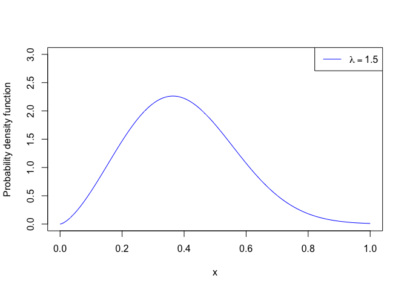
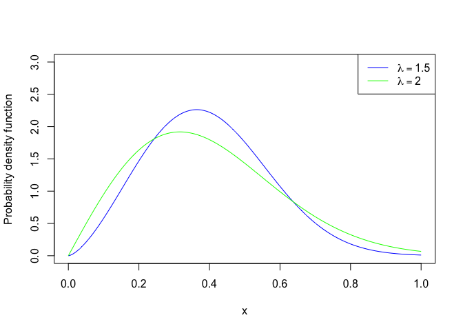
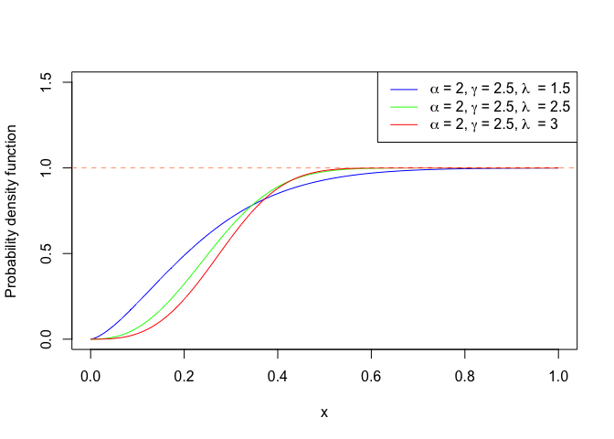

### A New Generalized Weighted Weibull Distribution

In this post, we will plot generalized Weighted Weibull Distribution by
varying the parameters alpha,lambda and gamma.  

For the theory, We have referred to the paper "A New Generalized Weighted Weibull Distribution" by
Salman Abbas, Gamze Ozal, Saman Hanif Shahbaz and Muhammad Qaiser Shahbaz. Check the [link](https://pjsor.com/pjsor/article/download/2782/729/)

### Abstract

In this article, we present a new generalization of weighted Weibull
distribution using Topp Leone family of distributions. We have studied
some statistical properties of the proposed distribution including
quantile function, moment generating function, probability generating
function, raw moments, incomplete moments, probability, weighted
moments, Rayeni and q−th entropy. We have obtained numerical values of
the various measures to see the effect of model parameters. Distribution
 of order statistics for the proposed model has also been obtained.
The estimation of the model parameters has been done by using maximum
likelihood method. The effectiveness of proposed model is analyzed by
means of a real data sets. Finally, some concluding remarks are given.

#### Probability Density Function

*f*(*x*) = (1+*λ*<sup>*γ*</sup>)*α**γ**x*<sup>*γ* − 1</sup>*e*<sup>−*α**x*<sup>*γ*</sup>(1+*λ*<sup>*γ*</sup>)</sup>

``` r
# Probability Density Function
x <- seq(0,1, length = 1000)
pdfx <- function(x, lambda = 1, alpha = 1, gamma = 2)
  {
  (1+lambda^gamma)*alpha*gamma*x^(gamma-1)*exp(-1*alpha*x^gamma*(1+lambda^gamma))
}

lamda = c(1.5)

plot(x,pdfx(x, alpha = 2, gamma = 2.5, lambda = 1.5),
     type = 'l', col = 'blue',
     ylim = c(0,3), ylab = "Probability density function")
legend("topright",lwd=1, cex = 1, col = c("blue"),
       legend = c(expression(lambda == paste('1.5'))))
```



``` r
# Probability Density Function
x <- seq(0,1, length = 1000)
pdfx <- function(x, lambda = 1, alpha = 1, gamma = 2)
  {
  (1+lambda^gamma)*alpha*gamma*x^(gamma-1)*exp(-1*alpha*x^gamma*(1+lambda^gamma))
}

plot(x,pdfx(x, alpha = 2, gamma = 2.5, lambda = 1.5),
     type = 'l', col = 'blue',
     ylim = c(0,3), ylab = "Probability density function")
lines(x,pdfx(x, lambda = 2), type = 'l', col = 'green')

legend("topright",lwd=1, cex = 1, col = c("blue", 'green'),
       legend = c(expression(lambda == paste('1.5')),  
                  expression(lambda == paste('2'))))
```



#### Cumulative Density Function

The formula for cdf
>*F*(*x*) = 1 − *e*<sup>−*α**x*<sup>*γ*</sup>(1+*λ*<sup>*γ*</sup>)</sup>  
for *x*, *α*, *λ* \> 0  

##### Legend Creation  
We have used bquote and as.expression to create the legend labels.

bquote(““\~ alpha == 2,lambda == 1.5\~”“)  
as.expression(bquote(”“\~alpha == 2, gamma == 2.5, lambda == 1.5\~”“))

##### expression in R :

-   <https://quantpalaeo.wordpress.com/2015/04/20/expressions-in-r/>  
-   <https://stackoverflow.com/questions/57455827/r-using-expression-in-plot-legends>

expression returns a vector of type “expression” containing its
arguments (unevaluated).  
expression and is.expression are primitive functions.  
expression is ‘special’: it does not evaluate its arguments.  
> par_labels1 = c(expression(alpha \~“= 2,”\~ gamma\~“= 2.5,”\~lambda\~” =
1.5”))  
> par_labels1  
> eval(par_labels1)

``` r
#Cumulative Density Function
x <- seq(0,1, length = 1000)
cdfx <- function(x, lambda = 1, alpha = 1, gamma = 2)
  {
  1-exp(-1*alpha*x^lambda*(1+lambda^gamma))
}

par_labels1 = c(expression(alpha ~"= 2,"~ gamma~"= 2.5,"~lambda~" = 1.5"))
par_labels2 = c(expression(alpha ~"= 2,"~ gamma~"= 2.5,"~lambda~" = 2.5"))
par_labels3 = c(expression(alpha ~"= 2,"~ gamma~"= 2.5,"~lambda~" = 3"))
#parlabels = rbind(par_labels1,par_labels2, par_labels3)

plot(x,cdfx(x, alpha = 2, gamma = 2.5, lambda = 1.5),
     type = 'l', col = 'blue',
     ylim = c(0,1.5), ylab = "Probability density function")

lines(x,cdfx(x, alpha = 2, gamma = 2.5, lambda = 2.5), type = 'l', col = 'green' )
lines(x,cdfx(x, alpha = 2, gamma = 2.5, lambda = 3), type = 'l', col = 'red' )

legend("topright",lwd=1, cex = 1, col = c("blue", "green","red"),
       legend = c(par_labels1, par_labels2, par_labels3))

abline(h = 1, col = "lightsalmon", lty = 2)
```


