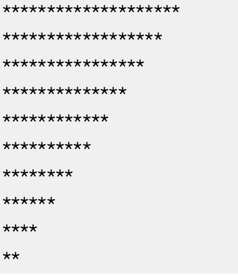

  
## Print patterns using SQL  
  
Source : [HackerRank, Alternative Queries, Draw the Triangle 1](https://www.hackerrank.com/challenges/draw-the-triangle-1/problem?)  

  
  
  
-- Recursive CTE code without comments
```sql
WITH RECURSIVE num(n) AS (
    SELECT 20 

    UNION ALL

    SELECT n - 2
    FROM num
    WHERE n - 2 >= 2
)
SELECT 
    load('', num.n, '*')
FROM 
    num;
```  
  
-- Recursive CTE code with comments
  
```sql
-- Define a recursive CTE named 'num'
WITH RECURSIVE num(n) AS (
    -- Anchor Member: Start the sequence with 20
    SELECT 20 

    UNION ALL

    -- Recursive Member: In each subsequent iteration, 
    -- decrement the previous number by 2
    SELECT n - 2
    FROM num
    -- Termination Condition: Continue recursion as long as the 
    -- number is greater than or equal to 2
    WHERE n - 2 >= 2
)

-- Main query to select from the recursive CTE
SELECT 
    -- Assuming 'load' is a predefined function in your SQL environment; 
    -- replace it with the actual function intended
    -- The function is used here with each number generated by the CTE
    load('', num.n, '*')
FROM 
    num; -- Select from the recursively generated numbers in CTE 'num'
```  

**Recursive Common Table Expressions (CTEs)** are a powerful feature in SQL that allow you to execute complex queries, particularly useful for dealing with hierarchical or recursive data structures. Here's a more detailed look at recursive CTEs:  

## Basic Structure
A recursive CTE consists of two parts:
1. **Anchor Member**: This is the initial query that forms the base result set of the CTE. It's the starting point of the recursion.
2. **Recursive Member**: This part of the CTE references the CTE itself and is used to extend or transform the result set from the anchor member.
   
These two parts are combined using the **UNION ALL operator**, ensuring that the results of the anchor member are combined with the results of the recursive member.
  
## How It Works
- **Initialization**: The anchor member is executed first to create the initial set of rows.
- **Recursion**: The recursive member is then repeatedly executed, taking the results of the previous iteration as its input, and adding to the overall result set.
- **Termination**: The recursion continues until the recursive member returns no rows or a specified condition is met, preventing an infinite loop.

## Use Cases
- **Generating Sequences**: Like creating a series of numbers, dates, etc.
- **Hierarchical Data**: Navigating tree-like structures, such as organizational charts, category trees, or folder structures.
- **Graph Data**: Traversing graph data structures, such as finding the shortest path or all paths between two nodes.
  
> Follow the best practices : Starting with the anchor member, while ensuring that the recursive and anchor members have the same number of columns and data types, and write the termination condition.  
> Create efficient and accurate queries to traverse hierarchical data structures

### Specific Usecases  
  
| Scenario              | Description                                                                                                     |  
|-----------------------|-----------------------------------------------------------------------------------------------------------------|  
| Employee Hierarchies  | Traverse a tree of employees and their managers to calculate total compensation of all employees in a given branch |  
| Product Categories    | Traverse a tree of product categories to find all the products in a given category and its subcategories          |  
| Social Networks       | Traverse a graph of social network connections to find all friends of a given user and their connections          |  
| Task dependencies     | Traverse a tree of task dependencies to calculate time required to complete a project                              |  
  

## Example
A simple example of a recursive CTE is generating a series of numbers:

```sql
WITH RECURSIVE NumberSeries AS (
    SELECT 1 AS Number -- Anchor Member
    UNION ALL
    SELECT Number + 1 FROM NumberSeries -- Recursive Member
    WHERE Number < 10
)
SELECT * FROM NumberSeries;
```

This query generates a series of numbers from 1 to 10.

## Key Points to Remember
- **Avoid Infinite Loops**: Always ensure there is a condition to terminate the recursion, or else the query can go into an infinite loop.  
- **Performance**: Recursive CTEs can be resource-intensive, especially with large data sets or complex recursive logic
- **Database Support**: Most modern relational databases support recursive CTEs, including PostgreSQL, MySQL (from version 8.0), SQL Server, and Oracle.  
  
Recursive CTEs open up a wide array of possibilities for data manipulation and querying, especially in scenarios where traditional iterative programming techniques are not efficient or possible in standard SQL.


